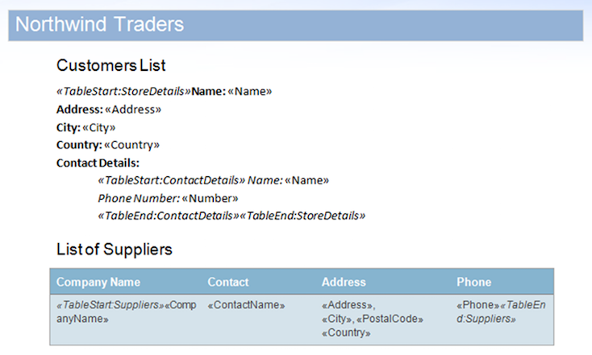
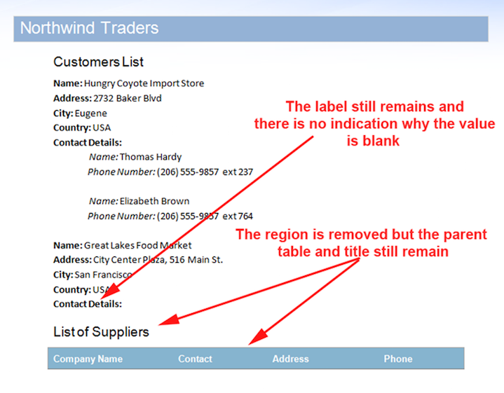
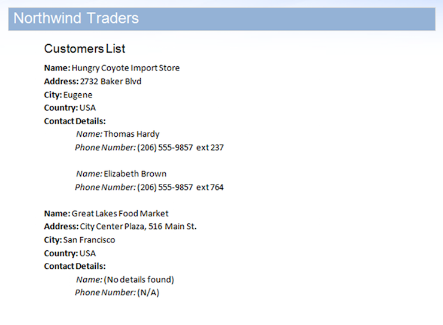
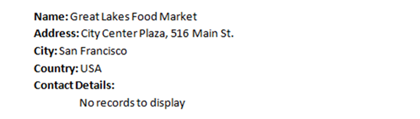
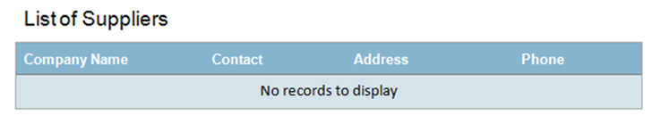
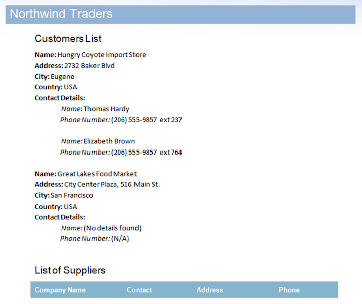

There are some situations where completely removing unmerged regions from the document during mail merge is not desired or results in the document looking incomplete. This can occur when the absence of input data should be displayed to the user in the form of a message instead of the region being completely removed.

There are also times when the removal of the unused region on its own is not enough, for instance, if the region is preceded with a title or the region is contained in a table. If this region is unused then the title and table will still remain after the region is removed which will look out of place in the document.

This article provides a solution to manually define how unused regions in the document are handled. The base code for this functionality is supplied and can be easily reused in another project.

The logic to be applied to each region is defined inside a class that implements the [IFieldMergingCallback](https://apireference.aspose.com/words/java/com.aspose.words/ifieldmergingcallback) interface. In the same way, a mail merge handler can be set up to control how each field is merged, this handler can be set up to perform actions on each field in an unused region or on the region as a whole. Within this handler, you can set the code to change the text of a region, remove nodes or empty rows and cells etc.

In this sample, we will be using the document displayed below. It contains nested regions and a region contained within a table. 

As a quick demonstration, we can execute a sample database on the sample document with the [MailMergeCleanupOptions.REMOVE_UNUSED_REGIONS](https://apireference.aspose.com/words//java/com.aspose.words/mailmergecleanupoptions) flag enabled. This property will automatically remove unmerged regions from the document during a mail merge.

The data source includes two records for the **StoreDetails** region but purposely does have any data for the child **ContactDetails** regions for one of the records. Furthermore, the **Suppliers** region does not have any data rows either. This will cause unused regions to remain in the document. The result after merging the document with this data source is below. 

As noted on the image you can see that the **ContactDetails** region for the second record and **Suppliers** regions have been automatically removed by the mail merge engine as they have no data. However, there are a few issues that make this output document look incomplete:

- The **ContactDetails** region still leaves a paragraph with the text “Contact Details”.
- In the same case there is no indication that there are no phone numbers, only a blank space which could lead to confusion.
- The table and title related to the **Suppliers** region also remains after the region inside the table is removed.

The technique provided in this article demonstrates how to apply custom logic to each unmerged regions to avoid these issues.

**The Solution**

To manually apply logic to each unused region in the document we take advantage of features already available in Aspose.Words.

The mail merge engine provides a property to remove unused regions through the **MailMergeCleanupOptions.RemoveUnusedRegions** flag. This can be disabled so that such regions are left untouched during a mail merge. This allows us to leave the unmerged regions in the document and handle them manually ourselves instead.

We can then take advantage of the **MailMerge.FieldMergingCallback** property as a means to apply our own custom logic to these unmerged regions during mail merge through the use of a handler class implementing the **IFieldMergingCallback** interface.

This code within the handler class is the only class you will need to modify in order to control the logic applied to unmerged regions. The other code in this sample can be reused without modification in any project.

This sample project demonstrates this technique. It involves the following steps:

1. Execute mail merge on the document using your data source. The **MailMergeCleanupOptions.RemoveUnusedRegions** flag is disabled for now we want the regions to remain so we can handle them manually. Any regions without data will be left unmerged in the document.
1. Call the **ExecuteCustomLogicOnEmptyRegions** method. This method is provided in this sample. It performs actions which allow the specified handler to be called for each unmerged region. This method is reusable and can be copied unaltered to any project which requires it (along with any dependent methods).This method executes the following steps:
   1. Sets the handler specified by the user to the **MailMerge.FieldMergingCallback** property.
   1. Calls the **CreateDataSourceFromDocumentRegions** method which accepts the user’s **Document** and **ArrayList** containing regions names. This method will create a dummy data source containing tables for each unmerged region in the document.
   1. Executes mail merge on the document using the dummy data source. When mail merge is executed with this data source it allows the user-specified handler to be called for each unmerge region and the custom logic applied

**The Code**

The implementation for the **ExecuteCustomLogicOnEmptyRegions** method is found below. This method accepts several parameters:

1. The [Document](https://apireference.aspose.com/words/java/com.aspose.words/Document) object containing unmerged regions which are to be handled by the passed handler.
1. The handler class which defines the logic to apply to unmerged regions. This handler must implement the [IFieldMergingCallback](https://www.aspose.com/api/java/words/com.aspose.words/interfaces/IFieldMergingCallback) interface.
1. Through the use of the appropriate overload, the method can also accept a third parameter – a list of region names as strings. If this is specified then only region names remaining the document specified in the list will be manually handled. Other regions which are encountered will not be called by the handler and removed automatically. When the overload with only two parameters is specified, every remaining region in the document is included by the method to be handled manually.

**Example**

Shows how to execute custom logic on unused regions using the specified handler.



{}

If you considering running the **ExecuteCustomLogicOnEmptyRegions** method consecutively with different handlers (e.g each handler applies logic to certain fields) then you will need to disable the removal of unused regions so such regions are not removed in between these calls.

{}

**Example**

Defines the method used to manually handle unmerged regions.



This method involves finding all unmerged regions in the document. This is accomplished using the **MailMerge.GetFieldNames** method. This method returns all merge fields in the document, including the region start and end markers (represented by merge fields with the prefix *TableStart* or *TableEnd*).

When a TableStart merge field is encountered this is added as a new **DataTable** to the **DataSet**. Since a region may appear more than once (for example because it is a nested region where the parent region has been merged with multiple records), the table is only created and added if it does not already exist in the **DataSet**.

When an appropriate region start has been found and added to the database, the next field (which corresponds to the first field in the region) is added to the **DataTable**. Only the first field is required to be added for each field in the region to be merged and passed to the handler.

We also set the field value of the first field to “FirstField” to make it easier to apply logic to the first or other fields in the region. By including this it means it is not necessary to hard-code the name of the first field or implements extra code to check if the current field is the first in the handler code.

The code below demonstrates how this system works. The document shown at the start of this article is remerged with the same data source but this time, the unused regions are handled by custom code.

**Example**

Shows how to handle unmerged regions after mail merge with user-defined code.



The code performs different operations based on the name of the region retrieved using the **FieldMergingArgs.TableName** property. Note that depending upon your document and regions you can code the handler to run logic dependent on each region or code which applies to every unmerged region in the document or a combination of both.

The logic for the **ContactDetails** region involves changing the text of each field in the **ContactDetails** region with an appropriate message stating that there is no data. The names of each field are matched within the handler using the **FieldMergingArgs.FieldName** property.

A similar process is applied to the **Suppliers** region with the addition of extra code to handle the table which contains the region. The code will check if the region is contained within a table (as it may have already been removed). If it is, it will remove the entire table from the document as well as the paragraph which precedes it as long as it is formatted with a heading style e.g “Heading 1”.

**Example**

Shows how to define custom logic in a handler implementing IFieldMergingCallback that is executed for unmerged regions in the document.



The result of the above code is shown below. The unmerged fields within the first region are replaced with informative text and the removal of the table and heading allows the document to look complete.

The code which removes the parent table could also be made to run on every unused region instead of just a specific region by removing the check for the table name. In this case, if any region inside a table was not merged with any data, both the region and the container table will be automatically removed as well.

We can insert different code in the handler to control how unmerged regions are handled. Using the code below in the handler instead will change the text in the first paragraph of the region to a helpful message while any subsequent paragraphs in the region are removed. These other paragraphs are removed as they would remain in the region after merging our message.

The replacement text is merged into the first field by setting the specified text into the **FieldMergingArgs.Text** property. The text from this property is merged into the field by the mail merge engine.

The code applies this for only the first field in the region by checking the **FieldMergingArgs.FieldValue** property. The field value of the first field in the region is marked with “FirstField” . This makes this type of logic easier to implement over many regions as no extra code is required.

**Example**

Shows how to replace an unused region with a message and remove extra paragraphs.



The resulting document after the code above has been executed is shown below. The unused region is replaced with a message stating that there are no records to display.

As another example, we can insert the code below in place of the code originally handling the **SuppliersRegion** . This will display a message within the table and merge the cells instead of removing the table from the document. Since the region resides within a table with multiple cells, it looks nicer to have the cells of the table merged together and the message centered.

**Example**

Shows how to merge all the parent cells of an unused region and display a message within the table.



The resulting document after the code above has been executed is shown below.

Finally, we can call the **ExecuteCustomLogicOnEmptyRegions** method and specify the table names that should be handled within our handler method, while specifying others to be automatically removed.

**Example**

Shows how to specify only the ContactDetails region to be handled through the handler class.



Calling this overload with the specified ArrayList will create the data source which only contains data rows for the specified regions. Regions other than the ContactDetails region will not be handled and will be removed automatically by the mail merge engine instead. The result of the above call using the code in our original handler is shown below. 

