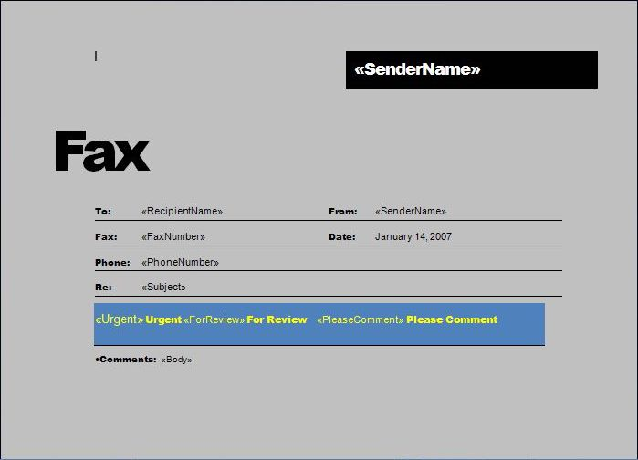
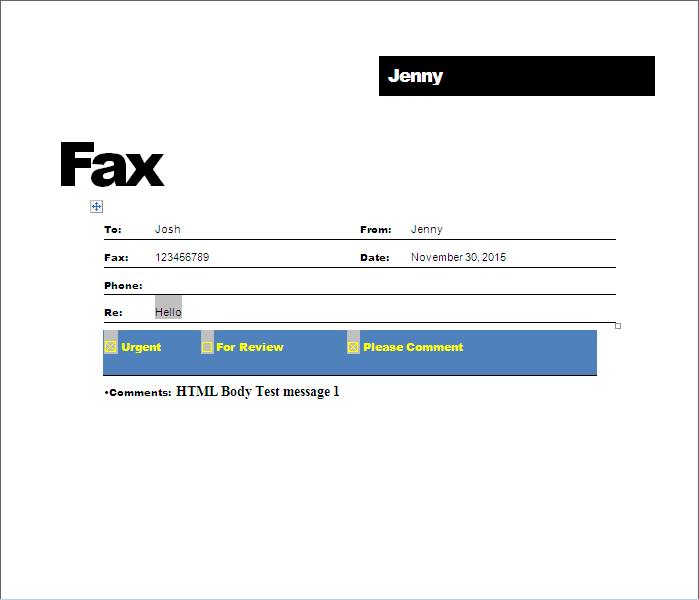

The merge engine takes a document as input, looks for MERGEFIELD fields in it, and replaces them with the data obtained from the data source. Typically, plain text and HTML are inserted, but Aspose.Words users can also generate a document that handles more unusual scenarios for mail merge fields.

Powerful Aspose.Words functionality allows you to extend the mail merge process:

- insert checkboxes and text input form fields into the document during a mail merge
- insert images from any custom storage (files, BLOB fields, etc.)

## Insert Checkboxes and Text Input during Mail Merge

Sometimes it is necessary to perform a mail merge operation so that not text is substituted in the merge field, but a checkbox or text input field. Even though this is not the most common scenario, it is very handy for some tasks.

The following screenshot of a Word document shows a template with merge fields:

This screenshot of the Word document below shows the already generated document:

{}

Note that some fields were replaced with plain text, some fields were replaced with checkbox form fields, and the Subject field was replaced with a text input field.

{}

The following code example shows how to insert checkboxes and input text fields into a document during a mail merge:





## Insert Images during Mail Merge

When performing a mail merge operation, you can insert images from the database into the document using special image mail merge fields. The image mail merge field is a merge field named Image:MyFieldName.

### Insert Images from a Database

During a mail merge, when an image mail merge field is encountered in a document, the [FieldMergingCallback](https://reference.aspose.com/words/java/com.aspose.words/mailmerge#FieldMergingCallback) event is fired. You can respond to this event to return a filename, stream, or image object to the mail merge engine so it can be inserted into the document.

The following code example shows how to insert images stored in a database BLOB field into a report:



### Set Image Properties during Mail Merge

While merging an image merge field, you may sometimes need to control various image properties, such as [WrapType](https://reference.aspose.com/words/java/com.aspose.words/wraptype/).

Currently, using [ImageFieldMergingArgs](https://reference.aspose.com/words/java/com.aspose.words/imagefieldmergingargs/) you can only set image width or height properties, respectively. To overcome this issue, Aspose.Words provides the [Shape](https://reference.aspose.com/words/java/com.aspose.words/imagefieldmergingargs#Shape) property, which facilitates to get full control over the inserted image or any other shape.

The following code example shows how to set various image properties:





