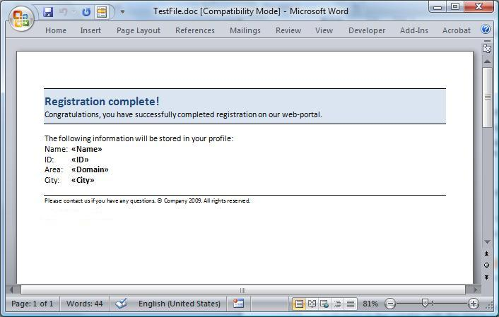
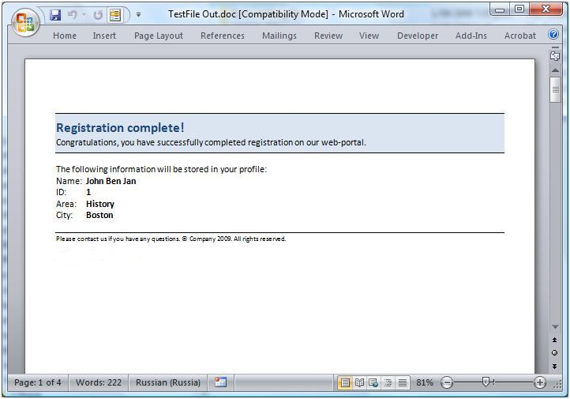

Given the widespread use and support of the XML markup language, the ability to run a mail merge from an XML file to a Word template document has become a common requirement.

This article provides a simple example of how using Aspose.Words, you can execute mail merge from XML using a custom data source which implements the [IMailMergeDataSource](http://www.aspose.com/api/java/words/com.aspose.words/interfaces/IMailMergeDataSource) interface.
#### **Solution**
To achieve this, we will implement our own custom data source which reads the parsed XML stored in memory. When mail merge is executed our class is requested to return values for each of the fields in the document. The values from the XML is read and passed to the mail merge engine to be merged into the document.

We’ll use this simple XML file which contains the customer information we want to use in the mail merge.

**XML**


<?xml version="1.0" encoding="utf-8"?>
<customers>
<customer Name="John Ben Jan" ID="1" Domain="History" City="Boston"/>
<customer Name="Lisa Lane" ID="2" Domain="Chemistry" City="LA"/>
<customer Name="Dagomir Zits" ID="3" Domain="Heraldry" City="Milwaukee"/>
<customer Name="Sara Careira Santy" ID="4" Domain="IT" City="Miami"/>
</customers>


Note that the structure of the XML document can also be varied and the data will still be read correctly. This allows different types of XML documents to be merged easily. The XML can be changed so that each table represented as an element in the XML with each field of the table being a child element and the field value being the text node of this element.

Here’s our sample Word template document. The Name, ID, Domain and City fields have been set up as merge fields and correspond to the nodes in the XML file.

To execute mail merge with data from an XML data source we will:

1. Load the XML into memory.
1. Pass the data to a new instance of the **XmlMailMergeDataTable** class which is included with this sample.
1. Run the Aspose.Words **MailMerge.Execute** method.

It’s really pretty simple. Using Aspose.Words, the mail merge operation will replace the merge fields in the document with the values from the XML file.
#### **The Code**
Make sure in the Word template that you have set up merge fields wherever you want the data inserted.

Firstly, we store the XML file from disk into memory by parsing it and storing it in a org.w3c.dom.Document object.

This object which represents the XML is passed to the **XmlMailMergeDataTable** class. This class is the middle-man between the data source and the mail merge engine, allowing data from the XML represented in memory to be passed the mail merge engine and merged into the document.

Then we open the template document, and run the mail merge on the XmlMailMergeDataTable using the Aspose.Words Mail Merge object.

Below example shows how to execute mail merge using an XML data source by implementing [IMailMergeDataSource](http://www.aspose.com/api/java/words/com.aspose.words/interfaces/IMailMergeDataSource).



The XmlMailMergeDataTable class is a custom data source implementing [IMailMergeDataSource](http://www.aspose.com/api/java/words/com.aspose.words/interfaces/IMailMergeDataSource). The code for this class is provided below. The [IMailMergeDataSource](http://www.aspose.com/api/java/words/com.aspose.words/interfaces/IMailMergeDataSource) interface allows you to manually define where the data used for mail merge comes from. In this case, the data is read from the XML file loaded into memory. The details of how classes implementing this interface works are not explained in full here but can be found in the API documentation for the [IMailMergeDataSource](http://www.aspose.com/api/java/words/com.aspose.words/interfaces/IMailMergeDataSource) class.

The general process that the **XmlMailMergeDataTable** class employs when providing data to the mail merge engine involves iterating over the nodes in the DOM and extracting the appropriate values with each record to be merged. The DOM represents XML tags as nodes and elements and when the mail merge engine requests the value of a field the data is extracted from the current node and the value returned.

When the record for the table has finished the mail merge engine instructs the pointer to be moved forward and the current node is moved to the next sibling.

If mail merge with regions is used along with nested regions then the [IMailMergeDataSource.getChildDataSource(java.lang.String)](http://www.aspose.com/api/java/words/com.aspose.words/interfaces/IMailMergeDataSource) method is called. A new instance of **XmlMailMergeDataTable** is created with the root node being the child node matching the first record of the table name.

Below example shows how to create a class implementing IMailMergeDataSource which allows data to be mail merged from an XML document.


#### **End Result**
And here’s the result below, page one of four pages in the output file, one page for each of the four customers in the XML file. The merge fields in the template have been replaced by the customer details in the XML file.

