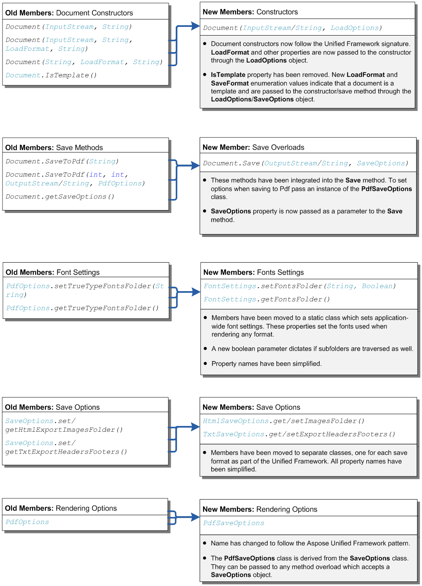
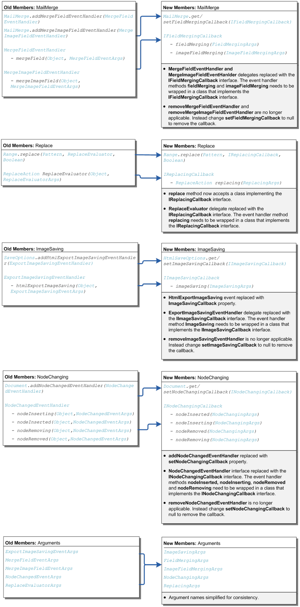

#### **Overview of the Changes**
{} 

Starting from the release of Aspose.Words for Java 10.0, the public API has undergone some changes. It is not common practice for us to make breaking changes to the API and we try to avoid this whenever possible, but sometimes it is necessary. In this case the changes in the new version occur because:

1. A move towards using the Aspose Unified Framework which dictates an improved API for loading and saving. This makes for a more organized and consistent API to be used across all Aspose products. 
1. The source code from the .NET platform will now be automatically ported to the Java platform. This will enable Aspose.Words for Java to match Aspose.Words for .NET feature-by-feature. 

Due to these changes you may need to fix certain parts of code when upgrading your version of Aspose.Words. These are simple changes and the steps to achieve this are explained below along with sample code. If you do not use any of the members listed below then most likely you will not need to make any changes as your code will already compile successfully with the new version. 

{} 

**Note:** No functionality has been lost from the previous versions through the refactoring of the API. All of the same functionality remains intact, only access to some members has been shifted, renamed or merged into other methods. 
#### **Possible Signs Your Code Requires Changes**
{} 

When migrating from a previous version to a newer version implementing the refactored API, attempting to build your project may return compile time errors, such as:

{} 

|**Description of Possible Errors** |
| :- |
|Cannot resolve method ‘saveToPdf’. |
|Cannot resolve method ‘addMergeFieldEventHandler’. |
|Cannot resolve method ‘setTrueTypeFontsFolder’. |
|Cannot resolve symbol ‘PdfOptions’. |
These types of errors indicate that you are still using members from the old API and need to upgrade to use the new members described below.
#### **Quick Reference Guide**
The diagrams below outline the old API members and their corresponding new API members, and are grouped in relation to their function. This allows for quick reference when code needs to be changed. The gray box below the new members states what changes have happened and why they occurred. Example implementations of the new code members can be found following the diagrams.

**Document Constructors, Load and Save Members** 

**Events, Delegates and Argument Members** 

#### **Code Examples**
Sample implementations of the new code members are presented below.
##### **Document Constructors**
The parameters passed to the constructors of the **Document** class from previous versions used to define the password and baseUri strings have now been integrated into the **LoadOptions** class. This object is passed to the **Document.#Ctor** constructors accepting a **LoadOptions** object to specify these settings when loading a document. 
##### **Example**
*Opens an HTML document with images from a stream using a base URI.* 

**Java**



// We are opening this HTML file:

//    <html>

//    <body>

//    
Simple file.

//    

//    </body>

//    </html>
String fileName = getMyDir() + "Document.OpenFromStreamWithBaseUri.html";

// Open the stream.
InputStream stream = new FileInputStream(fileName);

// Open the document. Note the Document constructor detects HTML format automatically.

// Pass the URI of the base folder so any images with relative URIs in the HTML document can be found.
LoadOptions loadOptions = new LoadOptions();
loadOptions.setBaseUri(getMyDir());
Document doc = new Document(stream, loadOptions);

// You can close the stream now, it is no longer needed because the document is in memory.
stream.close();

// Save in the DOC format.
doc.save(getMyDir() + "Document.OpenFromStreamWithBaseUri Out.doc");

##### **Saving To Different Formats**
The **Document.saveToPdf** method and its overloads have been simplified and is now called through the single **Document.Save** method overloads. 

The option classes passed to the **Document.Save** method for the PDF format and each format have been simplified as part of the move to the Unified Framework pattern. All the different types of option classes such as **PdfSaveOptions** and **XpsSaveOptions** are now derived from the base class **SaveOptions** and inherit its members. This means that any of these derived classes can be passed to an overload which accepts a **SaveOptions** object. 
##### **Example**
*Shows how to save a document to the PDF format using the Save method and the PdfSaveOptions class.* 

**Java**



// Open the document
Document doc = new Document(getMyDir() + "Rendering.doc");

// Option 1: Save document to file in the PDF format with default options
doc.save(getMyDir() + "Rendering.PdfDefaultOptions Out.pdf");

// Option 2: Save the document to stream in the PDF format with default options
ByteArrayOutputStream stream = new ByteArrayOutputStream();
doc.save(stream, SaveFormat.PDF);

// Option 3: Save document to the PDF format with specified options

// Render the first page only and preserve form fields as usable controls and not as plain text
PdfSaveOptions pdfOptions = new PdfSaveOptions();
pdfOptions.setPageIndex(0);
pdfOptions.setPageCount(1);
pdfOptions.setPreserveFormFields(true);
doc.save(getMyDir() + "Rendering.PdfCustomOptions Out.pdf", pdfOptions);

##### **Document Save Options**
The options defined in the **Document.SaveOptions** property from previous versions has been split into separate classes to which the members belong. For example the **SaveOptions.HtmlExportImagesFolder** has moved to the **HtmlSaveOptions.ImagesFolder** property of the **HtmlSaveOptions** class. Similarly the **SaveOptions.TxtExportHeadersFooters** has moved to **TxtSaveOptions.ExportHeadersFooters** property of the **TxtSaveOptions** class. These objects are passed to the **Document.Save** method as a parameter. 

The names of the properties have also been simplified in the move towards using the Unified Framework pattern. 
##### **Specifying Font Folders used During Rendering**
To set the folder used to look for fonts during rendering in previous versions you would use the **PdfOptions.setTrueTypeFontsFolder** method. Starting in Aspose.Words 10.0 this functionality has been moved to a static class so that setting the folders used to find fonts when rendering is shared for every fixed format across the application. Now to set the location of fonts on the machine, you need to call the **FontSettings.SetFontsFolder** method. 
##### **Example**
*Demonstrates how to set the folder Aspose.Words uses to look for TrueType fonts during rendering.* 

**Java**


Document doc = new Document(getMyDir() + "Rendering.doc");

// Set fonts to be scanned for under the specified directory. Do not search within sub-folders.
FontSettings.setFontsFolder("C:\\MyFonts\\", false);
doc.save(getMyDir() + "Rendering.SetFontsFolder Out.pdf");

##### **Replacing Events and Delegates with Callbacks and Interfaces**
To facilitate automatic porting of code from the .NET platform to the Java platform events and delegates have been replaced with callbacks and interfaces. Examples of how to modify each event to use the appropriate interface in your code are described below. 

For those interfaces that require implementation of more than one method, you can choose to leave the unused methods empty. 

Note that the names of the arguments passed to the handler methods have been simplified for consistently, for example **MergeFieldEventArgs** has become **FieldMergingArgs** . 
##### **Implementing the IFieldMergingCallback Interface**
##### **Example**
*Demonstrates how to use the InsertDocument method to insert a document into a merge field during mail merge.* 

**Java**


public void insertDocumentAtMailMerge() throws Exception
{
    // Open the main document.
    Document mainDoc = new Document(getMyDir() + "InsertDocument1.doc");

    // Add a handler to MergeField event
    mainDoc.getMailMerge().setFieldMergingCallback(new InsertDocumentAtMailMergeHandler());

    // The main document has a merge field in it called "Document_1".

    // The corresponding data for this field contains fully qualified path to the document

    // that should be inserted to this field.
    mainDoc.getMailMerge().execute(
        new String[] { "Document_1" },
        new String[] { getMyDir() + "InsertDocument2.doc" });
    mainDoc.save(getMyDir() + "InsertDocumentAtMailMerge Out.doc");
}
private class InsertDocumentAtMailMergeHandler implements IFieldMergingCallback
{
    /**
     * This handler makes special processing for the "Document_1" field.
     * The field value contains the path to load the document.
     * We load the document and insert it into the current merge field.
     */
    public void fieldMerging(FieldMergingArgs e) throws Exception
    {
        if ("Document_1".equals(e.getDocumentFieldName()))
        {
            // Use document builder to navigate to the merge field with the specified name.
            DocumentBuilder builder = new DocumentBuilder(e.getDocument());
            builder.moveToMergeField(e.getDocumentFieldName());

            // The name of the document to load and insert is stored in the field value.
            Document subDoc = new Document((String)e.getFieldValue());

            // Insert the document.
            insertDocument(builder.getCurrentParagraph(), subDoc);

            // The paragraph that contained the merge field might be empty now and you probably want to delete it.
            if (!builder.getCurrentParagraph().hasChildNodes())
                builder.getCurrentParagraph().remove();

            // Indicate to the mail merge engine that we have inserted what we wanted.
            e.setText(null);
        }
    }
    public void imageFieldMerging(ImageFieldMergingArgs args) throws Exception
    {
        // Do nothing.
    }
}

##### **Implementing the IReplacingCallback Interface**
##### **Example**
*Shows how to replace with a custom evaluator.* 

**Java**


public void replaceWithEvaluator() throws Exception
{
    Document doc = new Document(getMyDir() + "Range.ReplaceWithEvaluator.doc");
    doc.getRange().replace(Pattern.compile("[s|m]ad"), new MyReplaceEvaluator(), true);
    doc.save(getMyDir() + "Range.ReplaceWithEvaluator Out.doc");
}
private class MyReplaceEvaluator implements IReplacingCallback
{
    /**
     * This is called during a replace operation each time a match is found.
     * This method appends a number to the match string and returns it as a replacement string.
     */
    public int replacing(ReplacingArgs e) throws Exception
    {
        e.setReplacement(e.getMatch().group() + Integer.toString(mMatchNumber));
        mMatchNumber++;
        return ReplaceAction.REPLACE;
    }
    private int mMatchNumber;
}

##### **Implementing the IImageSavingCallback Interface**
##### **Example**
*Shows how to define custom logic for controlling how images are saved when exporting to HTML based formats.* 

**Java**


public void saveHtmlExportImages() throws Exception
{
    Document doc = new Document(getMyDir() + "Document.doc");

    // Create and pass the object which implements the handler methods.
    HtmlSaveOptions options = new HtmlSaveOptions(SaveFormat.HTML);
    options.setImageSavingCallback(new HandleImageSaving());
    doc.save(getMyDir() + "Document.SaveWithCustomImagesExport Out.html", options);
}
public class HandleImageSaving implements IImageSavingCallback
{
    public void imageSaving(ImageSavingArgs e) throws Exception
    {
        // Change any images in the document being exported with the extension of "jpeg" to "jpg".
        if (e.getImageFileName().endsWith(".jpeg"))
            e.setImageFileName(e.getImageFileName().replace(".jpeg", ".jpg"));
    }
}

##### **Implementing the INodeChangingCallback Interface**
##### **Example**
*Shows how to implement custom logic over node insertion in the document by changing the font of inserted HTML content.* 

**Java**


public void testNodeChangingInDocument() throws Exception
{
    // Create a blank document object
    Document doc = new Document();
    DocumentBuilder builder = new DocumentBuilder(doc);

    // Set up and pass the object which implements the handler methods.
    doc.setNodeChangingCallback(new HandleNodeChanging_FontChanger());

    // Insert sample HTML content
    builder.insertHtml("
Hello World
");
    doc.save(getMyDir() + "Document.FontChanger Out.doc");

    // Check that the inserted content has the correct formatting
    Run run = (Run)doc.getChild(NodeType.RUN, 0, true);
    Assert.assertEquals(run.getFont().getSize(), 24.0);
    Assert.assertEquals(run.getFont().getName(), "Arial");
}
public class HandleNodeChanging_FontChanger implements INodeChangingCallback
{
    // Implement the NodeInserted handler to set default font settings for every Run node inserted into the Document
    public void nodeInserted(NodeChangingArgs args) throws Exception
    {
        // Change the font of inserted text contained in the Run nodes.
        if (args.getNode().getNodeType() == NodeType.RUN)
        {
            Font font = ((Run)args.getNode()).getFont();
            font.setSize(24);
            font.setName("Arial");
        }
    }
    public void nodeInserting(NodeChangingArgs args) throws Exception
    {
        // Do Nothing
    }
    public void nodeRemoved(NodeChangingArgs args) throws Exception
    {
        // Do Nothing
    }
    public void nodeRemoving(NodeChangingArgs args) throws Exception
    {
        // Do Nothing
    }
}

