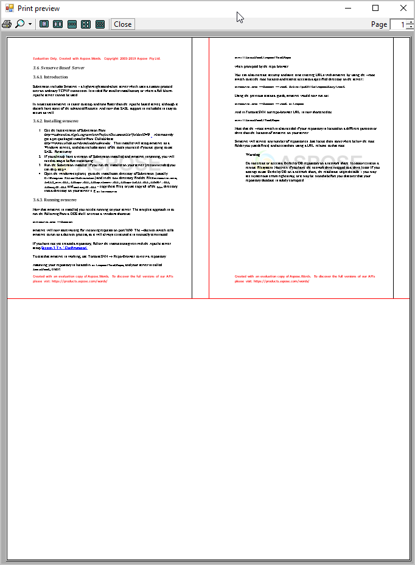

---
title: Printing a Document Programmatically or Using Dialogs
description: "Print a document using Aspose.Words for Java API through Settings, Print Preview, and Print progress dialogs."
type: docs
weight: 55
url: /java/print-a-document-programmatically-or-using-dialogs/
---

This article describes how to print a word processing document using Aspose.Words API. It also demonstrates the methods of printing a document with Settings, Print Preview, and Print progress dialogs.

## Printing a Document with Settings and Print Preview Dialogs

When working with documents, it is often required to print them to a selected printer. It is helpful to utilize a print preview dialog to visually inspect how the printed document will appear and choose relevant print options.

The Aspose.Words has no built-in dialogs or forms but implements the [AsposeWordsPrintDocument](https://apireference.aspose.com/words/java/com.aspose.words/AsposeWordsPrintDocument) class overrides both java.awt.print.Printable and java.awt.print.Pageable.

The following example demonstrates how to use these classes to print a document from Aspose.Words via the Print preview and Settings dialogs:



{} You can download an example of using the **PrintPreviewDialog** class from [Aspose.Words GitHub](https://github.com/aspose-words/Aspose.Words-for-Java/blob/master/Examples/src/main/java/com/aspose/words/examples/rendering_printing/PrintPreviewDialog.java). {} 

## Printing Multiple Pages on One Sheet

Aspose.Words implements the **MultipagePrintDocument** class, to fine-tune the printing operation to implement your custom logic by defining the way the document will appear on the printed page. The **MultipagePrintDocument** class provides the ability to print many pages on one sheet of paper.



You can download an example of using the **MultipagePrintDocument** class from [Aspose.Words GitHub](https://github.com/aspose-words/Aspose.Words-for-Java/blob/master/Examples/src/main/java/com/aspose/words/examples/rendering_printing/MultipagePrintDocument.java). 

The result of this code example is shown below:

