A common requirement when working with documents is to easily extract specific content from a range within the document. This content can consist of complex features such as paragraphs, tables, images etc. Regardless of what content needs to be extracted, the method in which to extract this content will always be determined by which nodes are chosen to extract content between. These could be entire bodies of text or simple runs of text. There are many possible situations and therefore many different node types to consider when extracting content. For instance, you may want to extract content between:

- Two specific paragraphs in the document.
- Specific runs of text.
- Different types of fields, for example, merge fields.
- Between the start and end ranges of a bookmark or comment.
- Different bodies of the text contained in separate sections.

In some situations, you may even want to combine the different types of, for example, extract content between a paragraph and field, or between a run and a bookmark.

This article provides the full code implementation to achieve this along with samples of common scenarios using this method. These samples are just a few demonstrations of the many possibilities that this method can be used for. Some day this functionality will be a part of the public API and the extra code here will not be required. Feel free to post your requests regarding this functionality on the [Aspose.Words forum here](https://forum.aspose.com/c/words/8).

## Reasons for Extracting Content

Often the goal of extracting this content is to duplicate or save it separately into a new document. For example, you may wish to extract the content and:

- Copy it to a separate document.
- Rendered a specific portion of a document to PDF or an image.
- Duplicate the content in the document many times.
- Work with this content separate from the rest of the document.

This is easy to achieve using Aspose.Words and the code implementation below.

## Extracting Content Algorithm

The code in this section addresses all of the possible situations above with one generalized and reusable method. The general outline of this technique involves:

1. Gathering the nodes which dictate the area of content that will be extracted from your document. Retrieving these nodes is handled by the user in their code, based on what they want to be extracted.
1. Passing these nodes to the **ExtractContent** method which is provided below. You must also pass a boolean parameter which states if these nodes that act as markers should be included in the extraction or not.
1. The method will return a list of cloned (copied nodes) of the content specified to be extracted. You can now use this in any way applicable, for example, creating a new document containing only the selected content.

## How to Extract Content

We will work with the document below in this article. As you can see it contains a variety of content. Also note, the document contains a second section beginning in the middle of the first page. A bookmark and comment are also present in the document but are not visible in the screenshot below.

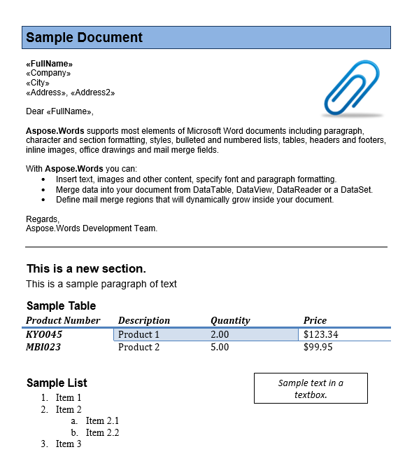

To extract the content from your document you need to call the ExtractContent method below and pass the appropriate parameters.

The underlying basis of this method involves finding block-level nodes (paragraphs and tables) and cloning them to create identical copies. If the marker nodes passed are block-level then the method is able to simply copy the content on that level and add it to the array.

However, if the marker nodes are inline (a child of a paragraph) then the situation becomes more complex, as it is necessary to split the paragraph at the inline node, be it a run, bookmark fields etc. Content in the cloned parent nodes not present between the markers is removed. This process is used to ensure that the inline nodes will still retain the formatting of the parent paragraph.

The method will also run checks on the nodes passed as parameters and throws an exception if either node is invalid. The parameters to be passed to this method are:

1. **StartNode** and **EndNode**. The first two parameters are the nodes which define where the extraction of the content is to begin and to end at respectively. These nodes can be both block level ([Paragraph](https://reference.aspose.com/words/java/com.aspose.words/paragraph/) , [Table](https://reference.aspose.com/words/java/com.aspose.words/table/) ) or inline level (e.g [Run](https://reference.aspose.com/words/java/com.aspose.words/run/) , [FieldStart](https://reference.aspose.com/words/java/com.aspose.words/fieldstart/) , [BookmarkStart](https://reference.aspose.com/words/java/com.aspose.words/bookmarkstart/) etc.):
   1. To pass a field you should pass the corresponding **FieldStart** object.
   1. To pass bookmarks, the **BookmarkStart** and [BookmarkEnd](https://reference.aspose.com/words/java/com.aspose.words/bookmarkend/) nodes should be passed.
   1. To pass comments, the [CommentRangeStart](https://reference.aspose.com/words/java/com.aspose.words/commentrangestart/) and [CommentRangeEnd](https://reference.aspose.com/words/java/com.aspose.words/commentrangeend/) nodes should be used.
1. **IsInclusive**. Defines if the markers are included in the extraction or not. If this option is set to false and the same node or consecutive nodes are passed, then an empty list will be returned:

      1. If a **FieldStart** node is passed then this option defines if the whole field is to be included or excluded.
      1. If a **BookmarkStart** or **BookmarkEnd** node is passed, this option defines if the bookmark is included or just the content between the bookmark range.
      1. If a **CommentRangeStart** or **CommentRangeEnd** node is passed, this option defines if the comment itself is to be included or just the content in the comment range.

The implementation of the **ExtractContent** method you can find [here](https://github.com/aspose-words/Aspose.Words-for-Java/blob/master/Examples/DocsExamples/Java/src/main/java/DocsExamples/Programming_with_documents/Contents_management/ExtractContentHelper.java). This method will be referred to in the scenarios in this article.

We will also define a custom method to easily generate a document from extracted nodes. This method is used in many of the scenarios below and simply creates a new document and imports the extracted content into it.

The following code example shows how to take a list of nodes and inserts them into a new document:

 //GenerateDocument

## Extract Content Between Paragraphs

This demonstrates how to use the method above to extract content between specific paragraphs. In this case, we want to extract the body of the letter found in the first half of the document. We can tell that this is between the 7th and 11th paragraphs.

The code below accomplishes this task. The appropriate paragraphs are extracted using the [getChild](https://reference.aspose.com/words/java/com.aspose.words/compositenode/#getChild-int-int-boolean) method on the document and passing the specified indices. We then pass these nodes to the **ExtractContent** method and state that these are to be included in the extraction. This method will return the copied content between these nodes which are then inserted into a new document.

The following code example shows how to extract the content between specific paragraphs using the ExtractContent method above:

 //ExtractContentBetweenParagraphs

{}

You can download the sample file of this example from [Aspose.Words GitHub](https://github.com/aspose-words/Aspose.Words-for-Java/blob/master/Examples/Data/Extract%20content.docx).

{}

The output document contains the two paragraphs that were extracted.

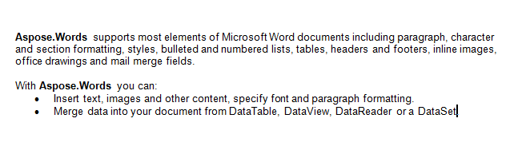

## Extract Content Between Different Types of Nodes

We can extract content between any combinations of block-level or inline nodes. In this scenario below we will extract the content between the first paragraph and the table in the second section inclusively. We get the markers nodes by calling [getFirstParagraph](https://reference.aspose.com/words/java/com.aspose.words/body/#getFirstParagraph) and [getChild](https://reference.aspose.com/words/java/com.aspose.words/compositenode/#getChild-int-int-boolean) method on the second section of the document to retrieve the appropriate **Paragraph** and **Table** nodes. For a slight variation let’s instead duplicate the content and insert it below the original.

The following code example shows how to extract the content between a paragraph and table using the **ExtractContent** method:

 //ExtractContentBetweenBlockLevelNodes

{}

You can download the sample file of this example from [Aspose.Words GitHub](https://github.com/aspose-words/Aspose.Words-for-Java/blob/master/Examples/Data/Extract%20content.docx).

{}

The content between the paragraph and table has been duplicated below is the result.

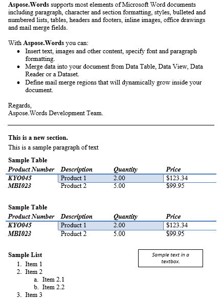

## Extract Content Between Paragraphs Based on Style

You may need to extract the content between paragraphs of the same or different style, such as between paragraphs marked with heading styles.

The code below shows how to achieve this. It is a simple example which will extract the content between the first instance of the “Heading 1” and “Header 3” styles without extracting the headings as well. To do this we set the last parameter to false, which specifies that the marker nodes should not be included.

In a proper implementation, this should be run in a loop to extract content between all paragraphs of these styles from the document. The extracted content is copied into a new document.

The following code example shows how to extract content between paragraphs with specific styles using the **ExtractContent** method:

 //ExtractContentBetweenParagraphStyles

//ParagraphsByStyleName

{}

You can download the sample file of this example from [Aspose.Words GitHub](https://github.com/aspose-words/Aspose.Words-for-Java/blob/master/Examples/Data/Extract%20content.docx).

{}

Below is the result of the previous operation.

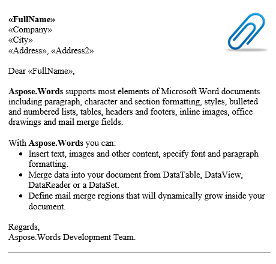

## Extract Content Between Specific Runs

You can extract content between inline nodes such as a **Run** as well. **Runs** from different paragraphs can be passed as markers. The code below shows how to extract specific text in-between the same **Paragraph** node.

The following code example shows how to extract content between specific runs of the same paragraph using the **ExtractContent** method:

 //ExtractContentBetweenRuns

{}

You can download the sample file of this example from [Aspose.Words GitHub](https://github.com/aspose-words/Aspose.Words-for-Java/blob/master/Examples/Data/Extract%20content.docx).

{}

The extracted text is displayed on the console. 

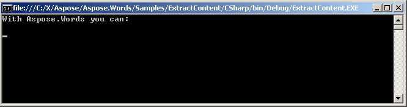

## Extract Content using a Field

To use a field as a marker, the FieldStart node should be passed. The last parameter to the ExtractContent method will define if the entire field is to be included or not. Let’s extract the content between the “FullName” merge field and a paragraph in the document. We use the [moveToMergeField](https://reference.aspose.com/words/java/com.aspose.words/documentbuilder/#moveToMergeField(java.lang.String)) method of [DocumentBuilder](https://reference.aspose.com/words/java/com.aspose.words/documentbuilder/) class. This will return the **FieldStart** node from the name of the merge field passed to it.

In our case let’s set the last parameter passed to the **ExtractContent** method to false to exclude the field from the extraction. We will render the extracted content to PDF.

The following code example shows how to extract content between a specific field and paragraph in the document using the **ExtractContent** method:

 //ExtractContentUsingField

{}

You can download the sample file of this example from [Aspose.Words GitHub](https://github.com/aspose-words/Aspose.Words-for-Java/blob/master/Examples/Data/Extract%20content.docx).

{}

The extracted content between the field and paragraph, without the field and paragraph marker nodes rendered to PDF.

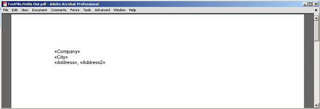

## Extract Content from a Bookmark

In a document, the content that is defined within a bookmark is encapsulated by the BookmarkStart and BookmarkEnd nodes. The content found between these two nodes make up the bookmark. You can pass either of these nodes as any marker, even ones from different bookmarks, as long as the starting marker appears before the ending marker in the document.

In our sample document, we have one bookmark, named “Bookmark1”. The content of this bookmark is highlighted content in our document:

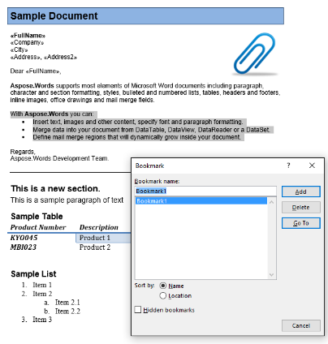

We will extract this content into a new document using the code below. The **IsInclusive** parameter option shows how to retain or discard the bookmark.

The following code example shows how to extract the content referenced a bookmark using the **ExtractContent** method:

 //ExtractContentBetweenBookmark

{}

You can download the sample file of this example from [Aspose.Words GitHub](https://github.com/aspose-words/Aspose.Words-for-Java/blob/master/Examples/Data/Extract%20content.docx).

{}

The extracted output with the IsInclusive parameter set to true. The copy will retain the bookmark as well.

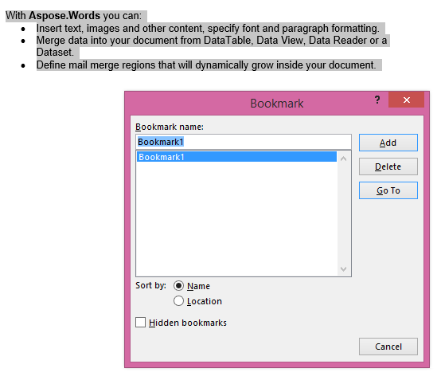

The extracted output with the **IsInclusive** parameter set to false. The copy contains the content but without the bookmark.

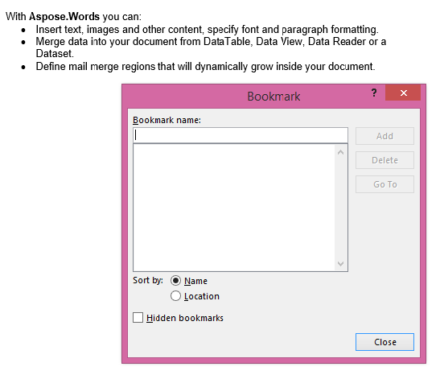

## Extract Content from a Comment

A comment is made up of the CommentRangeStart, CommentRangeEnd and Comment nodes. All of these nodes are inline. The first two nodes encapsulate the content in the document which is referenced by the comment, as seen in the screenshot below.

The **Comment** node itself is an [InlineStory](https://reference.aspose.com/words/java/com.aspose.words/inlinestory/) that can contain paragraphs and runs. It represents the message of the comment as seen as a comment bubble in the review pane. As this node is inline and a descendant of a body you can also extract the content from inside this message as well.

In our document we have one comment. Let’s display it by showing markup in the Review tab:

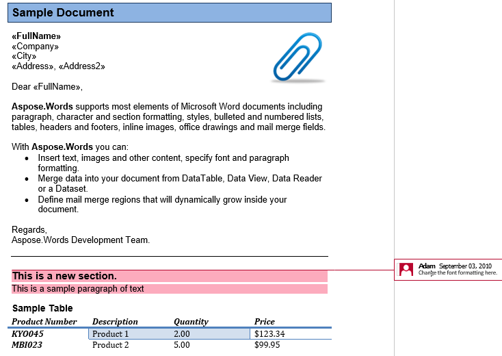

The comment encapsulates the heading, first paragraph and the table in the second section. Let’s extract this comment into a new document. The **IsInclusive** option dictates if the comment itself is kept or discarded.

The following code example shows how to do this is below:

 //ExtractContentBetweenCommentRange

{}

You can download the sample file of this example from [Aspose.Words GitHub](https://github.com/aspose-words/Aspose.Words-for-Java/blob/master/Examples/Data/Extract%20content.docx).

{}

Firstly the extracted output with the IsInclusive parameter set to true. The copy will contain the comment as well.

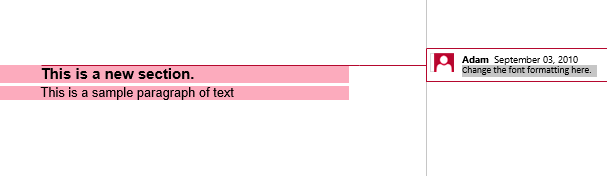

Secondly the extracted output with **isInclusive** set to false. The copy contains the content but without the comment.

## Extract Content using DocumentVisitor

Aspose.Words can be used not only for creating Microsoft Word documents by building them dynamically or merging templates with data, but also for parsing documents in order to extract separate document elements such as headers, footers, paragraphs, tables, images, and others. Another possible task is to find all text of specific formatting or style.

Use the [DocumentVisitor](https://reference.aspose.com/words/java/com.aspose.words/documentvisitor/) class to implement this usage scenario. This class corresponds to the well-known Visitor design pattern. With [DocumentVisitor](https://reference.aspose.com/words/java/com.aspose.words/documentvisitor/), you can define and execute custom operations that require enumeration over the document tree.

[DocumentVisitor](https://reference.aspose.com/words/java/com.aspose.words/documentvisitor/) provides a set of **VisitXXX** methods that are invoked when a particular document element (node) is encountered. For example, [VisitParagraphStart](https://reference.aspose.com/words/java/com.aspose.words/documentvisitor/#visitParagraphStart-com.aspose.words.Paragraph) is called when the beginning of a text paragraph is found and [VisitParagraphEnd](https://reference.aspose.com/words/java/com.aspose.words/documentvisitor/#visitParagraphEnd-com.aspose.words.Paragraph) is called when the end of a text paragraph is found. Each **DocumentVisitor.VisitXXX** method accepts the corresponding object that it encounters so you can use it as needed (say retrieve the formatting), e.g. both [VisitParagraphStart](https://reference.aspose.com/words/java/com.aspose.words/documentvisitor/#visitParagraphStart-com.aspose.words.Paragraph) and [VisitParagraphEnd](https://reference.aspose.com/words/java/com.aspose.words/documentvisitor/#visitParagraphEnd-com.aspose.words.Paragraph) accept a [Paragraph](https://reference.aspose.com/words/java/com.aspose.words/paragraph/) object.

Each **DocumentVisitor.VisitXXX** method returns a **VisitorAction** value that controls the enumeration of nodes. You can request either to continue the enumeration, skip the current node (but continue the enumeration), or stop the enumeration of nodes.

These are the steps you should follow to programmatically determine and extract various parts of a document:

- Create a class derived from [DocumentVisitor](https://reference.aspose.com/words/java/com.aspose.words/documentvisitor/).
- Override and provide implementations for some or all of the **DocumentVisitor.VisitXXX** methods to perform some custom operations.
- Call [Node.accept](https://reference.aspose.com/words/java/com.aspose.words/node/#accept-com.aspose.words.DocumentVisitor) on the node from where you want to start the enumeration. For example, if you want to enumerate the whole document, use [accept(DocumentVisitor)](https://reference.aspose.com/words/java/com.aspose.words/document/#accept-com.aspose.words.DocumentVisitor).

[DocumentVisitor](https://reference.aspose.com/words/java/com.aspose.words/documentvisitor/) provides default implementations for all of the **DocumentVisitor.VisitXXX** methods. This makes it easier to create new document visitors as only the methods required for the particular visitor need to be overridden. It is not necessary to override all of the visitor methods.

The following example shows how to use the Visitor pattern to add new operations to the Aspose.Words object model. In this case, we create a simple document converter into a text format:

 //ExtractContentUsingDocumentVisitor

//ConvertDocToTxt

## Extract Text Only

The ways to retrieve text from the document are:

- Use [Document.save](https://reference.aspose.com/words/java/com.aspose.words/document/#save-java.io.OutputStream-com.aspose.words.SaveOptions) with [SaveFormat](https://reference.aspose.com/words/java/com.aspose.words/saveformat/) to save as plain text into a file or stream.
- Use [Node.toString](https://reference.aspose.com/words/java/com.aspose.words/node/#toString-com.aspose.words.SaveOptions) and pass the SaveFormat.Text parameter. Internally, this invokes save as text into a memory stream and returns the resulting string.
- Use [Node.getText](https://reference.aspose.com/words/java/com.aspose.words/node/#getText) to retrieve text with all Microsoft Word control characters including field codes.
- Implement a custom [DocumentVisitor](https://reference.aspose.com/words/java/com.aspose.words/documentvisitor/) to perform customized extraction.

### Using Node.GetText and Node.ToString

A Word document can contains control characters that designate special elements such as field, end of the cell, end of section etc. The full list of possible Word control characters is defined in the **ControlChar** class. The [GetText](https://reference.aspose.com/words/java/com.aspose.words/node/#getText) method returns text with all of the control character characters present in the node.

Calling ToString returns the plain text representation of the document only without control characters. For further information on exporting as plain text see **Using SaveFormat.Text**.

The following code example shows the difference between calling the **GetText** and [ToString](https://reference.aspose.com/words/java/com.aspose.words/node/#toString) methods on a node:

 //SimpleExtractText

### Using SaveFormat.Text

This example saves the document as follows:

- Filters out field characters and field codes, shape, footnote, endnote and comment references.
- Replaces end of paragraph [ControlChar.Cr](https://reference.aspose.com/words/java/com.aspose.words/controlchar/) characters with [ControlChar.CrLf](https://reference.aspose.com/words/java/com.aspose.words/controlchar/) combinations.
- Uses UTF8 encoding.

The following code example shows how to save a document in TXT format:

//DocxToTxt