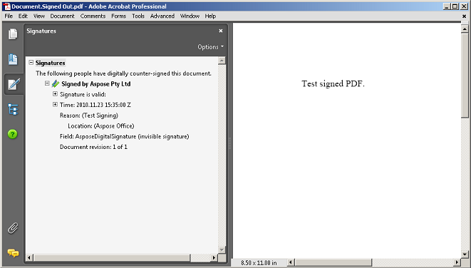

A digital signature is a technological implementation of electronic signatures to sign documents and authenticate the signer to guarantee that a document has not been modified since it was signed. Each digital signature is unique for each signer because of following the PKI protocol to generate both public and private keys. Signing a document digitally means creating a signature using the signer's private key where a mathematical algorithm is used to encrypt the generated hash.

Aspose.Words allows you to detect, count, or verify existing digital signatures, and also add a new signature to your document to find out any tampering in it. You can also remove all digital signatures from a document. Use the [DigitalSignatureUtil](https://reference.aspose.com/words/java/com.aspose.words/digitalsignatureutil/) class to work with digital signatures.

This article explains how to do all of the above to validate the authenticity and integrity of a digital document.

{}

Note that you can access digital signatures of your document only when running the Java 6 version and above.

{}

{}

**Try online**

You can try this functionality with our [Free online signature](https://products.aspose.app/words/signature).

{}

## Supported Formats

Aspose.Words allows you to work with digital signatures on DOC, OOXML, and ODT documents and to sign the generated document in PDF or XPS format.

## Limitations of Digital Signatures

The table below describes a few limitations that you may face while working with digital signatures through Aspose.Words, as well as some alternative options.

| Limitation                                                   | Alternative option                                           |
| ------------------------------------------------------------ | ------------------------------------------------------------ |
| Loss of digital signatures on a document after loading and saving it. Therefore, processing a document to a server may cause the loss of all digital signatures without a notice. | Check if a document has digital signatures and take the appropriate action if any are found. For example, send an alert to the clients informing them that the document they are uploading contains digital signatures that will be lost if it is processed. |
| Aspose.Words supports working with macros in a document. But Aspose.Words does not yet support digital signatures on macros. | Export the document back to any Word format, and use Microsoft Word to add a digital signature to macros. |

## Detect, Count, and Verify Digital Signatures

Aspose.Words allows you to detect digital signature in a document using the the [DetectFileFormat](https://reference.aspose.com/words/java/com.aspose.words/fileformatutil/#detectFileFormat-java.io.InputStream) method and the [HasDigitalSignature](https://reference.aspose.com/words/java/com.aspose.words/fileformatinfo/#hasDigitalSignature) property. It is worth noting that such a check will only detect the fact of the signature, but not its validity.

A document can be signed more than once, and this can be done by different users. To check the validity of digital signatures, you need to load them from the document using the [LoadSignatures](https://reference.aspose.com/words/java/com.aspose.words/digitalsignatureutil/#loadSignatures-java.io.InputStream) method and use the [IsValid](https://reference.aspose.com/words/java/com.aspose.words/digitalsignaturecollection/#isValid) property. Also Aspose.Words allows you to count a set of all digital signatures within a document using the [Count](https://reference.aspose.com/words/java/com.aspose.words/digitalsignaturecollection/#getCount) property.

All of this provides an efficient and safe way to check a document for signatures before processing it.

The following code example shows how to detect the presence of digital signatures and verify them:


// Use a FileFormatInfo instance to verify that a document is not digitally signed.
FileFormatInfo info = FileFormatUtil.detectFileFormat(getMyDir() + "Document.docx");

Assert.assertEquals(".docx", FileFormatUtil.loadFormatToExtension(info.getLoadFormat()));
Assert.assertFalse(info.hasDigitalSignature());

// Sign the document.
CertificateHolder certificateHolder = CertificateHolder.create(getMyDir() + "morzal.pfx", "aw", null);
SignOptions signOptions = new SignOptions();
signOptions.setSignTime(new Date());
DigitalSignatureUtil.sign(getMyDir() + "Document.docx", getArtifactsDir() + "File.DetectDigitalSignatures.docx",
        certificateHolder, signOptions);

// Use a new FileFormatInfo instance to confirm that it is signed.
info = FileFormatUtil.detectFileFormat(getArtifactsDir() + "File.DetectDigitalSignatures.docx");
Assert.assertTrue(info.hasDigitalSignature());

// The signatures can then be accessed like this.
Assert.assertEquals(1, DigitalSignatureUtil.loadSignatures(getArtifactsDir() + "File.DetectDigitalSignatures.docx").getCount());


## Create a Digital Signature {#create-a-digital-signature}

To create a digital signature, you will require to load a signing certificate that confirms identity. When you send a digitally signed document, you also send your certificate and public key.

Aspose.Words allows you to create X.509 certificate, a digital certificate that uses the internationally accepted X.509 PKI standard to verify that a public key belongs to the signer included inside the certificate. To do this, use the [Create](https://reference.aspose.com/words/java/com.aspose.words/certificateholder/#create-byte---java.lang.String) method within the [CertificateHolder](https://reference.aspose.com/words/java/com.aspose.words/certificateholder/) class.

The next sections explain how to add a digital signature, signature line, and how to sign a generated PDF document.

### Sign a Document

Aspose.Words allows you to sign a DOC, DOCX, or ODT document digitally using the [Sign](https://reference.aspose.com/words/java/com.aspose.words/digitalsignatureutil/#sign-java.io.InputStream-java.io.OutputStream-com.aspose.words.CertificateHolder) method and [SignOptions](https://reference.aspose.com/words/java/com.aspose.words/signoptions/) properties.

The following code example shows how to sign documents using a certificate holder and sign options:


// Create X.509 certificate.
CertificateHolder certificateHolder=CertificateHolder.create(getMyDir()+"morzal.pfx","aw");

// Set up the signing time.
SignOptions signOptions = new SignOptions();
signOptions.setComments("My comment");
signOptions.setSignTime(new Date());

// Sign your document.
try (FileInputStream streamIn =  new FileInputStream(getMyDir()+"Digitally signed.docx");
	FileOutputStream streamOut= new FileOutputStream(getArtifactsDir()+"DigitalSignatureUtil.SignDocument.docx"))
{
	DigitalSignatureUtil.sign(streamIn,streamOut,certificateHolder,signOptions);
}

// Load and count digital signatures.
try (FileInputStream stream = new FileInputStream(getArtifactsDir()+"DigitalSignatureUtil.SignDocument.docx"))
{
	DigitalSignatureCollection digitalSignatures = DigitalSignatureUtil.loadSignatures(stream);
	Assert.assertEquals(1, digitalSignatures.getCount());

	DigitalSignature signature=digitalSignatures.get(0);
	
	Assert.assertTrue(signature.isValid());
	Assert.assertEquals(DigitalSignatureType.XML_DSIG, signature.getSignatureType());
	Assert.assertEquals(signOptions.getSignTime().toString(), signature.getSignTime().toString());
	Assert.assertEquals("My comment", signature.getComments());
}


### Add a Signature Line

A signature line is a visual representation of a digital signature in a document. Aspose.Words allows you to insert a signature line using the [DocumentBuilder.InsertSignatureLine](https://reference.aspose.com/words/java/com.aspose.words/documentbuilder/#insertSignatureLine-com.aspose.words.SignatureLineOptions) method.  You can also set the parameters for this representation using the [SignatureLineOptions](https://reference.aspose.com/words/java/com.aspose.words/signaturelineoptions/) class.

For example, the picture below shows how valid and invalid signatures can be displayed.

Also, if a document contains a signature line and no digital signature, there is a feature to ask the user to add a signature.

The following code example shows how to sign a document with a personal certificate and a specific signature line:


// Create a Document.
Document doc = new Document();
DocumentBuilder builder = new DocumentBuilder(doc);

// Set signature line options.
SignatureLineOptions signatureLineOptions = new SignatureLineOptions();
signatureLineOptions.setSigner("Entername");
signatureLineOptions.setSignerTitle("QA");
signatureLineOptions.setEmail("EnterSomeEmail");
signatureLineOptions.setShowDate(true);
signatureLineOptions.setDefaultInstructions(false);
signatureLineOptions.setInstructions("You need more info about signature line");
signatureLineOptions.setAllowComments(true);

// Insert signature line.
SignatureLine signatureLine = builder.insertSignatureLine(signatureLineOptions).getSignatureLine();
signatureLine.setProviderId(UUID.fromString("CF5A7BB4-8F3C-4756-9DF6-BEF7F13259A2"));

doc.save(getArtifactsDir() + "DocumentBuilder.SignatureLineProviderId.docx");

// Set signing options.
SignOptions signOptions = new SignOptions();
signOptions.setSignatureLineId(signatureLine.getId());
signOptions.setProviderId(signatureLine.getProviderId());
signOptions.setComments("Document was signed by vderyushev");
signOptions.setSignTime(new Date());

// Create a certificate.
CertificateHolder certHolder = CertificateHolder.create(getMyDir() + "morzal.pfx", "aw");

// We can sign the signature line programmatically.
DigitalSignatureUtil.sign(getArtifactsDir() + "DocumentBuilder.SignatureLineProviderId.docx",
        getArtifactsDir() + "DocumentBuilder.SignatureLineProviderId.Signed.docx", certHolder, signOptions);

// Create the shape of the signature line.
doc = new Document(getArtifactsDir() + "DocumentBuilder.SignatureLineProviderId.Signed.docx");
Shape shape = (Shape)doc.getChild(NodeType.SHAPE, 0, true);
signatureLine = shape.getSignatureLine();

Assert.assertEquals("vderyushev", signatureLine.getSigner());
Assert.assertEquals("QA", signatureLine.getSignerTitle());
Assert.assertEquals("vderyushev@aspose.com", signatureLine.getEmail());
Assert.assertTrue(signatureLine.getShowDate());
Assert.assertFalse(signatureLine.getDefaultInstructions());
Assert.assertEquals("You need more info about signature line", signatureLine.getInstructions());
Assert.assertTrue(signatureLine.getAllowComments());
Assert.assertTrue(signatureLine.isSigned());
Assert.assertTrue(signatureLine.isValid());

// Loading signatures.
DigitalSignatureCollection signatures = DigitalSignatureUtil.loadSignatures(getArtifactsDir() + "DocumentBuilder.SignatureLineProviderId.Signed.docx");

Assert.assertEquals(1, signatures.getCount());
Assert.assertTrue(signatures.get(0).isValid());
Assert.assertEquals("Document was signed by vderyushev", signatures.get(0).getComments());
Assert.assertEquals("CN=Morzal.Me", signatures.get(0).getIssuerName());
Assert.assertEquals(DigitalSignatureType.XML_DSIG, signatures.get(0).getSignatureType());


### Sign a Generated PDF Document {#sign-a-generated-pdf-document}

Aspose.Words allows you to sign and get all details of a PDF document using the [PdfDigitalSignatureDetails](https://reference.aspose.com/words/java/com.aspose.words/pdfdigitalsignaturedetails/) properties.

The following code example shows how to sign a generated PDF:


Document doc = new Document();
DocumentBuilder builder = new DocumentBuilder(doc);
builder.writeln("Signed PDF contents.");

// Load the certificate from disk.
// The other constructor overloads can be used to load certificates from different locations.
CertificateHolder certificateHolder = CertificateHolder.create(getMyDir() + "morzal.pfx", "aw");

// Pass the certificate and details to the save options class to sign with.
PdfSaveOptions options = new PdfSaveOptions();
Date signingTime = new Date();
options.setDigitalSignatureDetails(new PdfDigitalSignatureDetails(certificateHolder, "Test Signing", "Aspose Office", signingTime));

// We can use this attribute to set a different hash algorithm.
options.getDigitalSignatureDetails().setHashAlgorithm(PdfDigitalSignatureHashAlgorithm.SHA_256);

Assert.assertEquals("Test Signing", options.getDigitalSignatureDetails().getReason());
Assert.assertEquals("Aspose Office", options.getDigitalSignatureDetails().getLocation());
Assert.assertEquals(signingTime, options.getDigitalSignatureDetails().getSignatureDate());

doc.save(getArtifactsDir() + "PdfSaveOptions.PdfDigitalSignature.pdf", options);


The picture below demonstrates that the generated PDF document is opened in Adobe Acrobat and the digital signature is verified as present and valid.

## Remove Digital Signatures

Aspose.Words allows you to remove all digital signatures from a signed document using the [RemoveAllSignatures](https://reference.aspose.com/words/java/com.aspose.words/digitalsignatureutil/#removeAllSignatures-java.io.InputStream-java.io.OutputStream) method.

The following code example shows how to load and remove digital signatures from a document:


// Load digital signatures via filename string to verify that the document is signed.
DigitalSignatureCollection digitalSignatures = DigitalSignatureUtil.loadSignatures(getMyDir() + "Digitally signed.docx");
Assert.assertEquals(1, digitalSignatures.getCount());

// Re-save the document to an output filename with all digital signatures removed.
DigitalSignatureUtil.removeAllSignatures(getMyDir() + "Digitally signed.docx", getArtifactsDir() + "DigitalSignatureUtil.LoadAndRemove.FromString.docx");

// Remove all signatures from the document using stream parameters.
try(FileInputStream streamIn = new FileInputStream(getMyDir() + "Digitally signed.docx");
	FileOutputStream streamOut = new FileOutputStream(getArtifactsDir() + "DigitalSignatureUtil.LoadAndRemove.FromStream.docx"))
{
	DigitalSignatureUtil.removeAllSignatures(streamIn, streamOut);
}

// We can also load a document's digital signatures via stream, which we will do to verify that all signatures have been removed.
try (FileInputStream stream = new FileInputStream(getArtifactsDir() + "DigitalSignatureUtil.LoadAndRemove.FromStream.docx");)
{
	digitalSignatures = DigitalSignatureUtil.loadSignatures(stream);
	Assert.assertEquals(0, digitalSignatures.getCount());
}


{}

Note that you can not remove only one digital signature within your document.

{}
