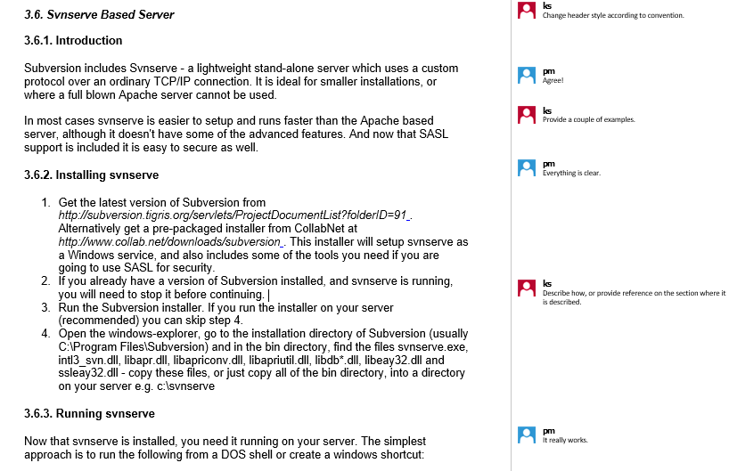
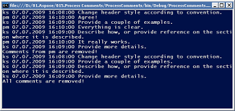
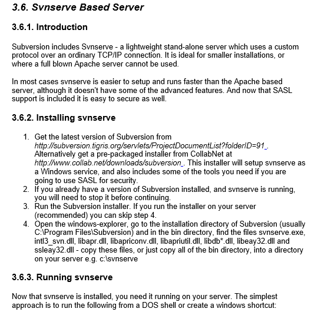

{}

**Try online**

You can try this functionality with our [Free online remove annotations](https://products.aspose.app/words/annotation).

{}

Aspose.Words allows users to work with comments – comments in a document in Aspose.Words are represented by the [Comment](https://reference.aspose.com/words/java/com.aspose.words/comment/) class. Also use the [CommentRangeStart](https://reference.aspose.com/words/java/com.aspose.words/commentrangestart/) and [CommentRangeEnd](https://reference.aspose.com/words/java/com.aspose.words/commentrangeend/) classes to specify the region of text that should be associated with a comment.

## Add a Comment

Aspose.Words allows you to add comments in several ways:

1. Using the [Comment](https://reference.aspose.com/words/java/com.aspose.words/comment/) class
2. Using the [CommentRangeStart](https://reference.aspose.com/words/java/com.aspose.words/commentrangestart/) and [CommentRangeEnd](https://reference.aspose.com/words/java/com.aspose.words/commentrangeend/) classes

The following code example shows how to add a comment to a paragraph using the **Comment** class:



The following code example shows how to add a comment to a paragraph using a region of text and the **CommentRangeStart** and **CommentRangeEnd** classes:



## Extract or Remove Comments

Using Comments in a Word document (in addition to Track Changes) is a common practice when reviewing documents, particularly when there are multiple reviewers. There can be situations where the only thing you need from a document is the comments. Say you want to generate a list of review findings, or perhaps you have collected all the useful information from the document and you simply want to remove unnecessary comments. You may want to view or remove the comments of a particular reviewer.

In this sample, we are going to look at some simple methods for both gathering information from the comments within a document and for removing comments from a document. Specifically, we'll cover how to:

- Extract all the comments from a document or only the ones made by a particular author.
- Remove all the comments from a document or only from a particular author.

### How to Extract or Remove Comments

The code in this sample is quite simple and all methods are based on the same approach. A comment in a Word document is represented by a Comment object in the Aspose.Words document object model. To collect all the comments in a document use the [getChildNodes](https://reference.aspose.com/words/java/com.aspose.words/document/#getChildNodes) method with the first parameter set to `NodeType.Comment`. Make sure that the second parameter of the **getChildNodes** method is set to true: this forces the **getChildNodes** to select from all child nodes recursively, rather than only collecting the immediate children.

To illustrate how to extract and remove comments from a document, we will go through the following steps:

1. Open a Word document using the [Document](https://reference.aspose.com/words/java/com.aspose.words/document/) class
1. Get all comments from the document into a collection
1. To extract comments:
   1. Go through the collection using the for the operator
   1. Extract and list the author name, date & time and text of all comments
   1. Extract and list the author name, date & time and text of comments written by a specific author, in this case, the author ‘ks’
1. To remove comments:
   1. Go backwards through the collection using the for the operator
   1. Remove comments
1. Save the changes.

We are going to use the following Word document for this exercise:

As you can see, it contains several Comments from two authors with the initials “pm” and “ks”.

### How to Extract All Comments

The [getChildNodes](https://reference.aspose.com/words/java/com.aspose.words/document/#getChildNodes) method is very useful and you can use it every time you need to get a list of document nodes of any type. The resulting collection does not create an immediate overhead because the nodes are selected into this collection only when you enumerate or access items in it.

The following code example shows how to extract the author name, date&time and text of all comments in the document:



### How to Extract Comments of a Specified Author

After you have selected Comment nodes into a collection, all you have to do is extract the information you need. In this sample, the author's initials, date, time and the plain text of the comment is combined into one string; you could choose to store it in some other ways instead.

The overloaded method that extracts the Comments from a particular author is almost the same, it just checks the author’s name before adding the info into the array.

The following code example shows how to extract the author name, date&time and text of the comments by the specified author:



### How to Remove Comments

If you are removing all comments, there is no need to move through the collection deleting comments one by one; you can remove them by calling [clear](https://reference.aspose.com/words/java/com.aspose.words/nodecollection/#clear) on the comments collection.

The following code example shows how to remove all comments in the document:



When you need to selectively remove comments, the process becomes more similar to the code we used for comment extraction.

The following code example shows how to remove comments by the specified author:



The main point to highlight here is the use of the for operator. Unlike the simple extraction, here you want to delete a comment. A suitable trick is to iterate the collection backwards from the last Comment to the first one. The reason for this if you start from the end and move backwards, the index of the preceding items remains unchanged, and you can work your way back to the first item in the collection.

The following code example shows the methods for the comments extraction and removal:



{}

You can download the sample file of this example from [Aspose.Words GitHub](https://github.com/aspose-words/Aspose.Words-for-Java/blob/master/Examples/src/main/resources/com/aspose/words/examples/programming_documents/comments/ProcessComments/TestFile.doc).

{}

When launched, the sample displays the following results. First, it lists all comments by all authors, then it lists comments by the selected author only. Finally, the code removing all comments.

The output Word document has now comments removed from it:

### How to Remove Text between CommentRangeStart and CommentRangeEnd

Using Aspose.Words you can also remove comments between the CommentRangeStart and CommentRangeEnd nodes.

The following code example shows how to remove text between CommentRangeStart and CommentRangeEnd:



## Add or Remove Comment's Reply

The [addReply](https://reference.aspose.com/words/java/com.aspose.words/comment/#addReply-java.lang.String-java.lang.String-java.util.Date-java.lang.String) method adds a reply to this comment. Please note that due to the existing MS Office limitations only one (1) level of replies is allowed in the document. An exception of type InvalidOperationException will be raised if this method is called on the existing Reply comment.

You can use the [removeReply](https://reference.aspose.com/words/java/com.aspose.words/comment/#removeReply-com.aspose.words.Comment) method to remove the specified reply to this comment.

The following code example shows how to add a reply to a comment and remove a comment's reply:



## Read Comment's Reply

Aspose.Words support to read the reply of a Comment. The [Replies](https://reference.aspose.com/words/java/com.aspose.words/comment/#getReplies) property returns a collection of the [Comment](https://reference.aspose.com/words/java/com.aspose.words/comment/) objects that are immediate children of the specified comment.

The following code example shows how to iterate through a comment's replies and resolved them:

