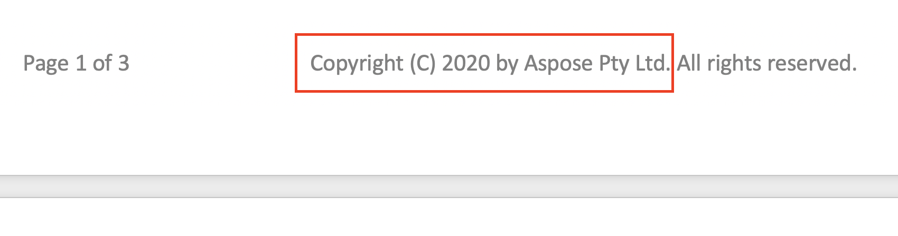

You can easily navigate within your document using a keyboard and mouse, but if you have many pages to scroll through, it will take quite a while to find specific text in a long document. It will be more time consuming when you want to replace certain characters or words that you have used in your document. The “Find and replace” functionality enables you to find a sequence of characters in a document and replace it with another sequence of characters.

Aspose.Words allows you to find a specific string or regular expression pattern in your document and replace it with an alternative without installing and using additional applications such as Microsoft Word. This will speed up many typing and formatting tasks, potentially saving you hours of work.

This article explains how to apply string replacement and regular expressions with the support of metacharacters.

## Ways to Find and Replace {#ways-to-find-and-replace}

Aspose.Words provides two ways to apply the find and replace operation by using the following:

1. *Simple string replacement* – to find and replace a specific string with another, you need to specify a search string (alphanumeric characters) that is going to be replaced according to all occurrences with another specified replacement string. Both strings must not contain symbols. Take into account that string comparison can be case-sensitive, or you may be unsure of spelling or have several similar spellings.
2. *Regular expressions* – to specify a regular expression to find the exact string matches and replace them according to your regular expression. Note that a word is defined as being made up of only alphanumeric characters. If a replacement is executed with only whole words being matched and the input string happens to contain symbols, then no phrases will be found.

Also, you can use special metacharacters with simple string replacement and regular expressions to specify breaks within the find and replace operation.

Aspose.Words presents the find and replace functionality with the [IReplacingCallBack](https://apireference.aspose.com/words/java/com.aspose.words/ireplacingcallback). You can work with many options during the find and replace process using [FindReplaceOptions](https://apireference.aspose.com/words/java/com.aspose.words/FindReplaceOptions) class.

### Find and Replace Text Using Simple String Replacement {#find-and-replace-text-using-simple-string-replacement}

You can use one of the [Replace](https://apireference.aspose.com/words/java/com.aspose.words/range#replace(java.lang.String,java.lang.String)) methods to find or replace a particular string and return the number of replacements that were made. In this case, you can specify a string to be replaced, a string that will replace all its occurrences, whether the replacement is case-sensitive, and whether only stand-alone words will be affected.

The following code example shows how to find the string “_CustomerName_” and replace it with the string *“James Bond”*:



You can notice the difference between the document before applying simple string replacement:

And after applying simple string replacement:

### Find and Replace Text Using Regular Expressions {#find-and-replace-text-using-regular-expressions}

A regular expression (regex) is a pattern that describes a certain sequence of text. Suppose you want to replace all double occurrences of a word with a single word occurrence. Then you can apply the following regular expression to specify the double-word pattern: `([a-zA-Z]+) \1`.

Use the other [Replace](https://apireference.aspose.com/words/java/com.aspose.words/range#replace(java.util.regex.Pattern,java.lang.String)) method to search and replace particular character combinations by setting the Regex parameter as the regular expression pattern to find matches.

The following code example shows how to replace strings that match a regular expression pattern with a specified replacement string:



You can notice the difference between the document before applying string replacement with regular expressions:

And after applying string replacement with regular expressions:

### Find and Replace String Using Metacharacters {#find-and-replace-text-using-metacharacters}

You can use metacharacters in the search string or the replacement string if a particular text or phrase is composed of multiple paragraphs, sections, or pages. Some of the metacharacters include **&p** for a paragraph break, **&b** for a section break, **&m** for a page break, and **&l** for a line break.

{}

Note that the metacharacter **&&** equals to **&**. For example, if you need to find the text for **&p** that is not a paragraph break, then you can use **&&p**.

{}

The following code example shows how to replace text with paragraph and page break:


## Find and Replace String in Header/Footer of a Document {#find-and-replace-string-in-header-or-footer-of-a-document}

You can find and replace text in the header/footer section of a Word document using the [HeaderFooter](https://apireference.aspose.com/words/java/com.aspose.words/HeaderFooter) class.

The following code example shows how to replace the text of the header section in your document:



You can notice the difference between the document before applying header string replacement:

And after applying header string replacement:

The code example to replace the text of the footer section in your document is very similar to the previous header code example. All you need to do is replace the following two lines:


HeaderFooter header = headersFooters.get(HeaderFooterType.HEADER_PRIMARY);
header.getRange().replace("Aspose.Words", "Remove", options);


With the following:



You can notice the difference between the document before applying footer string replacement:

And after applying footer string replacement:

## Ignore Text During Find and Replace {#ignore-text-during-find-and-replace}

While applying the find and replace operation, you can ignore certain segments of the text. So, certain parts of the text can be excluded from the search, and the find and replace can be applied only to the remaining parts.

Aspose.Words provides many find and replace properties for ignoring text such as [IgnoreDeleted](https://apireference.aspose.com/words/java/com.aspose.words/findreplaceoptions#IgnoreDeleted), [IgnoreFieldCodes](https://apireference.aspose.com/words/java/com.aspose.words/findreplaceoptions#IgnoreFieldCodes), [IgnoreFields](https://apireference.aspose.com/words/java/com.aspose.words/findreplaceoptions#IgnoreFields), [IgnoreFootnotes](https://apireference.aspose.com/words/java/com.aspose.words/findreplaceoptions#IgnoreFootnotes), and [IgnoreInserted](https://apireference.aspose.com/words/java/com.aspose.words/findreplaceoptions#IgnoreInserted).

The following code example shows how to ignore text inside delete revisions:



## Customize Find and Replace Operation {#customize-find-and-replace-operation}

Aspose.Words provides many different [properties](https://apireference.aspose.com/words/java/com.aspose.words/FindReplaceOptions) to find and replace text such as applying specific format with [ApplyFont](https://apireference.aspose.com/words/java/com.aspose.words/findreplaceoptions#ApplyFont) and [ApplyParagraphFormats](https://apireference.aspose.com/words/java/com.aspose.words/findreplaceoptions#ApplyParagraphFormat) properties, using substitutions in replacement patterns with [UseSubstitutions](https://apireference.aspose.com/words/java/com.aspose.words/findreplaceoptions#UseSubstitutions) property, and others.

The following code example shows how to highlight a specific word in your document:



Aspose.Words allows you to use the [IReplacingCallback](https://apireference.aspose.com/words/java/com.aspose.words/IReplacingCallback) interface to create and call a custom method during a replace operation. You may have some use cases where you need to customize the find and replace operation such as replacing text specified with a regular expression with HTML tags, so basically you will apply replace with inserting HTML.

If you need to replace a string with an HTML tag, apply the **IReplacingCallback** interface to customize the find and replace operation so the match starts at the beginning of a run with the match node of your document. Let us provide several examples of using **IReplacingCallback**.

The following code example shows how to replace text specified with HTML:



The following code example shows how to highlight positive numbers with green color and negative numbers with red color:



The following code example shows how to prepend a line number to each line:


