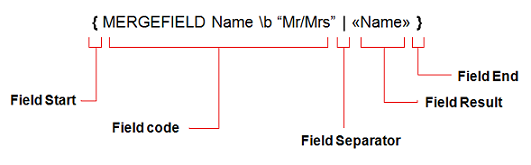
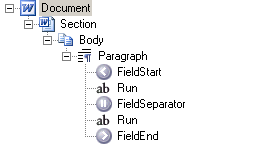

Aspose.Words is a class library designed for server-side processing of Microsoft Word documents and supports fields in the following ways:

- all fields in a document are preserved during open/save and conversions
- it is possible to update results of the most fields

In this article, we will learn more about field structure, the fields supported in Aspose.Words, and details of working with such fields.

## Field Structure

A field consists of:

- The field start and separator nodes are used to encompass the content which makes up the field code (normally as plain text).
- The field separator and field end encompass the field result. This can be made up of various types of content ranging from runs of text to paragraphs to tables.
- Some fields may not have a separator which means the entire content makes up the field code.
- The field code defines the behavior of the field and is comprised of the field identifier and often other parameters such as field name and switches.
- The field result contains the most recent evaluation of the field. This value is stored in the field result and is what is displayed to the user. Some fields may not have any field result thus will not display anything in the document. Likewise, some fields may not be updated yet therefore will also have no field result.

The content which makes up the field code is stored as [Run](https://reference.aspose.com/words/java/com.aspose.words/run/) nodes between the [FieldStart](https://reference.aspose.com/words/java/com.aspose.words/fieldstart/) and [FieldSeparator](https://reference.aspose.com/words/java/com.aspose.words/fieldseparator/). The field result is stored between the **FieldSeparator** and [FieldEnd](https://reference.aspose.com/words/java/com.aspose.words/fieldend/) nodes and can be made up of various types of content. Normally the field result contains just text made up of Run nodes, however it is possible for the FieldEnd node to be located in a completely different paragraph, and thus making the field result comprised of [block level nodes](https://docs.aspose.com/words/java/logical-levels-of-nodes-in-a-document/) such as **Table** and **Paragraph** nodes as well.

Here is a view of how a field is stored in Aspose.Words by using the “*DocumentExplorer”* example which can be found on [Github](https://github.com/aspose-words/Aspose.Words-for-Java/tree/master/Examples/src/main/java/com/aspose/words/examples/viewers_visualizers/document_explorer).

## Fields in Aspose.Words Document Object Model (DOM)

When a document is loaded into Aspose.Words, the fields of the document are loaded into the Aspose.Words Document Object Model as a set of separate components (nodes). A single field is loaded as a collection of **FieldStart**, **FieldSeparator** and **FieldEnd** nodes along with the content in between these nodes. If a field does not have a field result then there will be no **FieldSeparator** node. All of these nodes are always found inline (as children of [Paragraph](https://reference.aspose.com/words/java/com.aspose.words/paragraph/) or [SmartTag](https://reference.aspose.com/words/java/com.aspose.words/smarttag/)).

In Aspose.Words each of the **FieldXXX** nodes derives from [FieldChar](https://reference.aspose.com/words/java/com.aspose.words/fieldchar/). This class provides a property to check the type of field represented by the specified node through the [FieldType](https://reference.aspose.com/words/java/com.aspose.words/fieldtype/) property. For example FieldType.FieldMergeField represents a merge field in the document.

{}

There are some particular fields that exist in a Word document that are not imported into Aspose.Words as a collection of **FieldXXX** nodes. For instance, LINK field and INCLUDEPICTURE field are imported into Aspose.Words as a [Shape](https://reference.aspose.com/words/java/com.aspose.words/shape/) object. This object provides properties to work with the image data normally stored in these fields. To import INCLUDEPICTURE field as **FieldXXX** nodes the [PreserveIncludePictureField](https://reference.aspose.com/words/java/com.aspose.words/loadoptions#PreserveIncludePictureField) option must be specified as **true**.

Form fields are also imported into Aspose.Words as their own special class. The [FormField](https://reference.aspose.com/words/java/com.aspose.words/formfield/) class represents a form field in a Word document and provides additional methods that are particular to a form field.

{}

## Supported Fields

Calculation of the following fields is supported in the current version of Aspose.Words:

- = (formula)
- ADDRESSBLOCK
- ASK
- AUTHOR
- AUTONUM
- AUTONUMLGL
- AUTONUMOUT
- AUTOTEXT
- BARCODE
- COMMENTS
- COMPARE
- CREATEDATE
- DATABASE
- DATE
- DISPLAYBARCODE
- DOCPROPERTY
- DOCVARIABLE
- EDITTIME
- EQ
- FILENAME
- FILESIZE
- FILLIN
- FORMCHECKBOX
- FORMDROPDOWN
- FORMTEXT
- GLOSSARY
- GOTOBUTTON
- GREETINGLINE
- HYPERLINK
- IF
- IMPORT
- INCLUDE
- INCLUDEPICTURE
- INCLUDETEXT
- INDEX
- INFO
- KEYWORDS
- LASTSAVEDBY
- LISTNUM
- MACROBUTTON
- MERGEBARCODE
- MERGEFIELD
- MERGEREC
- MERGESEQ
- NEXT
- NEXTIF
- NOTEREF
- NUMCHARS
- NUMPAGES
- NUMWORDS
- PAGE
- PAGEREF
- PRINTDATE
- QUOTE
- REF
- REVNUM
- SAVEDATE
- SECTION
- SECTIONPAGES
- SEQ
- SET
- SHAPE
- SKIPIF
- STYLEREF
- SUBJECT
- SYMBOL
- TEMPLATE
- TIME
- TITLE
- TOA
- TOC (including TOT and TOF)
- USERADDRESS
- USERINITIALS
- USERNAME

## Sophisticated Field Parsing

Aspose.Words follows the way Microsoft Word processes fields and as a result it correctly handles:

- nested fields:
  `IF { =OR({ COMPARE { =2.5 +PRODUCT(3,5 ,8.4) } > 4}, { =2/2 }) } = 1 "Credit not acceptable" "Credit acceptable"`
- field argument can be a result of a nested field
- fields can be nested within a field code as well as in the field result
- spaces/no spaces, quotes/no quotes, escape characters in fields etc.:
  `MERGEFIELD \f"Text after""Field \n\ame with \" and \\\ and \\\*"\bTextBefor\e`
- fields that span across multiple paragraphs

### Formula Fields

Aspose.Words provides a very serious implementation of the formula engine and supports the following:

- arithmetic and logical operators:
  `=(54+4*(6-77)-(5))+(-6-5)/4/5`
- functions:
  `=ABS(-01.4)+2.645/(5.6^3.5)+776457 \\\# "#,##0"`
- references to bookmarks:
  `=IF(C>4, 5,ABS(A)*.76) +3.85`
- number formatting switches:
  `=00000000 \\\# "$#,##0.00;($#,##0.00)"`

The following functions in expressions are supported: ABS, AND, AVERAGE, COUNT, DEFINED, FALSE, IF, INT, MAX, MIN, MOD, NOT, OR, PRODUCT, ROUND, SIGN, SUM, TRUE.

### IF and COMPARE Fields

Just some of the IF expressions that Aspose.Words can easily calculate should give you an idea of how powerful this feature is:

- `IF 3 > 5.7^4+MAX(4,3) True False`
- `IF "abcd" > "abc" True False`
- `IF "?ab*" = "1abdsg" True False`
- `IF 4 = "2*2" True False`
- `COMPARE 3+5/34 < 4.6/3/2`

### DATE and TIME Fields

Aspose.Words supports all date and time formatting switches available in Microsoft Word, some examples are:

- `DATE @ "d-MMM-yy"`
- `DATE @ "d/MM/yyyy h:mm am/pm`

### Mail Merge Fields

Aspose.Words imposes no limit on the complexity of mail merge fields in your documents and supports nested IF and formula fields and can even calculate the merge field’s name using a formula.

Some examples of mail merge fields that Aspose.Words supports:

- Mail merge field switches:
  `MERGEFIELD FirstName \\\\\\\\* FirstCap \b "Mr. "`
- nested merge fields in a formula:
  `IF { MERGEFIELD Value1 } >= { MERGEFIELD Value2 } True False`
- calculate the name of the merge field at runtime:
  `MERGEFIELD { IF { MERGEFIELD Value1 } >= { MERGEFIELD Value2 } FirstName"LastName" }`
- conditional move to next record in the data source:
  `NEXTIF { MERGEFIELD Value1 } <= { =IF(-2.45 >= 6*{ MERGEFIELD Value2 }, 2, -.45) }`

### Format Switches

A field in a document can have formatting switches that specify how the resulting value should be formatted. Aspose.Words supports the following format switches:

- @ – date and time formatting
- \\\# – number formatting
- \\\\\\\\* Caps
- \\\\\\\\* FirstCap
- \\\\\\\\* Lower
- \\\\\\\\* Upper
- \\\\\\\\* CHARFORMAT – format result according to the first character of the field code
- \\\\\\\\* MERGEFORMAT – format result according to how the old result is formatted

### Date and Number Formatting in Fields

When Aspose.Words calculates a field result, it often needs to parse a string into a number or date value and also to format it back to a string.By default Aspose.Words uses the current thread culture to perform parsing and formatting when calculating field values during field update and mail merge. There are also options provided in the form of the [FieldOptions](https://reference.aspose.com/words/java/com.aspose.words/fieldoptions/) class which allows further control over which culture is used during field update%

* by default the [FieldUpdateCultureSource](https://reference.aspose.com/words/java/com.aspose.words/fieldoptions#FieldUpdateCultureSource) property is set to [CurrentThread](https://reference.aspose.com/words/java/com.aspose.words/fieldupdateculturesource#CURRENT_THREAD) which formats fields using the current thread culture
* this property can be set to [FieldCode](https://reference.aspose.com/words/java/com.aspose.words/fieldupdateculturesource#FIELD_CODE) so the language set from the field code of the field is used for formatting instead

### Formatting using the Current Thread’s Culture

To control the culture used during field calculation, just set the **CurrentCulture** property to a culture of your choice before invoking field calculation.

The following code example shows how to change the culture used in formatting fields during update:

EXAMPLE (use the public wrapper CurrentThreadSettings.getLocale() and setLocale() instead of the private Thread.CurrentThread.CurrentCulture)

Using the current culture to format fields allows a system to easily and consistently control how all fields in the document are formatted during field update.

### Formatting using the Culture in the Document

On the other hand, Microsoft Word formats each individual field based off the language of the text found in the field (specifically, the runs from the field code). Sometimes during field update this may be the desired behavior, for example if you have globalized documents containing content made up of many different languages and would like each fields to honor the locale used from the text. Aspose.Words also supports this functionality.

The [Document](https://reference.aspose.com/words/java/com.aspose.words/document/) class provides a [FieldOptions](https://reference.aspose.com/words/java/com.aspose.words/document#FieldOptions) property which contains members which can be used to control how fields are updated within the document.

The following code example shows how to specify where the culture used for date formatting during field update and mail merge is chosen from:

EXAMPLE
