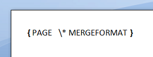
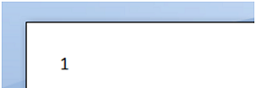
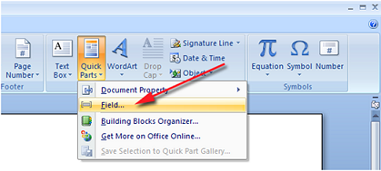
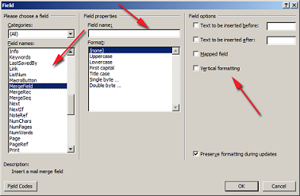
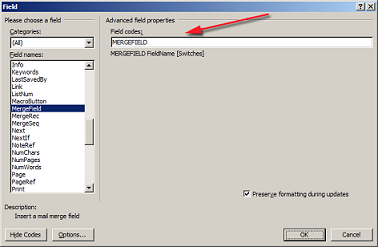
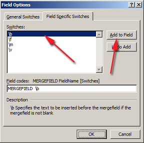
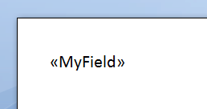

---
title: Introduction to Fields
description: "Fields feature in details, field codes and field results explained in Aspose.Words for Java."
type: docs
weight: 10
url: /java/introduction-to-fields/
---

## Fields Overview

Fields in a document are like placeholders where useful data can be inserted. For example, a field can be a page reference, formula or a mail merge field. A field in a Microsoft Word document consists of a field code and a field result. The field code is an instruction about how the field result needs to be updated or calculated. An application that processes a document and encounters a field might have the functionality to interpret the instructions contained in the field code and update the field result with a new value. This is called a field update.
Usually a field, when inserted in Microsoft Word, already contains an up to date value. For example, if the field is a formula or a page number, it will contain a correct calculated value for the given version of the document. But if you have an application that generates or modifies a document with fields (for example combines two documents or populates with data) then for the document to be useful, all fields should ideally be updated.

A field consists of:

- The field start and separator nodes are used to encompass the content which makes up the field code (normally as plain text)
- The field separator and field end encompass the field result. This can be made up of various types of content ranging from runs of text to paragraphs to tables.
- Some fields may not have a separator which means the entire content makes up the field code.
- The field code defines the behavior of the field and is comprised of the field identifier and often other parameters such as field name and switches.
- The field result contains the most recent evaluation of the field. This value is stored in the field result and is what is displayed to the user. Some fields may not have any field result thus will not display anything in the document. Likewise, some fields may not be updated yet therefore will also have no field result.

Here is a view of how a field is stored in Aspose.Words by using the “*DocumentExplorer”* example which can be found on [Github](https://github.com/aspose-words/Aspose.Words-for-Java/tree/master/Examples/src/main/java/com/aspose/words/examples/viewers_visualizers/document_explorer).

Aspose.Words is a class library designed for server-side processing of Microsoft Word documents and supports fields in the following ways:

- All fields in a document are preserved during open/save and conversions.
- It is possible to update the results of some of the most popular fields.

## Fields in Microsoft Word

Fields in Microsoft Word documents are complex. There are over 50 field types (each needs its own result calculation procedure), formulas and expressions, bookmarks and references, functions and various switches. Fields can also be nested.

Normally when a document is opened, the field result (the value of the field) is shown for all fields in the document. You can toggle the display of field results or field codes in Microsoft Word for all fields by pressing **ALT+F9**.

|Field Code|Field Result|
| :- | :- |
|||

### Inserting Fields in Microsoft Word

To insert a field in Microsoft Word:

1. Click on the **Insert** menu.
1. Click on the **Quick Parts** dropdown menu
1. Select **Field**

1. You are presented with a screen which allows you to enter the details of the field. On the left side you are given a list of the possible fields and on the right side is a screen to visually edit the properties of the field. 

1. Additionally you can press the **Field Codes** button which allows you to directly write out the field code. 

1. Switches can also be inserted by using the **Options** button 

1. Using either method, fill in the desired fields with the appropriate information then press **Ok**.
1. The field is inserted into the document at the current cursor position. 

### Updating Fields in Microsoft Word

To update a single field in Microsoft Word:

1. Move the caret into the field that you want to update.
1. Press **F9** to update the field.

To update all fields in Microsoft Word:

1. Press **Ctrl+A** to select all the content in the document.
1. Press **F9** to update all of the fields found within the selection.

### Switching Between Display of Field Code and Field Result

To toggle field codes of a single field in Microsoft Word:

1. Move the caret into the desired field.
1. Press **SHIFT+F9** to toggle the field code just for this field.

To toggle field codes of all fields in Microsoft Word:

1. Press **ALT+F9**

### Converting Fields to Static Text in Microsoft Word

To convert a dynamic field to static text in Microsoft Word:

1. Move the caret into the field that you want to convert.
1. Press **Ctrl+Shift+F9** to convert the fields to static text.

### Removing a Field in Microsoft Word

To remove a field in Microsoft Word:

1. Select the entire content making up the field. If field codes are displayed then the opening and ending braces need to be selected as well.
1. Press **Delete** to remove the entire field.

## Fields in Aspose.Words

When a document is loaded into Aspose.Words, the fields of the document are loaded into the Aspose.Words Document Object Model as a set of separate components (nodes). A single field is loaded as a collection of [FieldStart](https://apireference.aspose.com/words/java/com.aspose.words/FieldStart), [FieldSeparator](https://apireference.aspose.com/words/java/com.aspose.words/FieldSeparator) and [FieldEnd](https://apireference.aspose.com/words/java/com.aspose.words/FieldEnd) nodes along with the content in between these nodes. If a field does not have a field result then there will be no FieldSeparator node. All of these nodes are always found inline (as children of Paragraph or SmartTag).

The content which makes up the field code is stored as [Run](https://apireference.aspose.com/words/java/com.aspose.words/Run) nodes between the FieldStart and FieldSeparator. The field result is stored between the FieldSeparator and FieldEnd nodes and can be made up of various types of content. Normally the field result contains just text made up of Run nodes, however it is possible for the FieldEnd node to be located in a completely different paragraph, and thus making the field result comprised of block level nodes such as Table and Paragraph nodes as well.

In Aspose.Words each of the **FieldXXX** nodes derives from [FieldChar](https://apireference.aspose.com/words/java/com.aspose.words/FieldChar). This class provides a property to check the type of field represented by the specified node through the [FieldChar.FieldType](https://apireference.aspose.com/words/java/com.aspose.words/FieldType) property. For example FieldType.FieldMergeField represents a merge field in the document.

{} 

There are some particular fields that exist in a Word document that are not imported into Aspose.Words as a collection of **FieldXXX** nodes. For instance, LINK field and INCLUDEPICTURE field are imported into Aspose.Words as a Shape object. This object provides properties to work with the image data normally stored in these fields.

Form fields are also imported into Aspose.Words as their own special class. The FormField class represents a form field in a Word document and provides additional methods that are particular to a form field.

{} 

### Fields Supported during Update

Calculation of the following fields is supported in the current version of Aspose.Words:

- = (formula field)
- ADDRESSBLOCK
- AUTHOR
- COMPARE
- CREATEDATE
- DATE
- DOCPROPERTY
- DOCVARIABLE
- GREETINGLINE
- IF
- INCLUDETEXT
- MERGEFIELD
- MERGEREC
- MERGESEQ
- NEXT
- NEXTIF
- NUMPAGES
- PAGE
- PAGEREF
- REF
- SECTION
- SECTIONPAGES
- SEQ
- SET
- STYLEREF
- TIME
- TITLE
- TOA
- TOC (including TOT and TOF)
- TC

### Sophisticated Parsing

Aspose.Words follows the way Microsoft Word processes fields and as a result it correctly handles:

- Nested fields:
  `IF { =OR({ COMPARE { =2.5 +PRODUCT(3,5 ,8.4) } > 4}, { =2/2 }) } = 1 "Credit not acceptable" "Credit acceptable"`
- Field argument can be a result of a nested field.
- Fields can be nested within a field code as well as in the field result.
- Spaces/no spaces, quotes/no quotes, escape characters in fields etc.:
  `MERGEFIELD \f"Text after""Field \n\ame with \" and \\\ and \\\*"\bTextBefor\e`
- Fields that span across multiple paragraphs.

#### Formula Fields

Aspose.Words provides a very serious implementation of the formula engine and supports the following:

- Arithmetic and logical operators:
  `=(54+4*(6-77)-(5))+(-6-5)/4/5`
- Functions:
  `=ABS(-01.4)+2.645/(5.6^3.5)+776457 \\\# "#,##0"`
- References to bookmarks
  `: =IF(C>4, 5,ABS(A)*.76) +3.85`
- Number formatting switches:
  `=00000000 \\\# "$#,##0.00;($#,##0.00)"`

The following functions in expressions are supported: ABS, AND, AVERAGE, COUNT, DEFINED, FALSE, IF, INT, MAX, MIN, MOD, NOT, OR, PRODUCT, ROUND, SIGN, SUM, TRUE.

#### IF and COMPARE Fields

Just some of the IF expressions that Aspose.Words can easily calculate should give you an idea of how powerful this feature is:

- `IF 3 > 5.7^4+MAX(4,3) True False`
- `IF "abcd" > "abc" True False`
- `IF "?ab*" = "1abdsg" True False`
- `IF 4 = "2*2" True False`
- `COMPARE 3+5/34 < 4.6/3/2`

#### DATE and TIME Fields

Aspose.Words supports all date and time formatting switches available in Microsoft Word, some examples are:

- `DATE @ "d-MMM-yy"`
- `DATE @ "d/MM/yyyy h:mm am/pm`

#### Mail Merge Fields

Aspose.Words imposes no limit on the complexity of mail merge fields in your documents and supports nested IF and formula fields and can even calculate the merge field’s name using a formula.

Some examples of mail merge fields that Aspose.Words supports:

- Mail merge field switches:
  `MERGEFIELD FirstName \\\\\\\\* FirstCap \b "Mr. "`
- Nested merge fields in a formula:
  `IF { MERGEFIELD Value1 } >= { MERGEFIELD Value2 } True False`
- Calculate the name of the merge field at runtime:
  `MERGEFIELD { IF { MERGEFIELD Value1 } >= { MERGEFIELD Value2 } FirstName"LastName" }`
- Conditional move to next record in the data source:
  `NEXTIF { MERGEFIELD Value1 } <= { =IF(-2.45 >= 6*{ MERGEFIELD Value2 }, 2, -.45) }`

#### Format Switches

A field in a document can have formatting switches that specify how the resulting value should be formatted. Aspose.Words supports the following format switches:

- @ - date and time formatting
- \\\# - number formatting
- \\\\\\\\* Caps
- \\\\\\\\* FirstCap
- \\\\\\\\* Lower
- \\\\\\\\* Upper
- \\\\\\\\* CHARFORMAT – format result according to the first character of the field code.
- \\\\\\\\* MERGEFORMAT – format result according to how the old result is formatted.

##### Date and Number Formatting in Fields

When Aspose.Words calculates a field result, it often needs to parse a string into a number or date value and also to format it back to a string.By default Aspose.Words uses the current thread culture to perform parsing and formatting when calculating field values during field update and mail merge. There are also options provided in the form of the [FieldOptions](https://apireference.aspose.com/words/java/com.aspose.words/FieldOptions) class which allows further control over which culture is used during field update.By default the FieldOptions.FieldUpdateCultureSource property is set to FieldUpdateCultureSource.CurrentThread which formats fields using the current thread culture.This property can be set to FieldUpdateCultureSource.FieldCode so the language set from the field code of the field is used for formatting instead.
