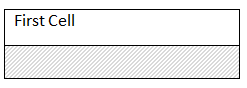
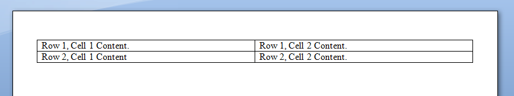
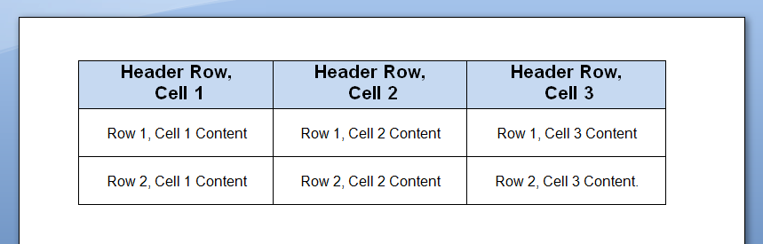
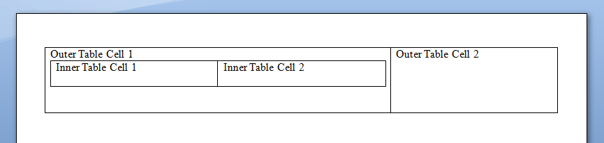

### Creating Tables Overview

Aspose.Words provides several different methods to create new tables in a document. This article presents the full details of how to insert formatted tables using each technique as well as a comparison of each technique at the end of the article. A newly created table is given similar defaults as used in Microsoft Word:

|Table Property|Default in Aspose.Words|
| :- | :- |
|Border Style|Single|
|Border Width|1/2 pt|
|Border Color|Black|
|Left and Right Padding|5.4 pts|
|AutoFit Mode|AutoFit to Window|
|Allow AutoFit|True|
{} 

A table can be inline where it is tightly positioned or can be floating where it can be positioned anywhere on the page. By default, Aspose.Words always creates inline tables.

{} 

### Inserting a Table using DocumentBuilder

In Aspose.Words a table is normally inserted using [DocumentBuilder](http://www.aspose.com/api/java/words/com.aspose.words/classes/DocumentBuilder). The following methods are used to build a table. Other methods will also be used to insert content into the table cells.

- [DocumentBuilder.startTable()](http://www.aspose.com/api/java/words/com.aspose.words/classes/documentbuilder/methods/startTable\(\)/)
- [DocumentBuilder.insertCell()](http://www.aspose.com/api/java/words/com.aspose.words/classes/documentbuilder/methods/insertCell\(\)/)
- [DocumentBuilder.endRow()](http://www.aspose.com/api/java/words/com.aspose.words/classes/documentbuilder/methods/endRow\(\)/)
- [DocumentBuilder.endTable()](http://www.aspose.com/api/java/words/com.aspose.words/classes/documentbuilder/methods/endTable\(\)/)
- [DocumentBuilder.writeln()](http://www.aspose.com/api/java/words/com.aspose.words/classes/documentbuilder/methods/writeln\(\)/)

|Operation|Description|Table State|
| :- | :- | :- |
|**DocumentBuilder.StartTable**|Starts building a new table at the current cursor position.The table is created empty and has no rows or cells yet.||
|**DocumentBuilder.InsertCell**|Inserts a new row and cell into the table.||
|**DocumentBuilder.Writeln**|Writes some text into the current cell.||
|**DocumentBuilder.InsertCell**|Appends a new cell at the end of the current row.||
|**DocumentBuilder.Writeln**|Writes some text into the current cell (now the second cell).||
|**DocumentBuilder.EndRow**|Instructs the builder to end the current row and to begin a new row with the next call to **DocumentBuilder.InsertCell** .||
|**DocumentBuilder.InsertCell**|Creates a new row and inserts a new cell.||
|**DocumentBuilder.Writeln**|Inserts some text into the first cell of the second row.||
|**DocumentBuilder.EndTable**|Called to finish off building the table. The builder cursor will now point outside the table ready to insert content after the table.||
Below example shows how to create a simple table using DocumentBuilder with default formatting.



The result of the above code is a table inserted into the document which contains four cells and some text.

Below example shows how to create a formatted table using DocumentBuilder.



The result is a table which is formatted with some cell shading and different cell alignment.

Below example shows how to insert a nested table using DocumentBuilder.



This will produce a table within another table. This is often referred to as a nested table.

### Inserting a Table Directly into the Document Object Model

Additionally, you can insert tables directly into the DOM at a particular node position. The same table defaults are used when using a [DocumentBuilder](http://www.aspose.com/api/java/words/com.aspose.words/classes/DocumentBuilder) to create a table. To build a new table from scratch without the use of [DocumentBuilder](http://www.aspose.com/api/java/words/com.aspose.words/classes/DocumentBuilder), first, create a new [Table](http://www.aspose.com/api/java/words/com.aspose.words/classes/Table) node using the appropriate constructor, then add it to the document tree.

Note that you must take into account that the table will initially be completely empty (i.e contains no child rows yet). In order to build the table, you will first need to add the appropriate child nodes.

Below example shows how to insert a table using the constructors of nodes.



### Inserting a Clone of an Existing Table

Often there are times when you have an existing table in a document and would like to add a copy of this table then apply some modifications. The easiest way to duplicate a table while retaining all formatting is to clone the table node using the [Table.deepClone(boolean)](http://www.aspose.com/api/java/words/com.aspose.words/classes/table/methods/deepClone\(boolean\)/) method. Below example shows how to make a clone of a table in the document and insert it after the original table.



{} 

If the new table is to include different content you will need to first clear the existing content from the table first.

{} 

Below example shows how to remove all content from the cells of a cloned table.

**Java**


for (Cell cell : (Iterable<Cell>) tableClone.getChildNodes(NodeType.CELL, true))
    cell.removeAllChildren();


The same technique can be used to add copies of an existing row to a table.

Below example shows how to make a clone of the last row of a table and append it to the table.



{} 

If you are looking at creating tables in a document which dynamically grow with each record from your data source, then the above method is not advised. Instead, the desired output is achieved more easily by using Mail Merge with Regions. You can learn more about this technique under [Mail Merge with Regions Explained](/words/java/about-mail-merge/#aboutmailmerge-mailmergewithregionsexplained).

{} 

### Inserting a Table from HTML

Aspose.Words supports inserting content into a document from an HTML source by using the [DocumentBuilder.insertHtml(java.lang.String)](http://www.aspose.com/api/java/words/com.aspose.words/classes/documentbuilder/methods/insertHtml\(java.lang.String\)/) method. The input can be a full HTML page or just a partial snippet. Using this method we can insert tables into our document by using table elements e.g &lt;table&gt;, &lt;tr&gt;, &lt;td&gt;. Below example shows how to insert a table in a document from a string containing HTML tags.



### Comparison of Insertion Techniques

As described in previous articles, Aspose.Words provides several methods for inserting new tables into a document. Each has its advantages and disadvantages, so often the choice of which to use depends on your situation. The table below can give you an idea of each technique.

|Method|Advantages|Disadvantages|
| :- | :- | :- |
|DocumentBuilder ([DocumentBuilder.startTable()](http://www.aspose.com/api/java/words/com.aspose.words/classes/documentbuilder/methods/startTable\(\)/))|Standard method of inserting tables and other document content.|Sometimes hard to create many varieties of tables at the same time with the same instance of the builder.|
|Table ([Table](http://www.aspose.com/api/java/words/com.aspose.words/classes/Table))|Fits in better with surrounding code that creates and inserts nodes directly into the DOM without the use of DocumentBuilder.|The table is created “blank”. Before most operations are performed [Table.ensureMinimum()](http://www.aspose.com/api/java/words/com.aspose.words/classes/table/methods/ensureMinimum\(\)/) must be called to create any missing child nodes.|
|Cloning ([Table.deepClone(boolean)](http://www.aspose.com/api/java/words/com.aspose.words/classes/table/methods/deepClone\(boolean\)/))|Can create a copy of an existing table while retaining all formatting on rows and cells.|The appropriate child nodes must be removed before the table is ready for use.|
|From an HTML source. ([DocumentBuilder.insertHtml(java.lang.String)](http://www.aspose.com/api/java/words/com.aspose.words/classes/documentbuilder/methods/insertHtml\(java.lang.String\)/))|Can create a new table from HTML source e.g the &lt;table&gt;, &lt;tr&gt;, &lt;td&gt; tags|Not all possible formatting on a Microsoft Word table can be applied in HTML.|

