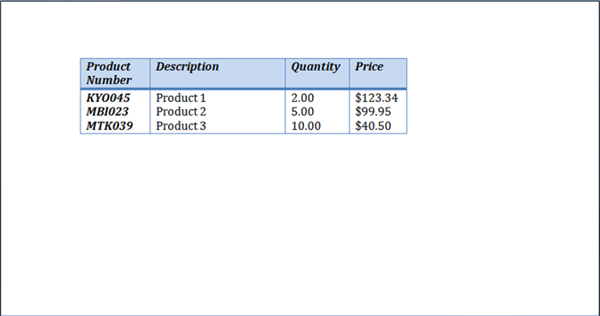
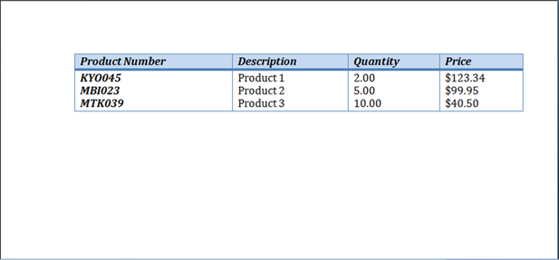
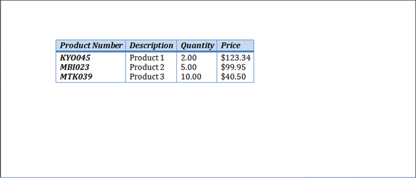

When creating a table using a visual agent such as Microsoft Word, you will often find yourself using one of the AutoFit options to automatically size the table to the desired width. For instance you can use the AutoFit to Window option to fit the table to the width of the page and AutoFit to Contents option to allow each cell to grow or shrink to accommodate its contents.

By default Aspose.Words inserts a new table using “**AutoFit to Window”**. The table will size to the available width on the page. To change the sizing behavior on such a table or an existing table you can call [Table.autoFit(int)](http://www.aspose.com/api/java/words/com.aspose.words/classes/table/methods/autoFit\(int\)/) method. This method accepts an AutoFitBehavior enumeration which defines what type of auto fitting is applied to the table.

As in Microsoft Word, an autofit method is actually a shortcut which applies different properties to the table all at once. These properties are actually what give the table the observed behavior. We will discuss these properties for each autofit option. We will use the following table and apply the different auto fit settings as a demonstration:

### **AutoFitting a Table to Window**

Below example autofits a table to fit the page width.



The result after this operation is a table which is lengthened to fit the width of the page is shown below.

{} 

When autofit to window is applied to a table the following operations are actually being performed behind the scenes:

1. The Table.AllowAutoFit property is enabled to automatically resize columns to the available content.
1. A Table.PreferredWidth value of 100% is applied.
1. The CellFormat.PreferredWidth is removed from all cells in the table. Note this is a little bit different to how Microsoft Word performs this step. In Microsoft Word the preferred width of each cell is set to suitable values based off their current size and content. Aspose.Words does not update preferred width so instead they are just cleared.
1. The column widths are recalculated for the current content of the table.
   The end result is a table that occupies all available width. The widths of the columns in the table change automatically as the user edits text in MS Word.

{} 

### **AutoFitting a Table to Contents**

Below example autofits a table in the document to its contents.



The result of the above code causes the table to automatically resize each column to its contents.

When a table is auto fitted to contents the following steps are actually undertaken behind the scenes:

1. The Table.AllowAutoFit property is enabled to automatically resize each cell to accommodate its contents.
1. The table-wide preferred width under Table.PreferredWidth is removed.
1. The CellFormat.PreferredWidth is removed for every cell in the table.
1. The column widths are recalculated for the current content in the table.
   The end result is a table whose column widths and the entire table width change automatically to best accommodate the content as the user edits text in MS Word.

{} 

Note that this autofit option clears the preferred widths from the cells just like in Microsoft Word. If you want to preserve the column sizes and have the columns further grow or shrink to fit content then you should set the [Table.getAllowAutoFit()](http://www.aspose.com/api/java/words/com.aspose.words/classes/table/methods/getAllowAutoFit\(\)/) property to True on its own instead of using the autofit shortcut.

{} 

### **Disabling AutoFitting on a Table and Use Fixed Column Widths**

Below example disables autofitting and enables fixed widths for the specified table.



The result of disabling autofit and using fixed widths for the column sizes is shown below.

When a table has auto fit disabled and fixed column widths used instead the following steps are taken:

1. The Table.AllowAutoFit property is disabled so columns do not grow or shrink to their contents.
1. The table-wide preferred width is removed from Table.PreferredWidth.
1. The CellFormat.PreferredWidth is removed from all cells in the table.
   The end result is a table whose column widths are defined using the [CellFormat.getWidth()](http://www.aspose.com/api/java/words/com.aspose.words/classes/cellformat/properties/getWidth\(\)/) property and whose columns do not automatically resize when the user enter texts or the page size is modified.

{} 

Note that if no width is defined for [CellFormat.getWidth()](http://www.aspose.com/api/java/words/com.aspose.words/classes/cellformat/properties/getWidth\(\)/) then a default value of one inch (72 points) is used.

{}
