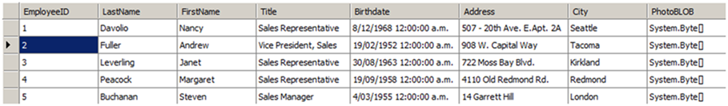
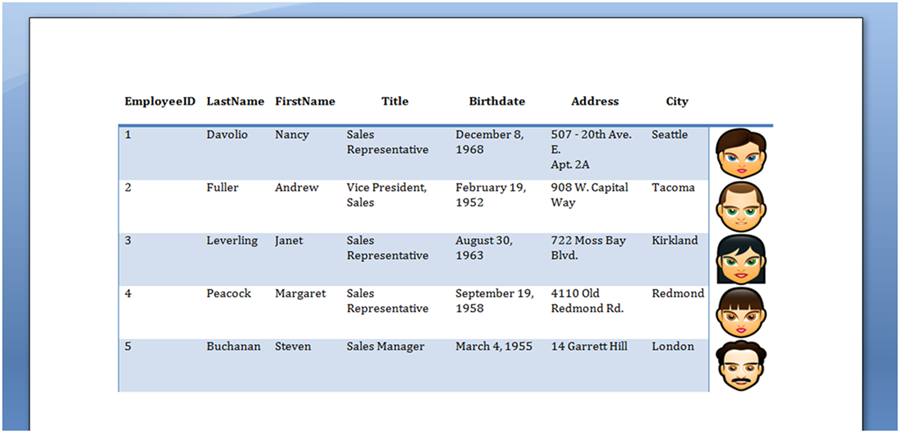

---
title: How to Build a Table from a DataTable
type: docs
weight: 130
url: /java/how-to-build-a-table-from-a-datatable/
---

Often your application will pull data from a database and store it in the form of a **DataTable**. You may wish to easily insert this data into your document as a new table and quickly apply formatting to the whole table.

Using Aspose.Words this task is very simple to achieve. The code presented in this article demonstrates how to do this.

{} 

Note that the preferred way of inserting data from a **DataTable** into a document table is by using [Mail Merge with Regions](/words/java/about-mail-merge/#aboutmailmerge-mailmergewithregionsexplained). The technique presented in this article is only suggested if you are unable to create a suitable template beforehand to merge data with, in other words, if you require everything to happen programmatically.

{} 

To build a table in a document from the data found in a DataTable:

1. Create a new [DocumentBuilder](https://apireference.aspose.com/words/java/com.aspose.words/DocumentBuilder) object on your [Document](https://apireference.aspose.com/words/java/com.aspose.words/Document).
1. Start a new table using [DocumentBuilder](https://apireference.aspose.com/words/java/com.aspose.words/DocumentBuilder).
1. If we want to insert the names of each of the columns from our **DataTable** as a header row then iterate through each data column and write the column names into a row in the table.
1. Iterate through each **DataRow** in the **DataTable**.
   1. Iterate through each object in the **DataRow**.
   1. Insert the object into the document using [DocumentBuilder](https://apireference.aspose.com/words/java/com.aspose.words/DocumentBuilder). The method used depends on the type of the object being inserted e.g [DocumentBuilder.writeln()](https://apireference.aspose.com/words/java/com.aspose.words/documentbuilder#writeln()) for text and [DocumentBuilder.insertImage()](https://apireference.aspose.com/words/java/com.aspose.words/documentbuilder#insertImage(byte[])) for a byte array which represents an image.
   1. At the end of processing of the data row also end the row being created by the [DocumentBuilder]https://apireference.aspose.com/words/java/com.aspose.words/DocumentBuilder) by using [DocumentBuilder.endRow()](https://apireference.aspose.com/words/java/com.aspose.words/documentbuilder#endRow()).
1. Once all rows from the **DataTable** have been processed finish the table by calling [DocumentBuilder.endTable()](https://apireference.aspose.com/words/java/com.aspose.words/documentbuilder#endTable()).
1. Finally, we can set the desired table style using one of the appropriate table properties such as [Table.getStyleIdentifier()](https://apireference.aspose.com/words/java/com.aspose.words/tablestyle#StyleIdentifier) to automatically apply formatting to the entire table.
   The following data in our **DataTable** is used in this example: 

The following code demonstrates how to achieve this in Aspose.Words. The **ImportTableFromDataTable** method accepts a **DocumentBuilder** object, the **DataTable** containing the data and a flag which specifies if the column heading from the **DataTable** are included at the top of the table. This method builds a table from these parameters using the builder’s current position and formatting. 

The following code example provides a method to import data from the DataTable and insert it into a new table using the DocumentBuilder.



The method can then be easily called using your **DocumentBuilder** and data.

The following code example demonstrates how to import the data from a DataTable and insert it into a new table in the document.



The following table is produced by running the code above:

