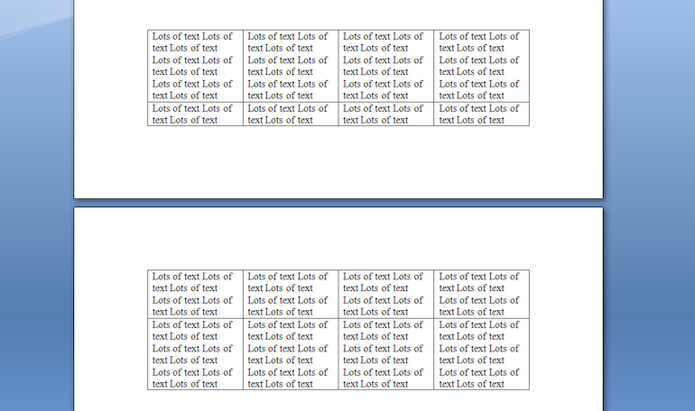
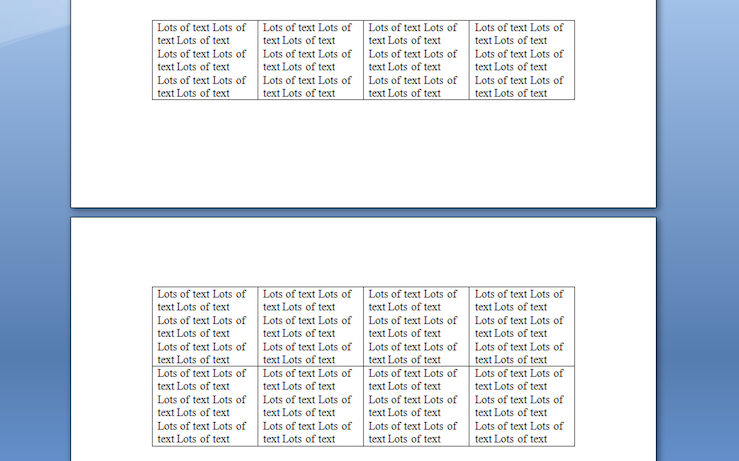
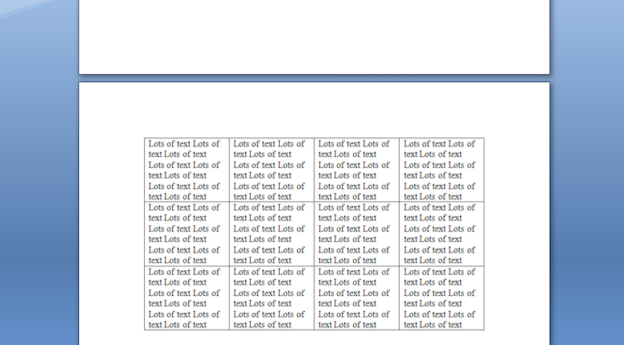

There are times where the contents of a table should not be split across a page. For instance when there is a title above a table, the title and the table should always be kept together on the same page to preserve proper appearance.

There are two separate techniques that are useful to achieve this functionality:

- Allow Row to Break across Pages which is applied to the rows of a table.
- Keep with Next which is applied to paragraphs in table cells.

We will use the table below in our example. By default it has the properties above disabled. Also notice how the content in the middle row is split across the page. 

## Keeping a Row from Breaking across Pages

This involves restricting content inside the cells of a row from being split across a page. In Microsoft Word this can found under Table Properties as the option “Allow Row to break across Pages”.
In Aspose.Words this is found under the [RowFormat](https://reference.aspose.com/words//java/com.aspose.words/rowformat) object of a [Row](https://reference.aspose.com/words//java/com.aspose.words/row) as the property [RowFormat.getAllowBreakAcrossPages()](https://reference.aspose.com/words/java/com.aspose.words/rowformat#AllowBreakAcrossPages). Below example shows how to disable rows breaking across pages for every row in a table.



The result is the contents of each row are no longer split across the page. The table will only split across the page at the start of a row instead of in the middle of a row.

## Keeping a Table from Breaking across Pages

To stop a table from splitting across the page we need to state that we wish the content contained within the table to stay together. In Microsoft Word this involves selecting the table and enabling “Keep with Next” under Paragraph Format. In Aspose.Words the technique is the same. Each paragraph inside the cells of the table should have [ParagraphFormat.setKeepWithNext(boolean)](https://reference.aspose.com/words/java/com.aspose.words/Paragraphformat#KeepWithNext) set to true. The exception is the last paragraph in the table which should be set to false. Below example shows how to set a table to stay together on the same page.



The table is no longer split across the page and the entire table is moved to the next page instead.

