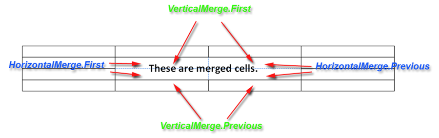

Sometimes certain rows in a table require a heading or large blocks of text that take up the full width of the table. For proper design of the table, the user can merge several table cells into one. Aspose.Words supports merged cells when working with all input formats, including importing HTML content.

## How to Merge Table Cells

In Aspose.Words, merged cells are represented by the following properties of the [CellFormat](https://reference.aspose.com/words/java/com.aspose.words/cellformat/) class:

- [HorizontalMerge](https://reference.aspose.com/words/java/com.aspose.words/cellformat/#getHorizontalMerge) which describes if the cell is a part of a horizontal merge of cells
- [VerticalMerge](https://reference.aspose.com/words/java/com.aspose.words/cellformat/#getVerticalMerge) which describes if the cell is a part of a vertical merge of cells

The values of these properties determine the merge behavior of cells:

- The first cell in a sequence of merged cells will have [CellMerge.First](https://reference.aspose.com/words/java/com.aspose.words/cellmerge/#FIRST)
- Any subsequently merged cells will have [CellMerge.Previous](https://reference.aspose.com/words/java/com.aspose.words/cellmerge/#PREVIOUS)
- A cell that is not merged will have [CellMerge.None](https://reference.aspose.com/words/java/com.aspose.words/cellmerge/#NONE)

{}

Sometimes, when loading existing document cells in a table, they will appear merged. However, it can actually be one long cell – sometimes Microsoft Word exports merged cells this way. This can be confusing when attempting to work with individual cells, but there doesn't seem to be any particular pattern as to when this happens.

{}

## Checking if a Cell is Merged

To check if a cell is part of a sequence of merged cells, we simply check the **HorizontalMerge** and **VerticalMerge** properties.

The following code example shows how to print the horizontal and vertical cell merge type:

 //CheckCellsMerged

## Merge Table Cells When Using DocumentBuilder

To merge cells in a table created with the [DocumentBuilder](https://reference.aspose.com/words/java/com.aspose.words/documentbuilder/), you need to set the appropriate merge type for each cell where the merge is expected – first **CellMerge.First** and then **CellMerge.Previous**.

Also, you must remember to clear the merge setting for those cells where no merge is required – this can be done by setting the first non-merge cell to **CellMerge.None**. If this is not done, all cells in the table will be merged.

The following code example shows how to create a table with two rows where the cells in the first row are merged horizontally:

 //HorizontalMerge

The following code example shows how to create a two-column table where the cells in the first column are vertically merged:

 //VerticalMerge

## Merge Table Cells in Other Cases

In other situations where the **DocumentBuilder** is not used, such as in an existing table, merging cells in the previous way may not be as easy. Instead, we can wrap the basic operations involved in applying merge properties to cells in a method that makes the task much easier. This method is similar to the Merge automation method, which is called to merge a range of cells in a table.

The code below will merge the table cells in the specified range, starting at the given cell and ending at the end cell. In this case, the range can span multiple rows or columns:

 //MergeCells

The following code example shows how to merge a range of cells between two specified cells:

 //MergeCellRange

## Vertical and Horizontal Merged Cells in HTML Table

As we have said in previous articles, a table in Microsoft Word is a set of independent rows. Each row has a set of cells that are independent of the cells of other rows. Thus, in the Microsoft Word table there is no such object as a “column”, and “1st column” is something like “the set of the 1st cells of each row in the table”. This allows users to have a table in which, for example, the 1st row consists of two cells – 2cm and 1cm, and the 2nd row consists of two different cells – 1cm and 2cm wide. And Aspose.Words supports this concept of tables.

A table in HTML has a essentially different structure: each row has the same number of cells and (it is important for the task) each cell has the width of the corresponding column, the same for all cells in one column. So if **HorizontalMerge** and **VerticalMerge** return an incorrect value, use the following code example:

EXAMPLE //PrintHorizontalAndVerticalMerged

//HorizontalAndVerticalMergeHelperClasses

## Convert to Horizontally Merged Cells

Sometimes it is not possible to detect which cells are merged because some newer versions of Microsoft Word no longer use the merge flags when cells are merged horizontally. But for situations where cells are merged into a cell horizontally by their width using merge flags, Aspose.Words provides the ConvertToHorizontallyMergedCells method to convert cells. This method simply transforms the table and adds new cells as needed.

The following code example shows the above method in operation:

 //ConvertToHorizontallyMergedCells
