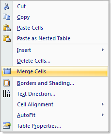
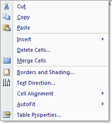

## **Tables Overview**

Tables are a common element found in word documents. They allow for large amounts of information to be organized and displayed cleanly in a grid like structure with rows and columns. They are also frequently used as a page layout tool, and a better alternative for displaying tabbed data (with tab stops) as they allow much better control over the design and layout of the content.

You can lay out content which is to be kept in a fixed position by using a borderless table. While you would normally have plain text in a table, you can also put other content in cells, such as images or even other tables. This is a common example of a table found in a Microsoft Word document:

A table is comprised of elements such as **Cell**, **Row** and **Column**. These are concepts which are common to all tables in general whether they come from a Microsoft Word document or an HTML document.

Tables in Aspose.Words are fully supported. You are able to freely edit, change, add and remove tables. Rendering of tables with high fidelity is also supported.

## **Tables in Microsoft Word**

All versions of Microsoft Word provide special commands for inserting and working with tables. The exact location of these differs between older and newer versions of Microsoft Word but they are all present. These are some of the more common tasks required when working with tables in Microsoft Word.

### **Inserting a Table in Microsoft Word**

To insert a table in Microsoft Word 2003 and earlier:

1. Click the Table menu from the top toolbar.
1. Click Insert and then Table.
1. Fill in the appropriate values and press Ok to insert the table.

To insert a table in Microsoft Word 2007 and later:

1. Click the Insert tab.
1. Choose the Tables drop down menu.
1. Select Insert Table. 

1. Fill in the appropriate values and press Ok to insert the table. 

### **Removing a Table or Table Elements in Microsoft Word**

To remove a table or individual table elements in Microsoft Word 2003 and earlier:

1. Click inside the table in the position that you want.
1. Click the Table menu from the top toolbar.
1. Click Delete.
1. Choose the menu item of element you want to delete. For instance choosing Table will remove the entire table from the document.

To remove a table or individual table elements in Microsoft Word 2007 and later:

1. Click inside the table at the desired position.
1. The Layout tab should appear. Click this tab.
1. Click the Delete drop down menu.
1. Choose the menu item of the element you want to delete. For instance choosing Delete Table will remove the entire table from the document. 

Merging Cells in a Table in Microsoft Word

1. Select the cells to be merged by dragging the cursor over the cells.
1. Right click on the selection.
1. Select Merge Cells from the popup menu. 

### **Using the AutoFit feature in Microsoft Word**

To use the AutoFit feature to automatically size a table in Microsoft Word:

1. Right click anywhere inside the desired table.
1. Select AutoFit from popup menu. 

1. Select the desired autofit option 

1. AutoFit to Contents fits the table around content.
1. AutoFit to Window resizes the table so it fills the available page width between the left and right margins.
1. Fixed Column Width sets each column width to an absolute value. This means even if the content within the cells were to change the width of each column in the table will stay the same.

## **Tables in Aspose.Words**

A table from any document loaded into Aspose.Words is imported as a [Table](http://www.aspose.com/api/java/words/com.aspose.words/classes/Table) node. A table can be found as a child of the main body of text, an inline story such as a comment or footnote, or within a cell as a nested table. Furthermore, tables can be nested inside other tables up to any depth.

A [Table](http://www.aspose.com/api/java/words/com.aspose.words/classes/Table) node does not contain any real content - instead it is a container for other such nodes which make up the content:

- A Table contains many Row nodes. A Table exposes all the normal members of a node which allows you to freely move, modify and remove the table in the document.
- A Row represents a single row of a table and contains many Cell nodes. Additionally a Row provides members which define how a row is displayed, for example the height and alignment.
- A Cell is what contains the true content seen in a table and is made up of Paragraph and other block level nodes. Additionally cells can contain further nested tables.

This relationship is best represented by inspecting the structure of a [Table](http://www.aspose.com/api/java/words/com.aspose.words/classes/Table) node in a document through the use of **DocumentExplorer**. 

You can see in the diagram above that the document contains a table which consists of one row which in turn consists of two cells. Each of the two cells contains a paragraph which is the container of the formatted text ion a cell. In Aspose.Words all table related classes and properties are contained in the **Aspose.Words.Tables** namespace.

You should also notice table is succeeded with an empty paragraph. It is a requirement for a Microsoft Word document to have at least one paragraph after a table. This is used to separate consecutive tables and without it such consecutive tables would be joined together into one. This behavior is identical in both Microsoft Word and Aspose.Words.
