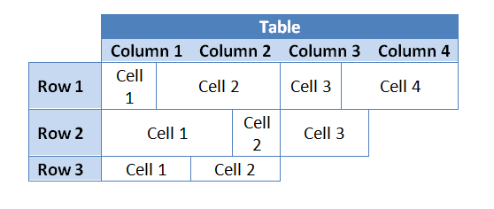
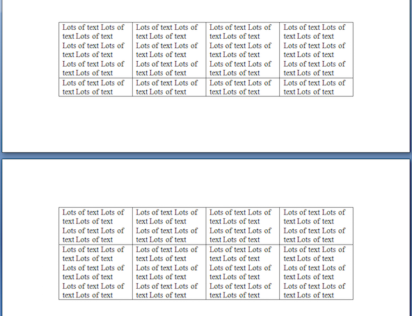
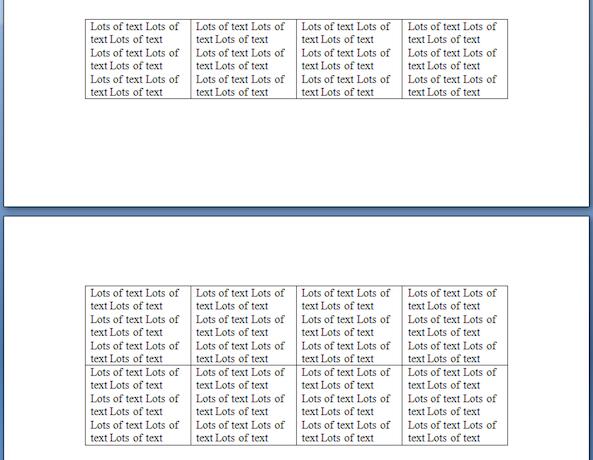
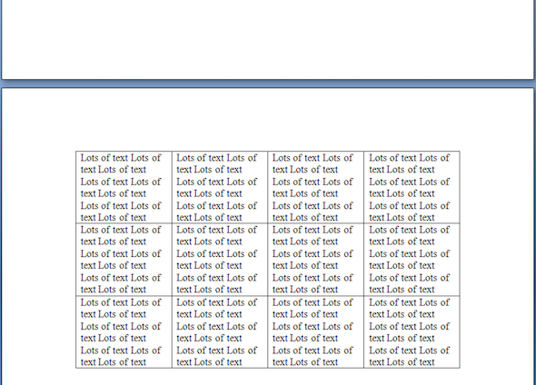

For more control over how tables work, learn how to manipulate columns and rows.

## Find the Table Element Index

Columns, rows and cells are managed by accessing the selected document node by its index. Finding the index of any node involves gathering all child nodes of the element type from the parent node, and then using the [IndexOf](https://reference.aspose.com/words/java/com.aspose.words/nodecollection/#indexOf-com.aspose.words.Node) method to find the index of the desired node in the collection.

### Find the Index of a Table in a Document 

Sometimes you may need to make changes to a particular table in a document. To do this, you can refer to a table by its index.

The following code example shows how to retrieve the index of a table in a document:



### Finding the Index of a Row in a Table

Similarly, you may need to make changes to a specific row in a selected table. To do this, you can also refer to a row by its index.

The following code example shows how to retrieve the index of a row in a table:



### Finding the Index of a Cell in a Row

Finally, you may need to make changes to a specific cell, and you can do this by cell index as well.

The following code example shows how to retrieve the index of a cell in a row:



## Work with Columns

In the Aspose.Words Document Object Model (DOM), the [Table](https://reference.aspose.com/words/java/com.aspose.words/table/) node consists of [Row](https://reference.aspose.com/words/java/com.aspose.words/row/) nodes and then [Cell](https://reference.aspose.com/words/java/com.aspose.words/cell/) nodes. Thus, in the Document Object Model of Aspose.Words, as in Word documents, there is no concept of a column.

By design, the table rows in Microsoft Word and Aspose.Words are completely independent, and the basic properties and operations are contained only in the rows and cells of the table. This gives tables the ability to have some interesting attributes:

- Each table row can have a completely different number of cells
- Vertically, the cells of each row can have different widths
- It is possible to join tables with different row formats and number of cells

Any operations performed on columns are actually "shortcuts" that perform the operation by collectively changing row cells in such a way that it looks like they are being applied to columns. That is, you can perform operations on columns by simply iterating over the same table row cell index.

The following code example simplifies such operations by proving a facade class that collects the cells that make up a "column" of a table:



The following code example shows how to insert a blank column into a table:



The following code example shows how to remove a column from a table in a document:



## Specify Rows as Header Rows

You can choose to repeat the first row in the table as the Header Row only on the first page or on each page if the table is split into several. In Aspose.Words, you can repeat the Header Row on every page using the [HeadingFormat](https://reference.aspose.com/words/java/com.aspose.words/rowformat/#getHeadingFormat) property.

You can also mark multiple header rows if such rows are located one after the other at the beginning of the table. To do this, you need to apply the **HeadingFormat** properties to these rows.

{}

Note that Header Rows do not work in nested tables. That is, if you have a table inside another table, this setting will have no effect. It is a limitation of Microsoft Word that does not allow this, not Aspose.Words.

{}

The following code example shows how to build a table which includes Header Rows that repeat on subsequent pages:



## Keep Tables and Rows from Breaking Across Pages {#keep-tables-and-rows-from-breaking-across-pages}

There are times where the contents of a table should not be split across pages. For instance, if a title is above a table, the title and table should always be kept together on the same page to preserve proper appearance.

There are two separate techniques that are useful to achieve this functionality:

- `Allow row break across pages`, which is applied to table rows
- `Keep with next`, which is applied to paragraphs in table cells

By default, the above properties are disabled.

### Keep a Row from Breaking Across Pages {#keep-a-row-from-breaking-across-pages}

This involves restricting content inside the cells of a row from being split across a page. In Microsoft Word, this can found under Table Properties as the option “Allow row to break across pages”. In Aspose.Words this is found under the [RowFormat](https://reference.aspose.com/words/java/com.aspose.words/rowformat/) object of a [Row](https://reference.aspose.com/words/java/com.aspose.words/row/) as the property [RowFormat.AllowBreakAcrossPages](https://reference.aspose.com/words/java/com.aspose.words/rowformat/#getAllowBreakAcrossPages).

The following code example shows how to disable breaking rows across pages for each row in a table:



### Keep a Table from Breaking Across Pages {#keep-a-table-from-breaking-across-pages}

To stop the table from splitting across pages, we need to specify that we want the content contained within the table to stay together.

To do this, Aspose.Words uses a method, which allows users to select a table and enable the [KeepWithNext](https://reference.aspose.com/words/java/com.aspose.words/paragraphformat/#getKeepWithNext) parameter to true for each paragraph within the table cells. The exception is the last paragraph in the table, which should be set to false.

The following code example shows how to set a table to stay together on the same page:

