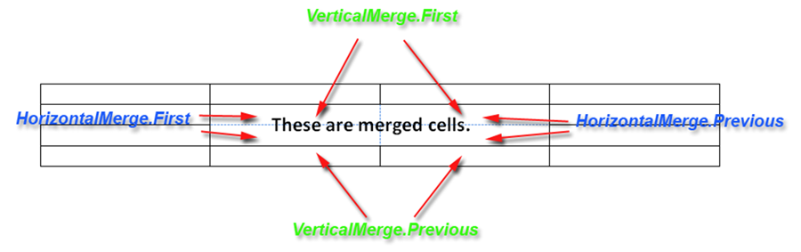

---
title: Working with Merged Cells
description: "Introduction to Merged Cells feature in Aspose.Words for Java."
type: docs
weight: 70
url: /java/working-with-merged-cells/
---

Several cells in a table can be merged together into a single cell. This is useful when certain rows require a title or large blocks of text which span across the width of the table. This can only be achieved by merging cells in the table into a single cell. Aspose.Words supports merged cells when working with all input formats including when importing HTML content.

In Aspose.Words, merged cells are represented by [CellFormat.setHorizontalMerge(int)](https://apireference.aspose.com/words/java/com.aspose.words/CellFormat#HorizontalMerge) and [CellFormat.setVerticalMerge(int)](https://apireference.aspose.com/words/java/com.aspose.words/CellFormat#VerticalMerge). The [CellFormat.getHorizontalMerge()](https://apireference.aspose.com/words/java/com.aspose.words/CellFormat#HorizontalMerge) property describes if the cell is part of a horizontal merge of cells. Likewise the [CellFormat.getVerticalMerge()](https://apireference.aspose.com/words/java/com.aspose.words/CellFormat#VerticalMerge) property describes if the cell is a part of a vertical merge of cells.

The values of these properties are what define the merge behavior of cells.

- The first cell in a sequence of merged cells will have CellMerge.First.
- Any subsequently merged cells have CellMerge.Previous.
- A cell which is not merged has CellMerge.None. 

{} 

Sometimes when you load existing document cells in a table will appear merged. However, these can be in fact one long cell. Microsoft Word at times is known to export merged cells in this way. This can cause confusion when attempting to work with individual cells. There appears to be no particular pattern as to when this happens.

{}

## Checking if a Cell is Merged

To check if a cell is part of a sequence of merged cells, we simply check the [CellFormat.getHorizontalMerge()](https://apireference.aspose.com/words/java/com.aspose.words/CellFormat#HorizontalMerge) and [CellFormat.getVerticalMerge()](https://apireference.aspose.com/words/java/com.aspose.words/CellFormat#VerticalMerge) properties.

### Example: Getting the Merge Type

Below example prints the horizontal and vertical merge type of a cell.



### Merging Cells in a Table

The same technique is used to set the merge behavior on the cells in a table. When building a table with merged cells with [DocumentBuilder](https://apireference.aspose.com/words/java/com.aspose.words/DocumentBuilder) you need to set the appropriate merge type for each cell. Also, you must remember to clear the merge setting or otherwise all cells in the table will become merged. This can be done by setting the value of the appropriate merge property to CellMerge.None.

#### Example: Merging Cells Horizontally

Creates a table with two rows with cells in the first row horizontally merged.



#### Example: Merging Cells Vertically

Creates a table with two columns with cells merged vertically in the first column.



There are different ways to start a table. In the code snippets above builder.insertCell(); is used. Another method is to use builder.startTable(). Either approach starts a new table.

Read more: [Inserting a Table using DocumentBuilder](/words/java/introduction-and-creating-tables/#inserting-a-table-using-documentbuilder).

In other situations where a builder is not used, such as in an existing table, merging cells in this way may not be as simple. Instead, we can wrap the base operations which are involved in apply merge properties to cells into a method which makes the task much easier. This method is similar to the automation Merge method which is called to merge a range of cells in a table. The code below will merge the range of cells in the table starting from the given cell, to the end cell. This range can span over many rows or columns.

#### Example: Merging all Cells in a Range

A method which merges all cells of a table in the specified range of cells.



#### Example: Merging Cells between Two Cells

Merges the range of cells between the two specified cells.



### Convert To Horizontally Merged Cells

In the latest versions of MS Word, the cells are merged horizontally by its width. Whereas, the merge flags were used in the older technique,  like Cell.CellFormat.HorizontalMerge. The merge flags are not used when cells are horizontally merged by their width and it is also not possible to detect which cells are merged. Aspose.Words provides ConvertToHorizontallyMergedCells method to convert cells which are horizontally merged by its width to the cell horizontally merged by flags. It simply transforms the table and adds new cells when needed.

The following code example shows the working of the above-mentioned method.


