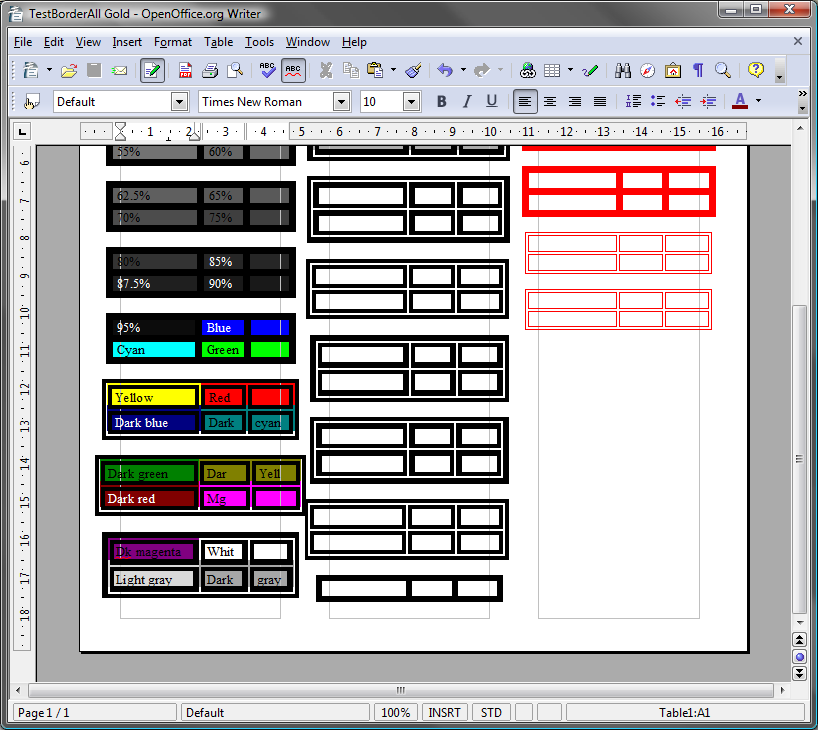

{} 

You can check the quality of Aspose.Words conversion and view the results online at this link:

<https://products.aspose.app/words/conversion>

{} 

## **About OpenDocument**

The [OpenDocument format (ODF)](http://en.wikipedia.org/wiki/OpenDocument) is a free and open file format for electronic office documents originally developed by Sun for the Open Office suite. [OpenDocument Text (ODT)](https://wiki.fileformat.com/word-processing/odt/) is the file format for word processing documents. OpenDocument is currently an OASIS and ISO standard.
## **ODT in Aspose.Words**
Aspose.Words supports loading OpenDocument 1.1 and 1.2 documents. Aspose.Words saves documents in the OpenDocument 1.1 format. You can also see the [detailed specification](/words/java/document-interoperability/) about what OpenDocument features are supported.

||
| :- |
|**Figure: A test ODT document generated by Aspose.Words and opened in OpenOffice Writer.**|

