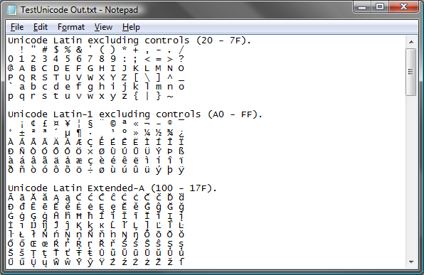

{} 

You can check the quality of Aspose.Words conversion and view the results online at this link:

<https://products.aspose.app/words/conversion>

{} 

## **TXT in Aspose.Words**

[TXT](https://docs.fileformat.com/word-processing/txt/), or plain text, is a file format used to transfer information with very little formatting. Where [RTF ](https://docs.fileformat.com/word-processing/rtf/)accommodates bold, underline and other styles, and [DOC](https://docs.fileformat.com/word-processing/doc/) and [DOCX](https://docs.fileformat.com/word-processing/docx/) allows very sophisticated formatting, TXT contains nothing but ASCII characters. It is considered a universal format because any text editor can open a TXT file.

It is easy to extract plain text from any document using Aspose.Words. You can either save into a plain text file or programmatically get the text of any document element.

The top picture below shows the original document in Microsoft Word. The bottom picture shows Notepad with a document converted from RTF to TXT using Aspose.Words.

||
| :- |
|**Figure: The original file**|

||
| :- |
|**Figure: Saved to TXT**|

