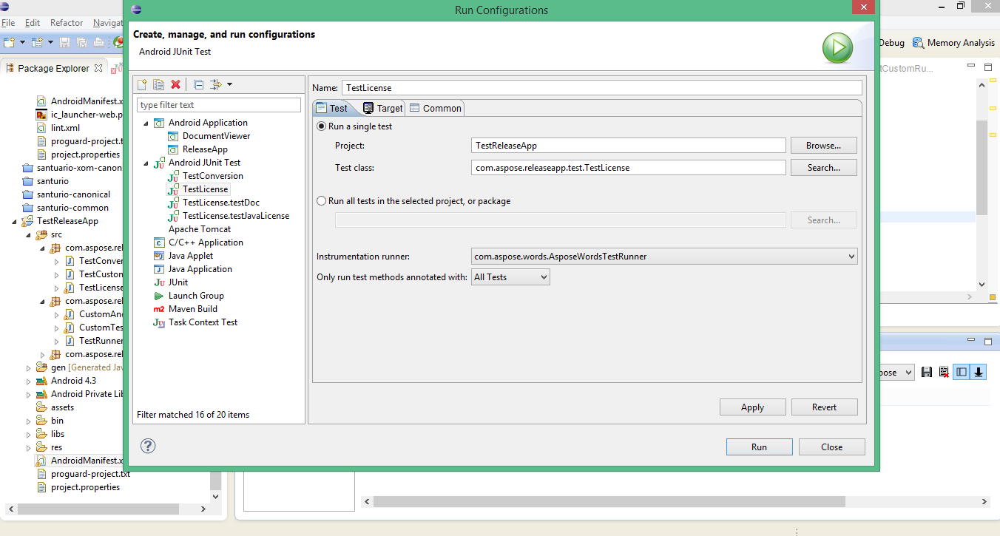
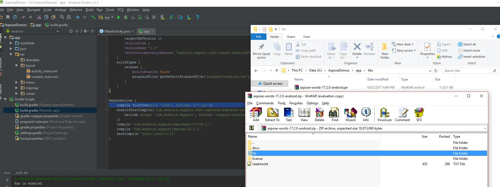
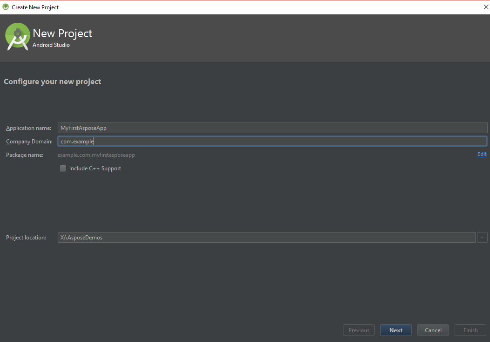
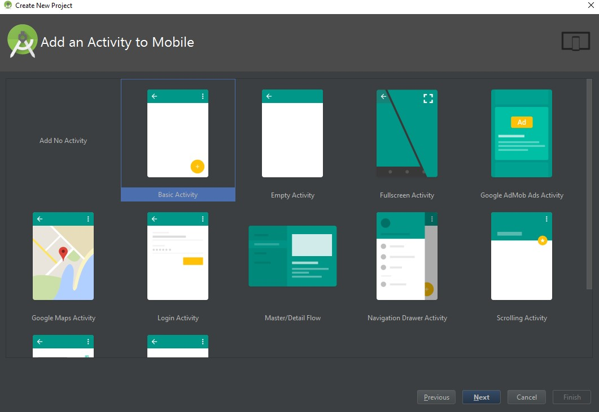
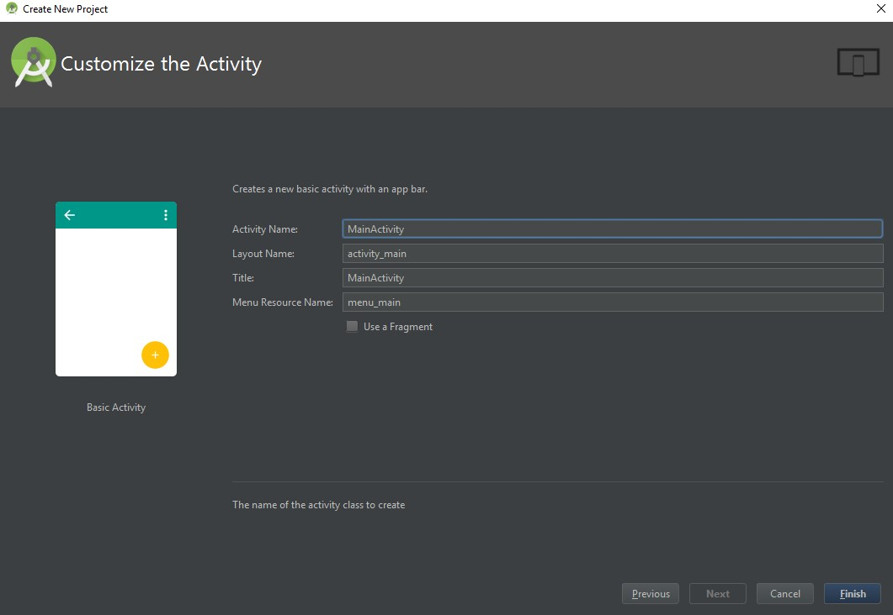
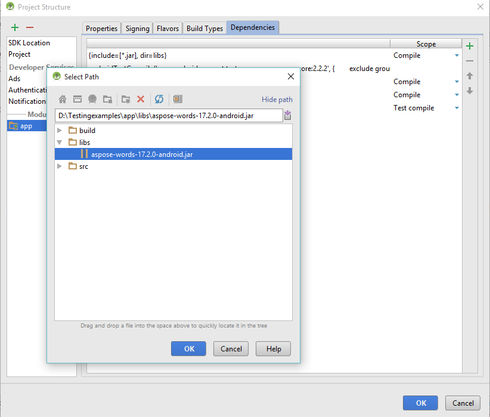
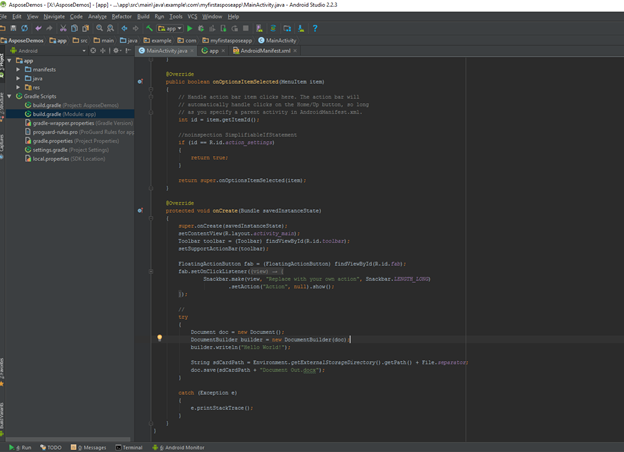

---
title: Install Aspose.Words for Android via Java – Aspose.Words for Java
articleTitle: Install Aspose.Words for Android via Java
linktitle: Install Aspose.Words for Android via Java
description: "Installing Aspose.Words for Android via Java."
type: docs
weight: 40
url: /java/install-aspose-words-for-android-via-java/
---

## Installation

Previously, Aspose.Words for Android via Java was distributed as a single ZIP file that contained the JAR file, demos, and documentation of Aspose.Words for Android via Java.

1. If you want to use any version before Aspose.Words for Android via Java 1.11, you just need to unzip any version of Aspose.Words.Android.zip into a directory of your choice.
1. Include the extracted Jar file in your application using the Build Path configuration for its application.

Versions 1.11 and 1.12 were manually divided into two parts: JAR and APK in order to limit the number of methods in the DEX file. In these versions, we provided our own APK loader to initiate the correct loading of the additional classes.dex file. Starting from version 17.2.0 we support the official workflow described [here](https://developer.android.com/studio/build/multidex.html).

### How to Use Aspose.Words for Android via Java from 1.11 Onward

Previously, a single JAR of Aspose.Words for Android via Java contained 47+ thousand methods which made older versions a little impractical to use in huge android applications. Now starting from this release, we have started to reduce the size of Aspose.Words for Android via Java library. Our major concern now is to reduce the number of methods without loss of functionality. We are constantly working on improving the quality and usability of Aspose.Words for Android via Java.

### Aspose.Words for Android via Java Library Divided into Two Parts

We had divided the library into following two archives:

- aspose-words-1.11-android-jdk15.jar: The first one includes public API and its auxiliary methods. Currently, it has 32395 methods.
- aspose-words-1.11-libs-android-jdk15.apk: The second one includes 3rd party jars, basic classes, and resources. Currently, it has 18296 methods.

### Using Aspose Words for Android via Java since 1.11

To include Aspose.Words for Android via Java into the project you can use any of the following methods:

- To place “aspose-words-1.11-android-jdk15.jar” in the folder “libs” of your project, and the archive “aspose-words-1.11-libs-android-jdk15.apk” into the folder “assets”. Indicate that you are going to use AsposeWordsApplication as the basic one.

**AndroidManifest.xml**


...
...
<application        
    android:allowBackup="true"
    android:icon="@drawable/ic_launcher"
    android:name="com.aspose.words.AsposeWordsApplication"
    android:label="@string/app_name"
    android:theme="@style/AppTheme" >
    <activity
...
...


To initiate a load of .apk file in the onCreate() method and if you do not want to use android:name=”com.aspose.words.AsposeWordsApplication” in AndroidManifest.xml

**Activity Java file**


@Override
protected void onCreate(Bundle savedInstanceState) 
{
    super.onCreate(savedInstanceState);

    // load AW manually
    AsposeWordsApplication awapp = new AsposeWordsApplication();
    
    // this context AW uses to find assets/ folder which contains the second part of the library.
    awapp.loadLibs(getApplicationContext()); 
    if (!checkIfAWSetUpCorrectly())
            throw new IllegalStateException();	
    ...
}
public static boolean checkIfAWSetUpCorrectly()
{
    try
    {
        Class.forName("com.aspose.words.Document");
        return true;
    }
    catch (ClassNotFoundException e)
    {
        e.printStackTrace();
        return false;
    }
}


### Using Aspose.Words for Android via Java in Android Test Applications

To use Aspose.Words for Android via Java in test projects, the same approach can be applied:

- Indicate AsposeWordsTestRunner in AndroidManifest.xml of the test project.

**AndroidManifest.xml**


...
...
<instrumentation
    android:name="com.aspose.words.AsposeWordsTestRunner"    
    android:targetPackage="com.aspose.releaseapp" />
...
...


In IDE it might be necessary to indicate AsposeWordsTestRunner in the configuration window as follows:

- Or to initiate the load of .apk using the getTargetContext() method.


@Override
public void onStart() {
    new AsposeWordsApplication().loadLibs(getTargetContext());
 // <-- Pass getTargetContext() because aspose-words-1.11-libs-android-jdk15.apk is in the main application's asset folder
    super.onStart();
}


## How to Use Aspose.Words for Android via Java from 17.2.0 Onward

1. Download the newest version of [Aspose.Words for Android via Java](https://repository.aspose.com/webapp/#/artifacts/browse/tree/General/repo/com/aspose/aspose-words/)
1. Copy aspose-words-18.3-android.via.java.jar into your project’s *libs/*folder

### Install Aspose.Words for Android via Java from Maven Repository

1. Add maven repository into your build.gradle 
1. Add 'Aspose.Words for Android via Java' JAR as a dependency


// 1. Add maven repository into your build.gradle 
repositories {
    mavenCentral()
    maven { url "https://repository.aspose.com/webapp/#/artifacts/browse/tree/General/repo/" }
}

// 2. Add 'Aspose.Words for Android via Java' JAR as a dependency
dependencies {
    ...
    ...
    compile (group: 'com.aspose', name: 'aspose-words', version: '20.2', classifier: 'android.via.java')
}


## Your First Application Using Aspose.Words for Android via Java

This article gives you an idea of getting started with Aspose.Words for Android via Java. It will demonstrate how to set up a new Android project from scratch, add a reference to the Aspose.Words JAR and create a new document which is saved to disk in DOCX format. This example uses [Android Studio](https://developer.android.com/studio/index.html) for development and the application is run on the Android Emulator. To get started with Aspose.Words for Android via Java, please follow this step-by-step tutorial to create an app which uses Aspose.Words for Android via Java:

1. Download and the [Android Studio](https://developer.android.com/studio/index.html) and install it to any location.
1. Run the Android Studio.
1. Create a new Android Application Project. 
 
 
 
 
 
1. Copy aspose-words-17.5-android.via.java.jar into your project’s libs/folder 

1. Select Project Section (from the file menu and click on the Dependencies tab.
   1. Click on the "+" button, select the file dependency option.
   1. Select Aspose.Words library from libs folder and click on OK. 
   
1. Sync the project with Gradle files if needed 

1. In order to access the SDcard special permissions must be added. Click on the AndroidManifest.xml file and choose the XML view. Add the following line to the file <uses-permission android:name="android.permission.WRITE_EXTERNAL_STORAGE" />  

1. Navigate back to the code section of the app and add the following imports: 

import java.io.File;
import com.aspose.words.Document;
import com.aspose.words.DocumentBuilder;
import android.os.Environment; 
 
And then insert the following code in the body of the onCreate method to create a new document from scratch using Aspose.Words, 
insert some text and save it to the SDCard in DOCX format. 

try
{
   Document doc = new Document();
   DocumentBuilder builder = new DocumentBuilder(doc);
   builder.writeln("Hello World!");
   String sdCardPath = Environment.getExternalStorageDirectory().getPath() + File.separator;
   doc.save(sdCardPath + "Document Out.docx");
}
catch (Exception e)
{
   e.printStackTrace();
}
 
The full code should look like this: 

1. Now run the application again. This time the Aspose.Words code will run in the background and generate a document that is saved to the SDcard. 

1. To view the created document navigate to the Tools menu then choose Android and choose Android Device Monitor 
 

1. Use the default viewer to open the document. The output generated by the app with just a few lines of code looks like this: 

## Versioning

Since 2017 the versioning of Aspose.Words for Android via Java complies with Aspose.Words for Java. 

[aspose-words-20.2-android.via.java.jar](https://repository.aspose.com/webapp/#/artifacts/browse/tree/General/repo/com/aspose/aspose-words/20.2/aspose-words-20.2-android.via.java.jar)
