---
title: File Formats and Conversions
second_title: Aspose.Words for Java
articleTitle: File Formats and Conversions
linktitle: File Formats and Conversions
description: "Convert documents from any supported load to save format with just two lines of Java code. It provides high-quality conversions using Java."
type: docs
weight: 40
url: /java/file-formats-and-conversions/
aliases:
 - /java/high-quality-conversions/
 - /java/adobe-portable-document-format-pdf/
 - /java/digital-publishing-epub/
 - /java/html-xhtml-and-mhtml/
 - /java/microsoft-word-doc/
 - /java/opendocument-odt/
 - /java/plain-text-txt/
 - /java/rich-text-format-rtf/
 - /java/wordprocessingml-docx-and-xml/
 - /java/xml-paper-specification-xps/
---

{}

**Try online**

You can try the conversion functionality by using our [Free online converter](https://products.aspose.app/words/conversion) tool.

{}

The ability to quickly and reliably convert various document formats with a high degree of precision is Aspose.Words's flagship feature. This is often a good enough reason to choose Aspose.Words for Java.

With Aspose.Words you can convert documents from any supported load format to any supported save format using just two lines of code:

1. Load a document from a file or stream
2. Save it to any supported format

The following code example shows how to convert a document:



For more details on loading, converting, and saving documents, see the ["Loading, Saving and Converting"](/words/java/loading-saving-and-converting/) section.

## High Fidelity

One of the main goals of Aspose.Words is to provide high-fidelity conversion between document formats. We use the word “high-fidelity” to describe conversions where the output document retains all the content and formatting of the original.

Modern word processing document formats are complex and include hundreds of features. Sometimes, when a vendor claims that their solution supports a particular document format – it means only the basic features of the format are supported. For example, Microsoft Word documents have advanced features such as footnotes, text boxes, auto shapes, OLE objects, fields, and advanced formatting attributes. Many of these elements are often ignored in document processing libraries, but not in Aspose.Words.

### Greater Extent of Format Support

The indisputable advantage of Aspose.Words is the great extent of support for most of the well-known formats. It is hard or impossible to find the same level of support for many important features elsewhere.

When purchasing a solution supporting a particular format, find out about the level at which the features of this format are supported. To test, create a complex file and run it through the proposed solution. You will often find that many document elements and formatting will be lost. For example, for the DOC format, shapes, textboxes, fields, columns, OLE objects, revisions, right-to-left text usually suffer.

Aspose.Words Document Object Model (DOM) was designed with Microsoft Word document formats in mind. Therefore, our level of support for those formats, such as DOC, DOCX, RTF, or WordprocessingML, is unprecedented. Conversion in any direction between these formats is high-fidelity.

When running a complex document through Aspose.Words, enjoy the unmatched completeness of format implementation.

### Conversion Examples between Popular Formats

Below are examples of conversions between some popular formats. You can evaluate how accurately Aspose.Words copes with the task.

---

*DOC to RTF – high-fidelity conversion:*

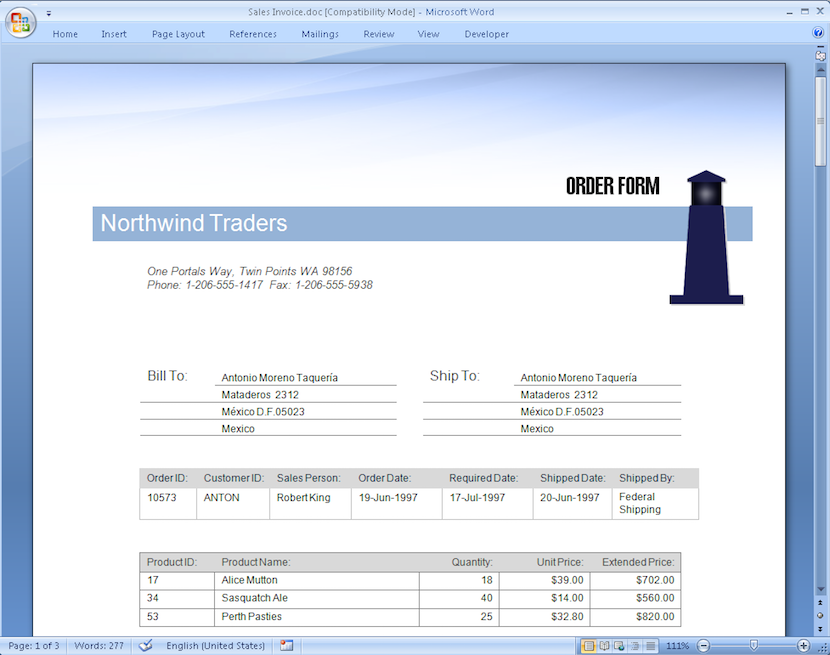 

---

*DOC to PDF – high-fidelity conversion:*

 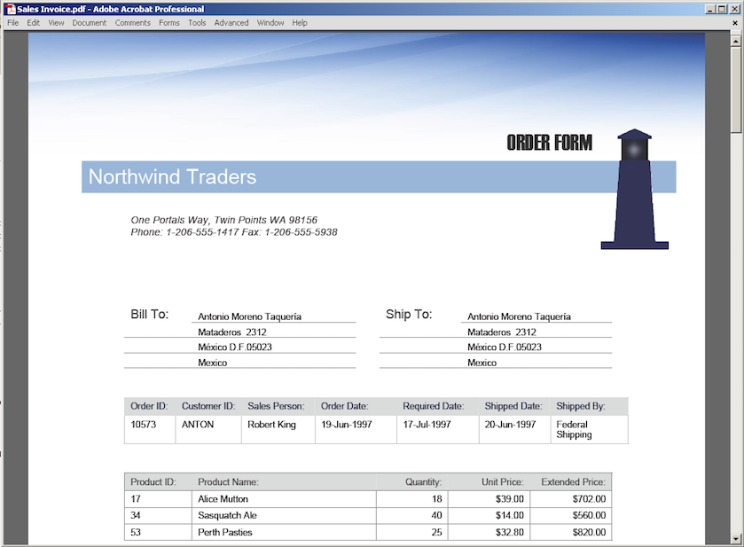

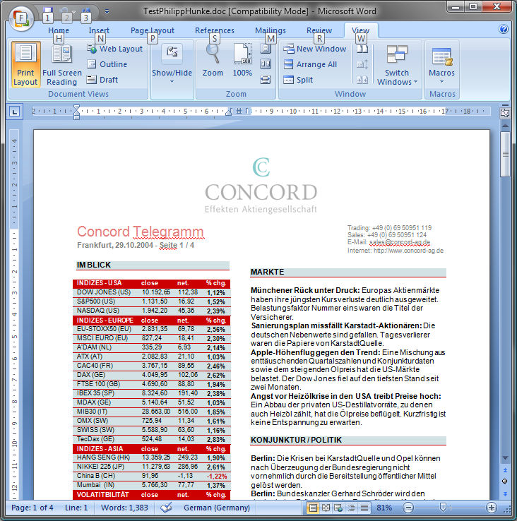 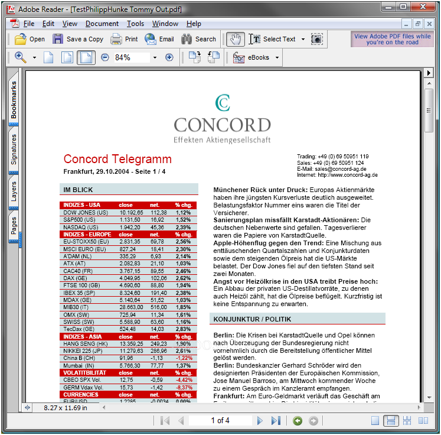

---

*DOC to ODT – high-fidelity conversion:*

 

---

*DOC to XPS – high-fidelity conversion:*

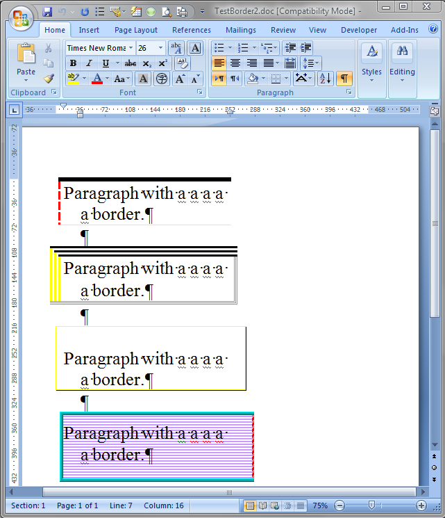 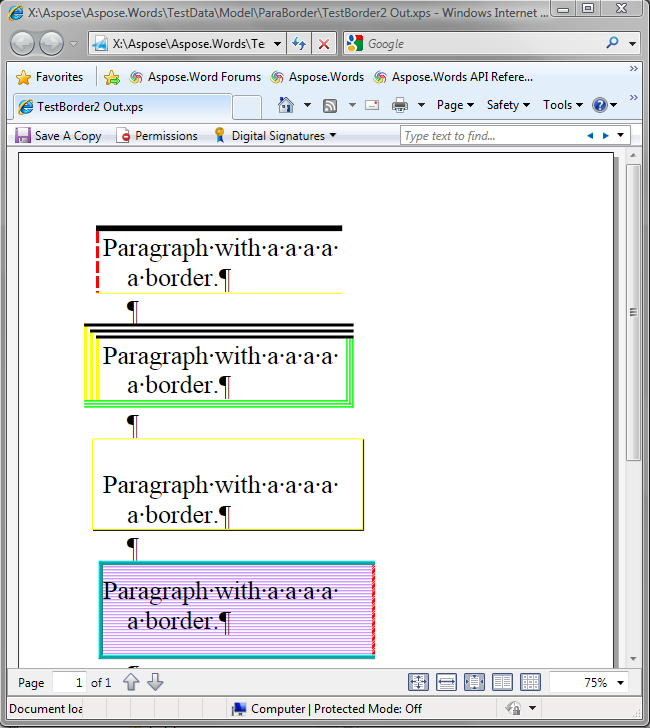

---

*DOC to JPEG – high-fidelity conversion:*

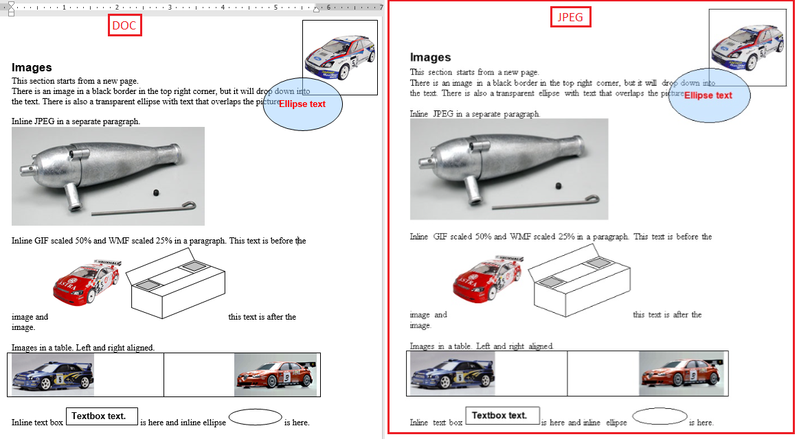

---

*RTF to TXT – high-fidelity conversion:*

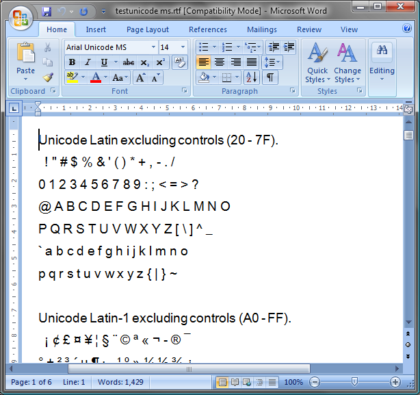 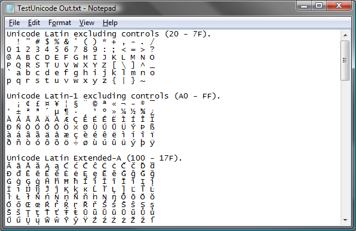

---

Although all of the converters in Aspose.Words are great, sometimes you will not be able to get the same appearence for documents in different formats.

{}

Note that in such situations, Aspose.Words has the conversion marked "high-fidelity" and the output document will be the same as after converting via Microsoft Word.

{}

For example, there is no simple one-to-one match between all the features of HTML and Microsoft Word documents. There are no headers/footers, sections, fields, and tabs in HTML. Conversely, not all CSS attributes and rules can be mapped to a Microsoft Word document.

Below is an example of conversions from DOC to HTML.

---

DOC to HTML – high-fidelity conversion:

 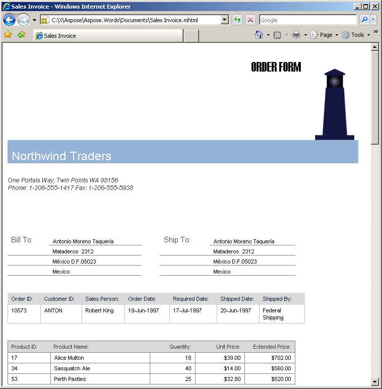

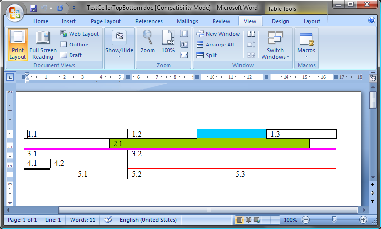 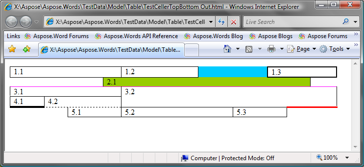

---

## High Scalability

Scalable server-side scenarios use Aspose.Words mainly because of its simple and clean design – Aspose.Words supports multithreading. [Document](https://apireference.aspose.com/words/java/com.aspose.words/Document) objects are independent of each other, and as long as only one thread can modify a document at a time (a typical requirement for any collection class), multiple threads can process any number of documents at the same time.

## High Performance

Aspose.Words demonstrates high performance when loading and saving documents. In testing, a DOC file over 5Mb in size was loaded in less than 1 second and then saved in less than 1 second on a P4 3GHz machine. Smaller files can be processed at thousands-per-minute speeds.

On several occasions, our customers have reported to us that they could not believe the speed of Aspose.Words. They stepped over the line of code that was loading a huge document into the debugger, and it was so instantaneous that they could not believe the file was loaded into the **Document** object.

The following code example shows how you can load and save such a large document if you want to:



