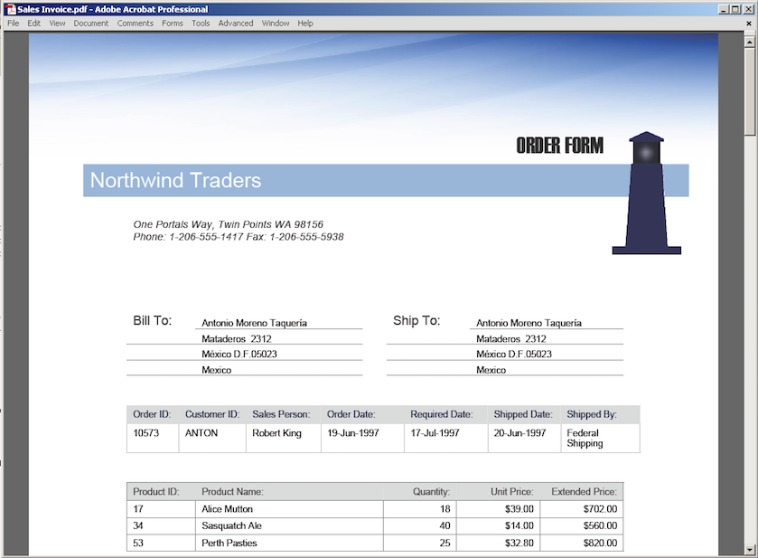
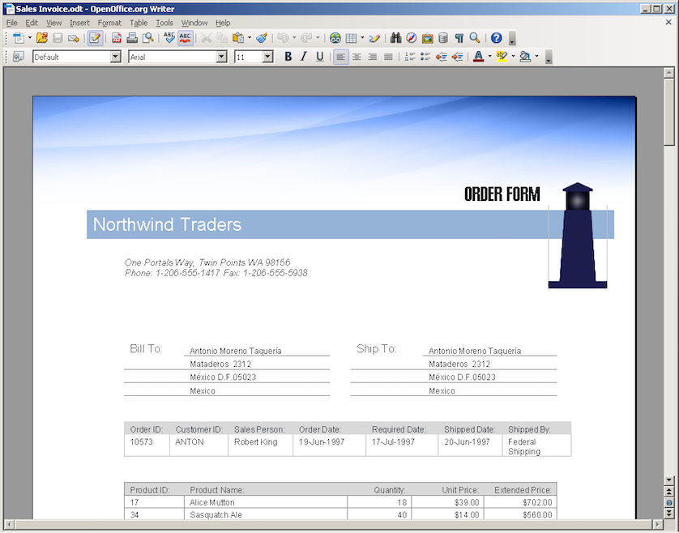
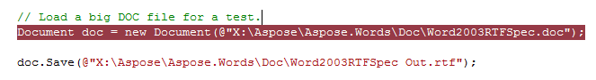

{} 

You can try this functionality with our [Free online converter](https://products.aspose.app/words/conversion).

{} 

The ability to quickly and reliably convert different document formats with a high degree of precision is often enough of a reason to choose Aspose.Words.

With Aspose.Words you can convert documents from any supported load format into any supported save format using just two lines of code:

Opens a document from a file and saves it to a different format

**Java**


Document doc = new Document(getMyDir() + "Document.doc");
doc.save(getMyDir() + "Document Out.html");


## Fidelity

One of the main goals of Aspose.Words is to provide high-fidelity conversion between document formats. We use the word “high-fidelity” to describe conversions where the output document retains all content and formatting of the original.

Modern word processing document formats are complex and include hundreds of features. Sometimes, when a vendor claims their solution supports a particular document format – it means only the basic features of the format are supported. For example, Microsoft Word documents have advanced features such as footnotes, text boxes, auto shapes, OLE objects, fields, and advanced formatting attributes. Many of these elements often will be ignored in document processing libraries, but not in Aspose.Words.

Aspose.Words’ document object model was designed with Microsoft Word document formats in mind. Therefore, our level of support for DOC, DOCX, RTF and WordprocessingML are unprecedented. Conversion in any direction between these formats is high-fidelity.

Although all of the converters in Aspose.Words are great, not all of them have the “high-fidelity” mark. For example, there is no easy one-to-one match between all features of HTML and Microsoft Word documents. There are no headers/footers, sections, fields and tabs in HTML. Conversely, not all CSS attributes and rules can be mapped to a Microsoft Word document.

Examples of Aspose.Words conversions.

|Description|Screenshot|
| :- | :- |
|**Original DOC file.**||
|**Aspose.Words converted DOC to RTF. High-fidelity conversion.**||
|**Aspose.Words converted DOC to PDF. High-fidelity conversion.**||
|**Aspose.Words converted DOC to ODT. High-fidelity conversion.**||
|**Aspose.Words converted DOC to HTML. Not “high-fidelity”, but still very good.**||

## Scalability

Server-side scalable scenarios are where Aspose.Words is used mainly because of its simple and clean design.

Aspose.Words supports multithreading. Document objects are independent of each other and as long as only one thread at a time is allowed to modify a document (a typical requirement for any collection class), multiple threads can be processed any number of documents at the same time.

## Speed

Aspose.Words demonstrates high productivity when loading and saving documents. In a test, a DOC file over 5Mb in size was loaded in less than 1 second and then saved in less than 1 second on a P4 3GHz machine. Smaller files can be processed at thousands-per-minute speeds.

On several occasions, our customers have reported to us that they could not believe the speed of Aspose.Words. They stepped over a line of code that loaded a huge document in a debugger and it was so instantaneous that they could not believe the file was loaded into the Document object.

**Stepping over a line of code where Aspose.Words loads a big file could be so quick that you might not believe the document was loaded completely.**

