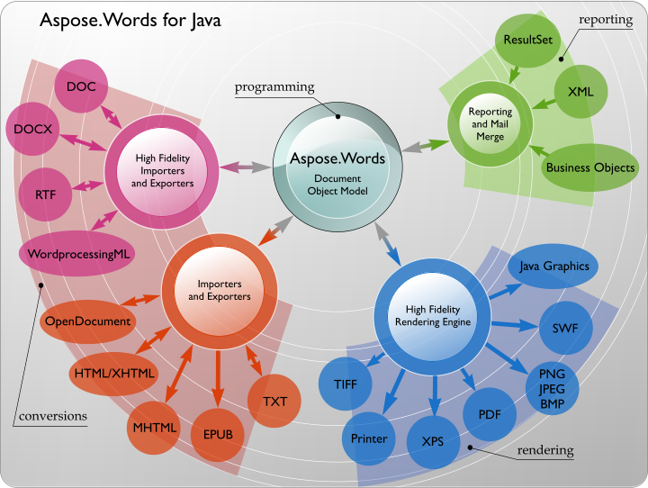

{} 

### **Welcome to Aspose.Words for Java!**

Aspose.Words for Java is a class library that enables your applications to perform a great range of document processing tasks. Aspose.Words supports DOC, DOCX, RTF, HTML, OpenDocument, PDF, XPS, EPUB and other formats. With Aspose.Words you can generate, modify, convert, render and print documents without using Microsoft Word®.

Using Aspose.Words for Java in your project gives you the following benefits:

- Rich feature set.
- No Microsoft Word automation.
- Platform independence.
- Performance and scalability.
- Minimal learning curve.

{} 

### **Product Description**

#### **Rich Set of Features**

Aspose.Words for Java features can be divided into four main areas:

- **Conversions**. High quality conversions to and from DOC, OOXML, RTF, WordprocessingML, HTML, MHTML, TXT and OpenDocument formats.
- **Document Object Model**. Programmatic access through a rich API to all document elements and formatting allows to create, modify, extract, copy, split, join, and replace document content.
- **Rendering**. Convert whole documents or pages to PDF or XPS for server-side document generation. Also convert document pages to TIFF, PNG or BMP images, print or render pages to Java Graphics. All with high fidelity - exactly like Microsoft Word® would have done it.
- **Reporting**. Generate documents or reports from scratch or by filling templates with data from data sources or business objects.

**Aspose.Words for Java's main feature areas and how they relate to each other.** 

#### **No Microsoft Word Automation**

Aspose.Words does not require Microsoft Office to be installed on the machine in order to work. All Aspose components are totally independent and are not affiliated with, nor authorized, sponsored, or otherwise approved by Microsoft Corporation. In short, Aspose.Words is a better alternative to automation in terms of security, stability, scalability/speed, price and features.

#### **Platform Independence**

Aspose.Words for .NET and Aspose.Words for Java are “twin brothers” products and together cover most of the popular development environments and deployment platforms.

Both Aspose.Words for .NET and Aspose.Words for Java run on Windows, Linux, and Mac OS operating systems.

You can use Aspose.Words for .NET to build any type of a 32-bit or 64-bit .NET application including ASP.NET, WCF, WinForms etc. It is possible to use Aspose.Words for .NET via COM Interop from ASP, Perl, PHP, and Python. You can also use Aspose.Words for .NET to build applications with Mono.

Aspose.Words for Java is available for Java 1.6, 1.7 and 1.8 and will run in any place where Java is installed. It is possible to use Aspose.Words for Java from Perl, PHP, and Python.

#### **Performance and Scalability**

Aspose.Words is designed to perform great both on a server or client. Aspose.Words is a single JAR archive that can be deployed with any Java application by simply copying it. You do not have to worry about any other services or modules.

You can literally generate thousands of documents in minutes with Aspose.Words and that involves opening a document, modifying content, and formatting or populating it with data and saving it. Even most of the complex documents are opened and saved on a P4 2.4Ghz 1Gb RAM machine in fractions of a second.

Aspose.Words is multithread safe as long as only one thread works on a document at a time. It is a typical scenario to have one thread working on one document. Different threads can safely work on different documents at the same time.

Sometimes Aspose.Words for Java will throw OutOfMemoryError on Java. This is because the default Java heap space might not be enough for high memory spikes when processing some documents. In this case, the easy way to fix the issue is to increase the heap space for the JVM.

#### **Minimal Learning Curve**

Although there are over 150 public classes and enumerations in Aspose.Words, the learning curve is minimal because the Aspose.Words API has been carefully designed with the following goals in mind:

- Borrow best practices from other well-known APIs such as Microsoft Word Automation.
- Borrow best practices from the industry accepted Java design guidelines.
- Provide a balance of easy usage vs detailed document element manipulation.

Developers, who used Microsoft Word Automation in their projects before, will find names and behavior of many classes, methods, and properties familiar. [Document](https://apireference.aspose.com/words/java/com.aspose.words/Document), [Paragraph](https://apireference.aspose.com/words/java/com.aspose.words/Paragraph), [Bookmark](https://apireference.aspose.com/words/java/com.aspose.words/Bookmark), Range, Section.PageSetup and [Paragraph.ParagraphFormat](https://apireference.aspose.com/words/java/com.aspose.words/ParagraphFormat) are some of the Aspose.Words classes.

At the same time, Aspose.Words is quite different from the Microsoft Word Object Model in that it represents the document as a tree of objects more like an XML DOM tree. If you worked with any XML DOM library you will find it is easy to understand and work with Aspose.Words.

### **Technical Support**

Aspose provides unlimited free technical support for all its products. The support is available to all users, including evaluation. If you need help with Aspose.Words, consider the following:

- The main avenue for support is the [Aspose.Forums](https://forum.aspose.com/) . Post your question in the [Aspose.Words Forum](https://forum.aspose.com/c/words) and it will be answered within a few hours. The questions are answered directly by the Aspose.Words development team.
- Please note, Aspose does not provide technical support over the phone. Phone support is only available for sales and purchase questions.
- When expecting a reply in the forums, please allow for time zone differences.

If you have an issue with Aspose.Words, follow these simple steps to make sure it is resolved in the most efficient way:

- Make sure you use the latest Aspose.Words version before reporting the issue, see [Aspose.Words for Java Downloads](http://maven.aspose.com/repository/simple/ext-release-local/com/aspose/aspose-words/) to find out about the latest version.
- Have a look through the forums, this documentation and API Reference before reporting the issue; maybe your question was already answered.
- When reporting an issue, please include the original document and possibly a fragment of your code that causes the problem. If you need to attach multiple files, zip them into one. It is safe to attach your documents in Aspose.Forums since only you and Aspose developers will have access to the attached files.
- Please try to report one issue per thread. If you have another issue, report it in a separate thread.

### **Installing Aspose.Words for Java**

Please refer to the following article:

[Installing Aspose.Words for Java from Maven Repository](/words/java/installation/)

### **Evaluate Aspose.Words**

You can easily download Aspose.Words for evaluation. The evaluation download is the same as the purchased download. The evaluation version simply becomes licensed when you add a few lines of code to [apply the license](https://docs.aspose.com/words/java/license-aspose-words/#applying-a-license). The evaluation version of Aspose.Words provides full product functionality, but inserts an evaluation watermark at the top of the document on open and save, and limits the maximum document size to several hundred paragraphs.

#### **Evaluation License**

If you want to test Aspose.Words without the evaluation version limitations, [request a 30-day temporary license](http://www.aspose.com/corporate/purchase/faqs/temporary-license.aspx).
