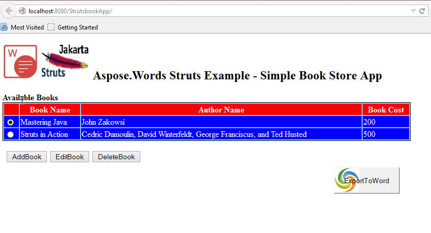
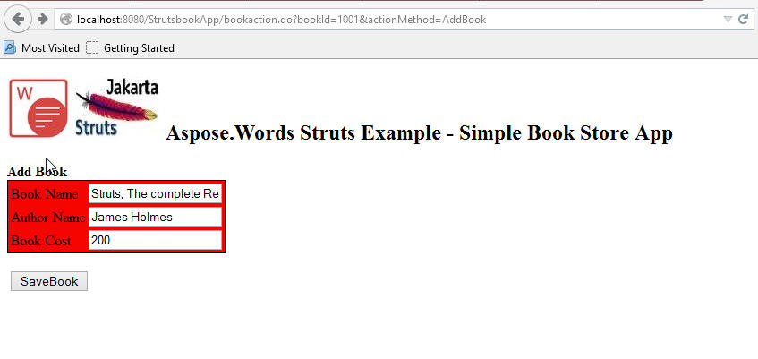
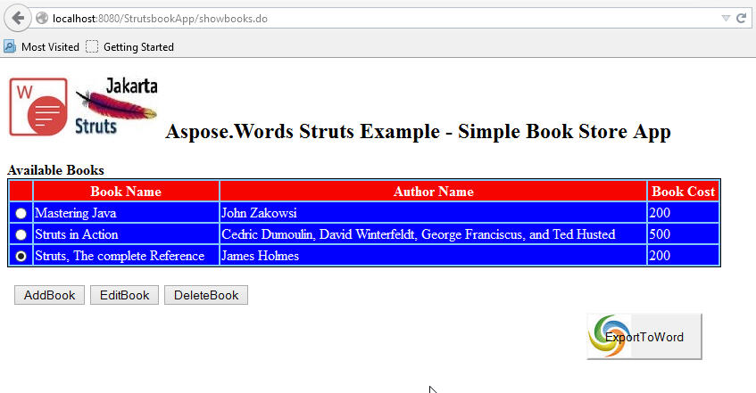
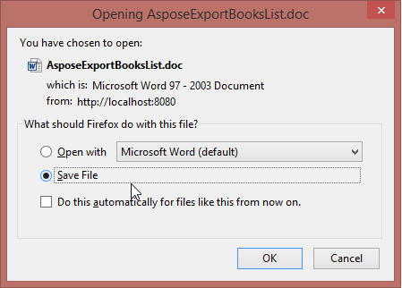
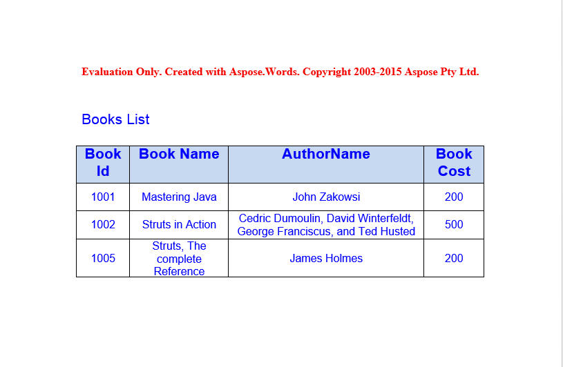

## Downloading Aspose.Words Java for Struts 1.3

You can download the pre-built (binary) .war file from the latest releases hosted on [codeplex](http://aspose-wordsforstruts.codeplex.com/releases/view/615997).

-OR-

You can download/check out the project source codes from the following locations:

- [Github](https://github.com/aspose-words/Aspose.Words-for-Java/tree/master/Plugins/Aspose_Words_for_Struts)

## Building Aspose.Words Java for Struts 1.3 from Source Codes

After checking out source codes from any of the above repositories, apply the following mvn commands:


$ mvn -U clean package 


This will build "Strutsbookapp.war" in the target folder.

To deploy the .war file just copy it to the running Apache tomcat server web app directory.

After [deploying the web application](/words/java/installation/).

1. Navigate to: `localhost:8080/StrutsbookApp/` 
   You will come up with the following web page: 

1. You can add/edit or delete books from here by selecting from book's list. 
   Click on "AddBook" button, which will show you the below web page: 

1. Add a new book name and Click "SaveBook", you will be navigated to the main book's list page as below: 

1. Click on "ExportToWord" button on the right bottom to export / save the Book's list to MS-Word document file: 

1. Below screen shows the saved /exported MS-Word document: 

