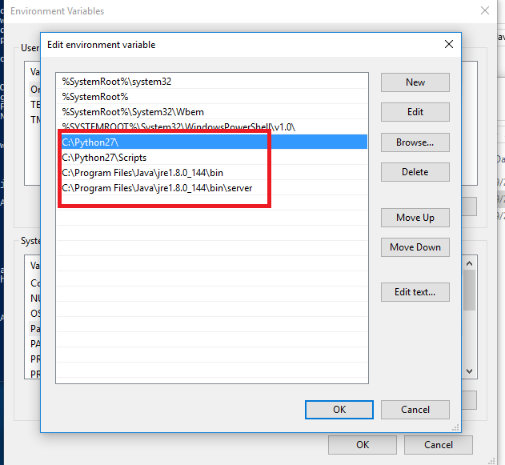
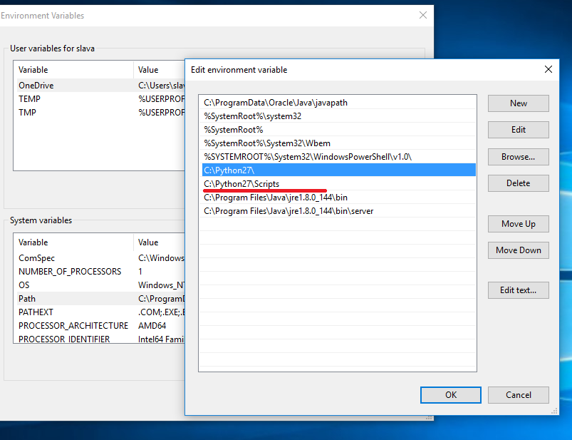

To create "Aspose Words for Python via Java" package we use [JCC](http://lucene.apache.org/pylucene/jcc/index.html)

## How to build JCC on Windows

Download and install [JRE](http://www.oracle.com/technetwork/java/javase/downloads/jre8-downloads-2133155.html) (it is not necessary because you can use %JDK_HOME%\jre)

JCC requires [JDK](http://www.oracle.com/technetwork/java/javase/downloads/jdk8-downloads-2133151.html) so download and install it.

Download and install [Python](https://www.python.org/ftp/python/2.7.14/python-2.7.14.amd64.msi)

Make sure Java's and Python's paths are on the environment variables list

Install wheel


>  pip install wheel


Download and install [Microsoft Visual C++ Compiler for Python 2.7](https://www.microsoft.com/en-us/download/details.aspx?id=44266)

Download and unzip [JCC](https://pypi.python.org/pypi/JCC/)

Run following command in JCC directory


JCC-3.0> python .\setup.py build


Then run install command


JCC-3.0> python .\setup.py install


Check JCC egg has been installed


    > ls C:\Python27\Lib\site-packages\JCC-3.0-py2.7-win-amd64.egg


## How to build JCC on Ubuntu

Check if python is installed


> python
Python 2.7.13 (default, Jan 19 2017, 14:48:08)
[GCC 6.3.0 20170118] on linux2
Type "help", "copyright", "credits" or "license" for more information.


In order to get things working make sure Java is installed, if it isn't then do following:


> sudo add-apt-repository ppa:webupd8team/java
\> sudo apt-get update
\> sudo apt-get install oracle-java8-installer


Install svn


> sudo apt install subversion


Check out JCC's sources


> svn co http://svn.apache.org/repos/asf/lucene/pylucene/trunk/jcc jcc


Make sure that [setuptools](https://pypi.python.org/pypi/setuptools) is installed


> pip install setuptools


Run following commands


> jcc/$ python setup.py build
\> jcc/$ python setup.py install --prefix=~/.local


Make sure JCC has been installed


> ls /home/_username_/.local/lib/python2.7/site-packages


## How to create "Aspose Words for Python via Java" python package

Make sure Java, JCC and wheel are installed.

Then run [create_aspose_words.py](create_aspose_words.py) with appropriate arguments


> python .\create_aspose_words.py .\Aspose.Words.jdk16.jar 17.8 aspose_words


The first argument is the path to the Aspose.Words jar;

The second is the version;

The third is the python module name.

Result *.whl* file will be saved in *.\dist* directory

## How to install "Aspose Words for Python via Java" on Windows

1. Download and install [JRE](http://www.oracle.com/technetwork/java/javase/downloads/jre8-downloads-2133155.html). We use JRE x64 version because our .whl was built for Windows x64;
1. Download and install [Python](https://www.python.org/ftp/python/2.7.14/python-2.7.14.amd64.msi). At the moment 2.7 version is used;
1. Add following path variables to the environment variables list: 

1. Then install the .whl package [create_aspose_words.py](create_aspose_words.py) 

> pip install .\aspose_words-17.8-cp27-none-win_amd64.whl


## How to install "Aspose Words for Python via Java" on Ubuntu

Check if python is installed


> python
Python 2.7.13 (default, Jan 19 2017, 14:48:08)
[GCC 6.3.0 20170118] on linux2
Type "help", "copyright", "credits" or "license" for more information.


In order to get things working make sure Java is installed, if it isn't then do following:


> sudo add-apt-repository ppa:webupd8team/java
\> sudo apt-get update
\> sudo apt-get install oracle-java8-installer


Make sure pip is installed if it isn't then


> sudo apt install python-pip


Run terminal and use following command:


> pip install --prefix=~/.local aspose_words-17.8-cp27-none-linux_x86_64.whl


## How to use "Aspose Words for Python via Java"


> python
import aspose_words
aspose_words.initVM(aspose_words.CLASSPATH)
d = aspose_words.Document()
db = aspose_words.DocumentBuilder(d)
db.writeln('Hello world!')
d.save('/home/slava/test.docx')

