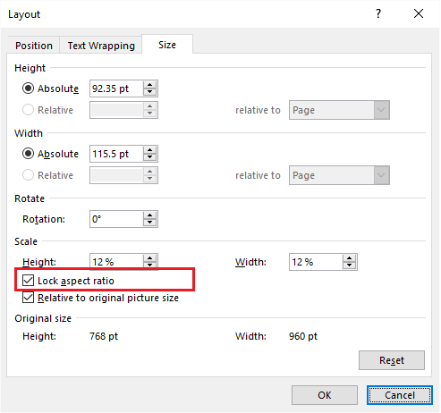

---
title: Aspose.Words for Java 16.3.0 Release Notes
articleTitle: Aspose.Words for Java 16.3.0 Release Notes
linktitle: Aspose.Words for Java 16.3.0 Release Notes
description: "Aspose.Words for Java 16.3.0 Release Notes – learn about the latest updates and fixes."
type: docs
weight: 90
url: /java/aspose-words-for-java-16-3-0-release-notes/
---

{}

This page contains release notes for [Aspose.Words for Java 16.3.0](https://repository.aspose.com/webapp/#/artifacts/browse/tree/General/repo/com/aspose/aspose-words/16.3.0/)

{}

## Major Features

There are 94 improvements and fixes in this regular monthly release. The most notable are:

- Further improvements to the speed and public API for plain text extraction.
- Render OfficeMath formulas to images separately from the document.
- Shape and OfficeMath can now be saved to SVG.
- Support for RC4 encryption.

## Full List of Issues Covering all Changes in this Release

|Key|Summary|Category|
| :- | :- | :- |
|WORDSJAVA-1241|ImageData.ImageType returns incorrect image type|Bug|
|WORDSJAVA-1313|Text with font "Arial Narrow" become thick in output Png|Bug|
|WORDSJAVA-1315|Transparent Emf contains black regions in output Pdf|Bug|
|WORDSJAVA-1334|Watermark (shape) does not render correctly in output Pdf.|Bug|
|WORDSJAVA-1342|GroupShape is rendered as black in output Pdf|Bug|
|WORDSJAVA-1318|Document.save throws java.lang.OutOfMemoryError while saving Docx to Html|Exception|
|WORDSJAVA-1305|Transparent background became black|Regression|
|WORDSNET-10709|/asian typography detection/ Chinese wraps to the next line when English and Chinese characters combined in one paragraph|Bug|
|WORDSNET-10710|/asian typography detection/ A line starts with a punctuation mark in PDF|Bug|
|WORDSNET-12471|Shape.TextBox doesn't keep its internal margins on save|Bug|
|WORDSNET-12475|Alternate row background color (shading) is not correct in PDF|Bug|
|WORDSNET-12775|Incorrect shadings applied in rendered PDF|Bug|
|WORDSNET-12794|Table moves to left in generated PDF|Bug|
|WORDSNET-12807|Large comment text truncated. SaveAs PDF with MS Word shows more data|Bug|
|WORDSNET-12917|Removing content from Cell changes Font|Bug|
|WORDSNET-12962|/strike through shape anchor/ MS Word to PDF: Extra line is added to the bottom of the image|Bug|
|WORDSNET-12986|Docx to Pdf conversion issue with Shape rendering|Bug|
|WORDSNET-12998|Document.UpdateFields does not update Section field|Bug|
|WORDSNET-13004|Docx to Pdf Conversion modifies Hyperlinks with the Local Path of Docx|Bug|
|WORDSNET-13006|/tab stops/ Text alignment is lost after DOCM to PDF|Bug|
|WORDSNET-13013|/asian typography detection/ Docx to Pdf conversion issue with Chinese text rendering|Bug|
|WORDSNET-13055|Text shape is transformed to text box or frame|Bug|
|WORDSNET-13091|Text boxes positions are changed after re-saving Docx|Bug|
|WORDSNET-13092|Image in content control is not rendered in output Doc/Pdf|Bug|
|WORDSNET-13118|Repeating section content control displays wrong data in PDF|Bug|
|WORDSNET-13141|Document.UpdateFields does not update REF field.|Bug|
|WORDSNET-13146|RTF to Pdf conversion issue with PdfImageCompression.Jpeg|Bug|
|WORDSNET-13158|Rotated text box (inside GroupShape) are not rotated when saved to PDF|Bug|
|WORDSNET-13180|One Row Tables within a SDT are ignored|Bug|
|WORDSNET-13191|Aspose.Words reads MHTML as a text file|Bug|
|WORDSNET-13200|Document.UpdateFields lose the bold formatting of Ref fields|Bug|
|WORDSNET-13209|Shape's text color is changed from white to black in output Pdf|Bug|
|WORDSNET-13210|Unexpected page breaks appear in output Pdf|Bug|
|WORDSNET-13223|Aspose Words Document save to PDF distorts inserted Shape|Bug|
|WORDSNET-13238|Mergefield TableStart inside an IF field are processed although the IF condition is false|Bug|
|WORDSNET-13241|Contents are lost after saving Rtf to Docx|Bug|
|WORDSNET-13242|Aspose.Words.Document hangs while loading Odt|Bug|
|WORDSNET-13246|Replacement of URL (UNC) is losing \ and breaking links (FieldHyperlink.Address)|Bug|
|WORDSNET-13247|FieldHyperlink.Address ignores slashes ("\") while replacing hyperlinks|Bug|
|WORDSNET-13248|The space between the bullet and starting text is not uniform|Bug|
|WORDSNET-13257|Rtf to Docx conversion issue with table's border|Bug|
|WORDSNET-13259|Chinese text is wrapped incorrectly|Bug|
|WORDSNET-13263|Quote fields in the header of Pdf are rendered incorrectly|Bug|
|WORDSNET-13266|Some Paragraphs have more left indentation during importing MHT|Bug|
|WORDSNET-13268|Creating TOC for text with non-BodyText OutlineLevel works unexpected|Bug|
|WORDSNET-13276|SVG image is rendered as a blank picture while importing HTML document|Bug|
|WORDSNET-13285|X-Axis labels are wrapped up into 2 lines in output Doc/Pdf|Bug|
|WORDSNET-2159|“NullReferenceException” occurs when move to Header/Footer after linking header to previous.|Bug|
|WORDSNET-6882|Investigate Run properties|Bug|
|WORDSNET-10722|The document is encrypted using the RC4 CryptoAPI Encryption and this not currently supported.|Enhancement|
|WORDSNET-11086|DOCX to HTML margin issue with paragraphs that have hanging indent|Enhancement|
|WORDSNET-11608|Implement rendering Dml shadow effect for semi transparent and transparent areas.|Enhancement|
|WORDSNET-12105|Take 'display' style into account when importing HTML elements|Enhancement|
|WORDSNET-12219|Counter-increment is not producing the expected output|Enhancement|
|WORDSNET-12221|InsertOleObject does not insert default icon and name for html file|Enhancement|
|WORDSNET-12269|Render square shapes with texture as images to preserve the texture source format. // Losing signature quality when converting word to tiff|Enhancement|
|WORDSNET-12449|Document.Save removes target="_blank" when saved to HtmlFixed|Enhancement|
|WORDSNET-12511|Author property returns incorrect text|Enhancement|
|WORDSNET-12627|Incorrect border of a horizontally merged cell|Enhancement|
|WORDSNET-12824|Shape.TextBox report incorrect margin for a DML shape|Enhancement|
|WORDSNET-13102|Shapes become invisible after saving Rtf to Doc/Docx/Pdf|Enhancement|
|WORDSNET-13227|Implement rendering Dml inner shadow effect for semi transparent and transparent areas.|Enhancement|
|WORDSNET-13312|REF fields are still being looked up from our IMailMergeDataSource|Enhancement|
|WORDSNET-4107|WMF images are displayed incorrectly after converting to DOC/DOCX|Enhancement|
|WORDSNET-10711|Aspose.Words.UnsupportedFileFormatException is thrown while loading document|Exception|
|WORDSNET-12801|Aspose.Words.UnsupportedFileFormatException is thrown while loading Doc|Exception|
|WORDSNET-12951|Aspose.Words.FileCorruptedException is thrown while loading Dot|Exception|
|WORDSNET-13036|System.Security.Cryptography.CryptographicException occurs when trying to sign document with pfx certificate|Exception|
|WORDSNET-13107|Aspose.Words.FileCorruptedException is thrown while loading Docx|Exception|
|WORDSNET-13114|Nested IF statements cause error when merge field contains trailing backslash|Exception|
|WORDSNET-13183|System.ArgumentOutOfRangeException occurs during rendering to PDF|Exception|
|WORDSNET-13186|IllegalStateException: This operation requires the node to be inside the main document|Exception|
|WORDSNET-13214|Aspose.Words.FileCorruptedException is thrown while loading html|Exception|
|WORDSNET-13231|Document.Save throws System.IndexOutOfRangeException|Exception|
|WORDSNET-13237|System.InvalidOperationException is thrown while saving Docx to Pdf.|Exception|
|WORDSNET-13244|MailMerge.GetRegionsHierarchy throws System.InvalidCastException|Exception|
|WORDSNET-13253|Aspose.Words.FileCorruptedException is thrown while loading Docx.|Exception|
|WORDSNET-13274|System.InvalidOperationException occurs when saving DOCX to PDF|Exception|
|WORDSNET-13283|Aspose.Words throws exception when updating fields|Exception|
|WORDSNET-13287|Aspose.Words.FileCorruptedException is thrown while loading Doc|Exception|
|WORDSNET-13288|Aspose.Words.FileCorruptedException is thrown while loading Doc|Exception|
|WORDSNET-11774|Provide API to convert OfficeMath node to pictures (SVG, Raster images)|Feature|
|WORDSNET-11865|Support Shape.Title property|Feature|
|WORDSNET-12330|Provide API to convert Shape and OfficeMath nodes SVG|Feature|
|WORDSNET-12857|Provide way to get FolderPath for SystemFontSource|Feature|
|WORDSNET-12866|Provide API to set the Aspect Ratio to Scale|Feature|
|WORDSNET-12942|Support RC4 CryptoAPI encryption|Feature|
|WORDSNET-12965|Support of RC4 encrypted documents created by MS Word 2007/2010/2013|Feature|
|WORDSNET-13228|Implement rendering Dml glow effect for semi transparent and transparent areas.|Feature|
|WORDSNET-13229|Implement rendering Dml soft edge effect for semi transparent and transparent areas.|Feature|
|WORDSNET-5482|Support RC4 CryptoAPI encryption algorithm.|Feature|
|WORDSNET-13178|Aspose.Words.Document constructor is very slow on the first call|Performance|
|WORDSNET-13255|Infinite Loop when loading HTML with a specific SVG into Aspose.Words|Performance|
|WORDSNET-12611|Cells width are not correct in output Docx/Pdf|Regression|

## Public API and Backward Incompatible Changes

This page lists public API changes that were introduced in Aspose.Words 16.3.0. It includes not only new and obsoleted public methods, but also a description of any changes in the behavior behind the scenes in Aspose.Words which may affect existing code. Any behavior introduced that could be seen as a regression and modifies existing behavior is especially important and is documented here.

### Renamed GetOpaqueRectangleInPixels to GetOpaqueBoundsInPixels in NodeRendererBase

WORDSNET-13230 (Tidy up NodeRendererBase class) has been resolved. We renamed GetOpaqueRectangleInPixels to GetOpaqueBoundsInPixels for names consistency and introduced GetBoundsInPixels method for consistency with other properties.

### Reworked public API for PlainTextDocument creation (WORDSNET-13321)

Breaking API changes:

- All public overloads of static Document.ExtractText methods removed
- PlaintextDocument class renamed to PlainTextDocument
- Added 4 public constructors to the PlainTextDocument class with signatures corresponding to the removed static Document.ExtractText methods

### Shape and OfficeMath nodes can be saved as SVG

WORDSNET-12330 - (Provide API to convert Shape and OfficeMath nodes SVG) has been resolved.

Starting from 16.3.0 version it is possible to render OfficeMath formulas to image separately from whole document:


Document doc = new Document("C:/Temp/in.docx");
OfficeMath math = (OfficeMath)doc.getChild(NodeType.OFFICE_MATH, 0, true);
math.getMathRenderer().save("C:/Temp/formula.png", new ImageSaveOptions(SaveFormat.PNG));


Also, now it is possible to pass SaveFormat.Svg into ImageSaveOptions, so OfficeMath and Shape nodes now can be save to SVG.

### WORDSNET-12866 - Added feature to get-set AspectRatioLocked property of Shape.

Starting from 16.3.0 Version, Aspose.Words supports AspectRatioLocked property of Shape. 


Shape shape = (Shape)doc.GetChild(NodeType.SHAPE, 0, true);

// Get/set AspectRatioLocked.
shape.setAspectRatioLocked(true);


Plase none:  it is possible to get/set AspectRatioLocked for child shapes (mimic MS Word behavior), but AspectRatioLocked has effect only for top level shapes!

### WORDSNET-13146 - Improvement of transparent image rendering to PDFA-1

PDF/A-1 specification prohibits transparency. In order to provide better output AW blends transparent images with white background. Previously images were blended only with PdfImageCompression.Auto. With PdfImageCompression.Jpeg transparent images were rendered by simply stripping alpha channel. Now images are blended for both PdfImageCompression.Auto and PdfImageCompression.Jpeg.
