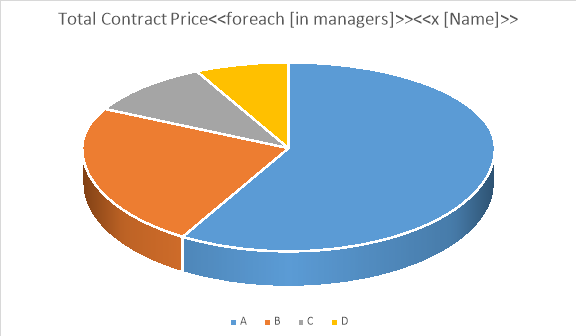
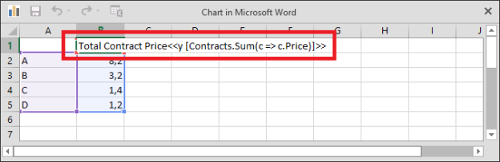
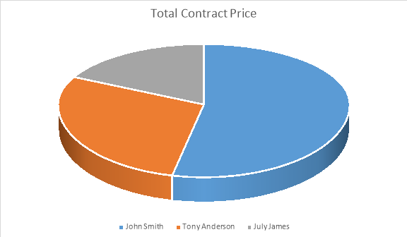
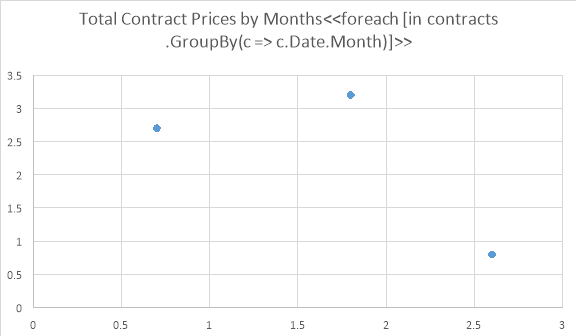
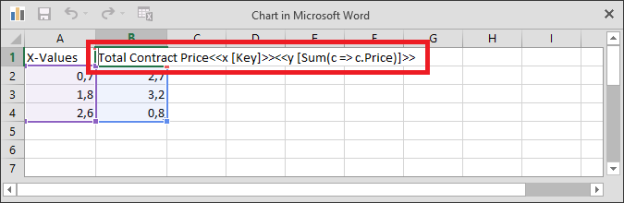
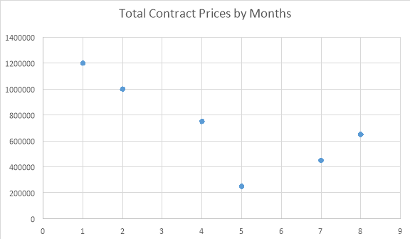
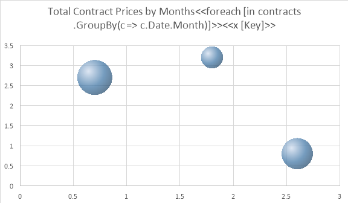
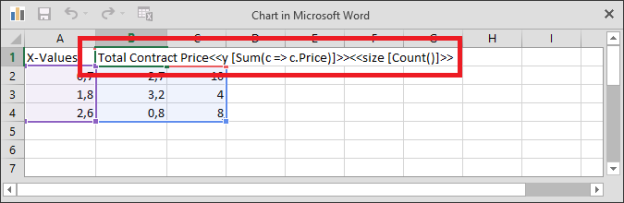
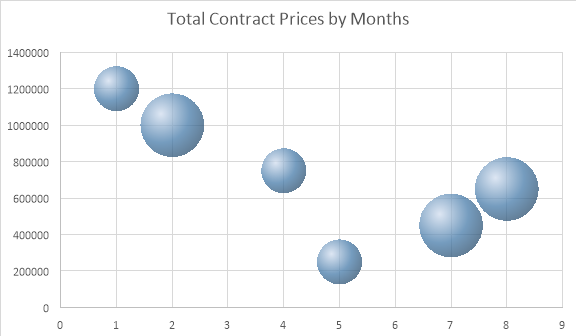
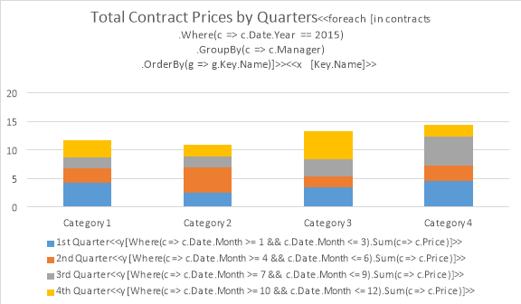

## Data Source Objects

This section contains examples of templates for typical scenarios. Every example is given using one of the following data source objects:

- `manager`, an instance of the `Manager` class
- `managers`, an enumeration of instances of the `Manager` class
- `contracts`, an enumeration of instances of the `Contract` class
- `clients`, an enumeration of instances of the `Client` class

The `Manager`, `Contract`, and `Client` classes are defined as follows.







## Templates

### Single-Row Template

#### Template Example

| | Name: <<[manager.Name]>>   Age: <<[manager.Age]>> |
| :- | :- |

You can download the template file of this example from [here](https://github.com/aspose-words/Aspose.Words-for-.NET/blob/master/Examples/Data/Reporting%20engine%20template%20-%20Table%20row.docx).

#### Report Example

||Name: John Smith   Age: 37 |
| :- | :- |



### In-Paragraph List Template

#### Template Example

|We provide support for the following clients: <<foreach [in clients]>><<[IndexOf() != 0 ? ", " : ""]>><<[Name]>><</foreach>>|
| :- |

#### Report Example

|We provide support for the following clients: A Company, B Ltd., C & D, E Corp., F & Partners, G & Co., H Group, I & Sons, J Ent.|
| :- |



### Bulleted List Template

#### Template Example


We provide support for the following clients:
    * <<foreach [in clients]>><<[Name]>>
<</foreach>>


You can download the template file of this example from [here](https://github.com/aspose-words/Aspose.Words-for-.NET/blob/master/Examples/Data/Reporting%20engine%20template%20-%20Bulleted%20list.docx).

#### Report Example


We provide support for the following clients:
    * A Company
    * B Ltd.
    * C & D
    * E Corp.
    * F & Partners
    * G & Co.
    * H Group
    * I & Sons
    * J Ent.




### Numbered List Template

#### Template Example


We provide support for the following clients:
    1. <<foreach [in clients]>><<[Name]>>
<</foreach>>


You can download the template file of this example from [here](https://github.com/aspose-words/Aspose.Words-for-.NET/blob/master/Examples/Data/Reporting%20engine%20template%20-%20Numbered%20list.docx).

#### Report Example


We provide support for the following clients:
    1. A Company
    2. B Ltd.
    3. C & D
    4. E Corp.
    5. F & Partners
    6. G & Co.
    7. H Group
    8. I & Sons
    9. J Ent.




### Multicolored Numbered List Template

#### Template Example

We provide support for the following clients:

<table class="conditional block">
	<tbody>
		<tr>
			<td>1. &lt;&lt;foreach [in clients]>>&lt;&lt;if [IndexOf() % 2 == 0]>>&lt;&lt;[Name]>> 
2. &lt;&lt;else>>&lt;&lt;[Name]>> 
&lt;&lt;/if>>&lt;&lt;/foreach>></td>
		</tr>
	</tbody>
</table>

You can download the template file of this example from [here](https://github.com/aspose-words/Aspose.Words-for-.NET/blob/master/Examples/Data/Reporting%20engine%20template%20-%20Multicolored%20numbered%20list.docx).

#### Report Example

We provide support for the following clients:

<table class="conditional block">
	<tbody>
		<tr>
			<td>1. A Company 
2. B Ltd. 
3. C & D 
4. E Corp. 
5. F & Partners 
6. G & Co. 
7. H Group 
8. I & Sons 
9. J Ent.</td>
		</tr>
	</tbody>
</table>



### Common List Template

#### Template Example

|<<foreach [in managers]>>      <<[Name()]>>   &lt;&lt;/foreach&gt;&gt;|
| :- |

You can download the template file of this example from [here](https://github.com/aspose-words/Aspose.Words-for-.NET/blob/master/Examples/Data/Reporting%20engine%20template%20-%20Common%20master%20detail.docx).

#### Report Example

|   John Smith      Tony Anderson      July James|
| :- |



### In-Table List Template

#### Template Example

|Manager|Contract Price|
| :- | :- |
| <<foreach [in managers]>><<[Name()]>>  |  <<[Contracts().sum(c => c.Price())]>><</foreach>>  |
| Total:  |  <<[sum(m => m.Contracts().sum(c => c.Price()))]>>  |

You can download the template file of this example from [here](https://github.com/aspose-words/Aspose.Words-for-.NET/blob/master/Examples/Data/Reporting%20engine%20template%20-%20Contextual%20object%20member%20access.docx).

#### Report Example

|Manager|Contract Price|
| :- | :- |
| John Smith  |  2300000  |
| Tony Anderson  |  1200000  |
| July James  |  800000  |
| Total:  |  4300000 



### In-Table List Template (Horizontal)

#### Template Example

| **Manager	<<foreach [in managers] -horz>><<[Name]>>	Total:** 
Contract Price	<<[Contracts.Sum( 
  c => c.Price)]>><</foreach>>	<<[Sum( 
  m => m.Contracts.Sum( 
    c => c.Price))]>> |
| :- |

#### Report Example

|Manager|John Smith|Tony Anderson|July James|Total:|
| :- | :- | -- | -- | -- |
| **Contract Price** | 2300000 | 1200000 | 800000 | 4300000 |

### In-Table List Template with Running (Progressive) Total

#### Template Example

&lt;&lt;var [total = 0.0]&gt;&gt;

|Client|Total Contract Price|
| :- | :- |
|**&lt;&lt;foreach [in contracts]&gt;&gt;&lt;&lt;[getClient().getName()]&gt;&gt;**|&lt;&lt;var [total = total + getPrice()]&gt;&gt;&lt;&lt;[total]&gt;&gt;&lt;&lt;/foreach&gt;&gt;|

#### Report Example

|Client|Total Contract Price|
| :- | :- |
|**A Company**|1200000|
|**B Ltd.**|1950000|
|**C & D**|2300000|
|**E Corp.**|2950000|
|**F & Partners**|3500000|
|**G & Co.**|3850000|
|**H Group**|4100000|
|**I & Sons**|4200000|
|**J Ent.**|4300000|

### In-Table List Template with Highlighted Rows

#### Template Example

|Client|Contract Price|
| :- | :- |
|**&lt;&lt;foreach [in contracts]&gt;&gt;&lt;&lt;if [Price() >= 1000000]&gt;&gt;&lt;&lt;[Client().Name()]&gt;&gt;**|&lt;&lt;[Price()]&gt;&gt;|
|**&lt;&lt;else&gt;&gt;&lt;&lt;[Client().Name()]&gt;&gt;**|&lt;&lt;[Price()]&gt;&gt;&lt;&lt;/if&gt;&gt;&lt;&lt;/foreach&gt;&gt;|
|**Total:**|&lt;&lt;[sum(c => c.Price())]&gt;&gt;|

#### Report Example

|Client|Contract Price|
| :- | :- |
|**A Company**|1200000|
|**B Ltd.**|750000|
|**C & D**|350000|
|**E Corp.**|650000|
|**F & Partners**|550000|
|**G & Co.**|350000|
|**H Group**|250000|
|**I & Sons**|100000|
|**J Ent.**|100000|
|**Total:**|4300000|

### In-Table List Template (Horizontal) with Highlighted Columns

#### Template Example

| **Manager	<<foreach [in managers] -horz>><<if [Contracts.Sum(** 
  **c => c.Price) >= 2000000] -horz>><<[Name]>>	<<else>><<[Name]>>	Total:** 
**Contract Price**	<<[Contracts.Sum( 
  c => c.Price)]>>	<<[Contracts.Sum( 
  c => c.Price)]>><</if>><</foreach>>	<<[Sum( 
  m => m.Contracts.Sum( 
    c => c.Price))]>> |
| :- |

#### Report Example

| Manager            | John Smith | Tony Anderson | July James | Total:  |
| :----------------- | :--------- | ------------- | ---------- | ------- |
| **Contract Price** | 2300000    | 1200000       | 800000     | 4300000 |

### In-Table List Template with Alternate Content

#### Template Example

|Client|Contract Price|
| :- | :- |
|**<<if [!Any()]>>No data**||
|**<<else>><<foreach [in contracts]>><<[Client.Name]>>**|<<[Price]>><</foreach>>|
|**Total:**|<<[Sum(c => c.Price)]>><</if>>|

You can download the template file of this example from [here](https://github.com/aspose-words/Aspose.Words-for-.NET/blob/master/Examples/Data/Reporting%20engine%20template%20-%20Total.docx).

#### Report Example 1

|Client|Contract Price|
| :- | :- |
|**No data**||

#### Report Example 2

|Client|Contract Price|
| :- | :- |
|**A Company**|1200000|
|**B Ltd.**|750000|
|**C & D**|350000|
|**E Corp.**|650000|
|**F & Partners**|550000|
|**G & Co.**|350000|
|**H Group**|250000|
|**I & Sons**|100000|
|**J Ent.**|100000|
|**Total:**|4300000|



### In-Table List Template (Horizontal) with Alternate Content

#### Template Example

| **Manager	<<if [!Any()] -horz>>No data	<<else>><<foreach [in managers] -horz>><<[Name]>>	Total:** 
**Contract Price**		<<[Contracts.Sum( 
  c => c.Price)]>><</foreach>>	<<[Sum( 
  m => m.Contracts.Sum( 
    c => c.Price))]>><</if>> |
| :- |

#### Report Example 1

| Manager            | No data |
| :----------------- | :------ |
| **Contract Price** |         |

#### Report Example 2

| Manager            | John Smith | Tony Anderson | July James | Total:  |
| :----------------- | :--------- | ------------- | ---------- | ------- |
| **Contract Price** | 2300000    | 1200000       | 800000     | 4300000 |

### Common Master-Detail Template

#### Template Example

|<<foreach [in managers]>>      <<[Name()]>>   Clients: <<foreach [in Contracts() ]>><<[indexOf() != 0 ? ", " : ""]>><<[Client().Name()]>><</foreach>>   &lt;&lt;/foreach&gt;&gt;|
| :- |

You can download the template file of this example from [here](https://github.com/aspose-words/Aspose.Words-for-.NET/blob/master/Examples/Data/Reporting%20engine%20template%20-%20Common%20master%20detail.docx).

#### Report Example

|   John Smith   Clients: A Company, B Ltd., C & D      Tony Anderson   Clients: E Corp., F & Partners      July James   Clients: G & Co., H Group, I & Sons, J Ent.|
| :- |



### In-Table Master-Detail Template

#### Template Example

|Manager/Client|Contract Price|
| :- | :- |
| <<foreach [in managers]>><<[Name()]>>  |  <<[Contracts().sum(c => c.Price())]>> |
| <<foreach [in Contracts()]>> <<[Client().Name()]>>  |  <<[Price()]>><</foreach>><</foreach>> |
| Total:  |  <<[sum(m => m.Contracts().sum(c => c.Price()))]>> |

You can download the template file of this example from [here](https://github.com/aspose-words/Aspose.Words-for-.NET/blob/master/Examples/Data/Reporting%20engine%20template%20-%20Nested%20data%20table.docx).

#### Report Example

|Manager/Client|Contract Price|
| :- | :- |
| John Smith  |  2300000 |
| A Company  |  1200000 |
| B Ltd.  |  750000

|
| C & D  |  350000

|
| Tony Anderson  |  1200000

|
| E Corp.  |  650000

|
| F & Partners  |  550000

|
| July James  |  800000

|
| G & Co.  |  350000

|
| H Group  |  250000

|
| I & Sons  |  100000

|
| J Ent.  |  100000

|
| Total:  |  4300000

|



### Pie Chart Template

You can download the template file of this example from [here](https://github.com/aspose-words/Aspose.Words-for-.NET/blob/master/Examples/Data/Reporting%20engine%20template%20-%20Pie%20chart.docx).

**Template Example**

**Initial Chart Series Data**

**Report Example**



### Scatter Chart Template

You can download the template file of this example from [here](https://github.com/aspose-words/Aspose.Words-for-.NET/blob/master/Examples/Data/Reporting%20engine%20template%20-%20Scatter%20chart.docx).

**Template Example**

**Initial Chart Series Data**

**Report Example**



### Bubble Chart Template

You can download the template file of this example from [here](https://github.com/aspose-words/Aspose.Words-for-.NET/blob/master/Examples/Data/Reporting%20engine%20template%20-%20Bubble%20chart.docx).

**Template Example**

**Initial Chart Series Data**

**Report Example**



### In-Table Template with Filtering, Grouping, and Ordering

You can download the template file of this example from [here](https://github.com/aspose-words/Aspose.Words-for-.NET/blob/master/Examples/Data/Reporting%20engine%20template%20-%20Table%20with%20filtering.docx).

**Template Example**

|Manager|Contract Price|
| :- | :- |
| <<foreach [in contracts
.Where(c => c.Date().Year() == 2015)
.GroupBy(c => c.Manager())
.OrderBy(g => g.key.Name())]>>
<<[key.Name()]>>  |  <<[sum(c => c.Price())]>><</foreach>>|

**Report Example**

|Manager|Contract Price|
| :- | :- |
|**John Smith**|2300000|
|**July James**|800000|
|**Tony Anderson**|1200000|



### Chart Template with Filtering, Grouping, and Ordering

You can download the template file of this example from [here](https://github.com/aspose-words/Aspose.Words-for-.NET/blob/master/Examples/Data/Reporting%20engine%20template%20-%20Chart%20with%20filtering.docx).

**Template Example**

**Report Example**


