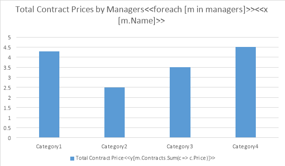
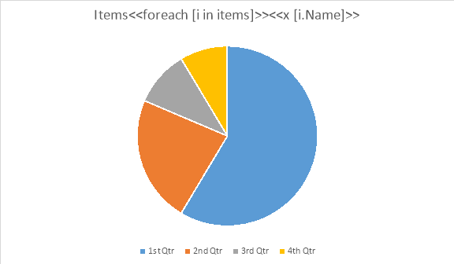
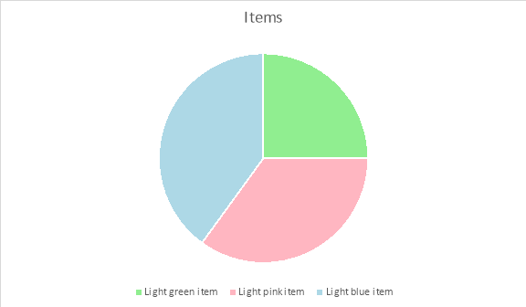
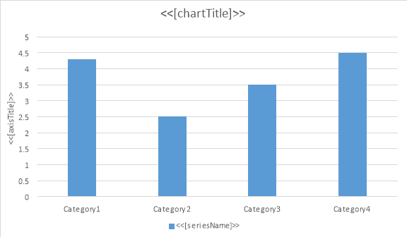

A typical template for LINQ Reporting Engine is composed of common document contents and tags that describe the template’s structure and data bindings. You can form these tags using just running text that can occupy multiple paragraphs to be more descriptive. 

A tag body must meet the following requirements:

- A tag body must be surrounded by “<<” and “>>” character sequences.
- A tag body must contain only text nodes.
- A tag body must not be located inside markup document nodes such as StructuredDocumentTag, CustomXmlMarkup, or SmartTag.

A tag body typically consists of the following elements:

- A tag name
- An expression surrounded by brackets
- A set of switches available for the tag, each of which is preceded by the “-“ character
- An optional comment providing a human-readable explanation ignored by the engine


<<tag_name [expression] –switch1 –switch2 ... // optional_comment >>


Particular tags can have additional elements.

Some tags require closing counterparts. A closing tag has the “/” character that precedes its name. This tag’s name must match to the name of the corresponding opening tag.

<</tag_name>>

**Note –** Tag body elements are case-sensitive.

During runtime, after a template syntax tag is processed by the engine, it is typically removed. This can lead to a situation where a paragraph containing the tag becomes empty if it has no other content. If such a paragraph is unwanted, it can be optionally removed by the engine (see “Removing Paragraphs Containing Only Template Syntax Tags” for more information).
## **Composing Expressions**
Expression is a central concept of the template syntax. Every tag is bound with an expression that is evaluated during runtime, and its result is used by LINQ Reporting Engine according to the tag's role. Expressions are composed of operands and operators according to [C# Language Specification 5.0](http://www.microsoft.com/en-us/download/details.aspx?id=7029) with several restrictions. See the following sections for more information. The complexity of expressions in templates is not restricted in any way. However, to keep your templates less cumbersome and to satisfy [Separation of Concerns](http://en.wikipedia.org/wiki/Separation_of_concerns) and [Single Responsibility](http://en.wikipedia.org/wiki/Single_responsibility_principle) principles, locate any complex logic at the This section includes the following topics: 
### **Using Lexical Tokens**
The following table describes lexical tokens that you can use in template expressions and restrictions on these tokens’ usage comparing with C# Language Specification 5.0.

|**Token**|**Restrictions**|
| :- | :- |
|**Keyword**|Only the following tokens are reserved as keywords: true, false, null, new, and in.|
|**Identifier**|- The feature of keyword escaping through the “@” character is not supported. - Unicode character escapes are not permitted in identifiers.|
|**Literal**|None.|
|**Operator**|See “Using Operators.”|

You can use the following identifiers that are not preceded by a member access operator in template expressions:

- The name of a passed data source object
- The name of an iteration variable within its scope (see “Outputting Sequential Data” for more information)
- The name of a common variable after it is declared (see “Using Variables” for more information)
- The name of a lambda function parameter within the scope of the lambda function
- A fully or partially qualified name of a type that is known by the engine (see “Setting up Known External Types” for more information)
- The name of a member of an object that is determined as follows: 
  - Inside a data band body, the object is resolved to the innermost iteration variable.
  - Outside a data band body, the object is resolved to a passed data source.

The feature of the omitting of an object identifier while accessing the object’s members is also known as the contextual object member access. See “Using Contextual Object Member Access” for more information.
### **Working with Types**
LINQ Reporting Engine enables you to use externally visible types in template expressions. A visible type is a public type with outer types (if any) are public as well. You can use a data source object of any visible type to pass it to the engine.

However, you can use the identifier of a visible type in template expressions only if the following additional requirements are met:

- The type is not void.
- The type does not represent an array.
- The type is not an open or closed generic type.

**Note –** Whereas using generic types' identifiers is forbidden in template expressions, you can use identifiers of nullable types in the shorthand "T?" form.

Also, the engine enables you to use anonymous types in template expressions. Such types are useful while composing expressions with grouping by multiple keys. See "Appendix A. Enumeration Extension Methods" for the examples.
### **Accessing Type Members**
LINQ Reporting Engine enables you to access the following public (static and instance) members of accessible types (see “Working with Types” for more information) in template expressions:

- Fields
- Properties
- Indexer getters
- Methods
- Constructors

**Note –** To access a static member of a type in a template expression, the type must be set known for the engine (see “Setting up Known External Types” for more information).

A function type member can be used in a template expression only if the following additional requirements are met:

- The function member returns a value.
- The function member does not have ref or out parameters.
- The function member does not take generic type arguments.

The engine supports the following features when dealing with function members:

- Overload resolution according to [C# Language Specification 5.0](http://www.microsoft.com/en-us/download/details.aspx?id=7029)
- Using of default parameter values without support of named parameters
- Using of parameters taking a variable number of arguments

In addition to C# Language features, the engine provides the following extra features to simplify type member access:

- Accessing members of an object without specifying the object’s identifier (see “Using Contextual Object Member Access” for more information)
- Accessing missing members of an object (see “Accessing Missing Members of Data Objects” for more information)
### **Using Extension Methods**
LINQ Reporting Engine enables you to use the following built-in extension methods in template expressions:

- Extension methods mimicking the ones for IEnumerable<T> (see "Appendix A. Enumeration Extension Methods" for more information)
- Extension methods for iteration variables (see "Using Extension Methods of Iteration Variables" for more information)

**Note –** Extension methods, other than the built-in ones, can be used only in the form of plain static methods in template expressions.
### **Using Operators**
The following table contains predefined and user-defined operators that LINQ Reporting Engine enables you to use in template expressions.

|Primary|x.y  x?.y  f(x)  a[x]  a?[x]  new|
| :- | :- |
|Unary|-  !  ~  (T)x|
|Binary|*  /  %  +  -  <<  >>  <  >  <=  >=  ==  !=  &  ^  |  &&  ||  ??|
|Ternary|?:|

The engine follows operator precedence, associativity, and overload resolution rules declared at [C# Language Specification 5.0](http://www.microsoft.com/en-us/download/details.aspx?id=7029) while evaluating template expressions. But be aware of the following limitations in the behavior comparing with the specification:

- Implicit user-defined conversions are supported only when specified explicitly.
- The indexing of multi-dimensional arrays is not supported.
- Whereas the object initializer syntax is supported (including objects of anonymous types), the collection initializer syntax is not.

Also, the engine enables you to use lifted operators in template expressions. 
### **Using Lambda Functions**
LINQ Reporting Engine enables you to use lambda functions only as arguments of built-in enumeration extension methods in template expressions. See "Appendix A. Enumeration Extension Methods" for more information.

**Note –** Lambda functions declared within template expressions are not interchangeable with delegates. Thus, you can not pass delegates as arguments to built-in enumeration extension methods.

You can use both explicit and implicit lambda function signatures in template expressions. If you do not specify the type of a parameter of a lambda function explicitly, the type is determined implicitly by the engine depending on the type of the corresponding enumeration.
### **Working with Traditional Mail Merge Data Sources**
LINQ Reporting Engine enables you to use a simplified syntax in template expressions to work with traditional Aspose.Words Mail Merge data source objects. See the following sections for more information.
#### **Working with DataSet objects**
LINQ Reporting Engine enables you to access DataTable objects contained within a particular DataSet instance by table names using the “.” operator in template expressions. That is, for example, given that ds is a DataSet instance that contains a DataTable named “Persons”, you can access the table using the following syntax.


  ds.Persons


**Note –** Table names are case-insensitive.
#### **Working with DataTable and DataView Objects**
LINQ Reporting Engine enables you to treat DataTable and DataView objects in template expressions as enumerations of their rows. That is, you can use template expressions evaluated to such objects in foreach tags (see "Outputting Sequential Data" for more information).

Also, you can normally apply enumeration extension methods (see "Appendix A. Enumeration Extension Methods" for more information) to DataTable and DataView objects in template expressions. For example, given that persons are a DataTable or DataView instance, you can count its rows using the following syntax.


  persons.Count()

#### **Working with DataRow and DataRowView Objects**
LINQ Reporting Engine enables you to access a data associated with a particular DataRow or DataRowView instance in template expressions using the “.” operator. The following table describes, which identifiers you can use to access different kinds of the data.

|**Data Kind**|**Identifier**|**Examples of Template Expressions**|
| :- | :- | :- |
|**Field Value**|Field name|Given that r is a row that has a field named “Name”, you can access the field’s value using the following syntax.**r.Name**|
|**Single Parent or Child Row**|Parent (child) table name|Given that r is a row of a DataTable that has a parent (child) DataTable named “City”, you can access the single parent (child) row of r using the following syntax.**r.City**Given that the “City” DataTable has a field named “Name”, you can access the field’s value for the single parent (child) row using the following syntax.**r.City.Name**|
|**Enumeration of Child or Parent Rows**|Child (parent) table name|Given that r is a row of a DataTable that has a child (parent) DataTable named “Persons”, you can access the enumeration of the child (parent) rows of r using the following syntax.**r.Persons**Given that the “Persons” DataTable has a field named “Age”, you can count the child (parent) rows that correspond to persons over thirty years old using the following syntax.**r.Persons.Count(p => p.Age > 30)**|

**Note –** Field and table names are case-insensitive.

To determine parent-child relationships for a particular DataTable instance, the engine uses [DataRelation](http://msdn.microsoft.com/en-us/library/system.data.datarelation\(v=vs.110\).aspx) objects contained within the corresponding DataSet instance. Thus, you can manage these relationships in a common way.

**Note –** Instead of using of table names to access data of child or parent rows, you can also use relation names, which is useful when you deal with multiple relations to the same table.
#### **Working with IDataReader Implementors**
LINQ Reporting Engine enables you to treat IDataReader implementors as enumerations of IDataRecord implementors in template expressions. That is, you can use IDataReader implementors in template expressions in the same way as DataTable objects. See "Working with DataTable and DataView Objects" for more information.

However, you can not use IDataReader implementors in template expressions in conjunction with enumeration operations that require a caching of enumeration items. Examples of such operations are grouping and sorting. To work around this restriction, use DataTable objects instead.
#### **Working with IDataRecord Implementors**
LINQ Reporting Engine enables you to access the field values of a particular IDataRecord implementor by field names using the "." operator in template expressions. To use this feature, one of the following conditions must be met:

- The IDataRecord implementor represents an iteration variable upon enumerating an IDataReader implementor (see "Outputting Sequential Data" for more information).
- The IDataRecord implementor does not implement the IDataReader interface.

The following example shows, how to use this feature. Given that r is an IDataRecord implementor that has a field named "Name", you can access the field’s value using the following syntax.


  r.Name


**Note –** Field names are case-insensitive.

## **Outputting Expression Results**
You can output expression results to your reports using expression tags. An expression tag denotes a placeholder for an expression result within a template. While building a report, the corresponding expression is evaluated, and this placeholder is replaced with the formatted result of the expression. 

An expression tag has no name and consists of the following elements:

- An expression enclosed by brackets
- An optional format string enclosed by double quotes and preceded by the ":" character
- An optional html switch


<<[expression]:"format" -html>>


If html switch is not present, the result of the corresponding expression is written to a document as a plain text at runtime. Font attributes are derived from the first character of the corresponding tag in this case.

If html switch is present, the expression result is considered to be a HTML block and is written as such. This feature is useful, when you need to format text parts of an expression result in different ways. For example, the following tag is replaced with a content like "**Bold** and *italic* text" at runtime.

<["<b>Bold</b> and <i>italic</i> text"] -html>>


To format a numeric or date-time expression result, you can specify a format string as an element of the corresponding expression tag. Such format strings are the same as the ones that you pass to [IFormattable.ToString](http://msdn.microsoft.com/en-us/library/system.iformattable.tostring\(v=vs.110\).aspx)method implementors. That is, for example, given that d is a DateTime value, you can use the following template to format the value using the "yyyy.MM.dd" pattern.

<<[d]:"yyyy.MM.dd">>


LINQ Reporting Engine provides several additional number formats that can not be specified using format strings because these formats are missing in standard .Net libraries. The following table describes these formats.

|**Number Format**|**Description**|
| :- | :- |
|**alphabetic**|Formats an integer number as an upper-case letter (A, B, C, ...)|
|**roman**|Formats an integer number as an upper-case Roman numeral (I, II, III, ...)|
|**ordinal**|Appends an ordinal suffix to an integer number (1st, 2nd, 3rd, ...)|
|**ordinalText**|Converts an integer number to its ordinal text representation (First, Second, Third, ...)|
|**cardinal**|Converts an integer number to its text representation (One, Two, Three, ...)|
|**hex**|Formats an integer number as hexadecimal (8, 9, A, B, C, D, E, F, 10, 11, ...)|
|**arabicDash**|Encloses an integer number with dashes (- 1 -, - 2 -, - 3 -, ...)|

You can specify one of these additional number formats instead of a format string like in the following example. Given that i is an integer number, you can format the number as an upper-case letter using the following template.

<<[i]:alphabetic>>


LINQ Reporting Engine provides several additional string formats that can not be specified using format strings because these formats are missing in standard .Net libraries. The following table describes these formats.

|**String Format**|**Description**|
| :- | :- |
|**lower**|Converts a string to lower case ("the string")|
|**upper**|Converts a string to upper case ("THE STRING")|
|**caps**|Capitalizes a first letter of every word in a string ("The String")|
|**firstCap**|Capitalizes the first letter of the first word in a string ("The string")|

You can specify one of these additional string formats instead of a format string like in the following example. Given that s is a string, you can capitalize a first letter of every word in the string using the following template.

<<[s]:caps>>


You can also specify one of the additional string formats together with a format string or an additional number format like in the following examples. Given that d is a DateTime value, you can convert its textual month representation to upper case using the following template.

<<[d]:"MMMM":upper>>

Given that i is an integer number, you can convert the number to a lower-case Roman numeral using the following template.

<<[i]:roman:lower>>


**Note -** In contrast to format strings, additional number and string formats must not be enclosed with double quotes.
## **Outputting Sequential Data**
You can output a sequence of elements of the same type to your report using a data band. A data band has a body that represents a template for a single element of such a sequence. While building a report, sequence elements are enumerated, and the following procedure takes place for each of the elements:

1. The data band body is duplicated and appended to the report.
1. The appended data band body is populated with the element’s data.

**Note –** A data band body can contain nested data bands.

A data band body is defined between the corresponding opening and closing foreach tags within a template as follows.


  <<foreach ...>>
  data_band_body
  <</foreach>>


You can reference an element of the corresponding sequence in template expressions within a data band body using an iteration variable. At runtime, an iteration variable represents a sequence element for which an iteration is currently being performed. You can declare an iteration variable within the corresponding opening foreach tag.

An opening foreach tag defines a foreach statement enclosed by brackets. The following table describes the elements of this statement.

|**Element**|**Optional?**|**Remarks**|
| :- | :- | :- |
|**Iteration Variable Type**|Yes|You can specify the type of an iteration variable explicitly. This type must be known by the engine (see "Setting up Known External Types" for more information). If you do not specify the type explicitly, it is determined implicitly by the engine depending on the type of the corresponding sequence.|
|**Iteration Variable Name**|Yes|You can specify the name of an iteration variable to use it while accessing the variable’s members. The name must be unique within the scope of the corresponding foreach tag. If you do not specify the name, you can access the variable's members using the contextual object member access syntax (see "Using Contextual Object Member Access" for more information).|
|**"in" Keyword**|No| |
|**Sequence Expression**|No|A sequence expression must return an [IEnumerable](http://msdn.microsoft.com/en-us/library/system.collections.ienumerable\(v=vs.110\).aspx) implementor.|
The complete syntax of a foreach tag (including optional elements) is as follows.


<<foreach [variable_type variable_name in sequence_expression]>>
data_band_body
<</foreach>>

### **Working with Common Data Bands**
A common data band is a data band whose body starts and ends within paragraphs that belong to a single story or table cell.

In particular, a common data band can be entirely located within a single paragraph. In this case, while building a report, the band is replaced with contents that are entirely located within the same paragraph as well. The following example illustrates such a scenario. Given that items are an enumeration of the strings “item1”, “item2”, and “item3”, you can use the following template to enumerate them with commas in a single paragraph.


The items are: <<foreach [item in items]>><<[item]>>, <</foreach>>and others.


In this case, the engine produces a report as follows.


The items are: item1, item2, item3, and others.


When the body of a common data band starts and ends within different paragraphs, the engine duplicates on iteration only those paragraph breaks which are located within the body. The following table illustrates the relevant cases.

**Note –** Examples in the table are given with paragraph marks shown as per Microsoft Word® editor.

|**Template**|**Report**|
| :- | :- |
|
p> prefix <<foreach [item in items]>><<[item]>>¶<</foreach>>suffix|
p> prefix item1¶item2¶item3¶suffix|
|
p> prefix<<foreach [item in items]>>¶<<[item]>><</foreach>> suffix|
p> prefix¶item1¶item2¶item3 suffix|
|
p> prefix¶<<foreach [item in items]>><<[item]>>¶<</foreach>>suffix|
p> prefix¶item1¶item2¶item3¶suffix|
|
p> prefix<<foreach [item in items]>>¶<<[item]>><</foreach>>¶suffix|
p> prefix¶item1¶item2¶item3¶suffix|
|
p> prefix¶<<foreach [item in items]>>¶<<[item]>>¶<</foreach>>¶suffix|
p> prefix¶¶item1¶¶item2¶¶item3¶¶suffix|
While building a report, duplicated paragraph breaks derive common attributes from their template prototypes. In particular, this fact enables you to build numbered or bulleted lists in reports dynamically. For example, given the above declaration of items, you can get a report with their numbered list using the following template.

**Note –** “1. ” in the template stands for a numbered list label.


1. <<foreach [item in items]>><<[item]>>
<</foreach>>


In this case, the engine produces a report as follows.


1. item1
2. item2
3. item3

### **Working with Table-Row Data Bands**
A table-row data band is a data band which body occupies single or multiple rows of a single document table. The body of such a band starts at the beginning of the first occupied row and ends at the end of the last occupied row as follows.

||||
| :- | :- | :- |
|**<<foreach ...>> ...**|**...**|**...**|
|**...**|**...**|**...**|
|**...**|**...**|**... <</foreach>>**|
||||

The following examples in this section are given using ds, a DataSet instance containing DataTable and DataRelation objects according to the following data model.

The most common use case of a table-row data band is the building of a document table that represents a list of items. You can use a template like the following one to achieve this.

|**Client**|**Manager**|**Contract Price**|
| :- | :- | :- |
|**<<foreach [c in ds.Contracts]>><<[c.Clients.Name]>>**|**<<[c.Managers.Name]>>**|**<<[c.Price]>><</****foreach>>**|
|**Total:**||**<<[ds.Contracts.Sum(c =>c.Price)]>>**|

In this case, the engine produces a report as follows.

|**Client**|**Manager**|**Contract Price**|
| :- | :- | :- |
|**A Company**|**John Smith**|**1200000**|
|**B Ltd.**|**John Smith**|**750000**|
|**C & D**|**John Smith**|**350000**|
|**E Corp.**|**Tony Anderson**|**650000**|
|**F & Partners**|**Tony Anderson**|**550000**|
|**G & Co.**|**July James**|**350000**|
|**H Group**|**July James**|**250000**|
|**I & Sons**|**July James**|**100000**|
|**J Ent.**|**July James**|**100000**|
|**Total:**||**4300000**|

To populate a document table with a master-detail data, you can use nested table-row data bands like in the following template.

|**Manager/Client**|**Contract Price**|
| :- | :- |
|**<<foreach [m in ds.Managers]>><<[m.Name]>>**|**<<[m.Contracts.Sum(**`     `**c => c.Price)]>>**|
|**<<foreach [c in m.Contracts]>>  <<[c.Clients.Name]>>**|**<<[c.Price]>><</****foreach>><</****foreach>>**|
|**Total:**|**<<[ds.Contracts.Sum(c =>c.Price)]>>**|

In this case, the engine produces a report as follows.

|**Manager/Client**|**Contract Price**|
| :- | :- |
|**John Smith**|**2300000**|
|`  `**A Company**|**1200000**|
|`  `**B Ltd.**|**750000**|
|`  `**C & D**|**350000**|
|**Tony Anderson**|**1200000**|
|`  `**E Corp.**|**650000**|
|`  `**F & Partners**|**550000**|
|**July James**|**800000**|
|`  `**G & Co.**|**350000**|
|`  `**H Group**|**250000**|
|`  `**I & Sons**|**100000**|
|`  `**J Ent.**|**100000**|
|**Total:**|**4300000**|

You can normally use common data bands nested to table-row data bands as well like in the following template.

|**Manager**|**Clients**|
| :- | :- |
|**<<foreach [m in ds.Managers]>><<[m.Name]>>**|**<<foreach [ c in m.Contracts ]>><<[c.Clients.Name]>>****<</foreach>><</foreach>>**|

In this case, the engine produces a report as follows.

|**Manager**|**Clients**|
| :- | :- |
|**John Smith**|**A Company****B Ltd.****C & D**|
|**Tony Anderson**|**E Corp.****F & Partners**|
|**July James**|**G & Co.****H Group****I & Sons****J Ent.**|

A special case is a data band inside a single-column table row. In such a case, if you put opening and closing foreach tags in the same cell, the engine treats a data band formed by these tags as a common one rather than a table-row one by default. The following template illustrates such a scenario.

|**Managers**|
| :- |
|**<<foreach [m in ds.Managers]>><<[m.Name]>>  <</foreach>>**|

In this case, the engine produces a report as follows.

|**Managers**|
| :- |
|**John Smith  Tony Anderson  July James**  |

However, if needed, you can override this behavior making the engine to treat such a data band as a table-row one by specifying a greedy switch like in the following template.

|**Managers**|
| :- |
|**<<foreach [m in ds.Managers]>><<[m.Name]>><</foreach -greedy>>**|

In this case, the engine produces a report as follows.

|**Managers**|
| :- |
|**John Smith**|
|**Tony Anderson**|
|**July James**|

For more examples of templates for typical scenarios involving table-row data bands, see “Appendix C. Typical Templates”.
### **Using Extension Methods of Iteration Variables**
LINQ Reporting Engine provides special extension methods for iteration variables of any type. You can normally use these extension methods in template expressions. The following list describes the extension methods.

- IndexOf()

Returns the zero-based index of a sequence item that is represented by the corresponding iteration variable. You can use this extension method to distinguish sequence items with different indexes and then handle them in different ways. For example, given that items is an enumeration of the strings “item1”, “item2”, and “item3”, you can use the following template to enumerate them prefixing all of them but the first one with commas.


The items are: <<foreach [
    item in items]>><<[item.IndexOf() != 0
        ? ", "
        : ""]>><<[item]>><</foreach>>.


In this case, the engine produces a report as follows.


The items are: item1, item2, item3.


- NumberOf()

Returns the one-based index of a sequence item that is represented by the corresponding iteration variable. You can use this extension method to number sequence items without involving Microsoft Word® lists. For example, given the previous declaration of items, you can enumerate and number them in a document table using the following template.

|**No.**|**Item**|
| :- | :- |
|
p> <<foreach [itemin items]>><<[item.NumberOf()]>>|
p> <<[item]>><</foreach>>|
In this case, the engine produces a report as follows.

|**No.**|**Item**|
| :- | :- |
|1|item1|
|2|item2|
|3|item3|
### **Forcing Movement to Next Item within Data Band**
You can instruct the engine to force movement to the next item within a data band using a next tag. This feature is useful in label-print-like scenarios when you need to output data about a fixed number of items in a single table row like in the following example. Given that Clients is a DataTable instance having a field named "Name", you can use the following template to output three client names per table row while outputting names of all clients in a single table.

|**<<foreach [c in Clients]>><<[c.Name]>>**|**<<next>><<[c.Name]>>**|**<<next>><<[c.Name]>> <</foreach>>**|
| :- | :- | :- |

In this case, the engine produces a report as follows.

|**A Company**|**B Ltd.**|**C & D** |
| :- | :- | :- |
|**E Corp.**|**F & Partners**|**G & Co.** |
|**H Group**|**I & Sons**|**J Ent.** |
### **Using Charts to Represent Sequential Data**
LINQ Reporting Engine enables you to use charts to represent your sequential data. To declare a chart that is going to be populated with data dynamically within your template, do the following steps:

1. Add a chart to your template at the place where you want it to appear in a result document.
1. Configure the appearance of the chart.
1. Add required chart series and configure their appearance as well.
1. Add a title to the chart, if missing.
1. Add an opening foreach tag to the chart title.
1. Depending on the type of the chart, add x tags to the chart title or chart series’ names as follows.

**<<x [x_value_expression]>>**

- For a scatter or bubble chart, you can go one of the following ways: 
  - To use the same x-value expression for all chart series, add a single x tag to the chart title after the corresponding foreach tag.
  - To use different x-value expressions for every chart series, add multiple x tags to chart series’ names – one for each chart series.

An x-value expression for a scatter or bubble chart must return a numeric value.

- For a chart of another type, add a single x tag to the chart title after the corresponding foreach tag. In this case, an x-value expression must return a numeric, date, or string value.
7. For a chart of any type, add y tags to chart series’ names as follows.

**<<y [y_value_expression]>>**

An y-value expression must return a numeric value.

8. For a bubble chart, add size tags to chart series’ names as follows.

**<<size [bubble_size_expression]>>**

A bubble-size expression must return a numeric value.

**Note –** A closing foreach tag is not used for a chart.

While composing expressions for x, y, and size tags, you can normally reference an iteration variable declared at the corresponding foreach tag in a chart title in the same way as if you intended to output results of expressions within a data band.

**Note –** You can normally use charts with dynamic data within data bands.

During runtime, a chart with a foreach tag in its title is processed by the engine as follows:

1. A sequence expression declared at the foreach tag is evaluated and iterated.
1. For every sequence item, expressions declared at x, y, and size tags are evaluated.
1. Results of these expressions are used to populate corresponding chart series.
1. All foreach, x, y, and size tags are removed from the chart title and chart series’ names.

Consider the following example. Assume that you have the Manager and Contract classes defined in your application as follows.

  public class Manager
  {
    public String  Name { get { ... } }
    public IEnumerable<Contract> Contracts { get { ... } }**
    ...
  }
  
  public class Contract
  {
    public float Price { get { ... } }
    ...
  }

Given that managers is an enumeration of Manager instances, you can use the following template to represent total contract prices achieved by managers in a column chart.

In this case, the engine produces a report as follows.

For more examples of templates for typical scenarios involving charts, see “Appendix C. Typical Templates”.
#### **Including Chart Series Dynamically**
For a chart with dynamic data, you can select which series to include into it dynamically based upon conditions. In particular, this feature is useful when you need to restrict access to sensitive data in chart series for some users of your application. To use the feature, do the following steps:

1. Declare a chart with dynamic data in the usual way.
1. For series to be removed from the chart based upon conditions dynamically, define the conditions in names of these series using removeif tags having the following syntax.

<<removeif [conditional_expression]>>

**Note –** A conditional expression must return a Boolean value.

During runtime, series with removeif tags, for which conditional expressions return true, are removed from corresponding charts. The rest of the series are kept and populated with data as usual. In either case, removeif tags themselves are removed.

Consider the following example. Given the previous definition of managers and that accessLevel is an integer value representing an access level of a user, you can use the following chart template to make numbers of contracts be available for all users whereas financial contract data be available only for users having an access level of zero.

If accessLevel is equal to zero, the engine produces a report as follows.

If accessLevel is not equal to zero, the engine produces a report as follows.

#### **Setting Chart Series Colors Dynamically**
For a chart with dynamic data, you can set colors of chart series dynamically based upon expressions. To use the feature, do the following steps:

1. Declare a chart with dynamic data in the usual way.
1. For chart series to be colored dynamically, define corresponding color expressions in names of these series using seriesColor tags having the following syntax.

<<seriesColor [color_expression]>>

A color expression must return a value of one of the following types:

- A string containing the name of a known color, that is, the case-insensitive name of a member of the [KnownColor](https://msdn.microsoft.com/en-us/library/system.drawing.knowncolor\(v=vs.110\).aspx) enumeration such as “red”.
- An integer value defining RGB (red, green, blue) components of the color such as 0xFFFF00 (yellow).
- A value of the [Color](http://msdn.microsoft.com/en-us/library/system.drawing.color\(v=vs.110\).aspx) type.

During runtime, expressions declared within seriesColor tags are evaluated and corresponding chart series are colored accordingly. The seriesColor tags are removed then.

Consider the following example. Given the previous definition of managers and that color1 and color2 are color values of supported types, you can use the following chart template to set its series colors dynamically.

In this case, the engine produces a report as follows.

#### **Setting Chart Series Point Colors Dynamically**
For a chart with dynamic data, you can set colors of individual chart series points dynamically based upon expressions. To use the feature, do the following steps:

1. Declare a chart with dynamic data in the usual way.
1. For chart series with points to be colored dynamically, define corresponding color expressions in names of these series using pointColor tags having the following syntax.

<<pointColor [color_expression]>>

A color expression must return a value of one of the following types:

- A string containing the name of a known color, that is, the case-insensitive name of a member of the [KnownColor](https://msdn.microsoft.com/en-us/library/system.drawing.knowncolor\(v=vs.110\).aspx) enumeration such as “red”.
- An integer value defining RGB (red, green, blue) components of the color such as 0xFFFF00 (yellow).
- A value of the [Color](http://msdn.microsoft.com/en-us/library/system.drawing.color\(v=vs.110\).aspx) type.

During runtime, expressions declared within pointColor tags are evaluated and corresponding chart series points are colored accordingly. The pointColor tags are removed then.

Consider the following example. Assume that you have the ColoredItem class defined in your application as follows.

  public class ColoredItem
  {
    public String Name  { get { ... } }
    public float  Price { get { ... } }
    public Color  Color { get { ... } }
  }

Given that items is an enumeration of ColoredItem instances, you can use the following chart template to set its series point colors dynamically.

The series name for the template chart is defined as follows.

In this case, the engine produces a report as follows.

#### **Setting Chart Title, Series Names, and Axis Titles Dynamically**
You can normally use common expression tags in chart titles, series names, and axis titles, thus forming their contents dynamically. This feature can be used for any chart defined in a template even for the one that is not populated with data dynamically like in the following example.

Given that chartTitle, seriesName, and axisName are strings taking values “Chart Title”, “Series Name”, and “Axis Title” respectively, you can use the following chart template to set the chart’s title, series name, and axis title dynamically.

In this case, the engine produces a report as follows.

**Note –** You can normally apply this approach to a chart dynamically populated with data.

The following code example demonstrates how to set chart series names dynamically. You can download the template file of this example from [here](https://github.com/aspose-words/Aspose.Words-for-.NET/blob/master/Examples/Data/LINQ/ChartTemplate.docx).



## **Using Conditional Blocks**
You can use different document blocks to represent the same data depending on a condition with the help of conditional blocks. A conditional block represents a set of template options, each of which is bound with a conditional expression. At runtime, these conditional expressions are sequentially evaluated, until an expression that returns true is reached. Then, the conditional block is replaced with the corresponding template option populated with data.

A conditional block can have a default template option that is not bound with a conditional expression. At runtime, this template option is used, when none of the conditional expressions return true. If a default template option is missing and none of the conditional expressions return true, then the whole conditional block is removed during runtime.

You can use the following syntax to declare a conditional block.

<<if [conditional_expression1]>>
template_option1
<<elseif [conditional_expression2]>>
template_option2
...
<<else>>
default_template_option
<</if>>

**Note -** A conditional expression must return a Boolean value.
### **Working with Common Conditional Blocks**
A common conditional block is a conditional block which body starts and ends within paragraphs that belong to a single story or table cell.

If a conditional block belongs to a single paragraph, it can be used as a replacement for an expression tag that involves the ternary “?:” operator. For example, given that items is an enumeration, you can use the following template to represent the count of elements in the enumeration.

You have chosen <<if [!items.Any()]>>no items<<else>><<[items.Count()]>> item(s)<</if>>.


**Note –** A template option of a common conditional block can be composed of multiple paragraphs if needed.

You can normally use common conditional blocks within data bands. For example, given that items is an enumeration of the strings “item1”, “item2”, and “item3”, you can use the following template to enumerate them and apply different formatting for even and odd elements.

<<foreach [item in items]>><<if [IndexOf() % 2 == 0]>><<[item]>>
<<else>><<[item]>>
<</if>><</foreach>>


In this case, the engine produces a report as follows.

item1
item2
item3


You can use data bands within common conditional blocks as well. For example, given the previous declaration of items, you can check whether the enumeration contains any elements before outputting their list.

<<if [!items.Any()]>>No data.
<<else>><<foreach [item in items]>><<[item]>>
<</foreach>><</if>>

### **Working with Table-Row Conditional Blocks**
A table-row conditional block is a conditional block which body occupies single or multiple rows of a single document table. The body of such a block (as well as the body of its every template option) starts at the beginning of the first occupied row and ends at the end of the last occupied row as follows.

**Note –** Table rows occupied by different template options in the following template are highlighted with different colors.

||||
| :- | :- | :- |
|**<<if ...>> ...**|**...**|**...**|
|**...**|**...**|**...**|
|**<<elseif ...>> ...**|**...**|**...**|
|**...**|**...**|**...**|
|**<<else>> ...**|**...**|**...**|
|**...**|**...**|**...**|
|**...**|**...**|**... <</if>>**|
||||

The following examples in this section are given using client, an instance of the Client class, and clients, an enumeration of instances of the Client class that is defined as follows.

  public class Client
  {
    public String Name { get { ... } }
    public String Country { get { ... } }
    public String LocalAddress { get { ... } }
    ...
  }

Using table-row conditional blocks, you can pick to output a single row among several rows of a single document table depending on a condition like in the following example.

|**...**|**...**|**...**|
| :- | :- | :- |
|**<<if [client.Country == “New Zealand”]>><<[client.Name]>>**|**<<[client.LocalAddress]>>**||
|**<<else>><<[client.Name]>>**|**<<[client.Country]>>**|**<<[client.LocalAddress]>><</if>>**|
|**...**|**...**|**...**|

You can normally use table-row conditional blocks within data bands to make elements of an enumeration look differently depending on a condition. Consider the following template.

|**<<foreach [in clients]>><<if [Country == “New Zealand”]>><<[Name]>>**|**<<[LocalAddress]>>**||
| :- | :- | :- |
|**<<else>><<[Name]>>**|**<<[Country]>>**|**<<[LocalAddress]>><</if>><</foreach>>**|

In this case, the engine produces a report as follows.

|**A Company**|**Australia**|**219-241 Cleveland St****STRAWBERRY HILLS  NSW  1427**|
| :- | :- | :- |
|**B Ltd.**|**Brazil**|**Avenida João Jorge, 112, ap. 31****Vila Industrial****Campinas - SP****13035-680**|
|**C & D**|**Canada**|**101-3485 RUE DE LA MONTAGNE****MONTRÉAL (QUÉBEC) H3G 2A6**|
|**E Corp.**|**445 Mount Eden Road****Mount Eden****Auckland 1024**||
|**F & Partners**|**20 Greens Road****Tuahiwi****Kaiapoi 7691**||
|**G & Co.**|**Greece**|**Karkisias 6****GR-111 42  ATHINA****GRÉCE**|
|**H Group**|**Hungary**|**Budapest****Fiktív utca 82., IV. em./28.****2806**|
|**I & Sons**|**43 Vogel Street****Roslyn****Palmerston North 4414**||
|**J Ent.**|**Japan**|**Hakusan 4-Chōme 3-2****Bunkyō-ku, TŌKYŌ****112-0001****Japan**|

**Note –** You can use common conditional blocks within table-row data bands as well.

Also, you can use data bands inside table-row conditional blocks. For example, you can provide an alternate content for an empty table-row data band using the following template.

|**Client**|**Country**|**Local Address**|
| :- | :- | :- |
|**<<if [!clients.Any()]>>No data**|||
|**<<else>><<foreach [in clients]>><<[Name]>>**|**<<[Country]>>**|**<<[LocalAddress]>><</foreach>><</if>>**|

In case when the corresponding enumeration is empty, the engine produces a report as follows.

|**Client**|**Country**|**Local Address**|
| :- | :- | :- |
|**No data**|||

A special case is a template option inside a single-column table row. In such a case, if you put an opening if, elseif, or else tag and a closing if tag in the same cell, the engine treats a template option formed by these tags as a common one rather than a table-row one by default. The following template illustrates such a scenario.

|**Header**|
| :- |
|**<<if [false]>>Content to remove<</if>>**|
|**Footer**|

In this case, the engine produces a report as follows.

|**Header**|
| :- |
||
|**Footer**|

However, if needed, you can override this behavior making the engine to treat such a template option as a table-row one by specifying a greedy switch like in the following template.

|**Header**|
| :- |
|**<<if [false]>>Content to remove<</if -greedy>>**|
|**Footer**|

In this case, the engine produces a report as follows.

|**Header**|
| :- |
|**Footer**|

**Note –** In the previous examples, tag <<if [false]>> is used for the sake of simplicity; you can use any other Boolean expression instead of just false.
## **Inserting Documents Dynamically**
You can insert contents of outer documents to your reports dynamically using doc tags. A doc tag denotes a placeholder within a template for a document to be inserted during runtime. 

Syntax of a doc tag is defined as follows.

**<<doc [document_expression]>>**

**Note –** A doc tag can be used almost anywhere in a template document except textboxes and charts.

An expression declared within a doc tag is used by the engine to load a document to be inserted during runtime. The expression must return a value of one of the following types:

- A byte array containing document data
- A [Stream](http://msdn.microsoft.com/en-us/library/system.io.stream\(v=vs.110\).aspx) instance able to read document data
- An instance of the Document class
- A string containing a document URI, path, or Base64-encoded document data

While building a report, an expression declared within a doc tag is evaluated and its result is used to load a document which content replaces the doc tag then.

**Note –** If an expression declared within a doc tag returns a stream object, then the stream is closed by the engine as soon as a corresponding document is loaded.

By default, a document being inserted is not checked against template syntax and is not populated with data. However, you can enable this by using a build switch as follows.

**<<doc [document_expression] -build>>**

When a build switch is used, the engine treats a document being inserted as a template that can access the following data available at the scope of a corresponding doc tag:

- Data sources
- Variables
- A contextual object (see “Using Contextual Object Member Access” for more information)
- Known external types (see “Setting up Known External Types” for more information)

## **Inserting Images Dynamically**
You can insert images to your reports dynamically using image tags. To declare a dynamically inserted image within your template, do the following steps:

1. Add a textbox to your template at the place where you want an image to be inserted.
1. Set common image attributes such as frame, size, and others for the textbox, making the textbox look like a blank inserted image.
1. Specify an image tag within the textbox using the following syntax.

**<<image [image_expression]>>**

The expression declared within an image tag is used by the engine to build an image to be inserted. The expression must return a value of one of the following types:

- A byte array containing an image data
- A [Stream](http://msdn.microsoft.com/en-us/library/system.io.stream\(v=vs.110\).aspx) instance able to read an image data
- An [Image](http://msdn.microsoft.com/en-us/library/system.drawing.image\(v=vs.110\).aspx) object
- A string containing an image URI, path, or Base64-encoded image data

While building a report, the following procedure is applied to an image tag:

1. The expression declared within the tag is evaluated and its result is used to form an image.
1. The corresponding textbox is filled with this image.
1. The tag is removed from the textbox. 

**Note –** If the expression declared within an image tag returns a stream object, then it is closed by the engine as soon as the corresponding image is built.

By default, the engine stretches an image filling a textbox to the size of the textbox without preserving the ratio of the image. However, you can change this behavior in the following ways:

- To keep the size of the textbox and stretch the image within bounds of the textbox preserving the ratio of the image, use the keepRatio switch as follows.

**<<image [image_expression] -keepRatio>>**

- To keep the width of the textbox and change its height according to the ratio of the image, use the fitHeight switch as follows.

**<<image [image_expression] -fitHeight>>**

- To keep the height of the textbox and change its width according to the ratio of the image, use the fitWidth switch as follows.

**<<image [image_expression] -fitWidth>>**

- To change the size of the textbox according to the size of the image, use the fitSize switch as follows.

**<<image [image_expression] -fitSize>>**

- To change the size of the textbox according to the size of the image without increasing the size of the textbox, use the fitSizeLim switch as follows.

**<<image [image_expression] -fitSizeLim>>**

**Note –** If the size of the image is greater than the size of the textbox, then the fitSizeLim switch acts like fitHeight or fitWidth. Otherwise, the fitSizeLim switch acts like fitSize.

## **Inserting Bookmarks Dynamically**
You can insert bookmarks to your reports dynamically using bookmark tags. Syntax of a bookmark tag is defined as follows.

**<<bookmark [bookmark_expression]>>
bookmarked_content
<</bookmark>>**

Here, bookmark_expression defines the name of a bookmark to be inserted during runtime. This expression is mandatory and must return a non-empty value. While building a report, bookmark_expression is evaluated and its result is used to construct a bookmark start and end that replace corresponding opening and closing bookmark tags respectively.

**Note –** A bookmark tag cannot be used within a chart.

## **Inserting Hyperlinks Dynamically**
You can insert hyperlinks to your reports dynamically using link tags. Syntax of a link tag is defined as follows.

**<<link [uri_or_bookmark_expression] [display_text_expression]>>**

Here, uri_or_bookmark_expression defines URI or the name of a bookmark within the same document for a hyperlink to be inserted dynamically. This expression is mandatory and must return a non-empty value.

In turn, display_text_expression defines text to be displayed for the hyperlink. This expression is optional. If it is omitted or returns an empty value, then during runtime, a value of uri_or_bookmark_expression is used as display text as well.

**Note –** Values of both uri_or_bookmark_expression and display_text_expression can be of any types. During runtime, Object.ToString() is invoked to get textual representations of these expressions’ values, which is useful for expressions of types like [Uri](http://msdn.microsoft.com/en-us/library/system.uri\(v=vs.110\).aspx), for example. 

While building a report, uri_or_bookmark_expression and display_text_expression are evaluated and their results are used to construct a hyperlink that replaces the corresponding link tag then. If uri_or_bookmark_expression returns the name of a bookmark in the same document, then the hyperlink navigates to the bookmark. Otherwise, the hyperlink navigates to a corresponding external resource.
## **Working with Content Controls**
LINQ Reporting Engine enables you to perform certain operations on content controls dynamically while building a report.

**Note –** To work with content controls in template documents using Microsoft Word®, you may need to [show the Developer tab on its ribbon](https://docs.microsoft.com/en-us/visualstudio/vsto/how-to-show-the-developer-tab-on-the-ribbon).
### **Setting Checkbox Values Dynamically**
You can set checkbox values to either checked or unchecked in your reports dynamically by taking the following steps:

1. Add a checkbox content control to your template at a place where you want it to appear in a result document.
1. By editing content control properties, add a check tag to the title of the checkbox content control using the following syntax.

**<<check [conditional_expression]>>**

Here, conditional_expression defines a condition upon which the value of the checkbox content control is to be set to checked (or unchecked, if the condition is not met). The conditional expression must return a Boolean value.

While building a report, a conditional expression declared within a check tag is evaluated and the value of its containing checkbox content control is set accordingly. The check tag itself is removed then.
### **Setting Content Control Titles Dynamically**
You can normally use common expression tags in content control titles, thus forming their contents dynamically. For example, given that s is a string value, you can set a content control title from this value dynamically by putting the following expression tag into the title.

**<<[s]>>**


## **Setting Background Color Dynamically**
You can set text background color for document contents dynamically using backColor tags. Syntax of a backColor tag is defined as follows.

**<<backColor [color_expression]>>
content_to_be_colored
<</backColor>>**

**Note –** A backColor tag can be used anywhere in a template document except charts.

An expression declared within an opening backColor tag defines a text background color to be applied during runtime. The expression must return a value of one of the following types:

- A string containing the name of a known color, that is, the case-insensitive name of a member of the [KnownColor](https://msdn.microsoft.com/en-us/library/system.drawing.knowncolor\(v=vs.110\).aspx) enumeration like in the following example.

**<<backColor [“red”]>>text with red background<</backColor>>**

- An integer value defining RGB (red, green, blue) components of the color like in the following example.

**<<backColor [0xFFFF00]>>text with yellow background<</backColor>>**

- A value of the [Color](http://msdn.microsoft.com/en-us/library/system.drawing.color\(v=vs.110\).aspx) type.

While building a report, an expression declared within an opening backColor tag is evaluated and document content between the tag and its corresponding closing tag is colored accordingly. The opening and closing backColor tags are removed then.

**Note –** Within a document block to be colored using a backColor tag, elements having a text background color already applied are not affected during runtime.

You can use backColor tags nested into each other. Also, you can normally use backColor tags within data bands and conditional blocks like in the following example.

Assume that you have the ColoredItem class defined in your application as follows.

**public class ColoredItem
{
`    `public String Name { get { ... } }**

`    `**public String Description { get { ... } }**

`    `**public Color Color { get { ... } }**

`    `**...
}**

Given that items is an enumeration of ColoredItem instances, you can use the following template to output every item into a separate paragraph colored dynamically.

<<foreach [item in items]>><<backColor [item.Color]>><<[item.Name]>><</backColor>>
<</foreach>>

To output every item into a separate table row colored dynamically, you can use the following template.

|**<<foreach [item in items]>><<backColor [item.Color]>><<[item.Name]>>**|**<<[item.Description]>><</backColor>><</foreach>>**|
| :- | :- |

**Note –** Start and end backColor tags can be located either in paragraphs of a single story (or table cell) or in rows of a single document table in the same way as foreach tags.

Also, you can use a backColor tag to set a solid-fill color for a shape dynamically by performing the following steps:

1. Add a required shape to your template.
1. Set the shape’s fill to none (that is, “No fill”).
1. Inside the shape’s textbox, add opening and closing backColor tags so that they to enclose the whole text inside the textbox, if any, like in the following example.


**<<backColor [“red”]>>text inside shape<</backColor>>**


During runtime, an expression declared within the opening backColor tag is evaluated and the shape’s solid-fill color is set accordingly. The opening and closing backColor tags are removed then.
## **Merging Table Cells Dynamically**
You can merge table cells with equal textual contents within your reports dynamically using cellMerge tags. Syntax of a cellMerge tag is defined as follows.

**<<cellMerge -horz>>**

A horz switch is optional. If the switch is present, it denotes a cell merging operation in a horizontal direction. If the switch is missing, it means that a cell merging operation is to be performed in a vertical direction (the default).

For two or more successive table cells to be merged dynamically in either direction by the engine, the following requirements must be met:

- Each of the cells must contain a cellMerge tag denoting a cell merging operation in the same direction.
- Each of the cells must not be already merged in another direction.
- The cells must have equal textual contents (ignoring leading and trailing whitespaces).

Consider the following template.

|**...**|**...**|**...**|
| :- | :- | :- |
|**...**|**<<cellMerge>><<[value1]>>**|**...**|
|**...**|**<<cellMerge>><<[value2]>>**|**...**|
|**...**|**...**|**...**|

If value1 and value2 have the same value, say “Hello”, table cells containing cellMerge tags are successfully merged during runtime and a result report looks as follows then.

|**...**|**...**|**...**|
| :- | :- | :- |
|**...**|**Hello**|**...**|
|**...**||**...**|
|**...**|**...**|**...**|

If value1 and value2 have different values, say “Hello” and “World”, table cells containing cellMerge tags are not merged during runtime and a result report looks as follows then.

|**...**|**...**|**...**|
| :- | :- | :- |
|**...**|**Hello**|**...**|
|**...**|**World**|**...**|
|**...**|**...**|**...**|

**Note –** A cellMerge tag can be normally used within a table data band.
## **Restarting List Numbering Dynamically**
You can restart list numbering within your documents dynamically using restartNum tags. In particular, this feature is useful when working with a nested numbered list within a data band as shown in the following example.

Assume that you have the Order and Service classes defined in your application as follows.

  public class Order
  {
    public String ClientName { get { ... } }
    public String ClientAddress { get { ... } }
    public IEnumerable<Service> Services { get { ... } }
    ...
  }
  
  public class Service
  {
    public String Name { get { ... } }
    ...
  }

Given that orders is an enumeration of Order instances, you could try to use the following template to output information on several orders in one document.

**<<foreach [order in orders]>><<[order.ClientName]>> (<<[order.ClientAddress]>>)**

1. **<<foreach [service in order.Services]>><<[service.Name]>>**

**<</foreach>><</foreach>>**

But then, a result document would look as follows.

**Jane Doe (445 Mount Eden Road Mount Eden Auckland 1024)**

1. **Regular Cleaning**
1. **Oven Cleaning**

**John Smith (43 Vogel Street Roslyn Palmerston North 4414)**

3. **Regular Cleaning**
3. **Oven Cleaning**
3. **Carpet Cleaning**

That is, there would be a single numbered list across all orders, which is not applicable for this scenario. However, you can make list numbering to restart for every order by putting a restartNum tag into your template before a corresponding foreach tag as follows.

**<<foreach [order in orders]>><<[order.ClientName]>> (<<[order.ClientAddress]>>)**

1. **<<restartNum>><<foreach [service in order.Services]>><<[service.Name]>>**

**<</foreach>><</foreach>>**

**Note –** When using with a data band, it is required to put a restartNum tag before a corresponding a foreach tag in the same numbered paragraph.

Then, a result document looks as follows.

**Jane Doe (445 Mount Eden Road Mount Eden Auckland 1024)**

1. **Regular Cleaning**
1. **Oven Cleaning**

**John Smith (43 Vogel Street Roslyn Palmerston North 4414)**

1. **Regular Cleaning**
1. **Oven Cleaning**
1. **Carpet Cleaning**

**Note –** You can use a restartNum tag without a data band to dynamically restart list numbering for a containing paragraph, if needed; for example, the tag can be used to restart list numbering for a document inserted dynamically (see “Inserting Documents Dynamically” for more information).

## **Using Contextual Object Member Access**
You can make your templates less cumbersome using the contextual object member access feature. This feature enables you to access members of some objects without specifying the objects' identifiers in template expressions. An object to which the feature can be applied is determined depending on a context as follows:

- Inside a data band body, the object is resolved to the innermost iteration variable.
- Outside a data band body, the object is resolved to a passed data source.

Obviously, inside a data band body, you can not use the feature to access members of an outer iteration variable or a passed data source object. With the exception of this restriction, you can use both contextual and common object member access syntaxes interchangeably depending on your needs and preferences.

Consider the following example. Given that ds is a DataSet instance containing a DataTable object named “Persons” that has fields named “Name” and “Age”, you can use the following template to list the contents of the table.

|**No.**|**Name**|**Age**|
| :- | :- | :- |
|
p> <<foreach [p        in ds.Persons]>><<[    p.NumberOf()]>>|
p> <<[p.Name]>>|
p> <<[p.Age]>><</foreach>>|
|
p> Count: <<[ds.Persons.Count()]>>| | |
Alternatively, you can use the following template involving the contextual object member access syntax to get the same results.

|**No.**|**Name**|**Age**|
| :- | :- | :- |
|
p>  <<foreach [        in Persons]>><<[    NumberOf()]>>|
p> <<[Name]>> |
p> <<[Age]>><</foreach>> |
|
p> Count: <<[Persons.Count()]>> | | |

## **Using Variables**
LINQ Reporting Engine enables you to use variables in template documents. Variables are useful when you need to calculate an expensive value just once and access it multiple times in a template. Also, calculation of complex values such as running (progressive) totals may require variables, see “Appendix C. Typical Templates” to get an example.

You can declare a variable in a template using a var tag as follows.

<<var [variable_type variable_name = variable_value]>>

The following table describes elements of the var tag.

|**Element**|**Optional?**|**Remarks**|
| :- | :- | :- |
|**Variable Type**|Yes|You can specify the type of a variable explicitly. This type must be known by the engine (see “Setting up Known External Types” for more information).If you do not specify the type explicitly, it is determined implicitly by the engine from the specified variable value.|
|**Variable Name**|No|For a new variable, its name must be a unique identifier.|
|**Assignment Operator**|No| |
|**Variable Value**|No| |

During runtime, a var tag is removed while the value of the corresponding variable is calculated and set appropriately.

After a variable is declared in a template, its value can be accessed using the name of the variable as any other identifier. For example, the following template outputs a string “Hello!”

<<var [s = “Hello!”]>><<[s]>>


You can redefine the value of a variable using a var tag against the name of this variable. For example, the following template outputs string “Hello, World!”

<<var [s = “Hello, ”]>><<[s]>><<var [s = “World!”]>><<[s]>>

Using of variables has the following restrictions:

- You can not redefine the type of a variable.
- You can not use the contextual object member access feature against a variable. See “Using Contextual Object Member Access” for more information.
- Using a var tag, you can not redefine the value of an iteration variable or a data source.
