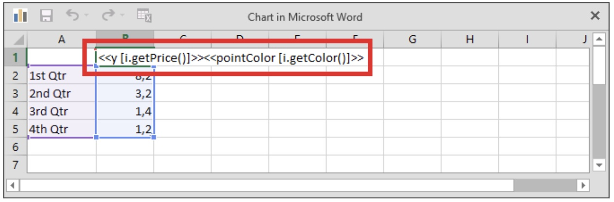
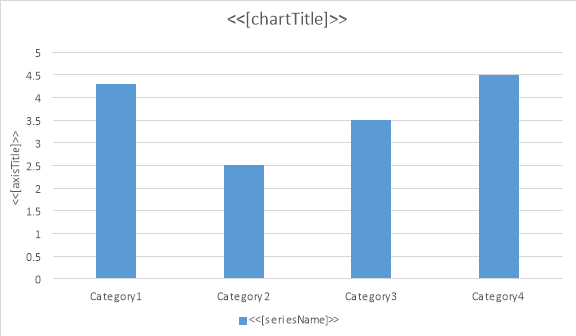
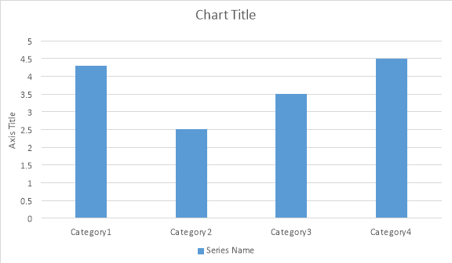

You can output a sequence of elements of the same type to your report using a data band. A *data band* has a body that represents a template for a single element of such a sequence. While building a report, sequence elements are enumerated, and the following procedure takes place for each of the elements:

1. The data band body is duplicated and appended to the report.
1. The appended data band body is populated with the element’s data.

**Note –** A data band body can contain nested data bands.

A data band body is defined between the corresponding opening and closing `foreach` tags within a template as follows.


  <<foreach ...>>
  data_band_body
  <</foreach>>


You can reference an element of the corresponding sequence in template expressions within a data band body using an iteration variable. At runtime, an *iteration variable* represents a sequence element for which an iteration is currently being performed. You can declare an iteration variable within the corresponding opening `foreach` tag.

An opening `foreach` tag defines a `foreach` statement enclosed by brackets. The following table describes the elements of this statement.

<table class="outputting-sequential-data">
	<tbody>
		<tr>
      <td><strong>Element</strong></td>
      <td><strong>Optional?</strong></td>
      <td><strong>Remarks</strong></td>
		</tr>
    <tr>
			<td>Iteration Variable Type</td>
      <td>Yes</td>
      <td>
You can specify the type of an iteration variable explicitly. This type must be known by the engine (see “Setting up Known External Types” for more information).

If you do not specify the type explicitly, it is determined implicitly by the engine depending on the type of the corresponding sequence.
</td>
		</tr>
    <tr>
			<td>Iteration Variable Name</td>
      <td>Yes</td>
      <td>
You can specify the name of an iteration variable to use it while accessing the variable’s members. The name must be unique within the scope of the corresponding foreach tag.

If you do not specify the name, you can access the variable’s members using the contextual object member access syntax (see “Using Contextual Object Member Access” for more information).
</td>
		</tr>
    <tr>
			<td>“in” Keyword</td>
      <td>No</td>
      <td> </td>
		</tr>
    <tr>
			<td>Sequence Expression</td>
      <td>No</td>
      <td>A sequence expression must return an <a href="https://docs.microsoft.com/en-us/dotnet/api/system.collections.ienumerable?view=net-6.0">IEnumerable implementor</a>.</td>
		</tr>
	</tbody>
</table>

The complete syntax of a `foreach` tag (including optional elements) is as follows.


<<foreach [variable_type variable_name in sequence_expression]>>
data_band_body
<</foreach>>


## Working with Common Data Bands

A common data band is a data band whose body starts and ends within paragraphs that belong to a single story or table cell.

In particular, a common data band can be entirely located within a single paragraph. In this case, while building a report, the band is replaced with contents that are entirely located within the same paragraph as well. The following example illustrates such a scenario. Given that `items` are an enumeration of the strings “item1”, “item2”, and “item3”, you can use the following template to enumerate them with commas in a single paragraph.


The items are: <<foreach [item in items]>><<[item]>>, <</foreach>>and others.


In this case, the engine produces a report as follows.


The items are: item1, item2, item3, and others.


When the body of a common data band starts and ends within different paragraphs, the engine duplicates on iteration only those paragraph breaks which are located within the body. The following table illustrates the relevant cases.

**Note –** Examples in the table are given with paragraph marks shown as per Microsoft Word® editor.

<table class="outputting-sequential-data">
	<tbody>
		<tr>
			<td><strong>Template</strong></td>
			<td><strong>Report</strong></td>
		</tr>
		<tr>
      <td>
prefix &lt;&lt;foreach [item in items]>>&lt;&lt;[item]>>¶

&lt;&lt;/foreach>>suffix
</td>
      <td>
prefix item1¶

item2¶

item3¶

suffix
</td>
		</tr>
    <tr>
      <td>
prefix&lt;&lt;foreach [item in items]>>¶

&lt;&lt;[item]>>&lt;&lt;/foreach>> suffix
</td>
      <td>
prefix¶

item1¶

item2¶

item3 suffix
</td>
		</tr>
    <tr>
      <td>
prefix¶

&lt;&lt;foreach [item in items]>>&lt;&lt;[item]>>¶

&lt;&lt;/foreach>>suffix
</td>
      <td>
prefix¶

item1¶

item2¶

item3¶

suffix
</td>
		</tr>
    <tr>
      <td>
prefix&lt;&lt;foreach [item in items]>>¶

&lt;&lt;[item]>>&lt;&lt;/foreach>>¶

suffix
</td>
      <td>
prefix¶

item1¶

item2¶

item3¶

suffix
</td>
		</tr>
<tr>
  <td>
prefix¶

&lt;&lt;foreach [item in items]>>¶

&lt;&lt;[item]>>¶

&lt;&lt;/foreach>>

suffix
</td>
      <td>
prefix¶

¶

item1¶

¶

item2¶

¶

item3¶

¶

suffix
</td>
		</tr>
	</tbody>
</table>

While building a report, duplicated paragraph breaks derive common attributes from their template prototypes. In particular, this fact enables you to build numbered or bulleted lists in reports dynamically. For example, given the above declaration of `items`, you can get a report with their numbered list using the following template.

**Note –** “1. ” in the template stands for a numbered list label.


1. <<foreach [item in items]>><<[item]>>
<</foreach>>


In this case, the engine produces a report as follows.


1. item1
2. item2
3. item3


## Working with Table-Row Data Bands

A table-row data band is a data band which body occupies single or multiple rows of a single document table. The body of such a band starts at the beginning of the first occupied row and ends at the end of the last occupied row as follows.

<table class="outputting-sequential-data">
	<tbody>
		<tr>
			<td> </td>
      <td> </td>
      <td> </td>
		</tr>
    <tr>
      <td>&lt;&lt;foreach ...>> ...</td>
      <td>...</td>
      <td>...</td>
		</tr>
    <tr>
			<td>...</td>
      <td>...</td>
      <td>...</td>
		</tr>
    <tr>
			<td>...</td>
      <td>...</td>
      <td>... &lt;&lt;/foreach>></td>
		</tr>
    <tr>
			<td> </td>
      <td> </td>
      <td> </td>
		</tr>
	</tbody>
</table>

The following examples in this section are given using `ds`, a `DataSet` instance containing `DataTable` and `DataRelation` objects according to the following data model.

The most common use case of a table-row data band is the building of a document table that represents a list of items. You can use a template like the following one to achieve this.

<table class="outputting-sequential-data">
	<tbody>
		<tr>
			<td><strong>Client</strong></td>
			<td><strong>Manager</strong></td>
			<td><strong>Contract Price</strong></td>
		</tr>
		<tr>
			<td>&lt;&lt;foreach [c in ds.Contracts]>>&lt;&lt;[c.Clients.Name]>></td>
			<td>&lt;&lt;[c.Managers.Name]>></td>
			<td>&lt;&lt;[c.Price]>>&lt;&lt;/foreach>></td>
		</tr>
    <tr>
			<td colspan="2">Total:</td>
			<td>&lt;&lt;[ds.Contracts.Sum(c => c.Price)]>></td>
		</tr>
	</tbody>
</table>

In this case, the engine produces a report as follows.

|Client|Manager|Contract Price|
| :- | :- | :- |
|**A Company**|**John Smith**|**1200000**|
|**B Ltd.**|**John Smith**|**750000**|
|**C & D**|**John Smith**|**350000**|
|**E Corp.**|**Tony Anderson**|**650000**|
|**F & Partners**|**Tony Anderson**|**550000**|
|**G & Co.**|**July James**|**350000**|
|**H Group**|**July James**|**250000**|
|**I & Sons**|**July James**|**100000**|
|**J Ent.**|**July James**|**100000**|
|**Total:**||**4300000**|

To populate a document table with a master-detail data, you can use nested table-row data bands like in the following template.

<table class="outputting-sequential-data">
	<tbody>
		<tr>
			<td><strong>Manager/Client</strong></td>
			<td><strong>Contract Price</strong></td>
		</tr>
		<tr>
			<td>&lt;&lt;foreach [m in ds.Managers]>>&lt;&lt;[m.Name]>></td>
			<td>&lt;&lt;[c.Price]>>&lt;&lt;/foreach>>&lt;&lt;/foreach>></td>
		</tr>
    <tr>
			<td>Total:</td>
			<td>&lt;&lt;[ds.Contracts.Sum(c => c.Price)]>></td>
		</tr>
	</tbody>
</table>

In this case, the engine produces a report as follows.

|Manager/Client|Contract Price|
| :- | :- |
|**John Smith**|**2300000**|
|**A Company**|**1200000**|
|**B Ltd.**|**750000**|
|**C & D**|**350000**|
|**Tony Anderson**|**1200000**|
|**E Corp.**|**650000**|
|**F & Partners**|**550000**|
|**July James**|**800000**|
|**G & Co.**|**350000**|
|**H Group**|**250000**|
|**I & Sons**|**100000**|
|**J Ent.**|**100000**|
|**Total:**|**4300000**|

You can normally use common data bands nested to table-row data bands as well like in the following template.

<table class="outputting-sequential-data">
	<tbody>
		<tr>
			<td><strong>Manager</strong></td>
			<td><strong>Client</strong></td>
		</tr>
		<tr>
			<td>&lt;&lt;foreach [m in ds.Managers]>>&lt;&lt;[m.Name]>></td>
			<td>&lt;&lt;foreach [c in m.Contracts]>>&lt;&lt;[c.Clients.Name]>>&lt;&lt;/foreach>>&lt;&lt;/foreach>></td>
		</tr>
	</tbody>
</table>

In this case, the engine produces a report as follows.

<table class="outputting-sequential-data">
	<tbody>
		<tr>
			<td><strong>Manager</strong></td>
			<td><strong>Client</strong></td>
		</tr>
		<tr>
			<td><strong>John Smith</strong></td>
      <td>
A Company

B Ltd.

C &amp; D
</td>
		</tr>
    <tr>
			<td><strong>Tony Anderson</strong></td>
      <td>
E Corp.

F &amp; Partners
</td>
		</tr>
    <tr>
			<td><strong>July James</strong></td>
      <td>
G &amp; Co.

H Group
I &amp; Sons

J Ent.
</td>
		</tr>
	</tbody>
</table>

**Note –** Table-column data bands can also be nested to table-row data bands (see “Working with Cross (Pivot) Tables” for details), but not conversely: Nesting of table-row data bands into table-column data bands is forbidden.

A special case is a data band inside a single-column table row. In such a case, if you put opening and closing `foreach` tags in the same cell, the engine treats a data band formed by these tags as a common one rather than a table-row one by default. The following template illustrates such a scenario.

<table class="outputting-sequential-data">
	<tbody>
		<tr>
			<td><strong>Manager</strong></td>
		</tr>
		<tr>
			<td>&lt;&lt;foreach [m in ds.Managers]>>&lt;&lt;[m.Name]>> &lt;&lt;/foreach>></td>
		</tr>
	</tbody>
</table>

In this case, the engine produces a report as follows.

|Managers|
| :- |
|**John Smith  Tony Anderson  July James**  |

However, if needed, you can override this behavior making the engine to treat such a data band as a table-row one by specifying a `greedy` switch like in the following template.

<table class="outputting-sequential-data">
	<tbody>
		<tr>
			<td><strong>Manager</strong></td>
		</tr>
		<tr>
			<td>&lt;&lt;foreach [m in ds.Managers]>>&lt;&lt;[m.Name]>>&lt;&lt;/foreach -greedy>></td>
		</tr>
	</tbody>
</table>

In this case, the engine produces a report as follows.

|Managers|
| :- |
|**John Smith**|
|**Tony Anderson**|
|**July James**|

For more examples of templates for typical scenarios involving table-row data bands, see “Appendix C. Typical Templates”.

## Working with Table-Column Data Bands

You can build tables growing horizontally rather than vertically by using table-column data bands.

A table-column data band represents a data band, which body occupies a rectangular area of cells of a single document table. The body of such a band starts at the beginning of the top-left cell of a corresponding area and ends at the end of its bottom-right cell. Typically, this area consists of one or several table columns as follows.

<table class="outputting-sequential-data">
	<tbody>
		<tr>
			<td>...</td>
      <td>&lt;&lt;foreach ... -horz>> ...</td>
      <td>...</td>
      <td>...</td>
      <td>...</td>
		</tr>
    <tr>
			<td>...</td>
      <td>...</td>
      <td>...</td>
      <td>...</td>
      <td>...</td>
		</tr>
    <tr>
			<td>...</td>
      <td>...</td>
      <td>...</td>
      <td>... &lt;&lt;/foreach>></td>
      <td>...</td>
		</tr>
	</tbody>
</table>

**Note –** The `horz` switch instructs the engine to affect table columns rather than rows.

However, unlike table-row data bands able to capture only whole rows, table-column data bands can occupy columns even partially as shown in the following template snippet.

<table class="outputting-sequential-data">
	<tbody>
    <tr>
			<td>...</td>
      <td>...</td>
      <td>...</td>
      <td>...</td>
      <td>...</td>
		</tr>
		<tr>
			<td>...</td>
      <td>&lt;&lt;foreach ... -horz>> ...</td>
      <td>...</td>
      <td>...</td>
      <td>...</td>
		</tr>
    <tr>
			<td>...</td>
      <td>...</td>
      <td>...</td>
      <td>...</td>
      <td>...</td>
		</tr>
    <tr>
			<td>...</td>
      <td>...</td>
      <td>...</td>
      <td>... &lt;&lt;/foreach>></td>
      <td>...</td>
		</tr>
    <tr>
			<td>...</td>
      <td>...</td>
      <td>...</td>
      <td>...</td>
      <td>...</td>
		</tr>
	</tbody>
</table>

Let us consider typical use cases for table-column data bands at first defining `ds`, a `DataSet` instance containing `DataTable` and `DataRelation` objects according to the following data model.

The most common scenario for a table-column data band is building of a document table that represents a list of items side by side. You can use a template like the following one to achieve this.

<table class="outputting-sequential-data">
	<tbody>
		<tr>
			<td><strong>Good</strong></td>
			<td>&lt;&lt;foreach [s in ds.Sales] -horz>>&lt;&lt;[s.Goods.Name]>></td>
			<td rowspan="2" style="vertical-align: middle"><strong>Total:</strong></td>
		</tr>
		<tr>
			<td><strong>Pack</strong></td>
			<td>&lt;&lt;[s.Packs.Name]>></td>
		</tr>
    <tr>
			<td><strong>Sold Quantity</strong></td>
      <td>&lt;&lt;[s.Quantity]>>&lt;&lt;/foreach>></td>
			<td>&lt;&lt;[ds.Sales.Sum(s => s.Quantity)]>></td>
		</tr>
	</tbody>
</table>

In this case, the engine produces a report as follows.

| **Good**          | **Drinking Water** | **Drinking Water** | **Mineral Water** | **Mineral Water** | **Total:** |
| ----------------- | ------------------ | ------------------ | ----------------- | ----------------- | ---------- |
| **Pack**          | **1.5 L**          | **500 ml**         | **1.5 L**         | **500 ml**        |            |
| **Sold Quantity** | **12**             | **27**             | **5**             | **13**            | **57**     |

To grow a document table horizontally by filling it with master-detail data, you can use nested table-column data bands like in the following template.

<table class="outputting-sequential-data">
	<tbody>
		<tr>
			<td><strong>Good/Pack</strong></td>
			<td>&lt;&lt;foreach [g in ds.Goods] -horz>>&lt;&lt;[g.Name]>></td>
			<td>&lt;&lt;foreach [s in g.Sales] -horz>>&lt;&lt;[s.Packs.Name]>></td>
      <td><strong>Total:</strong>
		</tr>
		<tr>
			<td><strong>Sold Quantity</strong></td>
			<td>&lt;&lt;[g.Sales.Sum(s => s.Quantity)]>></td>
      <td>&lt;&lt;[s.Quantity]>>&lt;&lt;/foreach>>&lt;&lt;/foreach>></td>
      <td>&lt;&lt;[ds.Sales.Sum(s => s.Quantity)]>></td>
		</tr>
	</tbody>
</table>

In this case, the engine produces a report as follows.

| **Good / Pack**   | **Drinking Water** | **1.5 L** | **500 ml** | **Mineral Water** | **1.5 L** | **500 ml** | **Total:** |
| ----------------- | ------------------ | --------- | ---------- | ----------------- | --------- | ---------- | ---------- |
| **Sold Quantity** | **39**             | **12**    | **27**     | **18**            | **5**     | **13**     | **57**     |

You can normally use common data bands nested to table-column data bands as well like in the following template.

<table class="outputting-sequential-data">
	<tbody>
		<tr>
			<td><strong>Good</strong></td>
			<td>&lt;&lt;foreach [g in ds.Goods] -horz>>&lt;&lt;[g.Name]>></td>
		</tr>
		<tr>
			<td><strong>Sold Packs</strong></td>
			<td>&lt;&lt;foreach [s in g.Sales]>>&lt;&lt;[s.Packs.Name]>>&lt;&lt;/foreach>>&lt;&lt;/foreach>></td>
		</tr>
	</tbody>
</table>

In this case, the engine produces a report as follows.

| **Good**       | **Drinking Water**         | **Mineral Water**          |
| -------------- | -------------------------- | -------------------------- |
| **Sold Packs** | **1.5 L**  **500 ml** | **1.5 L**  **500 ml** |

**Note –** Table-column data bands can themselves be nested to table-row data bands (see “Working with Cross (Pivot) Tables” for details), but not conversely: Nesting of table-row data bands into table-column data bands is forbidden.

For more examples of templates for typical scenarios involving table-column data bands, see “Appendix C. Typical Templates”.

## Working with Cross (Pivot) Tables

*A cross or pivot table* is a document table growing in the both directions – vertically and horizontally – depending on bound data. You can build a cross (pivot) table by nesting a table-column data band into a table-row data band as follows.

<table class="outputting-sequential-data">
	<tbody>
		<tr>
			<td>&lt;&lt;foreach ...>>&lt;&lt;foreach ... -horz>> ...</td>
      <td>...</td>
      <td>...</td>
		</tr>
    <tr>
			<td>...</td>
      <td>...</td>
      <td>...</td>
		</tr>
    <tr>
      <td>...</td>
      <td>...</td>
      <td>... &lt;&lt;/foreach>>&lt;&lt;/foreach>></td>
		</tr>
	</tbody>
</table>

**Note –** It is not necessary to start (or end) an outer table-row data band and a nested table-column one within the same cell, but this case is also supported.

Let us consider concrete examples using `years`, an array of integers ranging from 2020 to 2023, and `ds`, a `DataSet` instance containing `DataTable` and `DataRelation` objects according to the following data model.

The most basic scenario is filling a document table with data in two directions. You can use a template like the following one to achieve this.

<table class="outputting-sequential-data">
	<tbody>
		<tr>
			<td><strong>Managers</strong></td>
			<td>&lt;&lt;foreach [y in years] -horz>>&lt;&lt;[y]>>&lt;&lt;/foreach>></td>
		</tr>
		<tr>
			<td>&lt;&lt;foreach [m in ds.Managers]>>&lt;&lt;[m.Name]>></td>
			<td>&lt;&lt;foreach [y in years] -horz>>&lt;&lt;[m.Contracts.Where(c => c.Year == y).Sum(c => c.Price)]>>&lt;&lt;/foreach>>&lt;&lt;/foreach>></td>
		</tr>
	</tbody>
</table>

**Note –** Table-row and table-column regions cannot cross, that is why two table-column data bands bound to the same enumeration are required here.

In this case, the engine produces a report as follows.

| **Managers**     | **2020**   | **2021**   | **2022**   | **2023**   |
| ---------------- | ---------- | ---------- | ---------- | ---------- |
| **James Atkins** | **545000** | **340000** | **620000** | **510000** |
| **John Lee**     | **120000** | **320000** | **565000** | **495000** |
| **Thelma Green** | **310000** | **290000** | **485000** | **530000** |
| **Ted LeMark**   | **0**      | **110000** | **345000** | **380000** |

It is quite typical for cross (pivot) tables to contain totals for every row and column. You can add the totals by altering the template as follows.

<table class="outputting-sequential-data">
	<tbody>
		<tr>
			<td><strong>Managers</strong></td>
			<td>&lt;&lt;foreach [y in years] -horz>>&lt;&lt;[y]>>&lt;&lt;/foreach>></td>
      <td><strong>Total</strong></td>
		</tr>
		<tr>
			<td>&lt;&lt;foreach [m in ds.Managers]>>&lt;&lt;[m.Name]>></td>
			<td>&lt;&lt;foreach [y in years] -horz>>&lt;&lt;[m.Contracts.Where(c => c.Year == y).Sum(c => c.Price)]>>&lt;&lt;/foreach>></td>
      <td>&lt;&lt;[m.Contracts.Sum(c => c.Price)]>>&lt;&lt;/foreach>></td>
		</tr>
    <tr>
			<td><strong>Total</strong></td>
			<td>&lt;&lt;foreach [y in years] -horz>>&lt;&lt;[ds.Contracts.Where(c => c.Year == y).Sum(c => c.Price)]>>&lt;&lt;/foreach>></td>
      <td>&lt;&lt;[ds.Contracts.Sum(c => c.Price)]>></td>
		</tr>
	</tbody>
</table>

In this case, the engine produces a report as follows.

| **Managers**     | **2020**   | **2021**    | **2022**    | **2023**    | **Total**   |
| ---------------- | ---------- | ----------- | ----------- | ----------- | ----------- |
| **James Atkins** | **545000** | **340000**  | **620000**  | **510000**  | **2015000** |
| **John Lee**     | **120000** | **320000**  | **565000**  | **495000**  | **1500000** |
| **Thelma Green** | **310000** | **290000**  | **485000**  | **530000**  | **1615000** |
| **Ted LeMark**   | **0**      | **110000**  | **345000**  | **380000**  | **835000**  |
| **Total**        | **975000** | **1060000** | **2015000** | **1915000** | **5965000** |

Since cross (pivot) tables can contain large amounts of data, it is quite usual to group parts of information within these tables using merged cells, in order to simplify further search of necessary information. For this purpose, you can apply `cellMerge` tags (see “Merging Table Cells Dynamically” for more information) as shown in the following template.

<table class="outputting-sequential-data">
	<tbody>
		<tr>
			<td rowspan="2" style="vertical-align: middle"><strong>Cites</strong></td>
      <td rowspan="2" style="vertical-align: middle"><strong>Managers</strong></td>
			<td>&lt;&lt;foreach [y in years] -horz>>Years&lt;&lt;cellMerge -horz>></td>
		</tr>
    <tr>
      <td>&lt;&lt;[y]>>&lt;&lt;/foreach>></td>
    </tr>
		<tr>
			<td>&lt;&lt;foreach [m in ds.Managers]>>&lt;&lt;[m.Cities.Name]>>&lt;&lt;cellMerge>></td>
			<td>&lt;&lt;[m.Name]>></td>
      <td>&lt;&lt;foreach [y in years] -horz>>&lt;&lt;[m.Contracts.Where(c => c.Year == y).Sum(c => c.Price)]>>&lt;&lt;/foreach>>&lt;&lt;/foreach>></td>
		</tr>
	</tbody>
</table>

In this case, the engine produces a report as follows.

| Cities      | Managers         |            | Years      |            |            |
| ----------- | ---------------- | ---------- | ---------- | ---------- | ---------- |
|             |                  | **2020**   | **2021**   | **2022**   | **2023**   |
| **Seattle** | **James Atkins** | **545000** | **340000** | **620000** | **510000** |
|             | **John Lee**     | **120000** | **320000** | **565000** | **495000** |
| **Ottawa**  | **Thelma Green** | **310000** | **290000** | **485000** | **530000** |
|             | **Ted LeMark**   | **0**      | **110000** | **345000** | **380000** |

Combining all the described approaches, you can create cross (pivot) tables of almost any complexity.

## Working with Charts

LINQ Reporting Engine enables you to use charts to represent your sequential data. To declare a chart that is going to be populated with data dynamically within your template, do the following steps:

1. Add a chart to your template at the place where you want it to appear in a result document.
1. Configure the appearance of the chart.
1. Add required chart series and configure their appearance as well.
1. Add a title to the chart, if missing.
1. Add an opening `foreach` tag to the chart title.
1. Depending on the type of the chart, add `x` tags to the chart title or chart series’ names as follows.

<<x [x_value_expression]>>

	- For a scatter or bubble chart, you can go one of the following ways: 
		- To use the same x-value expression for all chart series, add a single `x` tag to the chart title after the corresponding `foreach` tag.
		- To use different x-value expressions for every chart series, add multiple `x` tags to chart series’ names – one for each chart series.
	
		  An x-value expression for a scatter or bubble chart must return a numeric value.
	- For a chart of another type, add a single `x` tag to the chart title after the corresponding `foreach` tag. In this case, an x-value expression must return a numeric, date, or string value.
7. For a chart of any type, add `y` tags to chart series’ names as follows.

<<y [y_value_expression]>>

An y-value expression must return a numeric value.

8. For a bubble chart, add `size` tags to chart series’ names as follows.

<<size [bubble_size_expression]>>

A bubble-size expression must return a numeric value.

**Note –** A closing `foreach` tag is not used for a chart.

While composing expressions for `x`, `y`, and `size` tags, you can normally reference an iteration variable declared at the corresponding `foreach` tag in a chart title in the same way as if you intended to output results of expressions within a data band.

**Note –** You can normally use charts with dynamic data within data bands.

During runtime, a chart with a `foreach` tag in its title is processed by the engine as follows:

1. A sequence expression declared at the `foreach` tag is evaluated and iterated.
1. For every sequence item, expressions declared at `x`, `y`, and `size` tags are evaluated.
1. Results of these expressions are used to populate corresponding chart series.
1. All `foreach`, `x`, `y`, and `size` tags are removed from the chart title and chart series’ names.

Consider the following example. Assume that you have the `Manager` and `Contract` classes defined in your application as follows.


  public class Manager
  {
    public String  Name { get { ... } }
    public IEnumerable<Contract> Contracts { get { ... } }
    ...
  }

  public class Contract
  {
    public float Price { get { ... } }
    ...
  }


Given that `managers` is an enumeration of `Manager` instances, you can use the following template to represent total contract prices achieved by managers in a column chart.

In this case, the engine produces a report as follows.

For more examples of templates for typical scenarios involving charts, see “Appendix C. Typical Templates”.

### Including Chart Series Dynamically

For a chart with dynamic data, you can select which series to include into it dynamically based upon conditions. In particular, this feature is useful when you need to restrict access to sensitive data in chart series for some users of your application. To use the feature, do the following steps:

1. Declare a chart with dynamic data in the usual way.
1. For series to be removed from the chart based upon conditions dynamically, define the conditions in names of these series using `removeif` tags having the following syntax.
  
  <<removeif [conditional_expression]>>
  

  **Note –** A conditional expression must return a Boolean value.

During runtime, series with `removeif` tags, for which conditional expressions return `true`, are removed from corresponding charts. The rest of the series are kept and populated with data as usual. In either case, `removeif` tags themselves are removed.

Consider the following example. Given the previous definition of `managers` and that `accessLevel` is an integer value representing an access level of a user, you can use the following chart template to make numbers of contracts be available for all users whereas financial contract data be available only for users having an access level of zero.

If `accessLevel` is equal to zero, the engine produces a report as follows.

If `accessLevel` is not equal to zero, the engine produces a report as follows.

### Setting Chart Series Colors Dynamically

For a chart with dynamic data, you can set colors of chart series dynamically based upon expressions. To use the feature, do the following steps:

1. Declare a chart with dynamic data in the usual way.
1. For chart series to be colored dynamically, define corresponding color expressions in names of these series using `seriesColor` tags having the following syntax.

<<seriesColor [color_expression]>>

	A color expression must return a value of one of the following types:
	- A string containing the name of a known color, that is, the case-insensitive name of a member of the [KnownColor](https://docs.microsoft.com/en-us/dotnet/api/system.drawing.knowncolor?view=net-6.0) enumeration such as “red”.
	- A string containing an HTML color code such as “#F08080” (light coral).
	- An integer value defining RGB (red, green, blue) components of the color such as 0xFFFF00 (yellow).
	- A value of the [Color](https://docs.microsoft.com/en-us/dotnet/api/system.drawing.color?view=net-6.0) type.

During runtime, expressions declared within `seriesColor` tags are evaluated and corresponding chart series are colored accordingly. The `seriesColor` tags are removed then.

Consider the following example. Given the previous definition of `managers` and that `color1` and `color2` are color values of supported types, you can use the following chart template to set its series colors dynamically.

In this case, the engine produces a report as follows.

### Setting Chart Series Point Colors Dynamically

For a chart with dynamic data, you can set colors of individual chart series points dynamically based upon expressions. To use the feature, do the following steps:

1. Declare a chart with dynamic data in the usual way.
1. For chart series with points to be colored dynamically, define corresponding color expressions in names of these series using `pointColor` tags having the following syntax.

<<pointColor [color_expression]>>

	A color expression must return a value of one of the following types:
	- A string containing the name of a known color, that is, the case-insensitive name of a member of the [KnownColor](https://docs.microsoft.com/en-us/dotnet/api/system.drawing.knowncolor?view=net-6.0) enumeration such as “red”.
	- A string containing an HTML color code such as “#F08080” (light coral).
	- An integer value defining RGB (red, green, blue) components of the color such as 0xFFFF00 (yellow).
	- A value of the [Color](https://docs.microsoft.com/en-us/dotnet/api/system.drawing.color?view=net-6.0) type.

During runtime, expressions declared within `pointColor` tags are evaluated and corresponding chart series points are colored accordingly. The `pointColor` tags are removed then.

Consider the following example. Assume that you have the `ColoredItem` class defined in your application as follows.


  public class ColoredItem
  {
    public String Name  { get { ... } }
    public float  Price { get { ... } }
    public Color  Color { get { ... } }
  }


Given that `items` is an enumeration of `ColoredItem` instances, you can use the following chart template to set its series point colors dynamically.

The series name for the template chart is defined as follows.

In this case, the engine produces a report as follows.

### Setting Chart Title, Series Names, and Axis Titles Dynamically

You can normally use common expression tags in chart titles, series names, and axis titles, thus forming their contents dynamically. This feature can be used for any chart defined in a template even for the one that is not populated with data dynamically like in the following example.

Given that `chartTitle`, `seriesName`, and `axisName` are strings taking values “Chart Title”, “Series Name”, and “Axis Title” respectively, you can use the following chart template to set the chart’s title, series name, and axis title dynamically.

In this case, the engine produces a report as follows.

**Note –** You can normally apply this approach to a chart dynamically populated with data.

The following code example demonstrates how to set chart series names dynamically.



{}

You can download the sample file of this example from [Aspose.Words GitHub](https://github.com/aspose-words/Aspose.Words-for-.NET/blob/master/Examples/Data/Reporting%20engine%20template%20-%20Chart.docx).

{}

## Using Extension Methods of Iteration Variables

LINQ Reporting Engine provides special extension methods for iteration variables of any type. You can normally use these extension methods in template expressions. The following list describes the extension methods.

- IndexOf()

Returns the zero-based index of a sequence item that is represented by the corresponding iteration variable. You can use this extension method to distinguish sequence items with different indexes and then handle them in different ways. For example, given that `items` is an enumeration of the strings “item1”, “item2”, and “item3”, you can use the following template to enumerate them prefixing all of them but the first one with commas.


The items are: <<foreach [
    item in items]>><<[item.IndexOf() != 0
        ? ", "
        : ""]>><<[item]>><</foreach>>.


In this case, the engine produces a report as follows.


The items are: item1, item2, item3.


- NumberOf()

Returns the one-based index of a sequence item that is represented by the corresponding iteration variable. You can use this extension method to number sequence items without involving Microsoft Word® lists. For example, given the previous declaration of `items`, you can enumerate and number them in a document table using the following template.

<table class="outputting-sequential-data">
	<tbody>
		<tr>
			<td><strong>No.</strong></td>
			<td><strong>Item</strong></td>
		</tr>
		<tr>
			<td>&lt;&lt;foreach [item in items]>>&lt;&lt;[item.NumberOf()]>></td>
			<td>&lt;&lt;[item]>>&lt;&lt;/foreach>></td>
		</tr>
	</tbody>
</table>

In this case, the engine produces a report as follows.

| No.  | Item  |
| :--- | :---- |
| 1    | item1 |
| 2    | item2 |
| 3    | item3 |

## Forcing Movement to Next Item within Data Band

You can instruct the engine to force movement to the next item within a data band using a `next` tag. This feature is useful in label-print-like scenarios when you need to output data about a fixed number of items in a single table row like in the following example. Given that `Clients` is a `DataTable` instance having a field named "Name", you can use the following template to output three client names per table row while outputting names of all clients in a single table.

<table class="outputting-sequential-data">
	<tbody>
		<tr>
			<td>&lt;&lt;foreach [c in Clients]>>&lt;&lt;[c.Name]>></td>
			<td>&lt;&lt;next>>&lt;&lt;[c.Name]>></td>
			<td>&lt;&lt;next>>&lt;&lt;[c.Name]>> &lt;&lt;/foreach>></td>
		</tr>
	</tbody>
</table>

In this case, the engine produces a report as follows.

| A Company   | B Ltd.           | C & D       |
| :---------- | :--------------- | :---------- |
| **E Corp.** | **F & Partners** | **G & Co.** |
| **H Group** | **I & Sons**     | **J Ent.**  |
