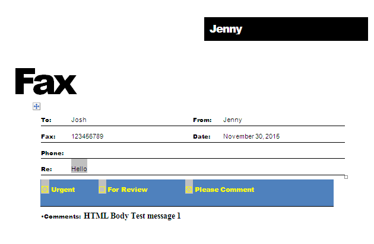

The merge engine takes a document as input, looks for MERGEFIELD fields in it, and replaces them with the data obtained from the data source. Typically, plain text and HTML are inserted, but Aspose.Words users can also generate a document that handles more unusual scenarios for mail merge fields.

Powerful Aspose.Words functionality allows you to extend the mail merge process:

- insert images from any custom storage (files, BLOB fields, etc.)
- insert checkboxes and text input form fields into the document during a mail merge

## Insert Checkboxes and Text Input during Mail Merge

Sometimes it is necessary to perform a mail merge operation so that not text is substituted in the merge field, but a checkbox or text input field. Even though this is not the most common scenario, it is very handy for some tasks.

This screenshot of Microsoft Word shows a template document with the merge fields: 

This screenshot of Microsoft Word shows the generated document. Note some fields were replaced with simple text, some fields were replaced with checkbox form fields and the Subject field was replaced with a text input form field.

Complete source code of a program that inserts checkboxes and text input form fields into a document during a mail merge.





## How to Insert Images from a Database

The **MailMerge.FieldMergingCallback** event occurs during mail merge when an image mail merge field is encountered in the document. An image mail merge field is a merge field named Image:MyFieldName. You can respond to this event to return a file name, stream, or an Image object to the mail merge engine so that it is inserted into the document.

The **MailMerge.FieldMergingCallback** property accepts a class implementing the **IFieldMergingCallback** interface. This class defines the method that is called to handle the merging for the image field. The method handler receives an argument of type **ImageFieldMergingArgs**. There are three properties available **ImageFieldMergingArgs.ImageFileName**, **ImageFieldMergingArgs.ImageStream** and **ImageFieldMergingArgs.Image** to specify where the image must be taken. Set only one of these properties. The below example shows how to insert images stored in a database BLOB field into a report.





## Setting Image Properties during Mail Merge

While merging an image merge field, you may sometimes require controlling various image properties, in particular, **WrapType**. Currently, using **ImageFieldMergingArgs** you can only set image width or height properties, respectively. To overcome this issue, Aspose.Words provides **ImageFieldMergingArgs.Shape** property which facilitates to get full control over the image (or any other shape) being inserted.

The following code example demonstrates how to set various image properties. 






