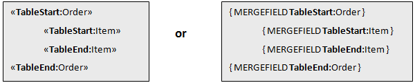
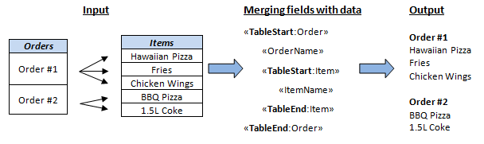
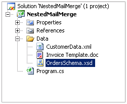
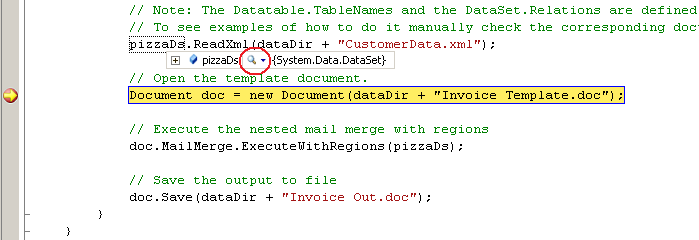
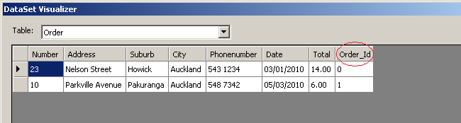
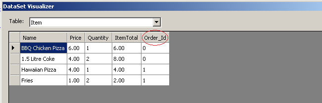

## **How to Use Nested Mail Merge Regions**
Most data in relational databases or XML files is hierarchical (e.g. with parent-child relationships). The most common example is an invoice or an order containing multiple items. Aspose.Words allows nesting mail merge regions inside each other in a document to reflect the way the data is nested and this allows you to easily populate a document with hierarchical data. This article details the steps of how to set up a working nested mail merge application to generate a collection of invoices where each contains multiple items. An example project with complete source code and files can be downloaded. The process and code will be explained step by step and common issues addressed at the end of the article.
### **What are Nested Mail Merge Regions and When Would I use Them?**
Nested mail merge regions are at least two regions in which one is defined entirely inside the other, so they are “nested” in one another. In a document it looks like this:

Just as in standard mail merge each region contains the data from one table. What’s different in nested mail merge is that the **Order** region has the **Item** region nested inside it. This makes the **Order** region the parent and the **Item** region the child. This means that when the data is merged from the data source, the regions will act just like a parent-child relationship where data coming from the **Order** table is linked to the **Item** table. The example below shows the data being passed to the nested merge regions and the output that is generated by the merge.

As you can see, each order from the **Order** table is inserted followed by each item from the **Item** table that is related to that order. Then the next order will be inserted along with their items until all the orders and items are listed.
#### **Step 1 – Create the Template**
This is the same process as creating a standard mail merge document with regions. Remember that with mail merge regions we can have the same field name in different regions so there is no need to change any column names. There are a few things you need to consider when preparing nested mail merge regions and merge regions in general.

- The mail merge region opening and closing tag (e.g. TableStart:Order, TableEnd:Order) **both need to appear in the same row or cell.** For example, if you start a merge region in a cell of a table, you must end the merge region in the same row as the first cell.
- The names of the columns in the **DataTable** **must match** the merge field name. Unless you have specified mapped fields the merge will not be successful for those fields whose names are different.
- The opening and closing table tags **need to be well formed**. This means that the StartTable and EndTable table tags must match. An incorrectly formed region will cause all nested mail merge regions to stop displaying anything at all.

If one of these rules is broken the program may produce unexpected results or an exception may be thrown.
#### **Step 2 – Create the Data Source**
The data to be merged into the template can come from a variety of sources, mainly relational databases or XML documents. In our example we are going to use an XML file to store our data and load it straight into a DataSet using the inbuilt .NET functionality. In our example, XML is used to store the data. There is a schema file found in the Data folder called **OrdersSchema.xsd** to ensure data integrity. Here are the contents of the files:
##### **CustomerData.xml**
You can download xml file of this example from [here](https://github.com/aspose-words/Aspose.Words-for-.NET/blob/master/Examples/Data/Mail-Merge/CustomerData.xml).

**XML**


<?xml version="1.0" encoding="utf-8" ?>
<Orders>
 <Order>
 <Number>23</Number>
 <Address>Nelson Street</Address>
 <Suburb>Howick</Suburb>
 <City>Auckland</City>
 <Phonenumber>543 1234</Phonenumber>
 <Date>03/01/2010</Date>
 <Total>14.00</Total>
  <Item>
  <Name>BBQ Chicken Pizza</Name>
  <Price>6.00</Price>
  <Quantity>1</Quantity>
  <ItemTotal>6.00</ItemTotal>
  </Item>
  <Item>
  <Name>1.5 Litre Coke</Name>
  <Price>4.00</Price>
  <Quantity>2</Quantity>
  <ItemTotal>8.00</ItemTotal>
  </Item>
 </Order>
...
</Orders>

##### **PizzaSchema.xsd**
**XML**


<?xml version="1.0" encoding ="utf-8"?>
<xs:schema id="OrdersSchema"  xmlns:xs="http://www.w3.org/2001/XMLSchema">
 <xs:element name="Orders">
 <xs:complexType>
 <xs:sequence>
  <xs:element name="Order">
  <xs:complexType>
  <xs:sequence>
  <xs:element name="Number"/>
  <xs:element name="Address"/>
  <xs:element name="Suburb"/>
  <xs:element name="City"/>
  <xs:element name="Phonenumber">
  <xs:element name="Date"/>
  <xs:element name="Total"/>
  <xs:element name="Item">
   <xs:complexType>
   <xs:sequence>
   <xs:element name="Name"/>
   <xs:element name="Price"/>
   <xs:element name="Quantity"/>
   <xs:element name="ItemTotal"/>
   </xs:sequence>
  </xs:complexType>
  </xs:element>
  </xs:sequence>
  </xs:complexType>
 </xs:element>
 </xs:sequence>
 </xs:complexType>
 </xs:element>
</xs:schema>


These files should be included in our project folder:

#### **Step 3 – Ensure Correct Table Names and Relationships Exist Between Tables**
For Aspose.Words to perform nested mail merge correctly, the following requirements must be met:

1. The names of the mail merge regions in the document must match the **names of the DataTables** populated from the data source.
1. The nesting order of mail merge regions in the document must match the **data relationships between the tables** in the data source.

Aspose.Words uses the data relationships defined in the **DataSet** to navigate to the correct data and process the nested mail merge regions, so having them set up is crucial to the merge working correctly. In our example, we simply let .NET automatically load the data into tables and create the relationship for us through the nested structure of XML. When the **DataSet** object loads XML it either uses a provided schema or infers one from the structure of the XML itself to achieve this. From this structure it creates relationships between the tables where needed. For more information about creating or inferring schemas using XML see the MSDN article [here](http://msdn.microsoft.com/en-us/library/3b4194wc\(VS.71\).aspx). Let’s take a look at the data loaded into our project. We can view the contents of the loaded data by using the Dataset Visualizer in the Visual Studio environment. To access the Visualizer:

1. Set a break point somewhere in the code.
1. Run the program in debug mode.
1. Hover the mouse over the DataSet and click on the magnifying glass icon.

This will open up the contents of the DataSet in a window as shown below.

We can see that an extra column **Order_Id,** was added automatically to both tables. This is the primary key for the **Order** table and the foreign key of the **Item** table. These columns are the basis for the relationship.
#### **Step 4 – Prepare the Code**
The code for setting up nested mail merge is simple to implement with Aspose.Words. Remember when setting up your project:

- To include the reference to Aspose.Words.
- Load each table from the data source into appropriate tables.
- Load the data into a DataSet object.

We create a [Document](http://www.aspose.com/api/net/words/aspose.words/document) object which loads our invoice template. Then Aspose.Words merges the data from our **DataSet** and fills the document with data. Then we save the results into a document in the desired format. Here is the complete code for our project: Below example shows how to generate an invoice using nested mail merge regions. You can download the template file of this example from [here](https://github.com/aspose-words/Aspose.Words-for-.NET/blob/master/Examples/Data/Mail-Merge/Invoice%20Template.doc).


### **Common Issues When Developing using Nested Mail Merge**
**Q:** When using nested mail merge, the generated output has no fields that are merged; instead the original name of the merge field just stays the same?
**A:** Check the data is being loaded properly into tables. The tables should have their TableName property set, a primary key and a relationship defined.

Additionally check that the merge fields are named properly. To do this press Alt+ F9 in Microsoft Word and make sure the name in the merge fields matches the columns in the tables. Try to use the following code in your project to ensure merge fields are being loaded in correctly. It gathers an array of strings that contain the names of the merge fields that are loaded into the document.

Below example shows how to get names of all merge fields in a document.



**Q:** The output of nested merging displays no data from the child table for the first entry in the parent table but displays all items for the last entry in the parent table, even ones that are not actually linked to it?

` `**A:** This happens when the merge regions in the template document are not correctly formed. Check step 1 of this documentation for information on the structure nested merge regions.

` `**Q:** Each entry from the parent table displays every item in the child table, even ones that are not actually linked to it?

**A:** This happens when the relationship between the parent and child tables are set up incorrectly or not at all. Check step 2 for information on how to setup a **DataRelation**.
**Q:** When executing nested mail merge an exception is thrown: “System.ArgumentException: This constraint cannot be enabled as not all values have corresponding parent values”?

**A:** By default, when a **DataRelation** is created between two tables there are foreign key constraints enforced on the relationship by the .NET Framework. This means that every row in the parent table should have a one-to-one relationship with the rows of the child table based off the primary and foreign keys. That is, every parent record requires a child record. If your data source does not match these criteria then this exception can occur when mail merge is executed.

However, these types of data sources are expected sometimes and it is critical that mail merge can still be executed in this situation. To solve this issue when working with such data sources, foreign key constraints must be disabled. This can be achieved by using one of the overloads of the **DataRelation** constructor which accepts an extra parameter of type boolean. This parameter, when specified as false will disable these constraints and allow these data sources to be successfully used when merging.

Below example shows how to disable foreign key constraints when creating a DataRelation for use in nested mail merge.


