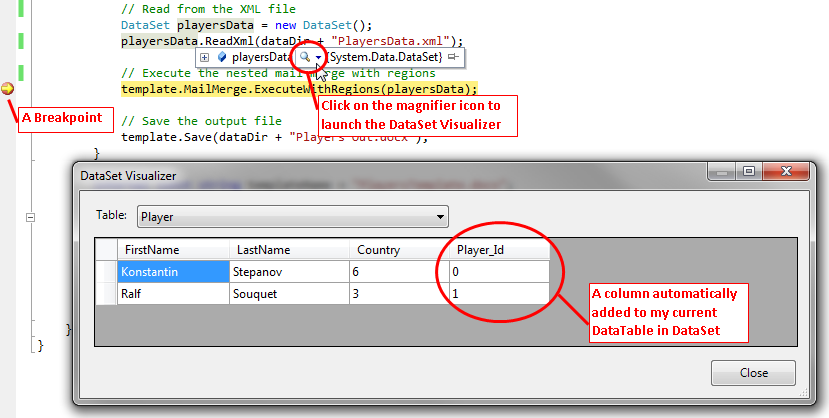

## **How to Set up Relations for use in Nested Mail Merge with Regions**
When using executing mail merge with nested regions there must be relationships present between parent and child data in order for the process to work correctly. Skipping this important step is one of the most common causes of nested mail merge to fail. Even though setting up relations between data tables related is a requirement when using mail merge with regions, there are some cases in which relations could be set automatically for you. This depends on the data source being used. This article explains perform nested mail merge by providing detailed instructions on how to set up relations for each particular type of data source.
### **Explicitly Creating Relations between DataTables in a DataSet**
The basic procedure for adding relationships when using a DataSet containing multiple DataTable objects are outlined well in the following MSDN article found [here](http://msdn.microsoft.com/en-us/library/ms171897\(v=VS.71\).aspx). The code snippet below demonstrates how to create relationship between the two data tables “Order” and “Item” within the DataSet called “dataSource”. Below example shows how to create a simple DataRelation for use in nested mail merge.



{} 

Code just shown above doesn’t work when one or both columns contain values which don’t have pairs in another table. You might discover that you get an exception “System.ArgumentException: This constraint cannot be enabled as not all values have corresponding parent values”.

{} 

This occurs because by default the .NET Framework only allows one-to-one type of relationship between data in DataTable objects. To enable such a data configuration you need to disable data constraints. Below example shows how to disable foreign key constraints when creating a DataRelation for use in nested mail merge.


### **Automatic Relations Created when using DataSet.ReadXml Method**
When retrieving data for nested mail merge from the XML file using the ReadXml method you will see relationships are created automatically according to the structure of the XML document. The DataSet populated by this method may come ready to use for many (or even most) tasks and nothing extra needs to be done. However you need to make sure that correct relations have been created. If mail merge is not working as expected then you may need to restructure your XML file or explicitly create relations between DataTable objects in the DataSet. In both cases of using implicit or explicit data relation in your project you can check the data as well as the data relations currently defined by using the DataSet Visualizer in the Visual Studio environment. 

### **Creating Relations between IMailMergeDataSource Objects**
Implementation of the [IMailMergeDataSource](http://www.aspose.com/api/net/words/aspose.words.mailmerging/imailmergedatasource) interface provides you an easy use your business objects as a data source for nested mail merge. You can also use nested mail merge with these objects as well. This is achieved by implementing the [IMailMergeDataSource.GetChildDataSource](http://www.aspose.com/api/net/words/aspose.words.mailmerging/imailmergedatasource/methods/getchilddatasource) method. The details of how to fully implement this interface into your project can be found in the API documentation for the IMailMergeDataSource interface. According to the focus of this article, we are only going to concentrate on the implementation of relationships between these types of objects and not any further implementation.

The code example below shows how to use [IMailMergeDataSource.GetChildDataSource](http://www.aspose.com/api/net/words/aspose.words.mailmerging/imailmergedatasource/methods/getchilddatasource) to provide relationships between parent and child data. This method is called by mail the mail merge engine whenever a nested region is encountered in the current parent region. This method is invoked in the parent IMailMergeDataSource which is handling the region so it can return the appropriate child data for the current parent record. Below example shows how to get a child collection of objects by using the GetChildDataSource method in the parent class.



The IMailMergeDataSource.GetChildDataSource method returns the child data related on the particular parent index. You are expected to return the correct child data from your custom objects based on the given table name and current position of the parent data. In this case this achieved by retrieving the order collection based on the current customer index. If this class is used in mail merge without nested regions or in simple mail merge, this method should simply return null.

Also note that the parent region might have one or more related child sets. These are differentiated using the supplied table name parameter. Each child data source should be derived from the IMailMergeDataSource interface as well.
