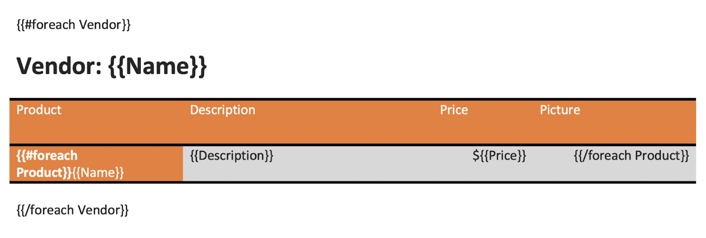
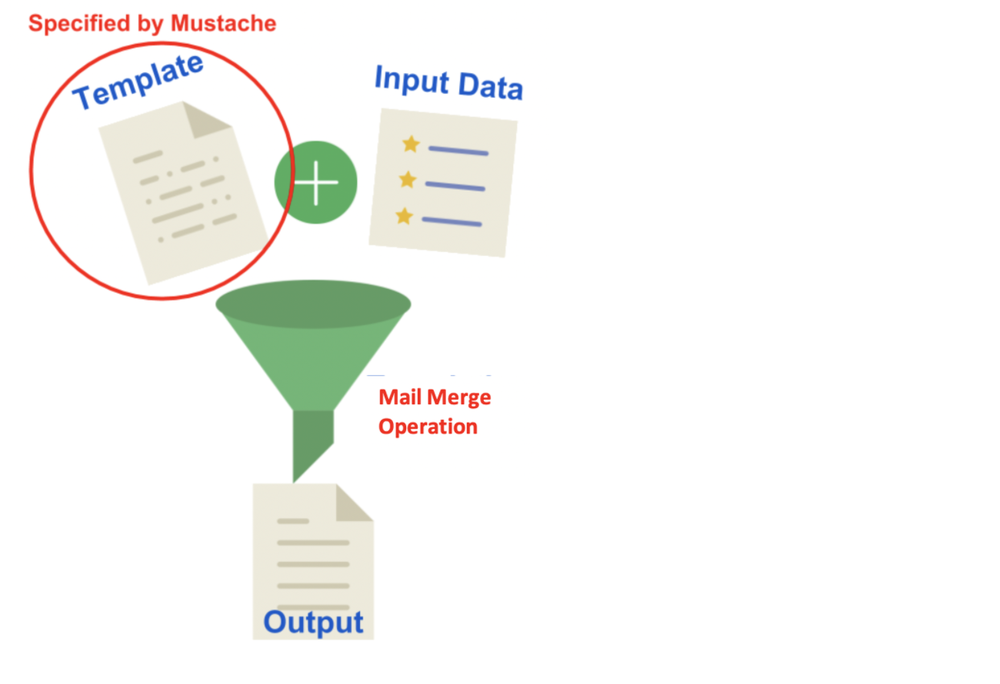
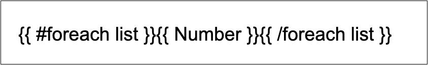
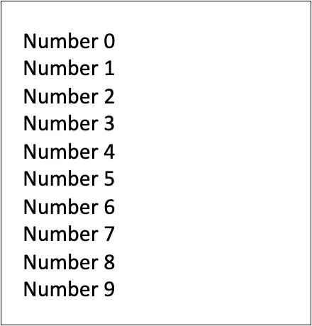
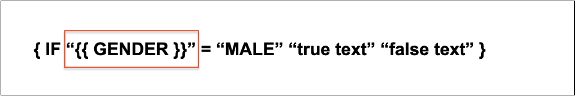
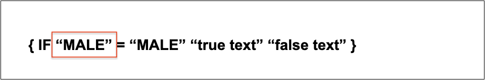

Aspose.Words allows you to create templates with mustache syntax in addition to the familiar templates. A Mustache is an alternative variant of template syntax that consists of tag names enclosed by   and is backed by a model object that contains the data for the template.

The Mustache syntax is the only option to use with templates that do not contain fields, such as HTML and TXT templates. With Word templates, you have two options either to use fields or Mustache syntax.

The Mustache syntax supports *foreach* tag, which is an alternative for using mail merge with regions. So the benefit is that you can use mustache syntax if for some reason you are not able or simply you do not want to use merge fields and merge regions.

You can also combine mail merge fields with some additional fields using the *foreach* tag as shown in the picture below.

## Create a Mustache Template

The first important point to clarify is that Mustache is not a templating engine. Mustache is another syntax variant which is available for any template in a [load format](https://reference.aspose.com/words/net/aspose.words/loadformat/) supported by Aspose.Words. Therefore, you can create such a template both programmatically and through an interface, you just need to include certain syntax and comply with the Mustache specification.

Let's suppose that you need to send the same email to 50 recipients to personalize the greeting with their corresponding first names. You could replace the recipient's first name by some placeholder as the following:

> Dear {{FirstName}}
>
> I hereby...

The question here: how you can create 50 emails from 1 single Mustache template? To answer that, you need to perform a mail merge with regions to fill the curly braces for placeholders in the template with actual data and generate an output document.

{}

As you notice from the example above, in Mustache you need to use curly braces for placeholders that look like a mustache when you rotate the curly braces 90 degrees clockwise.

{}

## Work with Mustache Syntax

Mustache is represented as a logic-less order as it lacks any specific control flow statements such as *for* loops and *if* and *else* conditions. But you can use the section tags processing lists and lambdas to achieve conditional evaluation and looping. So to include the Mustache syntax within the mail merge operation, you will need to use the [UseNonMergeFields](https://reference.aspose.com/words/net/aspose.words.mailmerging/mailmerge/usenonmergefields/) property and set its value to *True*.

The following code example shows how to replace the Mustache tags with specific data:



You can notice the difference between the document before executing the mail merge with regions along with applying the **UseNonMergeFields** property:

{}

A section begins with a pound and ends with a slash. That is, {{#foreach list}} begins a "foreach" section while {{/foreach list}} ends it.

{}

And after applying the mail merge with regions:

## Use IF Fields to Make a Mail Merge Intelligent

Aspose.Words allows you to use mail merge fields and Mustache tags with the IF statement. The `IF` fields can be used in any mail merge document to suppress undesired spaces and commas if a field is blank.

The `IF` field formula is shown below:

**{ IF [Condition] [Display Result 1] [Display Result 2] }**

Here, the Condition can be either a merge field or a Mustache tag.

For example, you can use `IF` fields if you need to insert “his”, “her”, “he” or “she” depending on the gender as the following:

**{ IF { MERGEFIELD Gender } = “MALE” “true text” “false text” }**

**{ IF “{{ GENDER }}” = “MALE” “true text” “false text” }**

The following code example shows how to perform a mail merge operation with Mustache tags and `IF` fields:



You can notice the difference between the document before applying the **UseNonMergeFields** property:

And after applying the **UseNonMergeFields** property:

