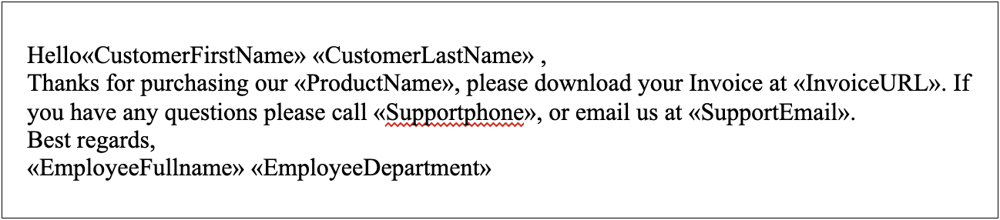

It is common to use a merge template as the base document for a mail merge operation either if it is a simple mail merge or mail merge with regions. Mail merge with regions is more powerful and popular than the simple mail merge. Simple mail merge is considered as a particular case of mail merge with regions where the region is the entire document. All is explained in the next article “Types of Mail Merge Operation” in more detail.

The template ensures that the text in the output merged document is formatted correctly, and the mail merge operation guarantees that the text from the data source is correctly entered into the merge template.

Aspose.Words provides the ability to create a mail merge template to define fixed content and then generate merge documents using the merge fields. Thus, the merge template will have the necessary text, which is the same in all of the output documents, and the merge fields to fill in the changing content. As a result, information from the specified data source will be added to the merge template through these fields during the generation of the merged document.

## What is a Mail Merge Template

A mail merge template is a personalized document that contains the fixed data and the merged fields where you want the variable text to be. A merge template can be in any format that supports fields, for example, DOC, DOCX, DOT, DOTX, RTF. In addition, you can also use the mustache template that is explained in the article “Mustache Template Syntax” in more detail.

You can create a merge template to be a model for new documents, and it should include the main text that needs to be the same for each version of the merged document. Adding merge fields inside the template will represent the personalization data such as names or addresses that are fetched from a data source. A mail merge operation will automatically insert the personalization data from your data source to your merge template document.

In addition, you can add a mail merge region in your template by inserting two mail merge fields to mark the beginning and the end of the mail region. The next article “Types of Mail Merge Operation” explains that in more detail.

## Create a Mail Merge Template

You can create a template and add specific merge fields to it, that will be replaced by the values from the data source either manually, for example, using Microsoft Word, or programmatically using Aspose.Words. In this article, we will look at the programmatic way of creating a template.

Use the [DocumentBuilder](https://apireference.aspose.com/words/net/aspose.words/documentbuilder) class to create the required merge template using Aspose.Words. You can include a text, a merge field, and a line break in such a template using the [InsertTextInput](https://apireference.aspose.com/words/net/aspose.words/documentbuilder/methods/inserttextinput), [InsetField](https://apireference.aspose.com/words/net/aspose.words.documentbuilder/insertfield/methods/1), and [InsertParagraph](https://apireference.aspose.com/words/net/aspose.words/documentbuilder/methods/insertparagraph) methods.

The following code example shows how to create a mail merge template:



The picture below shows the created template:

## Customize a Mail Merge Template Properties

Aspose.Words allows you to customize your template through many properties. Template customization will be described below through an example of customizing some properties of images and text.

### Customize Image Properties

You can specify the image properties using the [ImageFieldMergingArgs](https://apireference.aspose.com/words/net/aspose.words.mailmerging/imagefieldmergingargs) class. Note that you can insert an image from a database as it is described in [Aspose.Words GitHub](https://github.com/aspose-words/Aspose.Words-for-.NET/blob/master/Examples/DocsExamples/DocsExamples/Mail%20Merge%20and%20Reporting/Working%20with%20Fields.cs#L214).

The following code example shows how to specify the image file name and image size:



### Customize Text Properties

You can use the [Text](https://apireference.aspose.com/words/net/aspose.words.mailmerging/fieldmergingargs/properties/text) property to insert text into the document for the current merge field. Also, you can change the formatting of texts and paragraphs inside your template using [Font](https://apireference.aspose.com/words/net/aspose.words/font) and [ParagraphFormat](https://apireference.aspose.com/words/net/aspose.words/paragraphformat) classes. You can handle the text to be inserted before or after the merge field by using the [TextBefore](https://apireference.aspose.com/words/net/aspose.words.fields/fieldmergefield/properties/textbefore) and [TextAfter](https://apireference.aspose.com/words/net/aspose.words.fields/fieldmergefield/properties/textafter) properties that are included in the [FieldMergeField](https://apireference.aspose.com/words/net/aspose.words.fields/fieldmergefield) class.

The following code example shows how to insert Check Boxes or HTML during mail merge operation:



{}

You can download the sample file of this example from [Aspose.Words GitHub](https://github.com/aspose-words/Aspose.Words-for-.NET/blob/master/Examples/Data/Mail%20merge%20destinations%20-%20Fax.docx).

You can also check the implementation of the HandleMergeField class from [Aspose.Words GitHub](https://github.com/aspose-words/Aspose.Words-for-.NET/blob/828b58e207e96afa624956867ec9c777fa10af87/Examples/DocsExamples/DocsExamples/Mail%20Merge%20and%20Reporting/Working%20with%20Fields.cs#L43).

{}

## See Also

* For more details about how to create templates in Microsoft Word manually, please check the [“Create a Template”](https://support.microsoft.com/en-us/office/save-a-word-document-as-a-template-cb17846d-ecec-49d4-82ea-a6f5e3e8b9ae) article in the Microsoft Documentation
