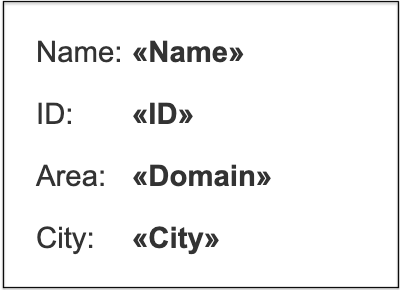

---
title: Mail Merge with XML Data Source
type: docs
description: "Aspose.Words for .NET enables you to use a variety of data sources when performing a mail merge operation, including an XML file. The main advantage of using XML is the ability to define a hierarchy directly in the document."
keywords: "mail merge xml data source c#"
weight: 30
url: /net/mail-merge-with-xml-data-source/
---

You can use a variety of data sources when performing a mail merge operation, including an XML file. The main advantage of using XML is the ability to define a hierarchy right in the document and then simply pass it to Aspose.Words.

This article will describe how to read data from an XML file rather than directly from a database and include XML as the data source to perform a mail merge operation.

## Advantages of XML As a Data Source

XML data sources are very handy for storing data without the overhead of a database. They are great for offline applications where users need to add, edit, and delete data when they cannot connect to a database.

XML data can be a good data source alternative to relational databases, especially if you work with web applications. Most web services use XML to exchange information. XML-oriented databases are actively used on the current market, and developers of relational databases are adding XML compatibility to their products to have a database return XML.

Since XML stores data in plain text format, the storage is platform-independent. Thus, data can be easily exported, imported, or simply moved. XML is popular as a data source because it offers a way to preserve the semantic meaning of data when communicating between different applications.

## Filling a Merge Template with Data from XML using DataSet

XML is the universal standard for data interchange, and Microsoft Word document formats are the most popular formats for mail merge templates. Therefore, the ability to run a mail merge from an XML file to a Word template document has become a common requirement.

Microsoft Word does not provide a direct method to work with XML data as a data source for a mail merge operation, while Aspose.Words allows you to perform a mail merge operation with data from an XML data source. Note that the structure of the XML document can also be varied and the data will still be read correctly. This enables different types of XML documents to be merged easily.

Use the ReadXML method to read the XML schema and data into the DataSet object. This object is then used as a data source for a mail merge.

{}

You can use the same templates for different data sources.

{}

The following XML contains the data that is needed to fill in a merge template:


<?xml version="1.0" encoding="utf-8"?>
<customers>
	 <customer Name="John Ben Jan" ID="1" Domain="History" City="Boston"/>
 	<customer Name="Lisa Lane" ID="2" Domain="Chemistry" City="LA"/>
	 <customer Name="Dagomir Zits" ID="3" Domain="Heraldry" City="Milwaukee"/>
 	<customer Name="Sara Careira Santy" ID="4" Domain="IT" City="Miami"/>
</customers> 


The following code example shows how to load XML data into DataSet and then use it as a data source:



{}

You can download the sample file of this example from [Aspose.Words GitHub](https://github.com/aspose-words/Aspose.Words-for-.NET/blob/master/Examples/Data/Mail%20merge%20data%20-%20Customers.xml).

{}

You can notice the difference between the template before executing the mail merge operation:

And after executing the mail merge operation:

