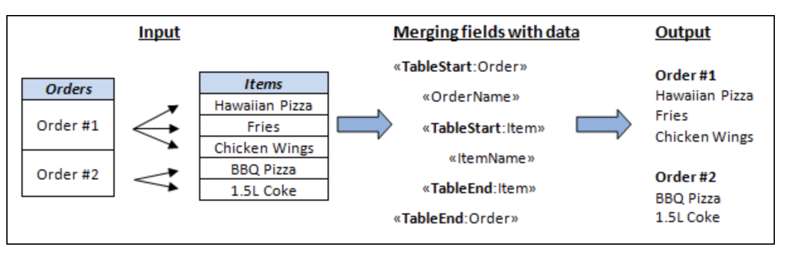

In some scenarios, you may need to use nested mail merge with regions. Nested merge is a feature that enables you to merge hierarchical data from your data source into your merge template to easily populate your document. Basically, the hierarchical data is represented as a set of data items, and hierarchical relationships describe how the data items are related to each other (one item of data is the parent of another one).

Aspose.Words allows you to perform a mail merge operation with nested regions. You can use this feature if you have a data source that is organized into a tree-like structure and you want to execute a mail merge operation to populate a template with hierarchical data.

{}

Nested mail merge is relevant only when performing a mail merge with regions.

{}

## What is a Nested Mail Merge

The mail merge region is called nested if you have two or more mail merge regions where one of them is inside the other in a hierarchical form. Note that each region contains data from one table.

The most common example of a nested mail merge is an order that contains multiple items where you need to link multiple data tables and present the information in a template.

The picture below shows two nested regions where the *Order* mail merge region is the parent of the *Item* mail merge region.

## How to Process Mail Merge with Nested Regions

The data to be merged into a template can come from various sources, mainly relational databases or XML documents. In our example, we are going to use an XML file to store our data and load it directly into the **DataSet**.

Aspose.Words allows you to process mail merge with nested regions using the data relationships specified in the **DataSet**. When the **DataSet** object loads XML, it either uses the provided schema or infers it from the structure of the XML itself to accomplish this. From this structure, it creates relationships between tables where necessary.

The image below shows how the data from the *Order* table passed to the nested merge regions will be linked to the *Item* table, as well as the output generated during the merge operation.

As you can see from the output document, each order from the **Order** table is inserted into the merge template with all order’s related items from the **Item** table. The next order will be inserted along with their items until all the orders and items are listed. The order of nesting mail merge with regions in the template must match the data relationships between the tables in the data source.

The following code example shows how to generate an invoice using nested mail merge with regions:



{}

You can download the sample file of this example from [Aspose.Words GitHub](https://github.com/aspose-words/Aspose.Words-for-.NET/blob/master/Examples/Data/Mail%20merge%20data%20-%20Orders.xml).

You can check the implementation of setting up the data relations manually from [Aspose.Words Github](https://github.com/aspose-words/Aspose.Words-for-.NET/blob/master/Examples/DocsExamples/DocsExamples/Mail%20Merge%20and%20Reporting/Complex%20examples%20and%20helpers/Nested%20MailMerge%20custom.cs).

{}

## How to Set Up Data Relations in Nested Mail Merge with Regions

You need to set up all data relationships in the parent-child structure to execute the nested mail merge with regions correctly. Skipping this important step can lead to a failure in executing the nested mail merge with regions.

When retrieving data for a nested mail merge from an XML file using the **ReadXml** method, relationships are automatically created according to the structure of the XML document. However, you need to make sure that correct relations have been created.

If mail merge is not working as expected, then you may need to restructure your XML file or explicitly create relations between DataTable objects in the DataSet.

A DataSet that has related data tables will use the **DataRelation** object to represent the parent-child relationship between the tables.

The following code example shows how to establish a DataRelation between a customer’s table and an order’s table by using a DataRelation object:



## How to Create Data Relations from a Custom Data Source

Implement the [IMailMergeDataSource](https://apireference.aspose.com/words/net/aspose.words.mailmerging/imailmergedatasource) interface to create relationships in the parent-child structure of your custom data source. Use the [GetChildDataSource](https://apireference.aspose.com/words/net/aspose.words.mailmerging/imailmergedatasource/methods/getchilddatasource) method to return the relevant child data of a current parent record.

The following example shows how to create data relations using **GetChildDataSource**:

**.NET**

public IMailMergeDataSourceCore GetChildDataSource(string childTableName, bool isObjectAttr)
        {
            DataRow parentRow = GetCurrentDataRow();
            DataTable parentTable = parentRow.Table;

​        	DataSet dataSet = parentTable.DataSet;
​       	 if (dataSet == null)
​            	return null;

​            DataRelation childRelation = FindRelation(dataSet, parentTable.TableName, childTableName);
​            if (childRelation != null)
​            {
​                // Normally expected, found a relation to the child table, return a data source for it.
​                return new MailMergeDataSourceDataRelation(mMailMerge, parentRow, childRelation);
​            }

​        	if (!isObjectAttr)
​        	{
​            	DataTable newTable = dataSet.Tables[childTableName];
​            	if (newTable != null)
​            	{
​                	// No relation, but such a table exists in the dataset. It means an unrelated table.
​                	// Return all rows of the table as per the interface specification.
​                	return new MailMergeDataSourceDataTable(mMailMerge, newTable);
​           	 }
​        	}

​        	// No relation and no table, means mismatch between the template document and the data set structure.
​        	// Return null as per the interface specification.
​       	return null;
   	 }

