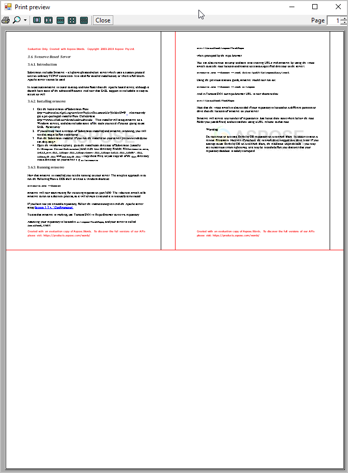

This article describes how to print a word processing document from an ASP.NET or Windows Service application using Aspose.Words and the XpsPrint API. It also shows the methods of printing a document with Settings, Print preview, and Print progress dialogs, and explains how to reduce the time of the first call to print a document.

## Printing a Document on a Server via the XpsPrint API

This section is intended for users who want to submit an XPS document to the unmanaged XpsPrint API from a .NET application using Aspose.Words.

### Limitations of printing a document in the ASP.NET or Windows Service applications

When developing a .NET application that produces some printed output, you can typically use classes provided in the *System.Drawing.Printing* namespace, or Windows Presentation Foundation (WPF) classes. However, if the application is an ASP.NET or Windows Service application, the options for printing are limited, because Microsoft discourages using this approach. The .NET Framework Printing classes are not supported by services application. This includes ASP pages, which generally run in the context of the server service.

The classes within the *System.Drawing.Printing* namespace are not supported for use within a Windows service or an ASP.NET application or service, and attempting their use may produce decreased service performance, run-time exceptions, and other issues. The use of WPF to build Windows services is likewise not supported. Since WPF is a presentation technology, the Windows service requires appropriate permissions to perform visual operations involving user interaction. If the Windows service does not have such permissions, there may be unexpected results.

The Aspose.Words [Document](http://www.aspose.com/api/net/words/aspose.words/document) object provides a family of [Print](https://apireference.aspose.com/net/words/aspose.words/document/methods/print/index) methods to print documents. These methods use the .NET printing classes defined in the *System.Drawing.Printing* namespace. There are numerous Aspose.Words customers who successfully utilize them for printing in their server-side applications. Nevertheless, this article shows an alternative method for printing that is compliant with Microsoft’s recommendations.

### Methods to Print a Document on a Server

The proper way to print documents according to Microsoft is by using the unmanaged XpsPrint API. This API is available on Windows 7, Windows Server 2008 R2, and on Windows Vista provided the Platform Update for Windows Vista is installed.

Since Aspose.Words can easily convert any document to XPS, you only need to write the code that passes an XPS document to the XpsPrint API. The only problem is that the XpsPrint API is unmanaged and requires some knowledge of the Platform Invoke technology.

To print a document, Aspose.Words provides an **XpsPrintHelper** class contains a simple Print method, where you just need to specify the following parameters (see more details in the article ["Print Document via XPS API"](/words/net/missing-features-in-openxml/)):

- Document you want to print.
- Printer name.
- Job name (optional).
- Boolean value, specifying whether the program should wait until the print job is completed. Therefore, the system will either check whether the document was printed successfully or return immediately after sending the print job. In the last case, it is impossible to identify whether the print job was successful.

Upon encountering any problems submitting or printing the document, the method will throw an exception.

The code example below demonstrates how to print a document using the **XpsPrintHelper** class:



When you run the project, it prints a sample document on the specified printer and opens a console window to display print results. When the print job completes or errors out, the system will display a success message or text of the thrown exception.

You can also set some print settings using the [PageSetup](https://apireference.aspose.com/net/words/aspose.words/pagesetup) class. For example, in Microsoft Word, printer trays are defined for each section and are printer-specific. Therefore, you can programmatically change these values for each section via the [FirstPageTray](http://www.aspose.com/api/net/words/aspose.words/pagesetup/properties/firstpagetray) and [OtherPagesTray](http://www.aspose.com/api/net/words/aspose.words/pagesetup/properties/otherpagestray) properties.

{} 

In some cases, you may need to use this sample without Aspose.Words. For example, when you already have an XPS document and just want to print it from an ASP.NET or Windows Service application. Then, you can just delete the Print method.

{} 

There are two overloads of the **XpsPrintHelper**.**Print** method. The first overload takes a [Document](https://apireference.aspose.com/net/words/aspose.words/document) object and saves it into a MemoryStream in the XPS format. The second overload accepts a Stream object. The stream must contain a document in the XPS format.

You can download the examples of method overloading from [Aspose.Words GitHub](https://github.com/aspose-words/Aspose.Words-for-.NET/releases/download/MissingFeaturesofOpenXMLWordsv1.1/Print.Document.via.XPS.API.zip).

You can download the sample file of this example from [Aspose.Words GitHub](https://github.com/aspose-words/Aspose.Words-for-.NET/blob/master/Examples/Data/Rendering.docx).

## Printing a Document with Settings and Print Preview Dialogs

When working with documents, it is often required to print them to a selected printer. It is helpful to utilize a print preview dialog to visually inspect how the printed document will appear and choose relevant print options.

The Aspose.Words has no built-in dialogs or forms but implements the [AsposeWordsPrintDocument](http://www.aspose.com/api/net/words/aspose.words.rendering/asposewordsprintdocument) class, based on the .NET **PrintDocument** class. An instance of this class can be passed to the **PrintPreviewDialog** form to preview and print the document. Also, the [PrintPreviewDialog](https://docs.microsoft.com/en-us/dotnet/api/system.windows.forms.printpreviewdialog?view=netframework-4.8) class defines the output to transmit to a printer.

The following example demonstrates how to use these classes to print a document from Aspose.Words via the Print preview and Settings dialogs:





{} 

The **AllowSomePages** property enables you to select a range of pages for printing if the value of this property is True. By default, all pages in the range are selected for printing.

{} 

To optimize the appearance of Print Preview dialog settings, specify properties of the **PrintPreviewDialog** class.

## Printing Multiple Pages on One Sheet

It is always beneficial to have more flexibility when printing documents. Using .NET and Aspose.Words you can easily fine-tune the printing operation to implement your custom logic by defining the way the document will appear on the printed page.

As in the previous section, Aspose.Words implements the **MultipagePrintDocument** class, which is based on the .NET **PrintDocument** class. This means that the existing .NET printing infrastructure can be used in such a way that the print and print preview dialogs would enable visualizing of the document before printing. The **MultipagePrintDocument** class provides the ability to print many pages on one sheet of paper.

{} You can download an example of using the **MultipagePrintDocument** class from [Aspose.Words GitHub](https://github.com/aspose-words/Aspose.Words-for-.NET/releases/tag/MultipagePrintDocumentExample). {} 

The result of this code example is shown below:

## Hiding the Print Progress Dialog When Printing a Document

The Printing Progress Dialog does not appear when printing a document via the [Print](https://apireference.aspose.com/net/words/aspose.words/document/methods/print) method. However, this dialog appears during printing with another [Print](https://apireference.aspose.com/net/words/aspose.words.rendering/asposewordsprintdocument) method. In this case, to prevent the Printing dialog from appearing, you should specify valid printer settings and a standard print controller in this method, as shown in the example below:



You can download the sample file of this example from [Aspose.Words GitHub](https://github.com/aspose-words/Aspose.Words-for-.NET/blob/master/Examples/Data/Rendering.docx).

## How to Reduce the Time of the First Call to Print a Document

Aspose.Words reads and caches some fields of **PrinterSettings** to reduce printing time. You can achieve this by calling the [CachePrinterSettings](https://apireference.aspose.com/net/words/aspose.words.rendering/asposewordsprintdocument/methods/cacheprintersettings) method. This method is called before the printing starts if it was not executed previously. Note that the total time of printing with and without calling of this method is almost the same. The purpose of using this method is to reduce the time of the first call of the [Print](https://apireference.aspose.com/net/words/aspose.words/document/methods/print) method. The following code example shows how to use this method:



## See Also

- [Platform Update for Windows Vista](http://msdn.microsoft.com/en-us/library/ee663866\(v=vs.85\).aspx)
