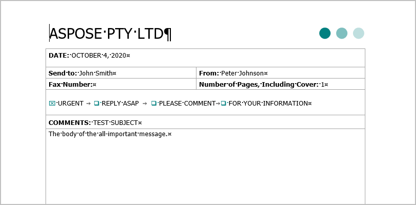
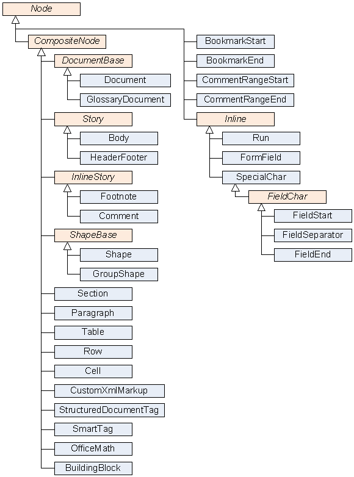

[MG: Некоторые диаграммы в статье довольно плохо читаются из-за разрешения или выбранных шрифтов. Предложить варианты улучшения. Если обновлять диаграммы (а скорее всего, нужно это сделать), согласовать инструмент и нотацию.

` `Разобраться с сокращением Aspose.Words Document Object Model (DOM).]

The Aspose.Words Document Object Model (DOM) is an in-memory representation of a Word document. The Aspose.Words DOM allows you to programmatically read, manipulate, and modify the content and formatting of a Word document.

This section describes the main classes of the Aspose.Words Document Object Model and their relationships. By using the AsposeWords Document Object Model classes, you can obtain the programmatic access to document elements and formatting.
## **Creating a Document Objects Tree**
When a document is read into the Aspose.Words DOM, a tree of objects is built, and different types of elements of the source document have their own DOM tree objects with various properties.

The following sample shows a Microsoft Word document with different types of content.

When reading the above document into the Aspose.Words DOM, the tree of objects is created, as shown in the schema below.

[Обновить элементы в соответствии с документом выше.]

[Document](http://www.aspose.com/api/net/words/aspose.words/document), [Section](http://www.aspose.com/api/net/words/aspose.words/section), [Paragraph](http://www.aspose.com/api/net/words/aspose.words/paragraph), [Table](http://www.aspose.com/api/net/words/aspose.words.tables/table), [Shape](http://www.aspose.com/api/net/words/aspose.words.drawing/shape), [Run](http://www.aspose.com/api/net/words/aspose.words/run), and all other ellipses on the diagram are the Aspose.Words objects that represent elements of the Word document.

The document tree in Aspose.Words follows the Composite Design Pattern: 

- All node classes ultimately derive from the [Node](https://apireference.aspose.com/net/words/aspose.words/node) class, which is the base class in the Aspose.Words Document Object Model.
- Nodes that can contain other nodes, for example, **Section** or **Paragraph**, derive from the [CompositeNode](https://apireference.aspose.com/net/words/aspose.words/compositenode) class, which in turn derives from **Node**.
### **Building of Document Nodes and Their Classes**
When Aspose.Words reads a Word document into memory, it creates objects of different types that represent various document elements. Every run of a text, paragraph, table, or a section is a node, and even the document itself is a node. Aspose.Words defines a class for every document node type.

The diagram provided below shows inheritance between node classes of the Aspose.Words Document Object Model (DOM). The names of abstract classes are in italics.

[Обновить диаграмму из-за шрифтов – курсив плохо читается.]

{} 

The Aspose.Words DOM also contains the non-node classes, such as [Style](https://apireference.aspose.com/net/words/aspose.words/style), [PageSetup](https://apireference.aspose.com/net/words/aspose.words/pagesetup), and [Font](https://apireference.aspose.com/net/words/aspose.words/font), which are used for setting up object attributes. [Пожалуйста, проверьте.]. These classes are not shown in this diagram as not inherited from the Node class [Пожалуйста, проверьте.].

{} 
### **Getting a Node Type**
[Check this section.]

Although the [Node](https://apireference.aspose.com/net/words/aspose.words/node) class is sufficient enough to distinguish different nodes from each other, Aspose.Words provides the [NodeType](https://apireference.aspose.com/net/words/aspose.words/nodetype) enumeration to simplify some API tasks, such as selecting nodes of a specific type. The type of each node can be obtained using the [NodeType](https://apireference.aspose.com/net/words/aspose.words/node/properties/nodetype) property. This property returns a **NodeType** enumeration value. For example, a paragraph node represented by the **Paragraph** class returns **NodeType**.**Paragraph**, a table node represented by the **Table** class returns **NodeType**.**Table**.

The following example shows how to get a node type using the **NodeType** enumeration:


## **Logical Levels in a Document**
This documentation sometimes refers to a group of node classes as belonging to a "level" in a document, such as "block-level" or "inline-level" (also known as "inline") nodes. The levels in a document are differentiated purely logically and are not explicitly expressed by inheritance, or other AsposeWords DOM means. The node level is used to describe the place in the document tree where the node would typically occur.

The following sections describe the logical node levels in Aspose.Words and the classes that belong to each level.
### **Document Logical Node Level Structure**
The top-level Document node contains only Section objects. In turn, the Section represented by the Section class is a container for stories (independent flows of text) for the main text and optionally headers and footers.

The [Document](https://apireference.aspose.com/net/words/aspose.words/document) and [Section](http://www.aspose.com/api/net/words/aspose.words/section) level nodes [Можно ли так сказать?] have the structure depicted in the following diagram:

[Обновить диаграмму: соответствие описанию, качество изображения.]

[Добавить описание ниже на диаграмму:

A section contains the main text as well as headers and footers for the first, even and odd pages. These different “flows” of text are called stories. In AsposeWords, the **Section** node contains the **Body** and **HeaderFooter** story nodes**.** The **Body** object stores the main text. The **HeaderFooter** objects store the text for each header and footer.Section class represents a document section. A Microsoft Word document consists of one or more sections, separated by section breaks. Page size, margins, orientation, headers and footers, and the number of text columns are defined in section.

The text of any story consists of paragraphs and tables, respectively represented by the Paragraph and Table objects.

Additionally, each word document can contain a glossary document. A glossary document contains building blocks, AutoText, and AutoCorrect entries. In AsposeWords, this is represented by the **GlossaryDocument** node, which in turn includes [BuildingBlock](https://apireference.aspose.com/net/words/aspose.words.buildingblocks/buildingblock) nodes representing different types of glossary document entries. Each **BuildingBlock** contains sections that can be inserted, removed, and copied in documents.

Необходимые комментарии сохранить здесь]
### **Block Logical Node Level Structure**
The block-level elements can occur in several places in the document tree, for example, child nodes of Body, Footnote, Comment, Cell. Such elements represented by the following classes:

- Tables and paragraphs containing other elements.
- CustomXmlMarkup [Всё таки к какому уровню относится? Упоминается и в следующей секции.] containing nested block-level nodes.
- StructuredDocumentTag [Всё таки к какому уровню относится? Упоминается и в следующей секции.], ... [Пропущено описание StructuredDocumentTag . Пожалуйста, прокомментируйте для чего используется StructuredDocumentTag?]

The following diagram shows the block-level elements:

[Обновить диаграмму: соответствие описанию, качество изображения.]

[Чем так примечателен объект Table?]

The following diagram shows the node structures appears on the Table, Row, and Cell levels:

### **Inline Logical Node Level Structure**
Inline-level nodes occur inside a Paragraph and represent the actual content of the document. Such elements represented by the following classes: Run, FormField, SpecialChar, FieldChar, FieldStart, FieldSeparator, FieldEnd, Shape, GroupShape, Comment, Footnote, CommentRangeStart, CommentRangeEnd, SmartTag, StructuredDocumentTag, CustomXmlMarkup, BookmarkStart and BookmarkEnd. [Check this list.]

Footnote, Comment, and Shape can contain block-level elements.

CustomXmlMarkup nodes can contain nested inline-level elements.

The following diagram shows the inline-level nodes structure:

[Обновить диаграмму: соответствие описанию, качество изображения.]

|**Inline-level nodes diagram.**|** |
| :- | :- |
|| |
[Добавить описание ниже на диаграмму:

The * **Paragraph** is the most frequently encountered container of inline-level nodes. Shapes in Microsoft Word include Office Art auto shapes, text boxes, images, OLE objects, and ActiveX controls, which are represented by the **Shape** class. Some shapes may contain text. Shapes can be grouped within each other using the **GroupShape** nodes. Even though shapes in a Microsoft Word document can be set in line with text or floating at any position on the page, a shape always has an “anchor” position in the text, and the **Shape** or **GroupShape** object in Aspose.Words represents that anchor position.

Documents in DOCX format can contain a special type of graphics called Shape, which is represented by the **Shape** node.

The **Footnote** and **Comment** nodes represent the anchor position of a footnote, endnote, or a comment in the document. Footnotes and comments can have text inside them. Therefore the **Footnote** and **Comment** nodes in Aspose.Words can contain block-level nodes.

Необходимые комментарии сохранить здесь]
### **About Custom Markup**
[MG: Не относится к разделу с диаграммами, вынести из него.]

[MG: Описание без примеров (в том числе примеров кода) не очень наглядно. Уточнить у Алексея, насколько актуально для пользователей использование Custom XML Markup. Если актуально, вынести в отдельную статью и расширить описание вводной частью (почему полезно использовать это и как AW позволяет это делать) и примерами. Если не очень актуально, отнести к какой-то статье (поcле переразбивки на статьи).] 

OOXML documents enable users to embed their custom semantics in the form of Smart Tags, Structured Document Tags (content controls), and Custom XML Markup, which are represented by the **SmartTag** class, **StructuredDocumentTag** class, and **CustomXmlMarkup** class respectively. Each class exposes the properties, which allow you to access the custom data of these markup nodes.

In Aspose.Words, the **SmartTag**, **StructuredDocumentTag**, and **CustomXmlMarkup** nodes “wrap” content on the same level in the document hierarchy. The content can then be found as child nodes of the markup node.

Each markup node can be located at different levels in the document. **SmartTag** nodes can only occur at the inline-level. **StructuredDocumentTag** and **CustomXmlMarkup** are more flexible and, therefore, may occur at several different levels in the document tree.

The [StructuredDocumentTag.Level](http://www.aspose.com/api/net/words/aspose.words.markup/structureddocumenttag/properties/level) and CustomXmlMarkup.Level properties return the MarkupLevel value specifying the level of the markup node in the document tree. These level are as follow:

- **Block** – The markup node appears at the block-level, for example, as a child of a **Body** in the document. The child nodes of these markup nodes can contain block-level nodes.
- **Row** – The markup node appears as a child of **Table** and can contain **Row** nodes.
- **Cell** – The markup node appears as a child of **Row** and can contain **Cell** nodes.
- **Inline** – The markup node appears at the inline-level. For example, as a child of **Paragraph** and can contain inline-level nodes.

Same level markup nodes can be nested. For example, **StructuredDocumentTag** at the block-level can contain nested block-level **StructuredDocumentTag** and **CustomXmlMarkup** nodes.
