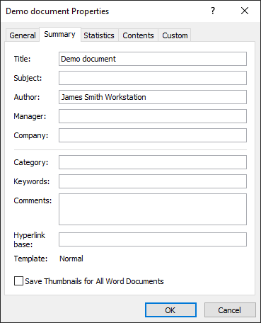

The [Document](https://apireference.aspose.com/net/words/aspose.words/document) class properties allow storing some useful document information in your document automation project. There is a system (built-in) and user-defined (custom) properties. 
Built-in properties contain such values as document title, author's name, document statistics, and so on. Custom properties are just name-value pairs where the user defines both the name and value.

{} 

Aspose.Words for .NET directly writes the information about API and Version Number in output documents. For example, upon rendering Document to PDF, Aspose.Words for .NET populates the **Application** field with the 'Aspose.Words' value and **PDF Producer** field with 'Aspose.Words for .NET 20.3'. For more details, see the, [Generator or Producer Name Included in Output Documents](/words/net/generator-or-producer-name-included-in-output-documents/).   [ Где хранится реальная текущая версия .NET 20.3? ]

Please note that you cannot direct Aspose.Words for .NET to change or remove this information from output Documents.

{} 
## **Accessing Document Properties in Microsoft Word**
You can access document properties in Microsoft Word by using the File | Properties menu.

## **Accessing Document Properties in Aspose.Words**
To access document properties in Aspose.Words do the following:

- To obtain built-in document properties, use [Document.BuiltInDocumentProperties](http://www.aspose.com/api/net/words/aspose.words/document/properties/builtindocumentproperties) .
- To obtain custom document properties, use [Document.CustomDocumentProperties](http://www.aspose.com/api/net/words/aspose.words/document/properties/customdocumentproperties).

**Document.BuiltInDocumentProperties** returns a [BuiltInDocumentProperties](http://www.aspose.com/api/net/words/aspose.words/document/properties/builtindocumentproperties) object and **Document.CustomDocumentProperties** returns a [CustomDocumentProperties](http://www.aspose.com/api/net/words/aspose.words/document/properties/customdocumentproperties) object. Both objects are collections of the [DocumentProperty](http://www.aspose.com/api/net/words/aspose.words.properties/documentproperty) objects. These objects can be obtained through the indexer property either by name or by index. **BuiltInDocumentProperties** additionally provides access to the document properties via a set of entered properties that return values of the appropriate type. **CustomDocumentProperties** enable you to add or to remove document properties from the document. The following code example demonstrates how to enumerates through all built-in and custom properties in a document. You can download the template file of this example from [here](https://github.com/aspose-words/Aspose.Words-for-.NET/blob/master/Examples/Data/Programming-Documents/Document/Properties.doc).



The [DocumentProperty](https://apireference.aspose.com/net/words/aspose.words/document/properties/index) class allows you to get the name, value, and type of the document property:

- To get a property name, use [DocumentProperty.Name](http://www.aspose.com/api/net/words/aspose.words.properties/documentproperty/properties/name).
- To get a property value, use [DocumentProperty.Value](http://www.aspose.com/api/net/words/aspose.words.properties/documentproperty/properties/value). **DocumentProperty.Value** returns an Object, but there is a set of methods allowing you to get the value of the property converted to a particular type.
- To get the property type, use [DocumentProperty.Type](http://www.aspose.com/api/net/words/aspose.words.properties/documentproperty/properties/type), which returns one of the [PropertyType](http://www.aspose.com/api/net/words/aspose.words.properties/propertytype) enumeration values. After you get to know what type the property is, you can use one of the **DocumentProperty.ToXXX** methods, such as [DocumentProperty.ToString](http://www.aspose.com/api/net/words/aspose.words.properties/documentproperty/methods/tostring) and [DocumentProperty.ToInt](http://www.aspose.com/api/net/words/aspose.words.properties/documentproperty/methods/toint) to obtain the value of the appropriate type instead of getting **DocumentProperty.Value**.
## **Updating Built-In Document Properties**
While Microsoft Word automatically updates some document properties when needed, Aspose.Words never automatically change any properties. For example, Microsoft Word updates the time the document was last printed, last saved, updates statistical properties (word, paragraph, character counts, and so on). Aspose.Words does not update any properties automatically but provides a method for updating some statistical built-in document properties. Call the [Document.UpdateWordCount](http://www.aspose.com/api/net/words/aspose.words/document/methods/updatewordcount) method to recalculate and update the [BuiltInDocumentProperties.Characters](http://www.aspose.com/api/net/words/aspose.words.properties/builtindocumentproperties/properties/characters), [BuiltInDocumentProperties.CharactersWithSpaces](http://www.aspose.com/api/net/words/aspose.words.properties/builtindocumentproperties/properties/characterswithspaces), [BuiltInDocumentProperties.Words](http://www.aspose.com/api/net/words/aspose.words.properties/builtindocumentproperties/properties/words) and [BuiltInDocumentProperties.Paragraphs](http://www.aspose.com/api/net/words/aspose.words.properties/builtindocumentproperties/properties/paragraphs) properties in the **BuiltInDocumentProperties** collection to ensure that these properties are synchronized with changes made after the document was opened or created.
## **Adding or Removing Document Properties**
You cannot add or remove built-in document properties in Aspose.Words. You can only change their values. To add custom document properties in Aspose.Words, use [CustomDocumentProperties.Add](http://www.aspose.com/api/net/words/aspose.words.properties/customdocumentproperties/methods/add/index) passing the name of the new property and the value of the appropriate type. The method returns the newly created **DocumentProperty** object. The following code example checks whether a custom property with a given name exists in a document and adds few more custom document properties. You can download the template file of this example from [here](https://github.com/aspose-words/Aspose.Words-for-.NET/blob/master/Examples/Data/Programming-Documents/Document/Properties.doc).



To remove custom properties, use **DocumentPropertyCollection.Remove** passing it the name of the property to remove. The following code example demonstrates how to remove a custom document property.


## **Configuring Link to Content Property**
Aspose.Words provides a method **CustomDocumentProperties.AddLinkToContent(string, string)** to create a new custom document property linked to content. This property returns the newly created property object or null if the [link source](https://apireference.aspose.com/net/words/aspose.words.properties/documentproperty/properties/linksource) is invalid. The following code example demonstrates how to configure the link to a content custom property.


## **Removing Personal Information from Document**
If you want to share Word document with other people, you can remove personal information, such as author name and company. You can use the **Document.RemovePersonalInformation** property to set the flag indicating that Microsoft Word will remove all user information from comments, revisions and document properties upon saving the document. 

Setting this option does not actually remove personal information while a document is processed in Aspose.Words and affects only Microsoft Word behavior.
## **Getting Document Variables**
You can get a collection of document variables using the [Document.Variables](http://www.aspose.com/api/net/words/aspose.words/document/properties/variables) property. Variable names and values are strings. The following code example demonstrates how to enumerate over document variables. You can download the template file of this example from [here](https://github.com/aspose-words/Aspose.Words-for-.NET/blob/master/Examples/Data/Programming-Documents/Document/Properties.doc).


## **How to Convert Between Measurement Units**
Most of the object properties provided in the Aspose.Words API that represent some measurement (width or height, margins, and various distances) accept values in points (1 inch equals 72 points). Sometimes this is not convenient. The ConvertUtil class provides helper functions to convert between various measurement units. It enables converting inches to points, points to inches, pixels to points, and points to pixels. The conversion of pixels to points and vice versa can be performed at 96 dpi (dots per inch) resolutions or the specified dpi resolution.

**ConvertUtil** is especially useful when setting different page properties because, for instance, inches are more usual measurement units than points. The following example demonstrates how to set up the page properties in inches. The below example shows how to specify page properties in inches:


