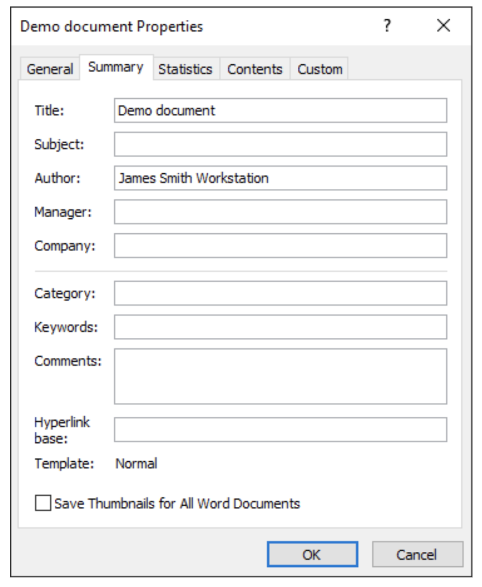

---
title: Work with Document Properties in C#
articleTitle: Work with Document Properties
linktitle: Work with Document Properties
description: "Aspose.Words for .NET allows storing some useful information about your document, such as API and Version Number or Authorized Date, in built-in or custom document properties using C#."
type: docs
weight: 20
url: /net/work-with-document-properties/
---

Document properties allow storing some useful information about your document. These properties can be divided into two groups:

* System or built-in that contain values such as document title, author name, document statistics, and others.
* User-defined or custom, provided as name-value pairs where the user can define both the name and value.

It is useful to know that information about API and Version Number is directly written to output documents. For example, upon converting a document to PDF, Aspose.Words fills in the "Application" field with "Aspose.Words", and the "PDF Producer" field with "Aspose.Words for .NET YY.M.N", where *YY.M.N* is the version of Aspose.Words used for conversion. For more details, see ["Generator or Producer Name Included in Output Documents"](/words/net/generator-or-producer-name-included-in-output-documents/).

{}

Note that you **cannot direct** Aspose.Words to change or remove this information from output documents.

{}

## Access Document Properties

To access document properties in Aspose.Words use:

* [BuiltInDocumentProperties](https://apireference.aspose.com/words/net/aspose.words/document/properties/builtindocumentproperties) to obtain built-in properties.

* [CustomDocumentProperties](https://apireference.aspose.com/words/net/aspose.words/document/properties/customdocumentproperties) to obtain custom properties.

**BuiltInDocumentProperties** and **CustomDocumentProperties** are collections of [DocumentProperty](https://apireference.aspose.com/words/net/aspose.words.properties/documentproperty) objects. These objects can be obtained through the indexer property by name or by index.

**BuiltInDocumentProperties** additionally provides access to document properties through a set of entered properties that return values of the appropriate type. **CustomDocumentProperties** enable you to add or remove document properties from a document.

The [DocumentProperty](https://apireference.aspose.com/words/net/aspose.words.properties/documentproperty) class allows you to get the name, value, and type of a document property. [Value](https://apireference.aspose.com/words/net/aspose.words.properties/documentproperty/properties/value) returns an object, but there is a set of methods allowing you to get the property value converted to a specific type. After you get to know what type the property is, you can use one of the **DocumentProperty.ToXXX** methods, such as **DocumentProperty.**[ToString](https://apireference.aspose.com/words/net/aspose.words.properties/documentproperty/methods/tostring) and **DocumentProperty.**[ToInt](https://apireference.aspose.com/words/net/aspose.words.properties/documentproperty/methods/toint), to obtain the value of the appropriate type.

The following code example shows how to enumerate all built-in and custom properties in a document:



{}

You can download the template file of this example from [Aspose.Words GitHub](https://github.com/aspose-words/Aspose.Words-for-.NET/blob/master/Examples/Data/Properties.docx).

{}

In Microsoft Word, you can access document properties using the “File → Properties” menu.

## Add or Remove Document Properties

You cannot add or remove built-in document properties using Aspose.Words. You can only change or update their values.

To add custom document properties with Aspose.Words, use the [Add](https://apireference.aspose.com/words/net/aspose.words.properties/customdocumentproperties/methods/add/index) method, passing the new property name and the value of the appropriate type. The method returns the newly created **DocumentProperty** object.

To remove custom properties, use the [Remove](https://apireference.aspose.com/words/net/aspose.words.properties/documentpropertycollection/methods/remove) method, passing it the property name to remove, or the [RemoveAt](https://apireference.aspose.com/words/net/aspose.words.properties/documentpropertycollection/methods/removeat) method to remove the property by index. You can also remove all properties using the [Clear](https://apireference.aspose.com/words/net/aspose.words.properties/documentpropertycollection/methods/clear) method.

The following code example checks whether a custom property with a given name exists in a document and adds a few more custom document properties:



{}

You can download the template file of this example from [Aspose.Words GitHub](https://github.com/aspose-words/Aspose.Words-for-.NET/blob/master/Examples/Data/Properties.docx).

{}

The following code example shows how to remove a custom document property:



## Update Built-In Document Properties

Aspose.Words does not automatically update document properties, as Microsoft Word does with some properties, but provides a method to update some statistical built-in document properties. Call the [UpdateWordCount](https://apireference.aspose.com/words/net/aspose.words/document/methods/updatewordcount/index) method to recalculate and update the following properties:

* [Characters](https://apireference.aspose.com/words/net/aspose.words.properties/builtindocumentproperties/properties/characters)
* [CharactersWithSpaces](https://apireference.aspose.com/words/net/aspose.words.properties/builtindocumentproperties/properties/characterswithspaces)
* [Words](https://apireference.aspose.com/words/net/aspose.words.properties/builtindocumentproperties/properties/words)
* [Paragraphs](https://apireference.aspose.com/words/net/aspose.words.properties/builtindocumentproperties/properties/paragraphs)
* [Lines](https://apireference.aspose.com/words/net/aspose.words.properties/builtindocumentproperties/properties/lines)

## Create a New Custom Property Linked to Content

Aspose.Words provides the [AddLinkToContent](https://apireference.aspose.com/words/net/aspose.words.properties/customdocumentproperties/methods/addlinktocontent) method to create a new custom document property linked to content. This property returns the newly created property object or null if the [LinkSource](https://apireference.aspose.com/words/net/aspose.words.properties/documentproperty/properties/linksource) is invalid.

The following code example shows how to configure a link to a custom property:



## Get Document Variables

You can get a collection of document variables using the [Variables](https://apireference.aspose.com/words/net/aspose.words/document/properties/variables) property. Variable names and values are strings.

The following code example shows how to enumerate document variables:



{}

You can download the template file of this example from [Aspose.Words GitHub](https://github.com/aspose-words/Aspose.Words-for-.NET/blob/master/Examples/Data/Properties.docx).

{}

## Remove Personal Information from Document

If you want to share a Word document with other people, you may want to remove personal information such as author name and company. To do this use the [RemovePersonalInformation](https://apireference.aspose.com/words/net/aspose.words/document/properties/removepersonalinformation) property to set the flag indicating that Microsoft Word will remove all user information from comments, revisions, and document properties upon saving the document.

The following code example shows how to remove personal information:



{}

Setting this option does not actually remove personal information while processing a document in Aspose.Words and affects only the Microsoft Word behavior.

{}
