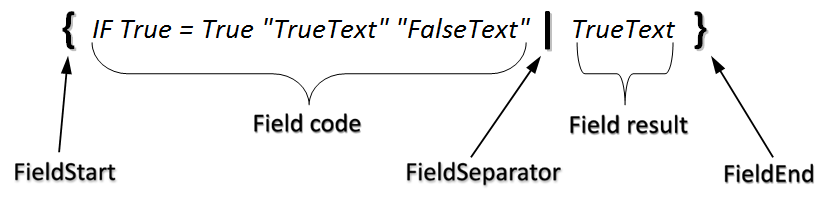

## How to Update Fields

When a document is loaded, Aspose.Words mimics the behavior of Microsoft Word with the option to automatically update fields is switched off. The behavior can be summarized as follows:

- When you open/save a document the fields remain intact.
- You can explicitly update all fields in a document (e.g. rebuild TOC) when you need to.
- When you print/render to PDF or XPS the fields related to page-numbering in headers/footers are updated.
- When you execute mail merge all fields are updated automatically.

### Update Fields Programmatically

To explicitly update fields in the whole document, simply call Document.UpdateFields.To update fields contained in part of a document, obtain a [Range](https://reference.aspose.com/words/net/aspose.words/range) object and call the [Range.UpdateFields](https://reference.aspose.com/words/net/aspose.words/range/methods/updatefields) method. In Aspose.Words, you can obtain a **Range** for any node in the document tree, such as [Section](https://reference.aspose.com/words/net/aspose.words/section) , [HeaderFooter](https://reference.aspose.com/words/net/aspose.words/headerfooter) , [Paragraph](https://reference.aspose.com/words/net/aspose.words/paragraph) etc using the [Node.Range](https://reference.aspose.com/words/net/aspose.words/node/properties/range) property.You can update the result of a single field by calling [Field.Update](https://reference.aspose.com/words/net/aspose.words.fields/field/methods/update).

### Automatic Update of Page-Related Fields during Rendering

When you execute conversion of a document to a fixed-page format e.g. to PDF or XPS, then Aspose.Words will automatically update page layout-related fields PAGE, PAGEREF found in headers/footers of the document. This behavior mimics the behavior of Microsoft Word when printing a document.If you want to update all other fields in the document, then you need to call **Document.UpdateFields** before rendering the document. You can download the template file of this example from [here](https://github.com/aspose-words/Aspose.Words-for-.NET/blob/master/Examples/Data/Rendering.docx)



### Automatic Field Update during Mail Merge

When you execute a mail merge, all fields in the document will be automatically updated. This is because mail merge is a case of a field update. The program encounters a mail merge field and needs to update its result, which involves grabbing the value from the data source and inserting it into the field. The logic is of course more complicated, for example, when the end of the document/mail merge region is reached but there is still further data to be merged, then the region needs to be duplicated and the new set of fields updated.

## Update Fields having Dirty Attribute

The w:dirty is a field-level attribute that will refresh only the field you specify when the document is opened. It tells MS Word to only refresh this field the next time the document is opened. You can use LoadOptions.UpdateDirtyFields property to specify whether to update the fields with the dirty attribute. When the value of LoadOptions.UpdateDirtyFields is set to *true*, all fields having *true* value for Field.IsDirty or FieldChar.IsDirty property are updated on document load. Following example shows how to update fields having dirty attribute. 



## Update LastSavedTime Property Before Saving

You can use SaveOptions.UpdateLastSavedTimeProperty property whether to update the corresponding built-in document property (BuiltInDocumentProperties.LastSavedTime) on document save. Following example shows how to update this property. 



## Differences in Field Update in Aspose.Words 9.6 and Above

Starting from Aspose.Words 9.6 the way that some fields are updated is slightly different, due to internal reworking of the field evaluation engine. These changes to the field engine allow fields to be more accurately updated and brings field updating in Aspose.Words closer to how field update in Microsoft Word behaves.

With the implementation of this new engine the general behavior of field update remains the same with the exceptions which mostly affect how the **Document.UpdateFields** and **Document.UpdatePageLayout** methods behave. These important changes are detailed below:

### Calling UpdateFields Now Updates All Field Types

In previous versions calling Document.UpdateFields or Range.UpdateFields would update only regular fields such as IF or DOCPROPERTY and not page-layout related fields such as PAGE or NUMPAGES. Newer versions will now update both the regular and page-layout related fields.

When **Document.UpdateFields** or **Range.UpdateFields** is called all fields are updated over the entire document/range. This may involve building the document layout if a page-layout related field like the PAGE field is encountered during the update. Below example shows how to update all fields in a document. You can download the template file of this example from [here](https://github.com/aspose-words/Aspose.Words-for-.NET/blob/master/Examples/Data/Rendering.docx).



{}

A similar process occurs when a single field is updated using the Field.Update method. If this field is a regular field then only this field is updated as normal. However if this field is related to the page layout then the document layout is rebuilt and it is updated along with all other page related fields found in headers or footers.

These changes in field evaluation may potentially cause results that differ from previous versions on certain documents when executing the same field update code.

{}

### Calling UpdatePageLayout Now Only Updates Page-Layout Related Fields in Headers and Footers

In previous versions a call to Document.UpdatePageLayout was required in order to update fields in the document like PAGE and PAGEREF. In the current version this functionality is handled by Document.UpdateFields which updates all types of fields as discussed above.

**Document.UpdatePageLayout** is still used to build or rebuild the document layout when a document is to be rendered. When this method is called or a document is rendered (i.e. saved to PDF, XPS, printed etc.) the document layout is built. In previous versions this process would update all page-layout related fields, however in the current version these fields are automatically updated only in the headers and footers of the document.

These changes to how fields are updated upon document layout are required and match how Microsoft Word updates fields. This now allows a document to be rendered without any fields in the main body being updated which is how fields are evaluated in Microsoft Word.

If the old functionality of updating page-related fields in the entire document when rendering is desired then an explicit call to **Document.UpdateFields** is required before saving the document.

### All Types of Fields Encountered during Mail Merge are Updated

Previously only non page-related fields encountered during mail merge would be updated. Now all fields inside a mail merge region (or in the whole body if not using mail merge regions) are updated, including page-related fields.

As with **Document.UpdateFields** this may invoke the document layout to be built if page-related fields are encountered. This behavior mimics how Microsoft Words handles field update during mail merge and ensures that after mail merge has been executed all fields are up to date with correct values.

### Rebuilding TOC Fields No Longer Requires UpdatePageLayout to be Called

As explained earlier, all fields are now updated using Document.UpdateFields. This now means a more concise and clearer way to update the fields in a document. This also means in situations such as updating a TOC field you no longer require any call to Document.UpdatePageLayout. All work is handled within the Document.UpdateFields call. Below examples shows how to completely rebuild TOC fields in the document by invoking field update.



## Removing a Field

Sometimes it is necessary to remove a field from the document. This may occur when it is to be replaced with a different field type or when the field is no longer needed in the document. For example a TOC field when saving to HTML. A field inserted into the document using **DocumentBuilder.InsertField** returns a Field object which provides a convenience method to easily remove the field from the document. Below example removes a field from the document. You can download the template file of this example from [here](https://github.com/aspose-words/Aspose.Words-for-.NET/blob/master/Examples/Data/Various%20fields.docx).



## Replacing Fields with Static Text

This is often required when you wish to save your document as a static copy, for example for when sending as an attachment in an e-mail. The conversion of fields such as a DATE or TIME field to static text will enable them to display the same date as when you sent them. In some situations you may need to remove conditional IF fields from your document and replace them with the most recent text result instead. For example, converting the result of an IF field to static text so it will no longer dynamically change its value if the fields in the document are updated.

For example, the diagram below shows how an “IF” field is stored in a document. The text is encompassed by the special field nodes [FieldStart](https://reference.aspose.com/words/net/aspose.words.fields/fieldstart) and [FieldEnd](https://reference.aspose.com/words/net/aspose.words.fields/fieldend). The [FieldSeparator](https://reference.aspose.com/words/net/aspose.words.fields/fieldseparator) node separates the text inside the field into the field code and field result. The field code is what defines the general behavior of the field while the field result stores the most recent result when this field is updated by either by Microsoft Word or Aspose.Words. The field result is what is stored in the field and displayed in the document when viewed. 

The structure can also be seen below in hierarchical form using the [demo project *“DocumentExplorer”*](https://github.com/aspose-words/Aspose.Words-for-.NET)*.*

Please note that this technique cannot be used properly on some fields in the header or footer. For example attempting to convert a PAGE field in a header or footer to static text will cause the same value to appear across all pages. This is because headers and footers are repeated across multiple pages and when they remain as fields they are handled especially so they display the correct result for each page. However upon conversion, the field in the header is transformed into a static run of text. This run of text will be evaluated as if it is the last page in the section which will cause any of PAGE field in the header to display the last page over all pages.

Below code example shows how to replace the field with its most recent result.



The ConvertFieldsToStaticText method accepts two parameters, a CompositeNode and a FieldType enumeration. Being able to pass any composite node to this method allows you to convert fields to static text in specific parts of your document only.

For example you can pass a Document object and convert the fields of the specified type from the entire document to static text, or you could pass the [Body](https://reference.aspose.com/words/net/aspose.words/body) object of a section and convert only fields found within that body.

When passing a block level node such as a [Paragraph](https://reference.aspose.com/words/net/aspose.words/paragraph) , be aware that in some cases fields can span across multiple paragraphs. If this happens then it is recommended to instead pass the parent of the composite to avoid this.

The **FieldType** enumeration passed to the method specifies what type of field should be convert to static text. A field of any other type encountered in the document will be left unchanged. Below example shows how to convert all fields of a specified type in a document to static text. You can download template file of below examples from [here](https://github.com/aspose-words/Aspose.Words-for-.NET/blob/master/Examples/Data/Linked%20fields.docx).



Below example shows how to convert all fields of a specified type in a body of a document to static text.



Below example shows how to convert all fields of a specified type in a paragraph to static text.



