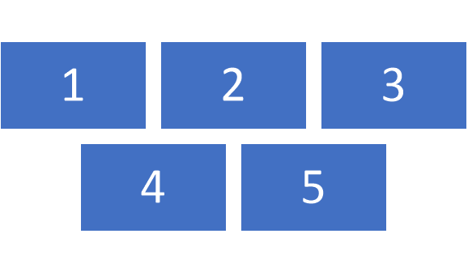
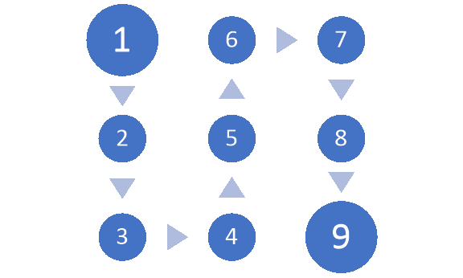
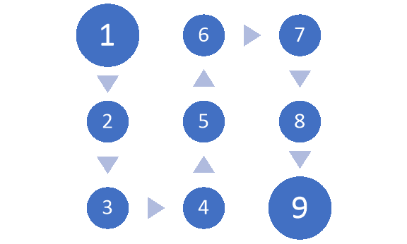
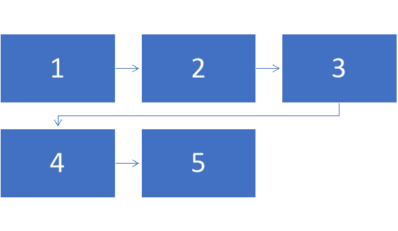
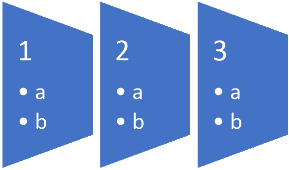
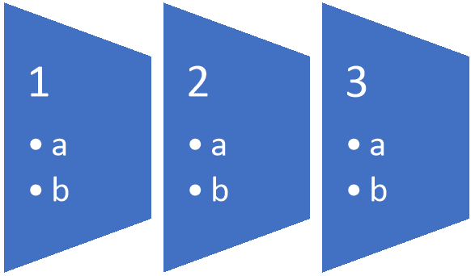

---
title: Working with SmartArt Cold Rendering in C#
second_title: Aspose.Words for .NET
articleTitle: Working with SmartArt Cold Rendering
linktitle: Working with SmartArt Cold Rendering
description: "Introduction to SmartArt shapes using C#."
type: docs
description: "Aspose.Words for .NET performs SmartArt Cold Rendering, meaning that it lays out and renders SmartArt objects if the pre-rendered SmartArt drawing is missing or incorrect using C#."
weight: 55
url: /net/working-with-smartart-cold-rendering/
---

SmartArt graphics are used to quickly and easily create a visual representation of information. You simply choose from a large number of layouts that best suits your situation. This ease of use makes SmartArt graphics quite popular for some purposes.

Microsoft Word generates and saves the pre-rendered drawing along with the SmartArt object. In most cases, the pre-rendered drawing is rendered well by Aspose.Words and no additional actions are required. However, if the document is saved by other applications, the pre-rendered SmartArt drawing may be missing or incorrect. In this case, the SmartArt object itself should be laid-out and rendered using Aspose.Words. We call this process the SmartArt Cold Rendering.

## Using SmartArt Cold Rendering

Aspose.Words allows you to use a pre-rendered drawing or perform cold rendering:

* If a pre-rendered drawing is available, Aspose.Words uses it to render the SmartArt object.
* If pre-rendered drawing is missing, Aspose.Words implicitly performs cold rendering to render the SmartArt object.
* If a pre-rendered drawing is present but is incorrect, it is required to perform SmartArt cold rendering explicitly by calling [UpdateSmartArtDrawing](https://reference.aspose.com/words/net/aspose.words.drawing/shape/methods/updatesmartartdrawing) method.

The following code example shows how to update drawings for all diagrams in the document:

**.NET**


## Support for Standard SmartArt Layouts

Currently, only a limited number of standard Microsoft Word SmartArt layouts are supported. Also, some of these layouts are supported partially, meaning that significant nodes and shapes of the diagram are rendered, but there may be differences between the Microsoft Word and Aspose.Words diagram layout.

The table below lists the fully and partially supported layouts:

| SmartArt Layouts Group | Fully supported layouts                                      | Partially supported layouts                                  |
| ---------------------- | ------------------------------------------------------------ | ------------------------------------------------------------ |
| List                   | <ul><li>Basic Block List</li><li>Alternating Hexagons</li><li>Vertical Bullet List</li><li>Vertical Box List</li><li>Varying Width List</li><li>Horizontal Bullet List</li><li>Grouped List</li><li>Vertical Block List</li><li>Vertical Chevron List</li><li>Vertical Arrow List</li><li>Trapezoid List</li><li>Table List</li><li>Pyramid List</li><li>Target List</li></ul> | <ul><li>Lined List</li><li>Vertical Bracket List</li><li>Tab List</li><li>Stacked List</li><li>Vertical Accent List</li><li>Vertical Circle List</li></ul> |
| Process                | <ul><li>Basic Process</li><li>Accent Process</li><li>Continuous Block Process</li><li>Increasing Arrow Process</li><li>Converging Text</li><li>Basic Timeline</li><li>Basic Chevron Process</li><li>Chevron Accent Process</li><li>Closed Chevron Process</li><li>Chevron List</li><li>Vertical Process</li><li>Staggered Process</li><li>Process List</li><li>Basic Bending Process</li><li>Repeating Bending Process</li><li>Detailed Process</li><li>Upward Arrow</li><li>Descending Process</li><li>Circular Bending Process</li></ul> | <ul><li>Step Up Process</li><li>Step Down Process</li><li>Alternating Flow</li><li>Increasing Circle Process</li><li>Pie Process</li><li>Interconnected Block Process</li><li>Process Arrows</li><li>Circle Accent Timeline</li><li>Circle Process</li><li>Sub Step Process</li><li>Phased Process</li><li>Random to Result Process</li><li>Circle Arrow Process</li></ul> |
| Cycle                  | –                                                            | <ul><li>Segmented Cycle</li><li>Hexagon Radial</li></ul>     |
| Hierarchy              | –                                                            | <ul><li>Table Hierarchy</li><li>Architecture Layout</li></ul> |
| Relationship           | <ul><li>Balance</li><li>Funnel</li><li>Gear</li><li>Plus And Minus</li><li>Arrow Ribbon</li><li>Counterbalance Arrows</li><li>Opposing Arrows</li><li>Nested Target</li><li>Basic Target</li><li>Basic Pie</li><li>Basic Venn</li><li>Stacked Venn</li><li>Interconnected Ring</li></ul> | <ul><li>Circle Relationship</li><li>Opposing Ideas</li><li>Equation</li><li>Vertical Equation</li><li>Linear Venn</li></ul> |
| Matrix                 | <ul><li>Basic Matrix</li><li>Titled Matrix</li><li>Grid Matrix</li><li>Cycle Matrix</li></ul> | –                                                            |
| Pyramid                | –                                                            | <ul><li>Segmented Pyramid</li></ul>                          |

## Comparison of SmartArt Rendering in Aspose.Words and Microsoft

The table below shows example pictures of Aspose.Words Cold Rendering of some standard layouts compared to Microsoft Word output:

|                               | **Aspose.Words**                                             | **Microsoft Word**                                           |
| ----------------------------- | ------------------------------------------------------------ | ------------------------------------------------------------ |
| **Basic Process**             |  |  |
| **Circular Bending Process**  |  |  |
| **Repeating Bending Process** |  |  |
| **Trapezoid List**            |  |  |
