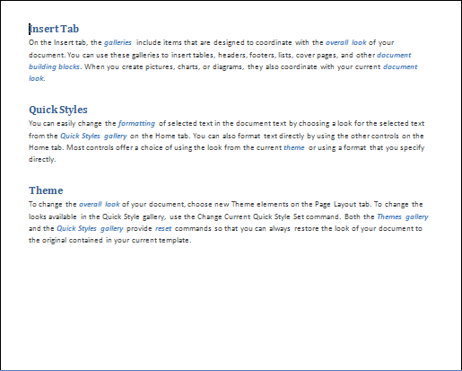
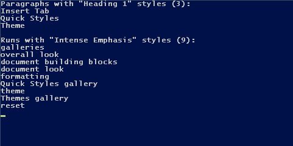

---
title: Working with Styles and Themes – Aspose.Words for .NET
articleTitle: Working with Styles and Themes
linktitle: Working with Styles and Themes
description: "Advanced Microsoft Word formatting features, working with styles and themes using Aspose.Words for .Net."
type: docs
weight: 40
url: /net/working-with-styles-and-themes/
---

The [StyleCollection](https://apireference.aspose.com/words/net/aspose.words/stylecollection) class is used to manage built-in and apply user-defined settings to styles.

## Accessing Styles

You can get a collection of styles defined in the document using the [Document.Styles](https://apireference.aspose.com/words/net/aspose.words/documentbase/properties/styles) property. This collection holds both the built-in and user-defined styles in a document. A particular style could be obtained by its name/alias, style identifier, or index. The following code example demonstrates how to get access to the collection of styles defined in the document.



## How to Extract Content Based on Styles

At a simple level, retrieving the content based on styles from a Word document can be useful to identify, list and count paragraphs and runs of text formatted with a specific style. For example, you may need to identify particular kinds of content in the document, such as examples, titles, references, keywords, figure names, and case studies.

To take this a few steps further, this can also be used to leverage the structure of the document, defined by the styles it uses, to re-purpose the document for another output, such as HTML. This is in fact how the Aspose documentation is built, putting Aspose.Words to the test. A tool built using Aspose.Words takes the source Word documents and splits them into topics at certain heading levels. An XML file is produced using Aspose.Words which is used to build the navigation tree you can see on the left. And then Aspose.Words converts each topic into HTML.

The solution for retrieving text formatted with specific styles in a Word document is typically economical and straightforward using Aspose.Words.

### The Solution

To illustrate how easily Aspose.Words handles retrieving content based on styles, let’s look at an example. In this example, we’re going to retrieve text formatted with a specific paragraph style and a character style from a sample Word document.At a high level, this will involve:# Opening a Word document using the [Document](https://apireference.aspose.com/words/net/aspose.words/document) class.# Getting collections of all paragraphs and all runs in the document.# Selecting only the required paragraphs and runs. Specifically, we’ll retrieve text formatted with the ‘Heading 1’ paragraph style and the ‘Intense Emphasis’ character style from this sample Word document.

In this sample document, the text formatted with the ‘Heading 1’ paragraph style is ‘Insert Tab’, ‘Quick Styles’ and ‘Theme’, and the text formatted with the ‘Intense emphasis’ character style is the several instances of blue, italicized, bold text such as ‘galleries’ and ‘overall look’.

### The Code

The implementation of a style-based query is quite simple in the Aspose.Words document object model, as it simply uses tools that are already in place.Two class methods are implemented for this solution:# **ParagraphsByStyleName** – This method retrieves an array of those paragraphs in the document that have a specific style name.# **RunsByStyleName** – This method retrieves an array of those runs in the document that have a specific style name.Both these methods are very similar, the only differences being the node types and the representation of the style information within the paragraph and run nodes.Here is an implementation of ParagraphsByStyleName : Below example find all paragraphs formatted with the specified style.



{} 

This implementation also uses the Document.GetChildNodes method of the Document class, which returns a collection of all nodes with the specified type, which in this case in all paragraphs.

Note that the second parameter of the **Document.GetChildNodes** method is set to true. This forces the **Document.GetChildNodes** method to select from all child nodes recursively, rather than selecting the immediate children only.

{} 

It’s also worth pointing out that the paragraphs collection does not create an immediate overhead because paragraphs are loaded into this collection only when you access items in them. Then, all you need to do is to go through the collection, using the standard foreach operator and add paragraphs that have the specified style to the paragraphsWithStyle array. The Paragraph style name can be found in the [Style.Name](https://apireference.aspose.com/words/net/aspose.words/style/properties/name) property of the [Paragraph.ParagraphFormat](https://apireference.aspose.com/words/net/aspose.words/paragraph/properties/paragraphformat) object. The implementation of RunsByStyleName is almost the same, although we’re obviously using [NodeType.Run](https://apireference.aspose.com/words/net/aspose.words/nodetype) to retrieve run nodes. The [Font.Style](https://apireference.aspose.com/words/net/aspose.words/font/properties/style) property of a [Run](https://apireference.aspose.com/words/net/aspose.words/run) object is used to access style information in the **Run** nodes. Below example find all runs formatted with the specified style.



When both queries are implemented, all you need to do is to pass a document object and specify the style names of the content you want to retrieve: Below example run queries and display results. You can download the template file of this example from [here](https://github.com/aspose-words/Aspose.Words-for-.NET/blob/master/Examples/Data/Styles.docx).



### End Result

When everything is done, running the sample will display the following output: 

As you can see, this is a very simple example, showing the number and text of the collected paragraphs and runs in the sample Word document.

## Copy All Styles from Template

There are cases when you want to copy all styles from one document into another. You can use Document.CopyStylesFromTemplate method to copy styles from the specified template to a document. When styles are copied from a template to a document, like-named styles in the document are redefined to match the style descriptions in the template. Unique styles from the template are copied to the document. Unique styles in the document remain intact. Below code example shows how to copy styles from one document into another.



## How to Manipulate Theme Properties

We have added basic API in Aspose.Words to access document theme properties. For now, this API includes following public objects:

- Theme
- ThemeFonts
- ThemeColors

Here is how you can get theme properties:



And here is how you can set theme properties:


