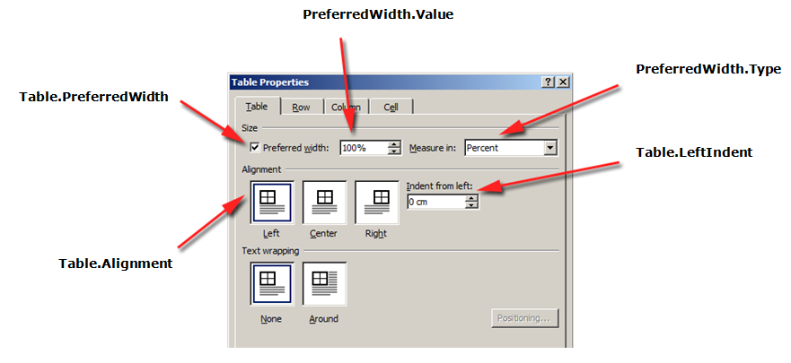
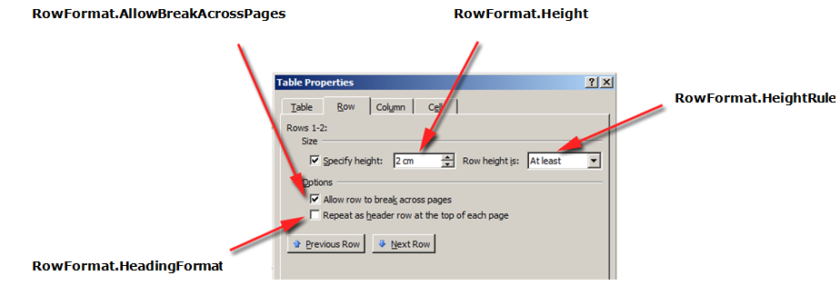
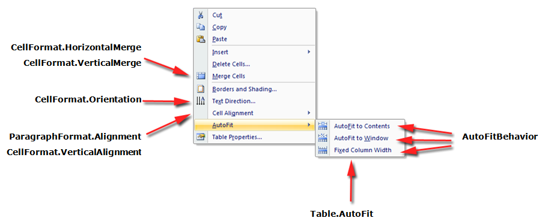
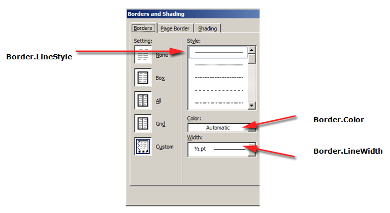
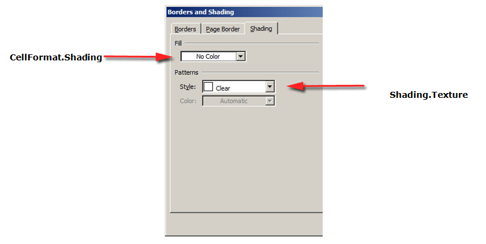
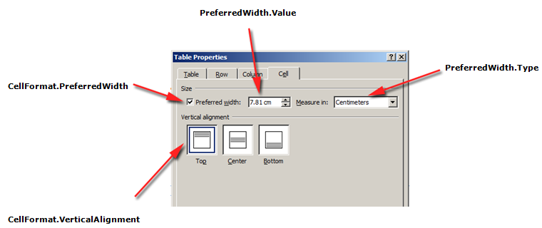
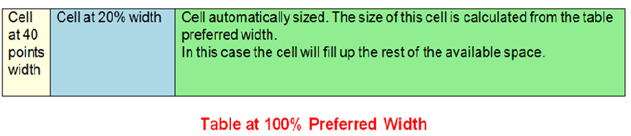

Each element of a table can be applied with different formatting. For example, table formatting will be applied to the entire table, row formatting to only particular rows, cell formatting to only certain cells.

Aspose.Words provides a rich API to retrieve and apply formatting to a table. You can use the [Table](https://reference.aspose.com/words/net/aspose.words.tables/table/), [RowFormat](https://reference.aspose.com/words/net/aspose.words.tables/rowformat/), and [CellFormat](https://reference.aspose.com/words/net/aspose.words.tables/cellformat/) nodes to set the formatting.

In this article, we will talk about how to apply formatting to different table nodes and what table formatting settings Aspose.Words supports.

## Apply Formatting to Different Nodes

In this section, we will look at applying formatting to various table nodes.

### Table Level Formatting

To apply formatting to a table, you can use the properties available on the corresponding Table node.

{}

Note that the table must have at least one row before the table properties can be applied. This means that when building a table with the [DocumentBuilder](https://reference.aspose.com/words/net/aspose.words/documentbuilder/), this formatting must be done after the first call to [InsertCell](https://reference.aspose.com/words/net/aspose.words/documentbuilder/insertcell/), or after the first row is added to the table, or when nodes are inserted directly into the DOM.

{}

The pictures below show a representation of the table formatting features in Microsoft Word and their corresponding properties in Aspose.Words.

The following code example shows how to apply an outline border to a table:



{}

You can download the sample file of this example from [Aspose.Words GitHub](https://github.com/aspose-words/Aspose.Words-for-.NET/blob/master/Examples/Data/Tables.docx).

{}

The following code example shows how to build a table with all borders enabled (grid):



{}

You can download the sample file of this example from [Aspose.Words GitHub](https://github.com/aspose-words/Aspose.Words-for-.NET/blob/master/Examples/Data/Tables.docx).

{}

### Row Level Formatting

Formatting on the row level can be controlled using the [RowFormat](https://reference.aspose.com/words/net/aspose.words.tables/row/rowformat/) property of the Row. 

Below example shows how to modify the formatting of a table row. You can download the template file of this example from [here](https://github.com/aspose-words/Aspose.Words-for-.NET/blob/master/Examples/Data/Tables.docx).



### Cell Level Formatting

Formatting on the cell level is controlled using the [CellFormat](https://reference.aspose.com/words/net/aspose.words.tables/cell/cellformat/) property of the Cell. 

Below example shows how to modify the formatting of a table cell. You can download the template file of this example from [here](https://github.com/aspose-words/Aspose.Words-for-.NET/blob/master/Examples/Data/Tables.docx).



The following code example shows how to set the amount of space (in points) to add to the left/top/right/bottom of the contents of the cell.



## Specify Row Heights

The height of a table row is controlled using height and height rule properties. These can be set differently for each row in the table which allows for wide control over the height of each row. In Aspose.Words these are represented by the [RowFormat.Height](https://reference.aspose.com/words/net/aspose.words.tables/rowformat/height/) and [RowFormat.HeightRule](https://reference.aspose.com/words/net/aspose.words.tables/rowformat/height/rule) properties of the given [Row](https://reference.aspose.com/words/net/aspose.words.tables/row/).

|HeightRule Value|Description|
| :- | :- |
|Auto|This is the default height rule given to a new row. Technically this means that no height rule is defined. The row is sized to fit the largest content within the cells of the row.|
|At Least|With this setting, the height of the row will grow to accommodate the content of the row, but will never be smaller than the specified size in **RowFormat.Height**.|
|Exactly|The size of the row is set exactly to the value found in **RowFormat.Height** and does not grow to fit the content.|
The simplest way to set row height is by using DocumentBuilder. Using the appropriate RowFormat properties you can set a default height setting or apply a different height for each row in the table.

Below example shows how to create a table that contains a single cell and apply row formatting.



### Applying Borders and Shading

Borders and shading can be applied either table wide using Table.SetBorder, Table.SetBorders and Table.SetShading or to particular cells only by using CellFormat.Borders and CellFormat.Shading. Additionally, borders can be set on a row by using RowFormat.Borders, however, shading cannot be applied in this way. 

The following code example shows how to format a table and cell with different borders and shadings.



## Specifying Table and Cell Widths

A table in a Microsoft word document provides several different ways to size a table and individual cells. These properties allow considerable control over the overall appearance and behavior of the table. This article gives an in-depth look into how the different width calculation properties of tables work and provides information which will allow you to gain full control of how table widths are calculated. This is useful to know in such cases where a table layout does not appear as expected.

### Different Widths on Table

Table elements present several different properties that can affect how the widths of the overall table, as well as individual cells, are calculated. These are each explained in detail in this article.

- Preferred width on the table.
- Preferred width on individual cells.
- Allowing autofit on the table.
- Regular cell width

{}

All of the properties and techniques that are described in this article all link back to how tables work in Microsoft Word. Therefore in most cases, if you are building your table programmatically but are finding it hard to create the desired table you can instead try visually creating it in Microsoft Word first and then simply copy the formatting values to your application. 

The preferred cell is recommended rather than the width in most cases. Cell preferred width is more aligned with DOCX format specification and with Aspose.Words model as well. Cell width is actually a calculated value for DOCX format. The actual cell width may depend on many things. For example, changing page margins or preferred table width may affect the actual cell width. Cell preferred width is a cell property that is stored in the document. It does not depend on anything and it does not change when a table or other cell properties change.

{}

### Using Preferred Widths

The desired width of a table or individual cells is defined through the preferred width property. That is a preferred width can be specified on individual cells or to the table as a whole. This is the size that the element strives to fit. In some cases, it may not be possible to fit this exact width, but the real width will come close to this value on most occasions. 

The preferred width property can be expressed in one of several different ways:

|Width Type|Behavior|
| :- | :- |
|Absolute|This fits the element to the given width in points.|
|Percent|Fits the element relative of the available space in the window or container size. If the available width changes then the table will automatically grow or shrink to reflect these changes.|
|Auto|This is the same as having no preferred width set. In this case, the size of the element is calculated using one of the other elements belonging to the table which does have a size set.|
An example of how these are applied to a real table in a document can be seen in the diagram below.

The table can be described as being fitted to 100% of the available space on the page. In this case, this means the table will try to take up the space between the left and right page margins.

The cells in the above table can be described as such:

- The width of the first cell is set at 40 points. This width shouldn’t vary even if the table is resized or other cells removed.
- The second cell is specified as taking up 20% of the available space in the table. This means if the table size was changed, the width of this cell should change as well to reflect this.
- The third cell is defined as auto or “width not defined”. This means the width of the cell is calculated using the other size information of the table. Normally such a cell will take up the remaining space in the table.

In Aspose.Words the sizing modes described above can be found under the [PreferredWidthType](https://reference.aspose.com/words/net/aspose.words.tables/preferredwidthtype/) enumeration and are set using the [Table.PreferredWidth](https://reference.aspose.com/words/net/aspose.words.tables/table/preferredwidth/) property and [CellFormat.PreferredWidth](https://reference.aspose.com/words/net/aspose.words.tables/cellformat/preferredwidth/) property.

The appropriate preferred width type and value is set by using the methods of the [PreferredWidth](https://reference.aspose.com/words/net/aspose.words.tables/preferredwidth/) class. For instance, to specify a width from points you would use the [PreferredWidth.FromPoints](https://reference.aspose.com/words/net/aspose.words.tables/preferredwidth/frompoints/) method. To specify a percentage width you would use [PreferredWidth.FromPercent](https://reference.aspose.com/words/net/aspose.words.tables/preferredwidth/frompercent/). Finally to specify auto or “no preferred width” you would use [PreferredWidth.Auto](https://reference.aspose.com/words/net/aspose.words.tables/preferredwidth/auto/).

#### Specifying a Preferred Width on a Table in Aspose.Words

Using the [Table.PreferredWidth](https://reference.aspose.com/words/net/aspose.words.tables/table/preferredwidth/) property will adjust its preferred width relative to the container (i.e the page, text column or outer table cell). The code example given below shows how to set a table to auto fit to 50% of the page width.



Before you can use preferred widths on a table you must make sure that the table contains at least one row. This is because such table formatting in a Microsoft Word document is stored in the rows of a table.

#### Specifying Preferred Width on a Cell

Using the [CellFormat.PreferredWidth](https://reference.aspose.com/words/net/aspose.words.tables/cellformat/preferredwidth/) property on a given cell will adjust its preferred width. Below example shows how to set the different preferred width settings.



#### Finding Preferred Width Type and Value of a Table or Cell

You can use [PreferredWidth.Type](https://reference.aspose.com/words/net/aspose.words.tables/preferredwidth/type/) and [PreferredWidth.Value](https://reference.aspose.com/words/net/aspose.words.tables/preferredwidth/value/) properties to find the preferred width details of the desired table or cell. Below example shows how to Retrieves the preferred width type of a table cell. You can download the template file of this example from [here](https://github.com/aspose-words/Aspose.Words-for-.NET/blob/master/Examples/Data/Tables.docx).



#### Allowing AutoFit

The [Table.AllowAutoFit](https://reference.aspose.com/words/net/aspose.words.tables/table/allowautofit/) property enables cells in the table to grow and shrink to accommodate their contents. This property can be used in conjunction with a preferred cell width to format a cell which auto fits its content but which also has an initial width. The cell width can then grow past this width if needed. Below example shows how to set a table to shrink or grow each cell to accommodate its contents.



#### Using Cell Width

In Aspose.Words the CellFormat object also provides a width property. This property is mainly leftover from previous versions, however, it is still useful as a way to simplify setting a cell’s width. This property now acts differently depending on which of the other width properties already exist on the table:

- If a cell has a preferred width of [PreferredWidthType.Auto](https://reference.aspose.com/words/net/aspose.words.tables/preferredwidthtype/) type (no preferred width set) then the value from the [CellFormat.Width](https://reference.aspose.com/words/net/aspose.words.tables/cellformat/width/) is copied over and becomes the preferred width of the cell (in points).
- If a cell has a cell preferred width of PreferredWidthType.Percent then any changes to [CellFormat.Width](https://reference.aspose.com/words/net/aspose.words.tables/cellformat/width/) is ignored.
- If a cell already has a preferred width of type PreferredWidthType.Points than any changes to CellFormat.Width is ignored. That is, any changes to the width property are not updated in preferred width and should be applied to the preferred width instead.* If the table has Table.AllowAutoFit enabled then any change in [CellFormat.Width](https://reference.aspose.com/words/net/aspose.words.tables/cellformat/width/) value is ignored and the cell is fitted to its contents instead.

#### The Order of Precedence during Cell Width Calculations

Aspose.Words uses the following order when calculating cell widths.

|Order|Property|Description|
| :- | :- | :- |
|1|**CellFormat.PreferredWidth**|Ideally, the preferred widths are used to calculate the cell sizes.|
|2|**Table.AllowAutoFit**|If the auto fit is allowed then the table may grow past the preferred width to accommodate contents. Normally it will not shrink below the preferred width.|
|3|**CellFormat.Width**|If neither of the settings above is present then the width defined under **CellFormat.Width** is used.|
{}

While creating a fixed table layout, specify the cell width. A cell without width cannot be saved to .doc format. Document formats other than .doc, such as .docx, allow, in principle, saving cells without width in a fixed table layout.

{}
