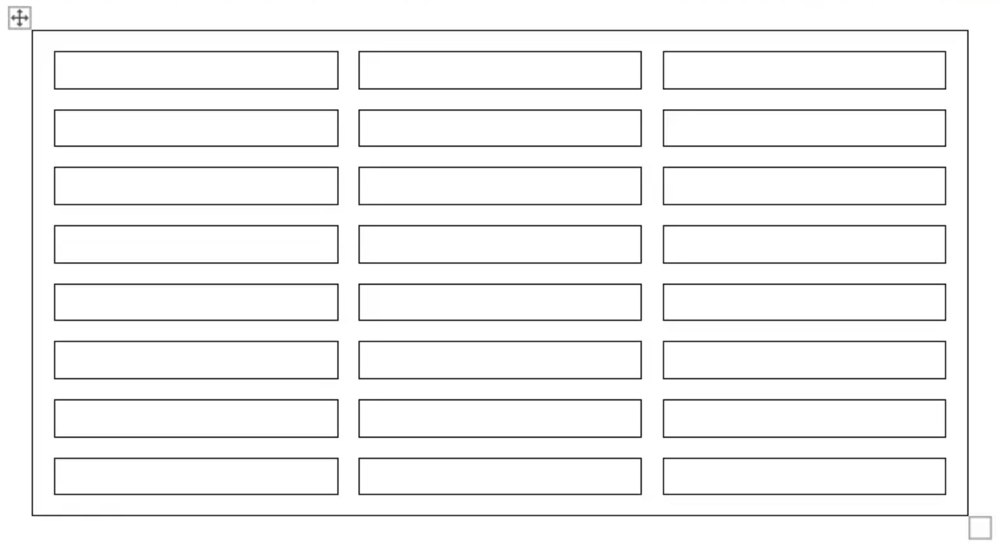

## Applying Formatting to Table, Row and Cell

Each element of a table can be applied with different formatting. For instance, table formatting will be applied over the entire table while row formatting will only affect particular rows etc.
Aspose.Words provides a rich API to retrieve and apply formatting to a table. You can use the [Table](https://apireference.aspose.com/words/net/aspose.words.tables/table), [RowFormat](https://apireference.aspose.com/words/net/aspose.words.tables/rowformat) and [CellFormat](https://apireference.aspose.com/words/net/aspose.words.tables/cellformat) nodes to set formatting.

### Applying Formatting on the Table Level

To apply formatting to a table you can use the properties available on the corresponding Table node. A visual view of table formatting features in Microsoft Word and their corresponding properties in Aspose.Words are given below. 

Below example shows how to apply an outline border to a table. You can download the template file of this example from [here](https://github.com/aspose-words/Aspose.Words-for-.NET/blob/master/Examples/Data/Tables.docx).



Below example shows how to build a table with all borders enabled (grid). You can download the template file of this example from [here](https://github.com/aspose-words/Aspose.Words-for-.NET/blob/master/Examples/Data/Tables.docx)



{} 

Note that before you apply table properties there must be at least one row present in the table. This means when building a table using DocumentBuilder, such formatting must be done after the first call to DocumentBuilder.InsertCell or after adding the first row to a table or when inserting nodes directly into the DOM.

{} 

### Applying Formatting on the Row Level

Formatting on the row level can be controlled using the [RowFormat](https://apireference.aspose.com/words/net/aspose.words.tables/row/properties/rowformat) property of the Row. 

Below example shows how to modify the formatting of a table row. You can download the template file of this example from [here](https://github.com/aspose-words/Aspose.Words-for-.NET/blob/master/Examples/Data/Tables.docx).



### Applying Formatting on the Cell Level

Formatting on the cell level is controlled using the [CellFormat](https://apireference.aspose.com/words/net/aspose.words.tables/cell/properties/cellformat) property of the Cell. 

Below example shows how to modify the formatting of a table cell. You can download the template file of this example from [here](https://github.com/aspose-words/Aspose.Words-for-.NET/blob/master/Examples/Data/Tables.docx).



The following code example shows how to set the amount of space (in points) to add to the left/top/right/bottom of the contents of the cell.



### Specifying Row Heights

The height of a table row is controlled using height and height rule properties. These can be set differently for each row in the table which allows for wide control over the height of each row. In Aspose.Words these are represented by the [RowFormat.Height](https://apireference.aspose.com/words/net/aspose.words.tables/rowformat/properties/height) and [RowFormat.HeightRule](https://apireference.aspose.com/words/net/aspose.words.tables/rowformat/properties/heightrule) properties of the given [Row](https://apireference.aspose.com/words/net/aspose.words.tables/row/properties/index).

|HeightRule Value|Description|
| :- | :- |
|Auto|This is the default height rule given to a new row. Technically this means that no height rule is defined. The row is sized to fit the largest content within the cells of the row.|
|At Least|With this setting, the height of the row will grow to accommodate the content of the row, but will never be smaller than the specified size in **RowFormat.Height**.|
|Exactly|The size of the row is set exactly to the value found in **RowFormat.Height** and does not grow to fit the content.|
The simplest way to set row height is by using DocumentBuilder. Using the appropriate RowFormat properties you can set a default height setting or apply a different height for each row in the table.

Below example shows how to create a table that contains a single cell and apply row formatting.



### Applying Borders and Shading

Borders and shading can be applied either table wide using Table.SetBorder, Table.SetBorders and Table.SetShading or to particular cells only by using CellFormat.Borders and CellFormat.Shading. Additionally, borders can be set on a row by using RowFormat.Borders, however, shading cannot be applied in this way. 

The following code example shows how to format a table and cell with different borders and shadings.



## Specifying Table and Cell Widths

A table in a Microsoft word document provides several different ways to size a table and individual cells. These properties allow considerable control over the overall appearance and behavior of the table. This article gives an in-depth look into how the different width calculation properties of tables work and provides information which will allow you to gain full control of how table widths are calculated. This is useful to know in such cases where a table layout does not appear as expected.

### Different Widths on Table

Table elements present several different properties that can affect how the widths of the overall table, as well as individual cells, are calculated. These are each explained in detail in this article.

- Preferred width on the table.
- Preferred width on individual cells.
- Allowing autofit on the table.
- Regular cell width

{} 

All of the properties and techniques that are described in this article all link back to how tables work in Microsoft Word. Therefore in most cases, if you are building your table programmatically but are finding it hard to create the desired table you can instead try visually creating it in Microsoft Word first and then simply copy the formatting values to your application. 

The preferred cell is recommended rather than the width in most cases. Cell preferred width is more aligned with DOCX format specification and with Aspose.Words model as well. Cell width is actually a calculated value for DOCX format. The actual cell width may depend on many things. For example, changing page margins or preferred table width may affect the actual cell width. Cell preferred width is a cell property that is stored in the document. It does not depend on anything and it does not change when a table or other cell properties change.

{} 

### Using Preferred Widths

The desired width of a table or individual cells is defined through the preferred width property. That is a preferred width can be specified on individual cells or to the table as a whole. This is the size that the element strives to fit. In some cases, it may not be possible to fit this exact width, but the real width will come close to this value on most occasions. 

The preferred width property can be expressed in one of several different ways:

|Width Type|Behavior|
| :- | :- |
|Absolute|This fits the element to the given width in points.|
|Percent|Fits the element relative of the available space in the window or container size. If the available width changes then the table will automatically grow or shrink to reflect these changes.|
|Auto|This is the same as having no preferred width set. In this case, the size of the element is calculated using one of the other elements belonging to the table which does have a size set.|
An example of how these are applied to a real table in a document can be seen in the diagram below.

The table can be described as being fitted to 100% of the available space on the page. In this case, this means the table will try to take up the space between the left and right page margins.

The cells in the above table can be described as such:

- The width of the first cell is set at 40 points. This width shouldn’t vary even if the table is resized or other cells removed.
- The second cell is specified as taking up 20% of the available space in the table. This means if the table size was changed, the width of this cell should change as well to reflect this.
- The third cell is defined as auto or “width not defined”. This means the width of the cell is calculated using the other size information of the table. Normally such a cell will take up the remaining space in the table.

In Aspose.Words the sizing modes described above can be found under the [PreferredWidthType](https://apireference.aspose.com/words/net/aspose.words.tables/preferredwidthtype) enumeration and are set using the [Table.PreferredWidth](https://apireference.aspose.com/words/net/aspose.words.tables/table/properties/preferredwidth) property and [CellFormat.PreferredWidth](https://apireference.aspose.com/words/net/aspose.words.tables/cellformat/properties/preferredwidth) property.

The appropriate preferred width type and value is set by using the methods of the [PreferredWidth](https://apireference.aspose.com/words/net/aspose.words.tables/preferredwidth) class. For instance, to specify a width from points you would use the [PreferredWidth.FromPoints](https://apireference.aspose.com/words/net/aspose.words.tables/preferredwidth/methods/frompoints) method. To specify a percentage width you would use [PreferredWidth.FromPercent](https://apireference.aspose.com/words/net/aspose.words.tables/preferredwidth/methods/frompercent). Finally to specify auto or “no preferred width” you would use [PreferredWidth.Auto](https://apireference.aspose.com/words/net/aspose.words.tables/preferredwidth/fields/auto).

#### Specifying a Preferred Width on a Table in Aspose.Words

Using the [Table.PreferredWidth](https://apireference.aspose.com/words/net/aspose.words.tables/table/properties/preferredwidth) property will adjust its preferred width relative to the container (i.e the page, text column or outer table cell). The code example given below shows how to set a table to auto fit to 50% of the page width.



Before you can use preferred widths on a table you must make sure that the table contains at least one row. This is because such table formatting in a Microsoft Word document is stored in the rows of a table.

#### Specifying Preferred Width on a Cell

Using the [CellFormat.PreferredWidth](https://apireference.aspose.com/words/net/aspose.words.tables/cellformat/properties/preferredwidth) property on a given cell will adjust its preferred width. Below example shows how to set the different preferred width settings.



#### Finding Preferred Width Type and Value of a Table or Cell

You can use [PreferredWidth.Type](https://apireference.aspose.com/words/net/aspose.words.tables/preferredwidth/properties/type) and [PreferredWidth.Value](https://apireference.aspose.com/words/net/aspose.words.tables/preferredwidth/properties/value) properties to find the preferred width details of the desired table or cell. Below example shows how to Retrieves the preferred width type of a table cell. You can download the template file of this example from [here](https://github.com/aspose-words/Aspose.Words-for-.NET/blob/master/Examples/Data/Tables.docx).



#### Allowing AutoFit

The [Table.AllowAutoFit](https://apireference.aspose.com/words/net/aspose.words.tables/table/properties/allowautofit) property enables cells in the table to grow and shrink to accommodate their contents. This property can be used in conjunction with a preferred cell width to format a cell which auto fits its content but which also has an initial width. The cell width can then grow past this width if needed. Below example shows how to set a table to shrink or grow each cell to accommodate its contents.



#### Using Cell Width

In Aspose.Words the CellFormat object also provides a width property. This property is mainly leftover from previous versions, however, it is still useful as a way to simplify setting a cell’s width. This property now acts differently depending on which of the other width properties already exist on the table:

- If a cell has a preferred width of [PreferredWidthType.Auto](https://apireference.aspose.com/words/net/aspose.words.tables/preferredwidthtype) type (no preferred width set) then the value from the [CellFormat.Width](https://apireference.aspose.com/words/net/aspose.words.tables/cellformat/properties/width) is copied over and becomes the preferred width of the cell (in points).
- If a cell has a cell preferred width of PreferredWidthType.Percent then any changes to [CellFormat.Width](https://apireference.aspose.com/words/net/aspose.words.tables/cellformat/properties/width) is ignored.
- If a cell already has a preferred width of type PreferredWidthType.Points than any changes to CellFormat.Width is ignored. That is, any changes to the width property are not updated in preferred width and should be applied to the preferred width instead.* If the table has Table.AllowAutoFit enabled then any change in [CellFormat.Width](https://apireference.aspose.com/words/net/aspose.words.tables/cellformat/properties/width) value is ignored and the cell is fitted to its contents instead.

#### The Order of Precedence during Cell Width Calculations

Aspose.Words uses the following order when calculating cell widths.

|Order|Property|Description|
| :- | :- | :- |
|1|**CellFormat.PreferredWidth**|Ideally, the preferred widths are used to calculate the cell sizes.|
|2|**Table.AllowAutoFit**|If the auto fit is allowed then the table may grow past the preferred width to accommodate contents. Normally it will not shrink below the preferred width.|
|3|**CellFormat.Width**|If neither of the settings above is present then the width defined under **CellFormat.Width** is used.|
{} 

While creating a fixed table layout, specify the cell width. A cell without width cannot be saved to .doc format. Document formats other than .doc, such as .docx, allow, in principle, saving cells without width in a fixed table layout.

{} 

## Working with Table Styles

A table style defines a set of formatting that can be easily applied to a table. Formatting such as borders, shading, alignment and font can be set in a table style and applied to many tables for a consistent appearance.

Aspose.Words supports applying a table style to a table and also reading properties of any table style. Table styles are preserved during loading and saving in the following ways:

- Table styles in DOCX and WordML formats are preserved when loading and saving to these formats.
- Table styles are preserved when loading and saving in the DOC format (but not to any other format).
- When exporting to other formats, rendering or printing, table styles are expanded to direct formatting on the table so all formatting is preserved.

Currently, you cannot create new table styles. You can only apply in-built table styles or custom table styles which already exist in the document to a table. 

### Applying a Table Style

In Aspose.Words you can apply a table style by using any of the Table.Style, Table.StyleIdentifier and Table.StyleName properties.You can also choose which features of the table style to apply, for example, first column, last column, banded rows. These are listed under the [TableStyleOptions](https://apireference.aspose.com/words/net/aspose.words.tables/tablestyleoptions) enumeration and are applied by using [Table.StyleOptions](https://apireference.aspose.com/words/net/aspose.words.tables/table/properties/styleoptions) property. The [TableStyleOptions](https://apireference.aspose.com/words/net/aspose.words.tables/tablestyleoptions) enumeration allows a bitwise combination of these features. The following code example shows how to build a new table with a table style applied.



Aspose.Words also provides a method to take formatting found on a table style and expands it onto the rows and cells of the table as direct formatting. Test combine formatting with table style and cell style. This method will not override any other formatting that is already applied to the table through a row or cell format.

Below example shows how to expand the formatting from styles onto the rows and cells of the table as direct formatting. You can download the template file of this example from [here](https://github.com/aspose-words/Aspose.Words-for-.NET/blob/master/Examples/Data/Tables.docx).



## Get Distance between Table and Surrounding Text

Below example shows how to get the distance between the table and its surrounding text. 



## Working with Table Position

### How to Get the Table's Alignment

If the table's text wrapping is *Around*, you can get the table's horizontal and vertical alignment using Table.RelativeHorizontalAlignment and Table.RelativeVerticalAlignment properties. In other cases, you can get the table's inline alignment using Table.Alignment property. Below example shows how to get the table's alignment.



### Get Position of Floating Table

The following code example shows how to get the position of the floating table. 



### Set Position of Floating Table

Aspose.Words API provides the following properties to set the position of the floating table in the word document:

- [RelativeHorizontalAlignment](https://apireference.aspose.com/words/net/aspose.words.tables/table/properties/relativehorizontalalignment)
- [AbsoluteHorizontalDistance](https://apireference.aspose.com/words/net/aspose.words.tables/table/properties/absolutehorizontaldistance)
- [RelativeVerticalAlignment](https://apireference.aspose.com/words/net/aspose.words.tables/table/properties/relativeverticalalignment)
- [AbsoluteVerticalDistance](https://apireference.aspose.com/words/net/aspose.words.tables/table/properties/absoluteverticaldistance)

The alignment and distance horizontally and vertically are combined properties and one can reset the other. For example, while setting RelativeHorizontalAlignment, it will reset AbsoluteHorizontalDistance to its default value and vice versa. The same is the case with vertical positioning. The following code example demonstrates how to set the position of the floating table. 



## Working with Alternative Text of Table

The title and description of the table provide alternative text-based representations of the information contained in the table. MS Word allows setting this information (*Right-click the table, click Table Properties, click the Alt Text tab, and then set the title and description of the table*). With Aspose.Words you can achieve this by using Table.Title and Table.Description properties. These properties are meaningful for ISO/IEC 29500 compliant DOCX documents. When saved to pre-ISO/IEC 29500 formats, these properties are ignored. The following code example shows how to set the table's title and description properties.



## Allow Spacing Between Cells

MS Word does not add any additional space between the cells in a table by default. You can find this option in the table's properties in MS Word. You can get or set "Allow spacing between cells" option using Table.AllowCellSpacing property. The following code example shows how to set space between cells.


