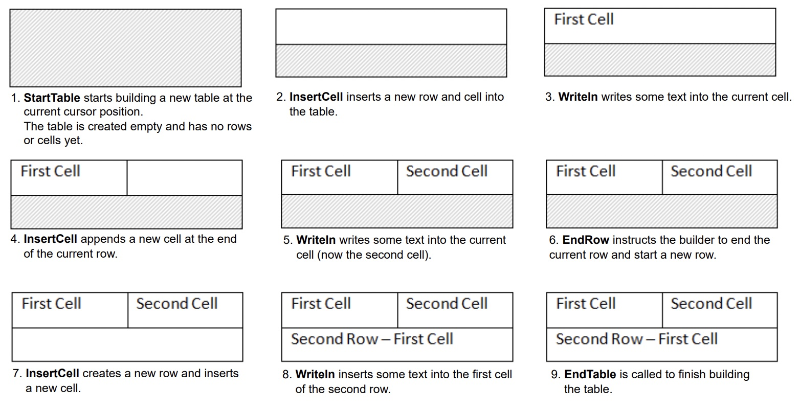

Aspose.Words allows users to create tables in a document from scratch and provides several different methods for doing so. This article presents details on how to add formatted tables to your document using each method, as well as a comparison of each method at the end of the article.

## Default Table Styles

The newly created table is given default values similar to those used in Microsoft Word:

| Table Property         | Default in Aspose.Words |
| :--------------------- | :---------------------- |
| Border Style           | Single                  |
| Border Width           | 1/2 pt                  |
| Border Color           | Black                   |
| Left and Right Padding | 5.4 pts                 |
| AutoFit Mode           | AutoFit to Window       |
| Allow AutoFit          | True                    |

{}

A table can be inline if it is tightly positioned, or floating if it can be positioned anywhere on the page. By default, Aspose.Words always creates inline tables.

{}

## Create a Table with DocumentBuilder

In Aspose.Words, users can create a table in a document using the [DocumentBuilder](https://reference.aspose.com/words/net/aspose.words/documentbuilder/). The basic algorithm for creating a table is as follows:

1. Start the table with [StartTable](https://reference.aspose.com/words/net/aspose.words/documentbuilder/starttable/)
2. Add a cell to the table using [InsertCell](https://reference.aspose.com/words/net/aspose.words/documentbuilder/insertcell/) – this automatically starts a new row
3. Optionally, use the [CellFormat](https://reference.aspose.com/words/net/aspose.words/documentbuilder/cellformat/) property to specify cell formatting
4. Insert the cell content using the appropriate **DocumentBuilder** methods such as [Writeln](https://reference.aspose.com/words/net/aspose.words/documentbuilder/writeln/), [InsertImage](https://reference.aspose.com/words/net/aspose.words/documentbuilder/insertimage/), and others
5. Repeat steps 2-4 until the row is complete
6. Call [EndRow](If InsertCell is called immediately after EndRow and the end of a row, the table will continue on a new row.) to end the current row
7. Optionally, use the [RowFormat](https://reference.aspose.com/words/net/aspose.words/documentbuilder/rowformat/) property to specify row formatting
8. Repeat steps 2-7 until the table is complete
9. Call [EndTable](https://reference.aspose.com/words/net/aspose.words/documentbuilder/endtable/) to finish building the table

{}

Important details:

* [StartTable](https://reference.aspose.com/words/net/aspose.words/documentbuilder/starttable/) can also be called inside a cell, in which case it starts the creation of a nested table within the cell.
* After calling [InsertCell](https://reference.aspose.com/words/net/aspose.words/documentbuilder/insertcell/), a new cell is created, and any content you add using other methods of the [DocumentBuilder](https://reference.aspose.com/words/net/aspose.words/documentbuilder/) class will be added to the current cell. To create a new cell on the same row, call **InsertCell** again.
* If **InsertCell** is called immediately after [EndRow]() and the end of a row, the table will continue on a new row.
* The [EndTable](https://reference.aspose.com/words/net/aspose.words/documentbuilder/endtable/) method to end the table should only be called once after calling **EndRow**. Calling **EndTable** moves the cursor from the current cell to the position immediately after the table.

{}

The process of creating a table can be clearly seen in the following picture:

The following code example shows how to create a formatted table that contains 2 rows and 2 columns:



The following code example shows how to create a simple table using **DocumentBuilder** with default formatting:



The following code example shows how to create a formatted table using DocumentBuilder:



The following code example shows how to insert a nested table using DocumentBuilder:



## Create a Table via DOM (Document Object Model)

You can insert tables directly into the DOM by adding a new [Table](https://reference.aspose.com/words/net/aspose.words.tables/table/) node at a specific position.

Please note that immediately after the table node creation, the table itself will be completely empty, that is it does not yet contain rows and cells. To insert rows and cells into a table, add the appropriate [Row](https://reference.aspose.com/words/net/aspose.words.tables/row/) and [Cell](https://reference.aspose.com/words/net/aspose.words.tables/cell/) child nodes to the DOM.

{}

This method of creating a table uses the same table defaults as when using the **DocumentBuilder**.

{}

The following code example shows how to build a new table from scratch by adding the appropriate child nodes to the document tree:



## Create a Table from HTML

Aspose.Words supports inserting content into a document from an HTML source using the [InsertHtml](https://reference.aspose.com/words/net/aspose.words/documentbuilder/inserthtml/) method. The input can be a complete HTML page or just a partial snippet.

Using the **InsertHtml** method, users can insert tables into the document via table tags like `<table>`, `<tr>`, `<td>`.

The following code example shows how to insert a table into a document from a string containing HTML tags:



## Insert a Copy of an Existing Table {#insert-a-clone-of-an-existing-table}

There are often times when you need to create a table based on an already existing table in a document. The easiest way to duplicate a table while retaining all formatting is to clone the Table node using the [Clone](https://reference.aspose.com/words/net/aspose.words/node/clone/) method.

The same technique can be used to add copies of an existing row or cell to a table.

The following code example shows how to duplicate a table using node constructors:



{}

You can download the sample file of this example from [Aspose.Words GitHub](https://github.com/aspose-words/Aspose.Words-for-.NET/blob/master/Examples/Data/Tables.docx).

{}

The following code example shows how to clone the last row of a table and append it to the table:



{}

You can download the sample file of this example from [Aspose.Words GitHub](https://github.com/aspose-words/Aspose.Words-for-.NET/blob/master/Examples/Data/Tables.docx).

{}

If you are looking at creating tables in a document that grow dynamically with each record from your data source, then the above method is not advised. Instead, the desired output is more easily achieved by using Mail merge with regions. You can learn more about this technique in the ["Mail Merge with Regions"](/words/net/types-of-mail-merge-operations/#mail-merge-with-regions) section.

## Compare Ways to Create a Table

Aspose.Words provides several methods to create new tables in a document. Each method has its own advantages and disadvantages, so the choice of which to use often depends on the specific situation.

Let's take a closer look at these ways of creating tables and compare their pros and cons:

|Method|Advantages|Disadvantages|
| :- | :- | :- |
|Via DocumentBuilder|The standard method for inserting tables and other document content|Sometimes difficult to create many varieties of tables at the same time with the same builder instance|
|Via DOM | Fits in better with surronding code that creates and inserts nodes directly into the DOM without using a **DocumentBuilder** |The table is created "empty": before performing most operations, you must call [EnsureMinimum](https://reference.aspose.com/words/net/aspose.words.tables/table/ensureminimum/) to create any missing child nodes|
|From HTML|Can create a new table from HTML source using tags like `<table>`, `<tr>`, `<td>`|Not all possible Microsoft Word table formats can be applied to HTML|
|Cloning an existing table|You can create a copy of an existing table while retaining all row and cell formatting|The appropriate child nodes must be removed before the table is ready for use|

