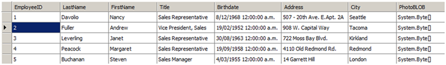

Often your application will pull data from a database and store it in the form of a **DataTable**. You can easily insert this data into your document as a new table and quickly apply formatting to the whole table.

{}

Note that the preferred way of inserting data from a **DataTable** into a document table is by using [Mail Merge with Regions](https://docs.aspose.com/words/net/types-of-mail-merge-operations/#mail-merge-with-regions). The technique presented in this article is only suggested if you are unable to create a suitable template before hand to merge data with, in other words if you require everything to happen programmatically.

{}

Using Aspose.Words, you can easily retrieve data from a database and store it as a table:

1. Create a new **DocumentBuilder** object on your **Document**.
1. Start a new table using **DocumentBuilder**.
1. If we want to insert the names of each of the columns from our **DataTable** as a header row then iterate through each data column and write the column names into a row in the table.
1. Iterate through each **DataRow** in the **DataTable**.
   1. Iterate through each object in the **DataRow**.
   1. Insert the object into the document using **DocumentBuilder**. The method used depends on the type of the object being inserted e.g **DocumentBuilder.Writeln** for text and **DocumentBuilder.InsertImage** for a byte array which represents an image.
   1. At the end of processing of the **DataRow** also end the row being created by the **DocumentBuilder** by using **DocumentBuilder.EndRow**.
1. Once all rows from the **DataTable** have been processed finish the table by calling **DocumentBuilder.EndTable**.
1. Finally we can set the desired table style using one of the appropriate table properties such as **Table.StyleIdentifier** to automatically apply formatting to the entire table.

The **ImportTableFromDataTable** method accepts a **DocumentBuilder** object, the **DataTable** containing the data and a flag which specifies if the column heading from the **DataTable** are included at the top of the table. This method builds a table from these parameters using the builder’s current position and formatting. Provides a method to import data from the DataTable and insert it into a new table using the DocumentBuilder.

The following data in our **DataTable** is used in this example: 

The following code example shows how to execute the above algorithm in Aspose.Words:

//ImportTableFromDataTable

The method can then be easily called using your **DocumentBuilder** and data.

The following code example shows how to import the data from a DataTable and insert it into a new table in the document:

//BuildTableFromDataTable
