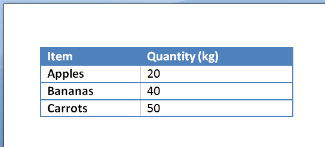
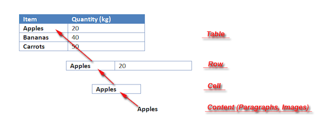

Aspose.Words is a class library designed for server-side processing of documents in various formats – PDF, HTML, different Microsoft Word formats and others – and supports tables in the following ways:

* tables in a document are preserved during open/save and conversions
* it is possible to edit table, content, and its formatting, and then export the changes to a file in a format that supports tables

In this article, we will learn more about table structure, cells, rows, and columns supported by Aspose.Words, and the details of working with such tables.

## Table Structure

As already mentioned, the table consists of such elements as **Cell**, **Row** and **Column**. These are concepts that are common to all tables in general, regardless of the document format.

This is a common example of a table found in a Microsoft Word document:

### Table Nodes

A table from any document loaded into Aspose.Words is imported as a **Table node**. The table can be found as a child of:

- main text
- an inline story such as a comment or a footnote
- cells when a table is nested within another table

{}

Note that tables can be nested inside other tables to any depth.

{}

### Table Content

The table node does not contain any real content – instead, it is a container for other such nodes that make up the content:

- **Table** contains many **Row** nodes. The table provides all the usual node elements, allowing you to freely move, modify, and remove the table in the document.
- **Row** represents a single table row and contains many **Cell** nodes. In addition, the **Row** provides elements that define how the row is displayed, such as height and alignment.
- **Cell** is what contains the true content visible in the table and is made up of a **Paragraph** and other block level nodes. Additionally, cells can contain nested tables.

{}

You can check the structure of table nodes in a document using the **DocumentExplorer**.

{}

### Empty Paragraph after Table

The picture above shows that the document contains a table of several rows, which in turn consists of two cells. Each of the two cells includes a paragraph, which is the container for the cell's formatted text.

It is also worth noting that separating two consecutive tables in a document requires at least one empty paragraph after the table. Without such a paragraph, consecutive tables would be joined together into one. This behavior is identical in both Microsoft Word and Aspose.Words.

In Aspose.Words, all classes and properties related to tables are contained in the [Aspose.Words.Tables](https://reference.aspose.com/words/net/aspose.words.tables/) namespace.

## See Also

* [Aspose.Words Document Object Model (DOM)](/words/net/aspose-words-document-object-model/)
* [Logical Levels of Nodes in a Document](/words/net/logical-levels-of-nodes-in-a-document/)